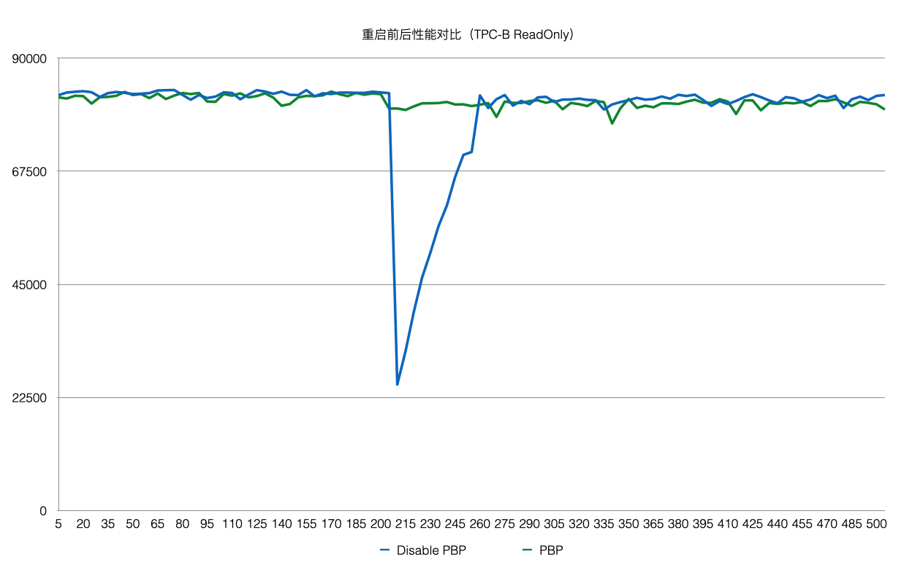

## 一起学PolarDB - 第10期 - 为什么数据库重启或崩溃恢复后性能可能瞬间很差?     
                                
### 作者                         
digoal                                
                                
### 日期                                
2022-01-04                               
                                
### 标签                                
PostgreSQL , PolarDB                                 
                                
----                                
                                
## 背景                
懂PostgreSQL, 学PolarDB不难, 就好像有九阳神功护体, 可以快速融会贯通.                       
对于DBA只要学会PolarDB精髓即可.                       
对于开发者来说不需要学习, 使用PolarDB和PostgreSQL一样.                                  
            
#### 为什么数据库重启或崩溃恢复后性能可能瞬间很差?        
https://www.bilibili.com/video/BV1pP4y177Do/  
  
数据库实例崩溃、重启后性能可能变得很差, 就像烧油的汽车刚刚发动时还没有润滑一样. 原因是崩溃后在数据库shared buffer内的热数据没了, 大概率访问数据需要访问存储, 存储的性能和内存相差巨大, 因此性能瞬间变差.   
  
社区版本:        
为了解决启动时没有热数据的问题, PG社区版本引入了预热插件pg_prewarm.   
- pg_prewarm (版本11开始也支持自动dump pageid, 自动预热) + pg_buffercache  
- https://www.postgresql.org/docs/14/pgbuffercache.html  
- https://www.postgresql.org/docs/14/pgprewarm.html  
  
注意:  
社区版本存在double cache现象, 如果不重启服务器, 或者未清理page cache, 重启数据库实例后性能影响可能不大, 因为很多数据可能存在于page cache内.    
  
PolarDB:    
- 不需要预热, PolarDB 支持 Persistent BufferPool的功能 (目前只有RW节点和standby实例有Persistent BufferPool), 实例重启、崩溃时, 由于Persistent BufferPool的存在, 性能基本没有抖动.    
    
  
  
本期问题1:            
为什么数据库重启或崩溃恢复后性能可能瞬间很差?       
- a. 客户端需要大量重建与数据库的连接       
- b. 数据库崩溃恢复或者重启时, shared buffer中没有数据, 所有数据都需要从存储层访问, 存储的性能和内存相差巨大, 因此性能瞬间变差.    
- c. 由于数据库重启或崩溃恢复, 操作系统的page cache中的热数据消失了  
- d. 数据库刚启动时需要处理复杂的启动任务, 所以刚启动时性能差  
                      
答案:                      
- b            
                  
解释:                  
- 参考本文内容             
  
  
#### [期望 PostgreSQL 增加什么功能?](https://github.com/digoal/blog/issues/76 "269ac3d1c492e938c0191101c7238216")
  
  
#### [PolarDB for PostgreSQL云原生分布式开源数据库](https://github.com/ApsaraDB/PolarDB-for-PostgreSQL "57258f76c37864c6e6d23383d05714ea")
  
  
#### [PostgreSQL 解决方案集合](https://yq.aliyun.com/topic/118 "40cff096e9ed7122c512b35d8561d9c8")
  
  
#### [德哥 / digoal's github - 公益是一辈子的事.](https://github.com/digoal/blog/blob/master/README.md "22709685feb7cab07d30f30387f0a9ae")
  
  

  
  
#### [PolarDB 学习图谱: 训练营、培训认证、在线互动实验、解决方案、生态合作、写心得拿奖品](https://www.aliyun.com/database/openpolardb/activity "8642f60e04ed0c814bf9cb9677976bd4")
  
  
#### [购买PolarDB云服务折扣活动进行中, 55元起](https://www.aliyun.com/activity/new/polardb-yunparter?userCode=bsb3t4al "e0495c413bedacabb75ff1e880be465a")
  
  
#### [About 德哥](https://github.com/digoal/blog/blob/master/me/readme.md "a37735981e7704886ffd590565582dd0")
  
