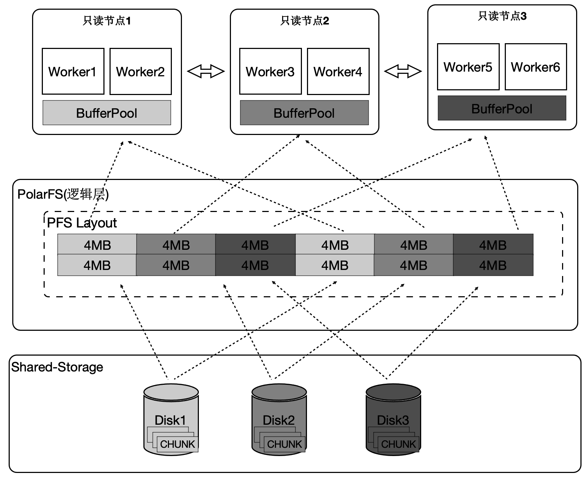
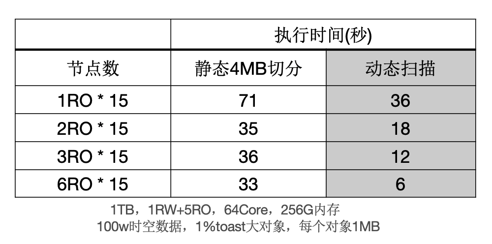

## 一起学PolarDB - 第13期 - 为什么木桶有短板?       
                                      
### 作者                               
digoal                                      
                                      
### 日期                                      
2022-01-10                                 
                                      
### 标签                                      
PostgreSQL , PolarDB                                       
                                      
----                                      
                                      
## 背景                      
懂PostgreSQL, 学PolarDB不难, 就好像有九阳神功护体, 可以快速融会贯通.               
对于DBA只要学会PolarDB精髓即可.           
对于开发者来说不需要学习, 使用PolarDB和PostgreSQL一样.               
             
#### 为什么木桶有短板?          
https://www.bilibili.com/video/BV1KS4y1Z7Le/   
  
[《一起学PolarDB - 第12期 - 为什么增加只读实例不能提高单条SQL的执行速度?》](../202201/20220110_01.md)  这一期讲了PolarDB 通过多个计算节点可以并行执行同一条SQL, 类似于Greenplum MPP特性.    
但是Greenplum有短板问题, PolarDB是怎么解决的呢?   
  
社区版本:    
1、Greenplum, 由于SQL是在多个计算节点上并行执行的, 所以SQL的执行时间取决于最慢的节点. 当计算节点的负载不均匀、计算能力不均匀、IO设备性能不均匀的情况下, 性能会出现剧烈抖动.  
2、还有一种情况是数据的存储结构倾斜, 也会导致短板, 例如分布键字段的某value比其他value记录条数多很多, 使得这部分数据所在的计算节点数据量比其他节点多很多, 这个节点就会成为短板.   
非分布键数据倾斜一般对聚合操作影响不大, Greenplum支持2阶段聚合来解决问题, 但是对数据分布不均匀束手无策:    
- [《Greenplum支持人为多阶段聚合的方法 - 直连segment(PGOPTIONS='-c gp_session_role=utility') Or gp_dist_random('gp_id') Or 多阶段聚合 prefunc》](../201806/20180624_02.md)    
- [《HybridDB PostgreSQL "Sort、Group、distinct 聚合、JOIN" 不惧怕数据倾斜的黑科技和原理 - 多阶段聚合》](../201711/20171123_01.md)    
- [《PostgreSQL 11 preview - 多阶段并行聚合array_agg, string_agg》](../201803/20180322_11.md)    
     
     
PolarDB:        
https://github.com/ApsaraDB/PolarDB-for-PostgreSQL/blob/main/doc/PolarDB-CN/Architecture.md   
针对前面提到的第一个问题: 当某个节点因为各种原因(例如某个节点的存储raid 5损坏了1块盘, 某个节点的数据存储有倾斜导致了节点负担变大.)存在短板时, 由于Greenplum每个节点只有部分数据, 其他节点不能帮短板节点进行计算, 只能干等.    
PolarDB 的数据扫描以4MB为单位进行动态扫描, 哪个节点强, 哪个节点就扫得多, 处理得多. 打破短板问题.  目前已实现seqscan的动态扫描.     
    
  
动态扫描相比静态扫描的性能提升：  
    
  
动态扫描最终能带来的目标和好处:   
- 消除木桶短板, polardb RW RO可以随意配置, RO与RO也可以随意配置, 运行时负载也可以不对齐.   
  
      
本期问题1:                  
为什么Greenplum在执行SQL时可能存在木桶短板问题?         
- a. 由于分布键的数据倾斜, 某个节点的数据比其他节点多  
- b. 由于Greenplum某些节点的配置比较差   
- c. 由于Greenplum某些节点的硬件出现性能问题, 例如存储RAID 5遭受坏盘, 导致每次读取需要从校验信息中恢复数据  
- d. 由于某些计算节点当前比较繁忙  
                            
答案:                            
- abcd            
                        
解释:                        
- 参考本文内容                   
  
本期问题2:                  
PolarDB 通过什么方式来解决SQL执行时某些节点执行较慢的木桶短板问题?         
- a. 重新选择分布键分布数据  
- b. 采用动态扫描, 每次扫描4MB数据. 处理快的节点会扫描更多的数据, 处理慢点节点扫描的数据更少.   
- c. 提升这些较慢节点的配置  
- d. 增加一层逻辑shard, 将逻辑shard重新按比例分配到不同的计算节点  
                            
答案:                            
- b          
                        
解释:                        
- 参考本文内容        
  
  
#### [期望 PostgreSQL 增加什么功能?](https://github.com/digoal/blog/issues/76 "269ac3d1c492e938c0191101c7238216")
  
  
#### [PolarDB for PostgreSQL云原生分布式开源数据库](https://github.com/ApsaraDB/PolarDB-for-PostgreSQL "57258f76c37864c6e6d23383d05714ea")
  
  
#### [PostgreSQL 解决方案集合](https://yq.aliyun.com/topic/118 "40cff096e9ed7122c512b35d8561d9c8")
  
  
#### [德哥 / digoal's github - 公益是一辈子的事.](https://github.com/digoal/blog/blob/master/README.md "22709685feb7cab07d30f30387f0a9ae")
  
  

  
  
#### [PolarDB 学习图谱: 训练营、培训认证、在线互动实验、解决方案、生态合作、写心得拿奖品](https://www.aliyun.com/database/openpolardb/activity "8642f60e04ed0c814bf9cb9677976bd4")
  
  
#### [购买PolarDB云服务折扣活动进行中, 55元起](https://www.aliyun.com/activity/new/polardb-yunparter?userCode=bsb3t4al "e0495c413bedacabb75ff1e880be465a")
  
  
#### [About 德哥](https://github.com/digoal/blog/blob/master/me/readme.md "a37735981e7704886ffd590565582dd0")
  
