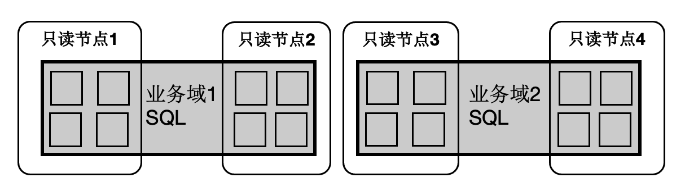

## 一起学PolarDB - 第14期 - 为什么SQL不能动态分组计算?         
                                        
### 作者                                 
digoal                                        
                                        
### 日期                                        
2022-01-11                                   
                                        
### 标签                                        
PostgreSQL , PolarDB                                         
                                        
----                                        
                                        
## 背景                        
懂PostgreSQL, 学PolarDB不难, 就好像有九阳神功护体, 可以快速融会贯通.                 
对于DBA只要学会PolarDB精髓即可.             
对于开发者来说不需要学习, 使用PolarDB和PostgreSQL一样.                 
               
#### 为什么SQL不能动态分组计算?    
https://www.bilibili.com/video/BV1pq4y1F7uy/    
  
什么是动态分组?  
- 汽车有两个指标动力输出的平顺性、瞬间的爆发力.   
- 企业会按职能划分成若干个部门, 每个部门各司其职, 体现了工作的平顺性.  但是当某个部门人力资源不足时, 只能向外招聘, 无法跨部门调派人力. 
    - 原因是其他部门的人可能跨领域了, 根本不熟悉无法帮忙. 
    - 原因也可能是, 某些能支持的其他部门人力也紧张, 调派后影响其他部门的业务.  
  
动态分组解决什么问题?  
- 资源有效利用的问题. 
- 体现在汽车上的爆发力、企业中的敏捷性、数据库中的稳定性和爆发性(典型的HTAP场景, OLTP要求RT平稳, OLAP大量计算和IO要求大规模并发计算来提高性能).  
  
动态分组计算的先决条件是什么?
- 参与动态分组的单元有足够的跨领域能力, 否则还得培训再上岗.  
  
数据库不能动态分组的原因是什么?  
- 数据库的计算节点要参与任意SQL的计算, 那么每个节点都要能访问所有数据, 否则就需要搬迁数据, 相当于培训上岗, 效率低下.  
    
社区版本:      
Greenplum, 表的数据必须hash分布在所有计算节点中.   (使用DISTRIBUTED REPLICATED的复制表除外)  
- 查询时, 所有节点都要参与计算. (含分区键条件的查询、使用DISTRIBUTED REPLICATED的复制表的查询除外.)  
  
citus, pg-xc 可以创建节点分组, 然后将表的数据分布在指定的分组内.    
- 查询时, SQL中涉及的表所在的分组包含的计算节点需要参与计算. (含分区键条件的查询、复制表的查询除外.)    
    - 如果遇到跨分组表JOIN(JOIN 的表分布在不同的逻辑分组内), 无法使用多阶段优化(  [《HybridDB PostgreSQL "Sort、Group、distinct 聚合、JOIN" 不惧怕数据倾斜的黑科技和原理 - 多阶段聚合》](../201711/20171123_01.md)  ), 必须跨多个分组重分布数据, 造成大量网络开销.    
  
```  
pg-xc:  
  
CREATE NODE GROUP cluster_group WITH Datanode1, Datanode2;  
  
[   
  DISTRIBUTE BY { REPLICATION | ROUNDROBIN | { [HASH | MODULO ] ( column_name ) } } |  
  DISTRIBUTED { { BY ( column_name ) } | { RANDOMLY } |  
  DISTSTYLE { EVEN | KEY | ALL } DISTKEY ( column_name )  
]  
[ TO { GROUP groupname | NODE ( nodename [, ... ] ) } ]  
```  
  
```  
citus:  
  
tables - distributed by column 记录映射到 shards  
shards 映射到 nodes   
多表shard对齐 : colocate tables shards  
```  
  
哪些分组将会参与计算? 取决于建表时的指定, 不管怎么指定, 数据分布都是静态对应到某些节点的.    
- 每个分组中的每个节点只包含了部分数据.     
- 计算通常需包含所有节点(以greenplum为例)     
  
shared nothing数据库在多节点计算方面存在什么可改进点?  
- 所有节点都参与计算, 一个大的SQL查询容易把资源打满, 影响其他查询性能, RT抖动比较严重.   
    - Greenplum通过resource group来隔离资源, 尽量减少这样的影响  
- 网络开销较大, 指PG-XC、citus, 如果遇到跨分组表JOIN(JOIN 的表分布在不同的逻辑分组内), 无法使用多阶段优化, 必须跨多个分组重分布数据, 造成大量网络开销.    
     
       
PolarDB:          
所有节点(RW, RO)共享一份存储, 当SQL需要用到多节点并行计算能力时, 可以多个实例共同出力(包括RW, RO), 出力是动态的, 所以可以满足SQL动态分组计算的前提.    
- 多少个节点参与计算? 是动态的      
    - 可以所有节点, 也可以指定某些节点.  
- 节点要出多少力? 是动态的      
    - 每个节点可以自主分配多少个work, 都可以动态配置.  
  
为什么PolarDB满足SQL动态分组计算的前提?   
- 所有节点共享一份数据, 任意节点想出力都行, 不需要跨节点传输数据, 不存在shared nothing的弊端.   
    - 任意节点可以组合成1组gang (动态指定一批计算节点处理某一个SQL, 业务区分. sql hint、guc)     
  
  
  
PolarDB SQL动态分组计算的典型应用场景:   
- 不同业务域的SQL同时跑在不同的节点集合上, 物理上隔绝干扰. (存储层是分布式块存储, 为所有PolarDB集群服务, 理论上可以认为是无限大、无限能力, 可以认为不存在存储层瓶颈)  
- HTAP 分时混合业务场景, 例如白天OLTP, 晚上T+1数据分析. 白天可以使用读写分离, 处理高并发小事务. 晚上可以用MPP特性, 调动所有节点的算力, 加速处理分析型SQL请求.   
- 节点级动态算力分配: 当某个节点负载较高时, 可以给这个节点分配较少的算力.  (通过SQL Hint, 参数等实现, 动态扫描则是自动实现的.)      
    - [《一起学PolarDB - 第13期 - 为什么木桶有短板?》](../202201/20220110_03.md)  
  
结合AI for DB, PolarDB 的SQL动态分组计算能力, 可以实现更加智能化的自动数据库驾驶.   
        
本期问题1:    
为什么shared nothing架构无法实现动态的节点算力调度?    
- a. shared nothing数据库的分布算法是hash算法.    
- b. shared nothing数据库需要每个节点参与计算, 使得每一次SQL查询都可以用到所有计算能力.   
- c. shared nothing数据库每个节点只能访问本地数据, 除了带分布键的查询或复制表的查询以为, 其他的查询都需要所有节点的参与, 无法动态调动指定节点参与.   
- d. shared nothing数据库的存储分布在所有的计算节点, 每一次SQL查询都需要访问所有计算节点, 才能访问到完整的数据.   
              
答案:                              
- c   
       
解释:                          
- 参考本文内容                     
  
本期问题2:    
为什么PolarDB可以实现动态的节点算力调度?    
- a. 共享数据, 任意节点都能访问完整的数据, 都可以参与计算     
- b. 支持类似MPP 的SQL优化器, 可以让多个计算节点参与计算    
- c. 支持通过HINT或参数控制每条SQL调动的算力    
- d. 查询时, 通过数据重分布实现跨节点动态计算   
              
答案:                              
- abc   
       
解释:                          
- 参考本文内容       
  
本期问题3:    
动态的节点算力调度有什么益处?    
- a. 隔离不同的业务域, 不同业务域可以使用不同的节点分组进行计算  
- b. 每个节点都可以动态分配算力, 避免某些节点成为瓶颈(短板)  
- c. 适合混合负载, 白天oltp, 夜晚htap    
- d. 在需要时, 投入更多算力提高性能  
              
答案:                              
- abcd  
       
解释:                          
- 参考本文内容       
  
  
#### [期望 PostgreSQL 增加什么功能?](https://github.com/digoal/blog/issues/76 "269ac3d1c492e938c0191101c7238216")
  
  
#### [PolarDB for PostgreSQL云原生分布式开源数据库](https://github.com/ApsaraDB/PolarDB-for-PostgreSQL "57258f76c37864c6e6d23383d05714ea")
  
  
#### [PostgreSQL 解决方案集合](https://yq.aliyun.com/topic/118 "40cff096e9ed7122c512b35d8561d9c8")
  
  
#### [德哥 / digoal's github - 公益是一辈子的事.](https://github.com/digoal/blog/blob/master/README.md "22709685feb7cab07d30f30387f0a9ae")
  
  

  
  
#### [PolarDB 学习图谱: 训练营、培训认证、在线互动实验、解决方案、生态合作、写心得拿奖品](https://www.aliyun.com/database/openpolardb/activity "8642f60e04ed0c814bf9cb9677976bd4")
  
  
#### [购买PolarDB云服务折扣活动进行中, 55元起](https://www.aliyun.com/activity/new/polardb-yunparter?userCode=bsb3t4al "e0495c413bedacabb75ff1e880be465a")
  
  
#### [About 德哥](https://github.com/digoal/blog/blob/master/me/readme.md "a37735981e7704886ffd590565582dd0")
  
