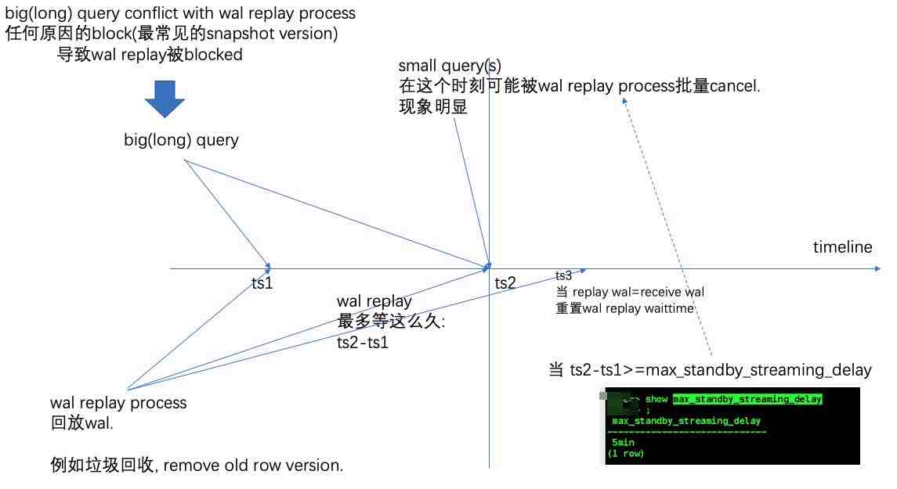

## 一起学PolarDB - 第17期 - 为什么只读实例延迟高?  
  
### 作者  
digoal  
  
### 日期  
2022-01-17  
  
### 标签  
PostgreSQL , PolarDB  
  
----  
  
## 背景  
懂PostgreSQL, 学PolarDB不难, 就好像有九阳神功护体, 可以快速融会贯通.  
对于DBA只要学会PolarDB精髓即可.  
对于开发者来说不需要学习, 使用PolarDB和PostgreSQL一样.  
  
#### 为什么只读实例延迟高?  
https://www.bilibili.com/video/BV1br4y1h7jY/   
  
什么原因会导致只读实例延迟?    
- 这里说的都是物理流复制, 不包括逻辑复制. (逻辑复制的延迟更高)    
- 分两种延迟情况进行分析: send delay, apply delay
  
社区版本:   
- 在只读实例上执行SQL, 某些SQL可能读到冲突, 发生冲突就需要暂停wal apply, 导致WAL apply延迟  
- 设置了 recovery_min_apply_delay 参数恢复延迟  
  
    
  
排除以上等待问题, 还有常规问题导致的延迟:  
- 网络带宽低, freeze风暴, vacuum风暴, full page过多等, 导致send 延迟    
- 只读实例IO设备性能问题, 导致apply 慢, 而且startup恢复进程为单进程恢复时采用同步IO, 对于IO延迟高的设备只读实例延迟尤为明显. 例如网盘、分布式网络存储.      
- apply架构的天然缺陷,   
    - 1、startup为单进程,    
    - 2、内存有限导致多次IO, 数据块恢复后可能驱逐出shared buffer, 所以同一个数据块在被多次恢复时, 可能产生多次物理IO.    
  
社区版本优化手段, 降低wal send和replay延迟的方法 (没有从根源上解决, 而是从使用角度尽量来规避):    
- 减少或避免快照冲突,   
    - 避免只读库上的 long query | xact     
    - 修改ro节点参数 hot_standby_feedback=on, 只要ro库有查询, 就会返回snapshot xid给主库, 主库的垃圾回收进程不会回收这个垃圾.    
        - 但是有弊端, 参考 [《PostgreSQL物理"备库"的哪些操作或配置，可能影响"主库"的性能、垃圾回收、IO波动》](../201704/20170410_03.md)    
    - 开启 vacuum_defer_cleanup_age 保留一定的dead tuples数据.    
- 减少冲突的时长     
    - 在RO节点设置statement timeout , 低于主动cancel query的delay时长.     
    - 在RO节点设置max_standby_archive_delay、max_standby_streaming_delay, 尽早cancel query.   
- 如果是standby本身资源问题导致delay, 那么建议查看standby节点的网络带宽、cpu、io能力是否存在瓶颈. 该加资源就加资源.    
    - [《PostgreSQL 流复制冲突分类讲解以及对应解决方案 - DEALING WITH STREAMING REPLICATION CONFLICTS IN POSTGRESQL  - 特别是lock confict(vacuum truncate suffix free page引起的）  
》](../202011/20201117_02.md)    
    - [《PostgreSQL standby conflict replay分析和解决方案》](../202005/20200518_01.md)    
- 无法避免的冲突    
    - HOT chain 清理导致的 buffer page pin 冲突   
    - DDL   
    - drop tablespace|database   
  
PolarDB:   
https://github.com/ApsaraDB/PolarDB-for-PostgreSQL/tree/POLARDB_11_DEV/docs/zh/architecture  
从根源解决只读实例延迟高的问题:   
- 采用 log index 支持异步并行恢复    
- 共享存储, 不需要传输wal payload data, 只需要传输wal metadata(解析出来的pageid, lsn list)    
- 共享存储, 通过shared buffer脏页刷新推进, 不需要100%应用日志    
- 使用异步DDL回放, 不堵塞wal replay回放进程, (理论上异步wal回放也可以避免DDL, drop tablespace|database的冲突导致堵塞整个wal replay进程).    
  
传统复制和恢复流程:   
    
  
PolarDB  log index  
  
  
PolarDB 只复制meta  
  
  
PolarDB 异步并行恢复  
  
  
PolarDB 异步DDL回放  
  
  
PolarDB VS 社区版本 复制对比:  
wal传输量对比  
  
  
延迟对比  
  
  
DDL堵塞数据对比  
  
  
本期问题1:  
哪些是导致只读实例延迟的原因?   
- a. 复制网络带宽低  
- b. 只读实例上的LONG SQL查询与WAL replay发生了各种冲突(例如ddl, snapshot, drop tbs|db, buffer pin 等conflict), 导致堵塞了wal replay  
- c. 设置了主动延迟恢复  
- d. 只读实例硬件性能差  
- e. replay进程为单进程同步回放架构  
- f. 内存有限, 回放过程中单个page的多次修改可能发生多次物理IO  
- g. 只读实例需要接收所有WAL, 遇到突发性的大量写WAL事件, 例如大量数据同时发生vacuum freeze, 大表vacuum等.   
- h. 只读实例有任何SQL查询存在时, 都会堵塞wal的恢复   
  
答案:  
- abcdefg  
  
解释:  
- 参考本文内容  
  
本期问题2:  
社区版本如何优化只读实例延迟问题?  
- a. 避免只读库上的 long query | xact     
- b. 关闭 hot_standby_feedback   
- c. 设置 vacuum_defer_cleanup_age, 保留一定的dead tuples数据  
- d. 设置非常大的 statement timeout    
- e. 提高复制网络带宽, 提高cpu、io能力  
  
答案:  
- ace   
  
解释:  
- 参考本文内容  
  
本期问题3:  
PolarDB做了什么使得只读实例几乎没有延迟?   
- a. 采用 log index 异步并行恢复    
- b. 采用共享存储架构, 不需要传输wal payload data, 只需要传输wal metadata, 大幅度减少WAL传输量    
- c. 采用共享存储架构, 通过shared buffer脏页刷新推进, 并不需要100%应用日志    
- d. 使用异步DDL回放, 不堵塞wal replay回放进程    
- e. 采用了多个WAL replay process, 并行恢复, 加快了恢复速度  
  
答案:  
- abcd  
  
解释:  
- 参考本文内容  
  
  
#### [期望 PostgreSQL 增加什么功能?](https://github.com/digoal/blog/issues/76 "269ac3d1c492e938c0191101c7238216")
  
  
#### [PolarDB for PostgreSQL云原生分布式开源数据库](https://github.com/ApsaraDB/PolarDB-for-PostgreSQL "57258f76c37864c6e6d23383d05714ea")
  
  
#### [PostgreSQL 解决方案集合](https://yq.aliyun.com/topic/118 "40cff096e9ed7122c512b35d8561d9c8")
  
  
#### [德哥 / digoal's github - 公益是一辈子的事.](https://github.com/digoal/blog/blob/master/README.md "22709685feb7cab07d30f30387f0a9ae")
  
  

  
  
#### [PolarDB 学习图谱: 训练营、培训认证、在线互动实验、解决方案、生态合作、写心得拿奖品](https://www.aliyun.com/database/openpolardb/activity "8642f60e04ed0c814bf9cb9677976bd4")
  
  
#### [购买PolarDB云服务折扣活动进行中, 55元起](https://www.aliyun.com/activity/new/polardb-yunparter?userCode=bsb3t4al "e0495c413bedacabb75ff1e880be465a")
  
  
#### [About 德哥](https://github.com/digoal/blog/blob/master/me/readme.md "a37735981e7704886ffd590565582dd0")
  
