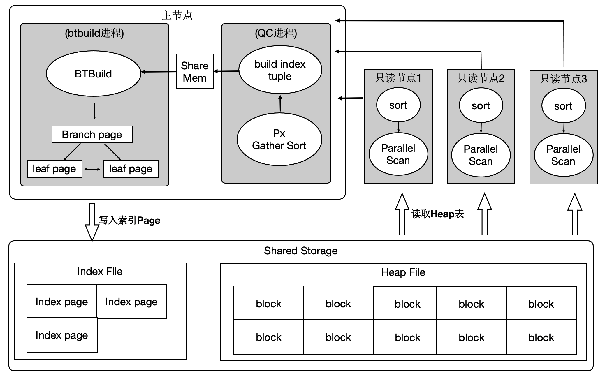

## 一起学PolarDB - 第18期 - 为什么创建索引慢?   
    
### 作者    
digoal    
    
### 日期    
2022-01-18    
    
### 标签    
PostgreSQL , PolarDB    
    
----    
    
## 背景    
懂PostgreSQL, 学PolarDB不难, 就好像有九阳神功护体, 可以快速融会贯通.    
对于DBA只要学会PolarDB精髓即可.    
对于开发者来说不需要学习, 使用PolarDB和PostgreSQL一样.    
    
#### 为什么创建索引慢?   
https://www.bilibili.com/video/BV1aR4y177fK/   
  
社区版本:     
以Btree索引为例, 排序, 构建Tree(Meta page, root page, branch page, leaf page).    
记录数越大, 越耗时. 超过内存大小时, 还需要使用临时文件存储排序结果.    
  
优化:   
PG 11开始支持了并行索引创建. 并行排序, 充分利用CPU多核资源.     
  
算法详见:    
[《PostgreSQL 11 preview - 并行排序、并行索引 (性能线性暴增) 单实例100亿TOP-K仅40秒》](../201802/20180204_01.md)      
  
用到了多核, 所以瓶颈变成了单机的CPU、内存、IO瓶颈.    
   
硬件 | 数据量 | 非并行创建索引耗时 | 64并行度创建索引耗时 | 性能提升倍数    
---|---|---|---|---    
64线程机器 | 1亿 | 26.244 秒 | 15.55 秒 | 1.69 倍    
64线程机器 | 10亿 | 1442.7 秒 | 160.77 秒 | 8.97 倍    
64线程机器 | 100亿 | 7456.9 秒 | 1869.5 秒 | 4 倍    
    
并行创建索引用到的是external sorting algorithm 排序方法(external sort + external merge)。    
    
```    
postgres=# set trace_sort =on;    
SET    
postgres=# set client_min_messages =log;    
SET    
    
set maintenance_work_mem='8GB';    
alter table ttt set ( parallel_workers=4 );    
    
postgres=# drop index idx_ttt;    
DROP INDEX    
postgres=# create index idx_ttt on ttt(id);    
LOG:  begin index sort: unique = f, workMem = 1677721, randomAccess = f    
LOG:  begin index sort: unique = f, workMem = 1677721, randomAccess = f    
LOG:  begin index sort: unique = f, workMem = 1677721, randomAccess = f    
LOG:  begin index sort: unique = f, workMem = 1677721, randomAccess = f    
LOG:  begin index sort: unique = f, workMem = 1677721, randomAccess = f    
LOG:  performsort of 0 starting: CPU: user: 3.90 s, system: 0.51 s, elapsed: 4.41 s    
LOG:  performsort of 4 starting: CPU: user: 3.74 s, system: 0.66 s, elapsed: 4.40 s    
LOG:  4 switching to external sort with 7 tapes: CPU: user: 3.74 s, system: 0.66 s, elapsed: 4.40 s    
LOG:  performsort of 3 starting: CPU: user: 3.78 s, system: 0.62 s, elapsed: 4.40 s    
LOG:  3 switching to external sort with 7 tapes: CPU: user: 3.78 s, system: 0.62 s, elapsed: 4.40 s    
LOG:  performsort of 2 starting: CPU: user: 3.74 s, system: 0.66 s, elapsed: 4.41 s    
LOG:  2 switching to external sort with 7 tapes: CPU: user: 3.74 s, system: 0.66 s, elapsed: 4.41 s    
LOG:  performsort of 1 starting: CPU: user: 3.76 s, system: 0.64 s, elapsed: 4.41 s    
LOG:  1 switching to external sort with 7 tapes: CPU: user: 3.76 s, system: 0.64 s, elapsed: 4.41 s    
LOG:  1 starting quicksort of run 1: CPU: user: 3.76 s, system: 0.65 s, elapsed: 4.41 s    
LOG:  0 switching to external sort with 7 tapes: CPU: user: 3.90 s, system: 0.51 s, elapsed: 4.41 s    
LOG:  3 starting quicksort of run 1: CPU: user: 3.78 s, system: 0.62 s, elapsed: 4.40 s    
LOG:  2 starting quicksort of run 1: CPU: user: 3.74 s, system: 0.66 s, elapsed: 4.41 s    
LOG:  0 starting quicksort of run 1: CPU: user: 3.90 s, system: 0.51 s, elapsed: 4.41 s    
LOG:  4 starting quicksort of run 1: CPU: user: 3.74 s, system: 0.66 s, elapsed: 4.40 s    
LOG:  1 finished quicksort of run 1: CPU: user: 3.90 s, system: 0.65 s, elapsed: 4.55 s    
LOG:  3 finished quicksort of run 1: CPU: user: 3.92 s, system: 0.62 s, elapsed: 4.55 s    
LOG:  2 finished quicksort of run 1: CPU: user: 3.88 s, system: 0.66 s, elapsed: 4.55 s    
LOG:  4 finished quicksort of run 1: CPU: user: 3.88 s, system: 0.66 s, elapsed: 4.55 s    
LOG:  0 finished quicksort of run 1: CPU: user: 4.05 s, system: 0.51 s, elapsed: 4.56 s    
LOG:  0 finished writing run 1 to tape 0: CPU: user: 5.04 s, system: 1.88 s, elapsed: 6.91 s    
LOG:  4 finished writing run 1 to tape 0: CPU: user: 4.57 s, system: 1.81 s, elapsed: 6.38 s    
LOG:  performsort of 4 done: CPU: user: 4.57 s, system: 1.85 s, elapsed: 6.43 s    
LOG:  parallel external sort of 4 ended, 48940 disk blocks used: CPU: user: 4.57 s, system: 1.85 s, elapsed: 6.43 s    
LOG:  3 finished writing run 1 to tape 0: CPU: user: 4.61 s, system: 1.79 s, elapsed: 6.41 s    
LOG:  performsort of 3 done: CPU: user: 4.61 s, system: 1.83 s, elapsed: 6.45 s    
LOG:  parallel external sort of 3 ended, 48363 disk blocks used: CPU: user: 4.61 s, system: 1.83 s, elapsed: 6.45 s    
LOG:  2 finished writing run 1 to tape 0: CPU: user: 4.58 s, system: 1.78 s, elapsed: 6.37 s    
LOG:  performsort of 2 done: CPU: user: 4.58 s, system: 1.82 s, elapsed: 6.41 s    
LOG:  parallel external sort of 2 ended, 48558 disk blocks used: CPU: user: 4.58 s, system: 1.82 s, elapsed: 6.41 s    
LOG:  1 finished writing run 1 to tape 0: CPU: user: 4.58 s, system: 1.82 s, elapsed: 6.41 s    
LOG:  performsort of 1 done: CPU: user: 4.58 s, system: 1.86 s, elapsed: 6.44 s    
LOG:  parallel external sort of 1 ended, 48234 disk blocks used: CPU: user: 4.58 s, system: 1.86 s, elapsed: 6.44 s    
LOG:  performsort of 0 done: CPU: user: 5.04 s, system: 1.91 s, elapsed: 6.95 s    
LOG:  parallel external sort of 0 ended, 50526 disk blocks used: CPU: user: 5.04 s, system: 1.91 s, elapsed: 6.95 s   
LOG:  begin index sort: unique = f, workMem = 8388608, randomAccess = f    
LOG:  performsort of -1 starting: CPU: user: 0.00 s, system: 0.00 s, elapsed: 0.00 s    
LOG:  -1 using 8388553 KB of memory for read buffers among 5 input tapes    
LOG:  performsort of -1 done (except 5-way final merge): CPU: user: 0.11 s, system: 1.08 s, elapsed: 1.20 s    
LOG:  parallel external sort of -1 ended, 244621 disk blocks used: CPU: user: 8.52 s, system: 3.98 s, elapsed: 12.49 s    
CREATE INDEX    
```    
   
```    
 * Callers must do the following to perform a sort in parallel using multiple    
 * worker processes:    
 *    
 * 1. Request tuplesort-private shared memory for n workers.  Use    
 *    tuplesort_estimate_shared() to get the required size.    
 * 2. Have leader process initialize allocated shared memory using    
 *    tuplesort_initialize_shared().  Launch workers.    
 * 3. Initialize a coordinate argument within both the leader process, and    
 *    for each worker process.  This has a pointer to the shared    
 *    tuplesort-private structure, as well as some caller-initialized fields.    
 *    Leader's coordinate argument reliably indicates number of workers    
 *    launched (this is unused by workers).    
 * 4. Begin a tuplesort using some appropriate tuplesort_begin* routine,    
 *    (passing the coordinate argument) within each worker.  The workMem    
 *    arguments need not be identical.  All other arguments should match    
 *    exactly, though.    
 * 5. tuplesort_attach_shared() should be called by all workers.  Feed tuples    
 *    to each worker, and call tuplesort_performsort() within each when input    
 *    is exhausted.    
 * 6. Call tuplesort_end() in each worker process.  Worker processes can shut    
 *    down once tuplesort_end() returns.    
 * 7. Begin a tuplesort in the leader using the same tuplesort_begin*    
 *    routine, passing a leader-appropriate coordinate argument (this can    
 *    happen as early as during step 3, actually, since we only need to know    
 *    the number of workers successfully launched).  The leader must now wait    
 *    for workers to finish.  Caller must use own mechanism for ensuring that    
 *    next step isn't reached until all workers have called and returned from    
 *    tuplesort_performsort().  (Note that it's okay if workers have already    
 *    also called tuplesort_end() by then.)    
 * 8. Call tuplesort_performsort() in leader.  Consume output using the    
 *    appropriate tuplesort_get* routine.  Leader can skip this step if    
 *    tuplesort turns out to be unnecessary.    
 * 9. Call tuplesort_end() in leader.    
```    
    
PolarDB:     
将sort任务拆分到多个节点(RW和RO节点都可以参与计算), 每个计算节点扫描部分数据并对其进行排序, 充分利用多机的CPU、内存、IO资源.     
所以PolarDB节点数越多, 创建索引越快.    
  
经分析建索引过程中：80%是在排序和构建索引页，20%在写索引页。通过使用分布式并行来加速排序过程，同时流水化批量写入。  
  
  
  
上述优化能够使得创建索引有 4~5 倍的提升。  
  
  
    
本期问题1:    
创建索引可能包含哪些阶段?     
- a. 排序   
- b. 构建tree   
- c. 读取数据   
- d. 写入磁盘  
- e. 删除数据  
- f. 写临时空间   
- g. 写WAL日志   
- h. 并行排序    
    
答案:    
- abcdfgh  
    
解释:    
- 参考本文内容    
  
本期问题2:    
大表创建索引时比较容易遇到的较大瓶颈有哪些?     
- a. 排序时消耗CPU  
- b. 排序时写临时文件  
- c. 写WAL日志  
- d. 排序结果写入索引页  
    
答案:    
- ab  
    
解释:    
- 参考本文内容    
  
本期问题3:    
PolarDB 如何解决大表创建索引的瓶颈问题?   
- a. 利用多个计算节点的IO能力  
- b. 排序时写临时文件  
- c. 利用多个计算节点的内存, 减少临时文件的使用  
- d. 利用多个计算节点的CPU能力  
    
答案:    
- acd  
    
解释:    
- 参考本文内容    
  
  
  
#### [期望 PostgreSQL 增加什么功能?](https://github.com/digoal/blog/issues/76 "269ac3d1c492e938c0191101c7238216")
  
  
#### [PolarDB for PostgreSQL云原生分布式开源数据库](https://github.com/ApsaraDB/PolarDB-for-PostgreSQL "57258f76c37864c6e6d23383d05714ea")
  
  
#### [PostgreSQL 解决方案集合](https://yq.aliyun.com/topic/118 "40cff096e9ed7122c512b35d8561d9c8")
  
  
#### [德哥 / digoal's github - 公益是一辈子的事.](https://github.com/digoal/blog/blob/master/README.md "22709685feb7cab07d30f30387f0a9ae")
  
  

  
  
#### [PolarDB 学习图谱: 训练营、培训认证、在线互动实验、解决方案、生态合作、写心得拿奖品](https://www.aliyun.com/database/openpolardb/activity "8642f60e04ed0c814bf9cb9677976bd4")
  
  
#### [购买PolarDB云服务折扣活动进行中, 55元起](https://www.aliyun.com/activity/new/polardb-yunparter?userCode=bsb3t4al "e0495c413bedacabb75ff1e880be465a")
  
  
#### [About 德哥](https://github.com/digoal/blog/blob/master/me/readme.md "a37735981e7704886ffd590565582dd0")
  
