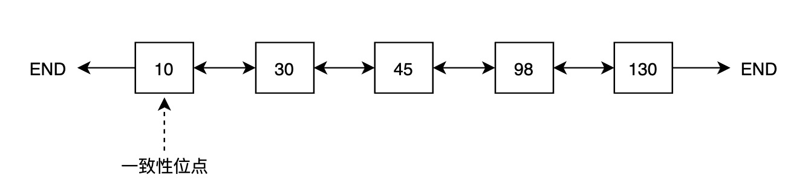
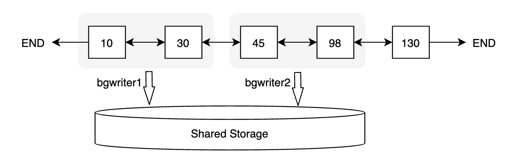

## 一起学PolarDB - 第19期 - 为什么做检查点会导致性能抖动?   
      
### 作者      
digoal      
      
### 日期      
2022-01-19     
      
### 标签      
PostgreSQL , PolarDB      
      
----      
      
## 背景      
懂PostgreSQL, 学PolarDB不难, 就好像有九阳神功护体, 可以快速融会贯通.      
对于DBA只要学会PolarDB精髓即可.      
对于开发者来说不需要学习, 使用PolarDB和PostgreSQL一样.      
      
#### 为什么做检查点会导致性能抖动?   
https://www.bilibili.com/video/BV1oP4y1c7n6/   
    
社区版本:       
- 创建检查点    
- 标记当前LSN为LSN1 , page在这之后第一次被修改时都要写full page  (如果开启了full page write)  
    - 写FULL PAGE会增加WAL的写入压力    
- 扫描shared buffer, 标记LSN < LSN1的脏页 FLAG, 表示这些页需要fsync到磁盘   
    - 遍历buffer, 有点耗费资源  
- 开始对已标记的page进行持久化动作 (根据checkpointer调度参数控制刷脏速度)   
    - 刷脏, 非常耗费资源, 特别是写IO     
- 写控制文件, 标记检查点逻辑开始与结束位置      
    
优化:     
1、拉长检查点周期:   
- 设置较大的max_wal_size, 设置触发检查点的最大wal日志数据量, max_wal_size越大, 两次检查点的时间跨度越大.   
    - 推荐设置 `max_wal_size = 3*shared_buffers`  
- 设置较大的checkpoint_completion_target, 一次检查点预计什么时候做完, 例如上一次检查点距离这次检查点之间生成了10GB WAL, checkpoint_completion_target = 0.9 表示这次检查点计划在`10*0.9`也就是生成9GB的WAL的过程中做完. checkpoint_completion_target越大, 检查点刷脏的力度越稀疏. checkpoint_completion_target越小, 检查点刷脏的力度越密集.   
- 设置较大的checkpoint_timeout, 拉长两次检查点之间的间隔.   
  
弊端, 以上方法虽然可以减轻检查点抖动, 但是也有一定的负面影响:    
- 检查点很长, 如果数据库崩溃很可能最近一次检查点还没做完, 那么数据库得从上一次检查点的逻辑开始位点开始应用WAL, 需要应用很多WAL文件.    
- 例如检查点跨度周期是16GB, 配置为0.9, 有90%的可能奔溃时检查点还没有做完, 所以要应用16GB以上的WAL日志.  如果崩溃时刚好做到80%, 则需要应用`16+0.8*16GB` wal日志.    
  
2、调小shared buffer    
弊端: 虽然检查点带来的性能抖动影响变小了, 但是影响数据库整体的读写性能, 内存没有用起来.     
  
3、调高bgwriter频率, 让异步刷脏更频繁, 减少checkpoint时的dirty page数. 从而减轻checkpoint负担.  
弊端: 可能导致IO放大, 特别是频繁修改的page, 可能会多次刷出去导致IO放大. (当然, 还要看LRU算法.)   
      
PolarDB:       
https://github.com/ApsaraDB/PolarDB-for-PostgreSQL/blob/POLARDB_11_STABLE/docs/zh/architecture/buffer-management.md  
  
1、PolarDB采用DIO   
  
2、PolarDB增加了一个list存储每个buffer page的oldest LSN(这个页面自这个LSN以来未持久化), 按LSN从小到大顺序刷buffer, 整个shared buffer内最小的oldest LSN就是一致性位点(临界点, 崩溃恢复时从这个位置开始获取WAL进行恢复), 因为这个位点之前的buffer page都持久化了.   
- checkpoint的核心目的之一无非就是标记出哪个点是一致的, 所以polardb的这个功能可以直接表达出一致的位点. 等于"不需要checkpoint"了.   
  
PolarDB的检查点已经不需要刷脏(称之为Lazy Checkpoint), 而是更新min(所有buffer page 的oldest LSN)这个逻辑位点即可, 所以PolarDB做检查点不影响性能.    
   
  
3、PolarDB通过并行bgwriter来提高刷脏速度. 目前PG社区版本bgwriter为单进程模型.      
   
      
本期问题1:      
PG社区版本做检查点时引起性能抖动的主要原因有哪些?       
- a. full page write   
- b. 遍历shared buffer标记需要刷的脏页   
- c. 写控制文件    
- d. 将已标记的脏页刷到持久化存储  
      
答案:      
- abd  
      
解释:      
- 参考本文内容      
    
本期问题2:      
PG社区版本可以如何优化检查点的稳定性?   
- a. 设置较大的max_wal_size, 拉长检查点的周期  
- b. 调大checkpoint_completion_target, 从而设置检查点的刷脏平滑度  
- c. 设置较小的shared buffer    
- d. 设置较大的shared buffer  
      
答案:      
- abc  
      
解释:      
- 参考本文内容      
  
本期问题3:      
PG社区版本拉长检查点会带来什么负面影响?   
- a. 导致数据读取性能变差  
- b. 崩溃恢复时可能需要恢复非常多的WAL文件, 导致崩溃恢复变慢, 影响可用性.    
- c. 导致数据写入性能变差   
- d. 导致产生更多的WAL日志   
      
答案:      
- b  
      
解释:      
- 参考本文内容      
    
本期问题4:      
PolarDB 检查点要做哪些动作?    
- a. 将脏页刷到持久化存储  
- b. 将shared buffer中的oldest LSN作为检查点的一致性位点(临界点)   
- c. 冻结数据库的写入操作  
- d. 结束所有的进行中事务  
      
答案:      
- b  
      
解释:      
- 参考本文内容      
    
本期问题5:      
PolarDB 一致性位点是通过什么机制来实现的?    
- a. 新增一个list结构按LSN从小到大顺序存储shared buffer脏页每个page的oldest LSN, bgwriter按oldest LSN从小到大的顺序刷脏. shared buffer中最小的oldest LSN就是数据库一致性位点(临界点)  
- b. 通过checkpoint 刷脏, 将此次刷脏开始时的LSN作为一致性位点.  
- c. 通过将last LSN设置为一致性LSN来保证一致性位点.  
- d. 将已标记的脏页刷到持久化存储  
      
答案:      
- a  
      
解释:      
- 参考本文内容      
  
本期问题6:      
PolarDB 通过什么机制来提高bgwriter刷脏速度?   
- a. 并行 bgwriter  
- b. 批量刷脏页  
- c. 提高bgwriter的刷脏频率  
- d. 将bgwriter的刷脏任务分配给checkpointer和background process一起来执行  
      
答案:      
- a  
      
解释:      
- 参考本文内容      
  
  
  
#### [期望 PostgreSQL 增加什么功能?](https://github.com/digoal/blog/issues/76 "269ac3d1c492e938c0191101c7238216")
  
  
#### [PolarDB for PostgreSQL云原生分布式开源数据库](https://github.com/ApsaraDB/PolarDB-for-PostgreSQL "57258f76c37864c6e6d23383d05714ea")
  
  
#### [PostgreSQL 解决方案集合](https://yq.aliyun.com/topic/118 "40cff096e9ed7122c512b35d8561d9c8")
  
  
#### [德哥 / digoal's github - 公益是一辈子的事.](https://github.com/digoal/blog/blob/master/README.md "22709685feb7cab07d30f30387f0a9ae")
  
  

  
  
#### [PolarDB 学习图谱: 训练营、培训认证、在线互动实验、解决方案、生态合作、写心得拿奖品](https://www.aliyun.com/database/openpolardb/activity "8642f60e04ed0c814bf9cb9677976bd4")
  
  
#### [购买PolarDB云服务折扣活动进行中, 55元起](https://www.aliyun.com/activity/new/polardb-yunparter?userCode=bsb3t4al "e0495c413bedacabb75ff1e880be465a")
  
  
#### [About 德哥](https://github.com/digoal/blog/blob/master/me/readme.md "a37735981e7704886ffd590565582dd0")
  
