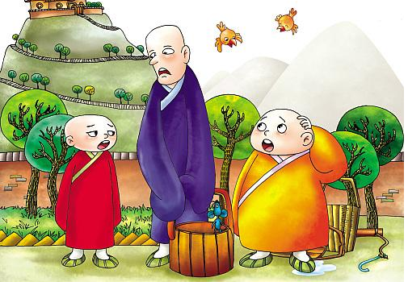
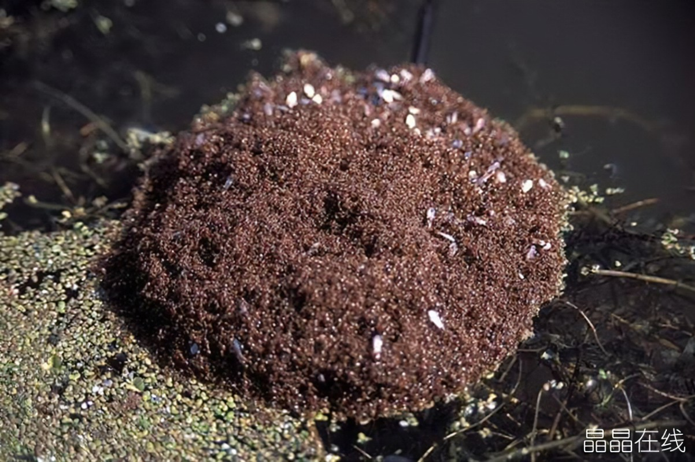
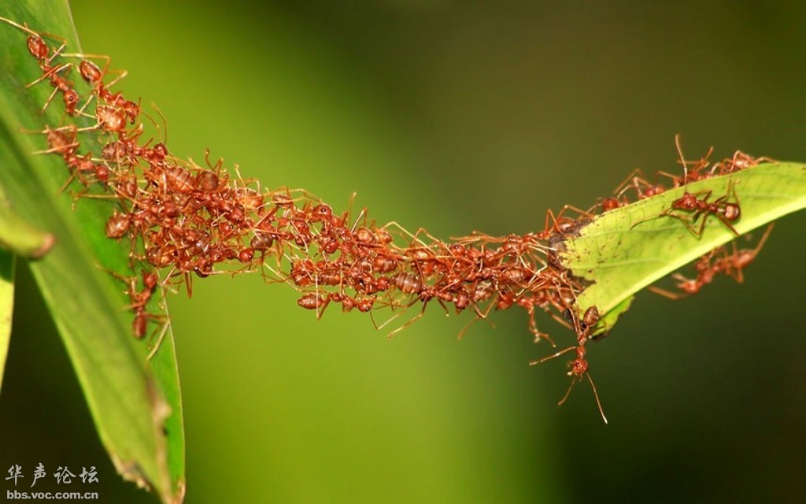
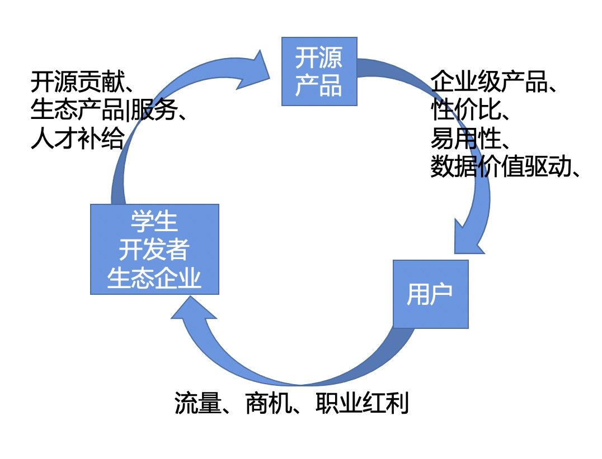
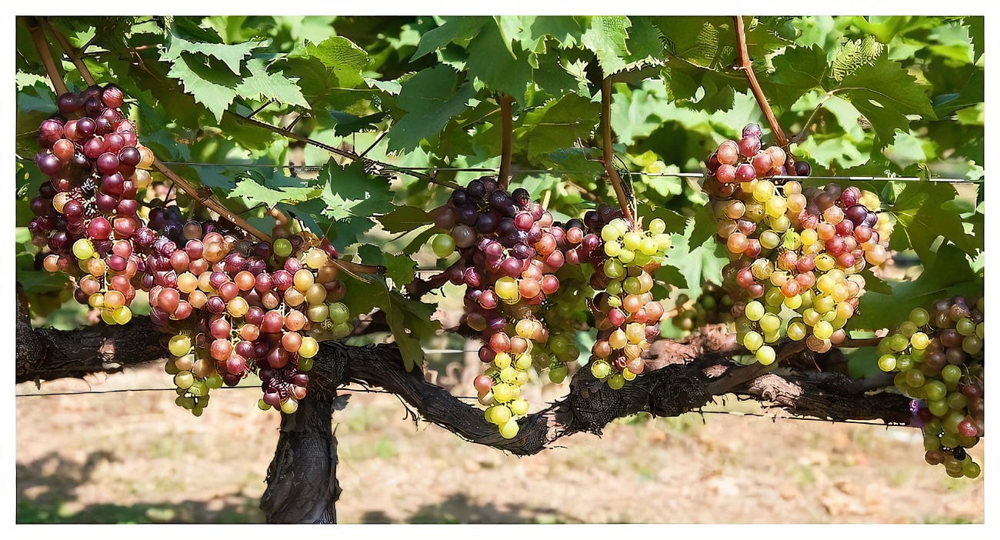
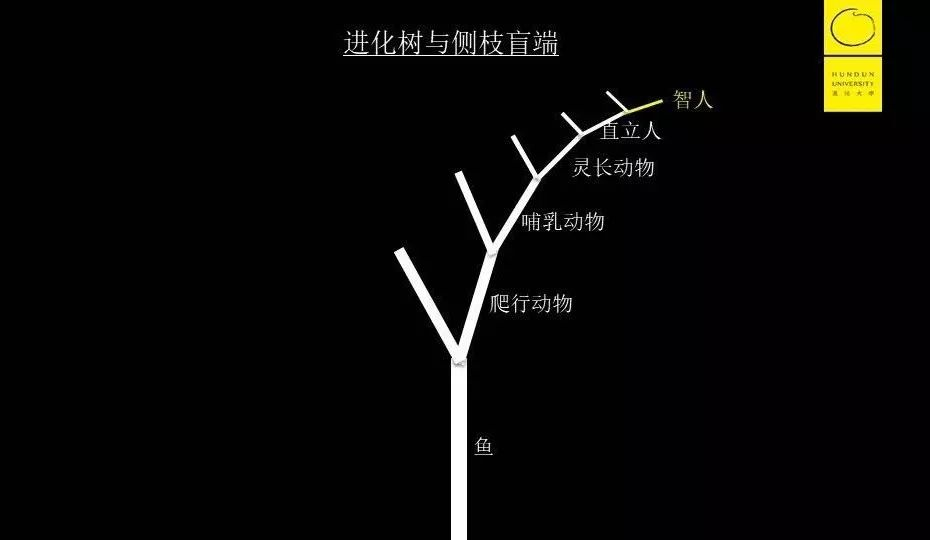
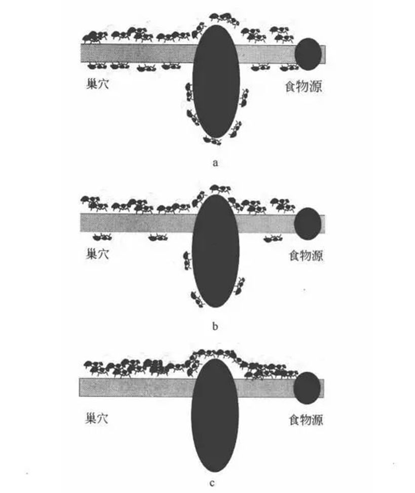

## 德说-第87期, 开源与生命的奥义     
                   
### 作者                        
digoal                                            
                                            
### 日期                                            
2022-01-25                                           
                                            
### 标签                                         
PostgreSQL , 开源              
                                          
----                                          
                                          
## 背景                                          
视频回放: https://www.bilibili.com/video/BV1iq4y1C7FA/       
[PPT](20220125_02_doc_001.pptx)    
    
    
- 一个和尚挑水喝    
- 二个和尚抬水喝    
- 三个和尚没水喝    
    
原因?      
- 自我意识太强.       
- 他们是个体, "自然人". 而不是一个整体, 不是"活力人".      
    
自然人是什么:     
- 个体生命, 受时间和空间限制.       
    
活力人是什么:     
- 集体生命, 打破了时间和空间的限制.       
    
举几个例子:     
一个人的细胞在不断死亡和新生, 每分钟一亿个细胞被更替, 七年全身的细胞会更新一遍. 请问这个人死了吗？为什么？     
    
    
一个蚂蚁群从深林火灾中滚出外面的蚂蚁死了请问蚂蚁群体死了吗？     
    
    
集体生命才是有活力的生命。当多个个体被合为一体，这个生命将会跨域更大的时间和空间。     
      
人类不断在突破合作人数的极限。 例如通过分工合作、等价交换。      
    
有合作就会有交互, 有交互就会有额外的损耗, 哪种合作的代价更高?     
- 基于信任    
- 基于不信任    
    
哪种锁的代价高:      
- 悲观锁    
- 乐观锁    
    
开源, 好像违反市场经济?  好像很难理解?  所以我们要从生命角度来理解开源.      
    
开源项目, 一代又一代的参与者加入、离场、加入 ... .       
跨越了时间和空间的限制.       
    
贝多芬晚年的时候说他要写一部交响曲，告诉全世界他那那“人类团结成兄弟”的理想，在这样的背景下，他写出了不朽的《第九(合唱)交响曲》。    
    
开源就是一种“人类团结成兄弟”的生命体的折射!     
    
## 1、生命的特点?     
game of life      
同一性+自组织  形成的整体.       
    
脱离了整体, 部分无法存活. 例如手指砍掉, 手指没有了血液滋养能不能活?      
    
    
群体生命:      
蚂蚁搭桥    
    
    
    
羚牛的迁徙    
    
    
    
蜜蜂、鸟群、鱼群、大脑神经、人体系统 ...     
    
    
## 2、开源是1.  (自上而下)       
核心是同一性.   相信开源的增量价值, 就像滚雪球一样, 是四两拨千斤的(不管是用户还是Owner):      
       
    
用户: 投入开发者共建, 比购买商业产品更廉价, 同时能快速满足自我的行业或者场景的需求. 其他同行对这个开源项目的贡献也能直接应用到你的场景中.     
Owner: 吸引开发者一起共同开发降低开发成本作用, 用户使用起到推广作用, 用户使用还起到测试、发掘行业需求作用.     
    
形成增长飞轮.    
   
    
两种典型的开源协议 :      
    
2.1、一种, 通常只有1个根(由某个非常强的企业引导的开源产品、并使用限制较大的开源协议), 例如 gpl 开源协议(所有对这个开源项目的修改都要开源).      
- 这类开源产品很难长出分叉, 分叉很难生存!  因为基于它的产品都必须开源, 既然已开源, 主分支也很快会拥有类似的能力. 为什么不直接贡献给主分支? 为什么不使用主分支?    
    
      
    
2.2、一种, 每1个分叉都可以有根, 例如 bsd 开源协议(特别是纯社区版本的, 类BSD开源协议的产品. PG).     
- 但是: 土壤只有这么多, 如果你在同一个盆里面生长, 无疑是内卷, 零和博弈.      
  
     
    
     
  
- 除非: 其他分支都长到别的盆里, 形成侧枝盲端.     
  
    
    
    
  
  
正和博弈例子:   
- 语言兼容, 统一用户接口, 长到另一个盆(底层不一样, 适用场景不一样). 例如汽车, 统一驾照, 会开汽油车的一定会开电动车.      
    
  
侧枝盲端:      
- PolarDB PG , 存算分离 , HTAP , 分布式 , 云原生    
- Greenplum , OLAP , 分布式 , MPP    
- MatrixDB , 时序 , 分布式    
- AntDB , 分布式    
- Citus , 分布式    
- TDSQL , 分布式    
  
    
## 3、开源共建. (自组织, 强连接.  简单规则)       
核心是交通 + 回应.       
    
     
  
     
    
    
- issue     
- mr     
- star    
- fork    
- 使用    
- 发布文档(使用、解决方案、...)    
- 翻译    
- 组织meetup    
- 志愿者    
- 分享    
- 发言    
- 提问    
- 回复    
- faq    
- 在线社群    
- 回应    
- 公司内部的分享    
    
    
    
## 4、PolarDB PG     
    
侧枝盲端之一    
    
- 存算分离, 共享存储. 跨过了Oracle RAC的大山   
- MPP, 多节点并行计算      
- ...     
    
github, 二维码 :     
https://github.com/ApsaraDB/PolarDB-for-PostgreSQL    
https://github.com/ApsaraDB/PolarDB-for-PostgreSQL/tree/POLARDB_11_STABLE/docs/zh/architecture    
    
     
  
一起学习PolarDB  
https://space.bilibili.com/310191812/channel/seriesdetail?sid=238118&ctype=0   
  
  
    
    
    
#### [期望 PostgreSQL 增加什么功能?](https://github.com/digoal/blog/issues/76 "269ac3d1c492e938c0191101c7238216")  
    
    
#### [PolarDB for PostgreSQL云原生分布式开源数据库](https://github.com/ApsaraDB/PolarDB-for-PostgreSQL "57258f76c37864c6e6d23383d05714ea")  
    
    
#### [PostgreSQL 解决方案集合](https://yq.aliyun.com/topic/118 "40cff096e9ed7122c512b35d8561d9c8")  
    
    
#### [德哥 / digoal's github - 公益是一辈子的事.](https://github.com/digoal/blog/blob/master/README.md "22709685feb7cab07d30f30387f0a9ae")  
    
    
  
    
    
  
#### [PolarDB 学习图谱: 训练营、培训认证、在线互动实验、解决方案、生态合作、写心得拿奖品](https://www.aliyun.com/database/openpolardb/activity "8642f60e04ed0c814bf9cb9677976bd4")
  
  
#### [购买PolarDB云服务折扣活动进行中, 55元起](https://www.aliyun.com/activity/new/polardb-yunparter?userCode=bsb3t4al "e0495c413bedacabb75ff1e880be465a")
  
  
#### [About 德哥](https://github.com/digoal/blog/blob/master/me/readme.md "a37735981e7704886ffd590565582dd0")
  
