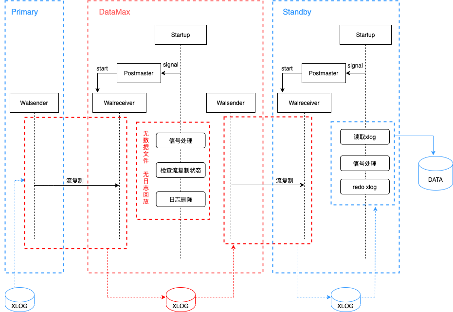

## 一起学PolarDB - 第21期 - 从3到2.5  
          
### 作者          
digoal          
          
### 日期          
2022-02-08         
          
### 标签          
PostgreSQL , PolarDB          
          
----          
          
## 背景          
懂PostgreSQL, 学PolarDB不难, 就好像有九阳神功护体, 可以快速融会贯通.          
对于DBA只要学会PolarDB精髓即可.          
对于开发者来说不需要学习, 使用PolarDB和PostgreSQL一样.          
          
#### 从3到2.5     
https://www.bilibili.com/video/BV1Lm4y1d7ed/   
  
为了提高数据库集群的可靠性, 我们通常会采用数据库多副本的功能, 例如一份数据3个副本(1主2从), 或者一份数据2个副本(1主1从).    
为了保障极端场景的0事务丢失, 同时保证高可用(某一个节点故障, 可以切换到另1个节点), 至少需要1个与主节点完全同步的副本.    
  
对于跨地域的部署架构, 为了同时保证可用性和可靠性, 通常会选择3节点的部署架构(A地域部署同步的主从节点+B地域的异步从节点). 这么做的原因是降低跨地域同步带来的RT增加.    
  
社区版本:           
PostgreSQL 社区版本支持quorum based sync replication功能, 可以配置同步副本数. 但是每个节点都必须是完整的才能参与failover的选举, 或者将wal日志转发给其他节点.    
社区版本采用典型的3节点架构.   
虽然 pg_receivewal 可以实时接收WAL, 但是它不支持将接收到的内容再通过流复制协议发送给其他的节点. 不友好, 无法实现实时wal文件中继.    
  
弊端:  
- 数据和日志都有3份, 性价比较低.     
- WAL日志都需要从主库传输, 需要2条流复制链路, 主库的压力较大  
  
PolarDB:           
datamax组件: 简单的理解是整合了pg_receivewal + wal sender的功能.   
  
  
优势:  
- 数据只需要2份, 3份日志  
- 主节点只需要一份同步链路, 减轻了主库的wal sender负担  
- 中继节点无需要回放日志, 效率、稳定性都比完整的从库节点更高  
  
PolarDB PG 的部署架构相当于2.5节点. 而不是3节点.   
  
          
本期问题1:          
为什么pg_receivewal不能作为wal的实时中继节点?   
- a. pg_receivewal 只接收日志文件, 不接收数据文件  
- b. pg_receivewal 只能接收日志, 不能发送日志   
- c. pg_receivewal 不是采用流复制协议的     
- d. pg_receivewal 采用的是流复制协议   
          
答案:          
- b     
          
解释:          
- 参考本文内容          
        
本期问题2:          
PolarDB datamax通常被用于跨地域的高可靠和高可用部署架构中, datamax组件有哪些功能?   
- a. 实时接收wal日志  
- b. 实时接收数据文件  
- c. 实时发送wal日志   
- d. 实时发送数据文件  
          
答案:          
- ac  
          
解释:          
- 参考本文内容     
  
  
#### [期望 PostgreSQL 增加什么功能?](https://github.com/digoal/blog/issues/76 "269ac3d1c492e938c0191101c7238216")
  
  
#### [PolarDB for PostgreSQL云原生分布式开源数据库](https://github.com/ApsaraDB/PolarDB-for-PostgreSQL "57258f76c37864c6e6d23383d05714ea")
  
  
#### [PostgreSQL 解决方案集合](https://yq.aliyun.com/topic/118 "40cff096e9ed7122c512b35d8561d9c8")
  
  
#### [德哥 / digoal's github - 公益是一辈子的事.](https://github.com/digoal/blog/blob/master/README.md "22709685feb7cab07d30f30387f0a9ae")
  
  

  
  
#### [PolarDB 学习图谱: 训练营、培训认证、在线互动实验、解决方案、生态合作、写心得拿奖品](https://www.aliyun.com/database/openpolardb/activity "8642f60e04ed0c814bf9cb9677976bd4")
  
  
#### [购买PolarDB云服务折扣活动进行中, 55元起](https://www.aliyun.com/activity/new/polardb-yunparter?userCode=bsb3t4al "e0495c413bedacabb75ff1e880be465a")
  
  
#### [About 德哥](https://github.com/digoal/blog/blob/master/me/readme.md "a37735981e7704886ffd590565582dd0")
  
