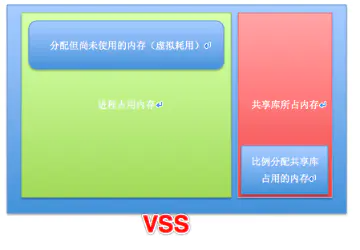
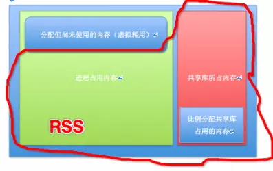
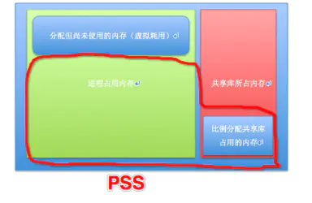
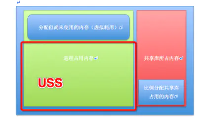

## Linux 进程实际内存占用计算方法 - vsz,vss,rss,pss,uss 介绍     
                  
### 作者                  
digoal                  
                  
### 日期                  
2022-02-10                 
                  
### 标签                  
PostgreSQL , 内存 , vsz , vss , rss , pss , uss , smaps , smem , maps           
                  
----                  
                  
## 背景             
    
- 某个进程独占内存:    
    - USS    
- 由于有fork, 线程的机制存在, 线程、进程之间可以共享内存, 所以一组进程(或线程)家族的内存占用:    
    - sum(USS + PSS)    
    
vss为什么不对? 因为是分配但是未使用的内存. 类似云计算资源的超卖、某些存储的provision功能(超分配), 分配的内存可能比实际内存大.      
rss为什么不对? 因为是共享的, 可能被多个进程同时算到, 计算一组进程(或线程)家族的内存占用使用SUM(rss)就不对了.      
    
rss通常被OOM-Killer用来判断杀哪个进程.      
    
## 内存耗用：VSS/RSS/PSS/USS 的介绍    
    
https://www.jianshu.com/p/3bab26d25d2e    
    
一般来说内存占用大小有如下规律：VSS >= RSS >= PSS >= USS    
    
#### VSS - Virtual Set Size （用处不大）    
    
虚拟耗用内存（包含共享库占用的全部内存，以及分配但未使用内存）。其大小还包括了可能不在RAM中的内存（比如虽然malloc分配了空间，但尚未写入）。VSS 很少被用于判断一个进程的真实内存使用量。    
    
    
    
#### RSS - Resident Set Size （用处不大）    
    
实际使用物理内存（包含共享库占用的全部内存）。但是RSS还是可能会造成误导，因为它仅仅表示该进程所使用的所有共享库的大小，它不管有多少个进程使用该共享库，该共享库仅被加载到内存一次。所以RSS并不能准确反映单进程的内存占用情况。    
    
    
    
#### PSS - Proportional Set Size （仅供参考）    
    
实际使用的物理内存（比例分配共享库占用的内存，按照进程数等比例划分）。    
    
例如：如果有三个进程都使用了一个共享库，共占用了30页内存。那么PSS将认为每个进程分别占用该共享库10页的大小。    
    
PSS是非常有用的数据，因为系统中所有进程的PSS都相加的话，就刚好反映了系统中的 总共占用的内存。而当一个进程被销毁之后， 其占用的共享库那部分比例的PSS，将会再次按比例分配给余下使用该库的进程。    
    
这样PSS可能会造成一点的误导，因为当一个进程被销毁后， PSS不能准确地表示返回给全局系统的内存。    
    
    
    
#### USS - Unique Set Size （非常有用）    
    
进程独自占用的物理内存（不包含共享库占用的内存）。USS是非常非常有用的数据，因为它反映了运行一个特定进程真实的边际成本（增量成本）。当一个进程被销毁后，USS是真实返回给系统的内存。当进程中存在一个可疑的内存泄露时，USS是最佳观察数据。    
    
    
    
参考资料：    
    
http://myeyeofjava.iteye.com/blog/1837860    
    
http://blog.csdn.net/panda1234lee/article/details/52291588    
    
## The mirage of memory    
https://dev.to/yugabyte/the-mirage-of-memory-3366    
    
https://dev.to/yugabyte/mirage-of-memory-part-2-pss-1n8o    
    
像 linux 这样的现代操作系统非常复杂。这种复杂性意味着有时事情实际上与他们让你相信的不同。其中之一是内存使用。    
    
Linux 与大多数现代操作系统一样，使用虚拟内存。这意味着每个不同的进程都有自己的地址空间，如果它正在使用线程，则该地址空间对进程和它的线程来说是完全私有的。    
    
### 获取linux内存统计信息    
对于每个使用的内存段，linux 都会跟踪分配，这当然是显而易见的，但也会在名为“maps”的文件中公开 proc 元文件系统中的分配。这些是我运行“cat”查看它时的分配：    
    
```    
$ cat /proc/self/maps    
55e0495ab000-55e0495b3000 r-xp 00000000 fd:00 401342                     /usr/bin/cat    
55e0497b2000-55e0497b3000 r--p 00007000 fd:00 401342                     /usr/bin/cat    
55e0497b3000-55e0497b4000 rw-p 00008000 fd:00 401342                     /usr/bin/cat    
55e04a1c0000-55e04a1e1000 rw-p 00000000 00:00 0                          [heap]    
7f23fbf4a000-7f23fc1c2000 r--p 00000000 fd:00 882                        /usr/lib/locale/en_US.utf8/LC_COLLATE    
7f23fc1c2000-7f23fc37e000 r-xp 00000000 fd:00 33564883                   /usr/lib64/libc-2.28.so    
7f23fc37e000-7f23fc57d000 ---p 001bc000 fd:00 33564883                   /usr/lib64/libc-2.28.so    
7f23fc57d000-7f23fc581000 r--p 001bb000 fd:00 33564883                   /usr/lib64/libc-2.28.so    
7f23fc581000-7f23fc583000 rw-p 001bf000 fd:00 33564883                   /usr/lib64/libc-2.28.so    
7f23fc583000-7f23fc587000 rw-p 00000000 00:00 0    
7f23fc587000-7f23fc5b3000 r-xp 00000000 fd:00 33564876                   /usr/lib64/ld-2.28.so    
7f23fc72b000-7f23fc74d000 rw-p 00000000 00:00 0    
7f23fc74d000-7f23fc7a0000 r--p 00000000 fd:00 883                        /usr/lib/locale/en_US.utf8/LC_CTYPE    
7f23fc7a0000-7f23fc7a1000 r--p 00000000 fd:00 886                        /usr/lib/locale/en_US.utf8/LC_NUMERIC    
7f23fc7a1000-7f23fc7a2000 r--p 00000000 fd:00 33564847                   /usr/lib/locale/en_US.utf8/LC_TIME    
7f23fc7a2000-7f23fc7a3000 r--p 00000000 fd:00 33564845                   /usr/lib/locale/en_US.utf8/LC_MONETARY    
7f23fc7a3000-7f23fc7aa000 r--s 00000000 fd:00 67614780                   /usr/lib64/gconv/gconv-modules.cache    
7f23fc7aa000-7f23fc7ac000 rw-p 00000000 00:00 0    
7f23fc7ac000-7f23fc7ad000 r--p 00000000 fd:00 33564857                   /usr/lib/locale/en_US.utf8/LC_MESSAGES/SYS_LC_MESSAGES    
7f23fc7ad000-7f23fc7ae000 r--p 00000000 fd:00 100664709                  /usr/lib/locale/en_US.utf8/LC_PAPER    
7f23fc7ae000-7f23fc7af000 r--p 00000000 fd:00 885                        /usr/lib/locale/en_US.utf8/LC_NAME    
7f23fc7af000-7f23fc7b0000 r--p 00000000 fd:00 33564842                   /usr/lib/locale/en_US.utf8/LC_ADDRESS    
7f23fc7b0000-7f23fc7b1000 r--p 00000000 fd:00 33564846                   /usr/lib/locale/en_US.utf8/LC_TELEPHONE    
7f23fc7b1000-7f23fc7b2000 r--p 00000000 fd:00 33564844                   /usr/lib/locale/en_US.utf8/LC_MEASUREMENT    
7f23fc7b2000-7f23fc7b3000 r--p 00000000 fd:00 33564843                   /usr/lib/locale/en_US.utf8/LC_IDENTIFICATION    
7f23fc7b3000-7f23fc7b4000 r--p 0002c000 fd:00 33564876                   /usr/lib64/ld-2.28.so    
7f23fc7b4000-7f23fc7b6000 rw-p 0002d000 fd:00 33564876                   /usr/lib64/ld-2.28.so    
7ffcb6792000-7ffcb67b3000 rw-p 00000000 00:00 0                          [stack]    
7ffcb67df000-7ffcb67e3000 r--p 00000000 00:00 0                          [vvar]    
7ffcb67e3000-7ffcb67e5000 r-xp 00000000 00:00 0                          [vdso]    
ffffffffff600000-ffffffffff601000 r-xp 00000000 00:00 0                  [vsyscall]    
```    
    
（对于阅读本文的老年人：这也是该pmap实用程序为您提供的，在多年前 proc 元文件系统和映射不存在时使用）    
    
如您所见，这些是相当多的内存分配。分配包括可执行文件（为其加载文本（代码）、只读数据和读写数据段）、堆、共享库（由与可执行文件相同的段组成）、区域设置数据和其他分配.    
    
如果我告诉你这些文件的内容实际上并没有加载到地址空间中，除了第一页，除非实际使用了其他页面？这就是操作系统可以如此快速地启动进程的原因之一：它会在最低限度内分页（“加载”），并在实际请求时添加额外的页面。    
    
实际加载页面的大小有一个名字，叫做“RSS”，意思是“驻留集大小”。但是你不应该相信我，或者任何告诉你事情的人，应该有证据。这个证明可以在 linux 的 proc 元文件系统中的一个名为“smaps”的文件中找到。这是这样的：    
    
```    
$ head /proc/self/smaps    
5557aad59000-5557aad63000 r-xp 00000000 fd:00 404248                     /usr/bin/head    
Size:                 40 kB    
KernelPageSize:        4 kB    
MMUPageSize:           4 kB    
Rss:                  40 kB    
Pss:                  40 kB    
Shared_Clean:          0 kB    
Shared_Dirty:          0 kB    
Private_Clean:        40 kB    
Private_Dirty:         0 kB    
```    
    
对于每个内存段，smaps显示内存详细信息。头可执行文件的第一个段是文本段，它是只读的（`'r-xp'：read，executable，private`），文本段总是只读的。“大小”统计数据是总大小，通常称为“虚拟集大小”或 VSZ。这里要发现的重要一点是 Rss，对于头可执行文件也是 40kB。头部文本段太小了，所有 10 页都被分页了。    
    
现在查看另一个文件：`/usr/lib/locale/en_US.utf8/LC_COLLATE`。我不确定这是多么静态，因此是否会在您的机器上请求它（我使用的是 `Alma 8.5 x86_64`），但它说明了这一点：    
    
```    
$ grep -A6 LC_COLLATE /proc/self/smaps    
7f492a1ff000-7f492a477000 r--p 00000000 fd:00 882                        /usr/lib/locale/en_US.utf8/LC_COLLATE    
Size:               2528 kB    
KernelPageSize:        4 kB    
MMUPageSize:           4 kB    
Rss:                  96 kB    
Pss:                  93 kB    
Shared_Clean:          4 kB    
```    
    
该文件的 VSZ 大小为 2528 kB，但实际上是 96 kB，别名 RSS 大小。    
    
### Postgresql 分配    
此时您可能想知道这与 Postgresql 有什么关系。好吧，实际上很多...当 postgres 启动时，它将受到与我刚才描述的相同的延迟加载，包括 postgres 缓冲区缓存，它可以设置为大量内存。    
    
在我的测试 postgres 实例上，它实际上是默认设置（128MB）。这是在 smaps 中的样子：    
    
```    
# grep -A6 deleted /proc/884/smaps    
7f82f73c9000-7f8300175000 rw-s 00000000 00:05 22953                      /dev/zero (deleted)    
Size:             145072 kB    
KernelPageSize:        4 kB    
MMUPageSize:           4 kB    
Rss:               10596 kB    
Pss:                7235 kB    
Shared_Clean:          0 kB    
--    
7f8308509000-7f830850a000 rw-s 00000000 00:05 0                          /SYSV0052e2c1 (deleted)    
Size:                  4 kB    
KernelPageSize:        4 kB    
MMUPageSize:           4 kB    
Rss:                   4 kB    
Pss:                   4 kB    
Shared_Clean:          0 kB    
```    
    
这些是共享内存段（可见访问属性的第四个字母是“s”表示共享，而不是“p”表示私有内存）。第一个共享内存段是缓冲区缓存，它比使用 shared_buffers 参数设置的内存略大。    
    
正如您在 Rss 统计中看到的那样，从 145072 kB 总/VSZ 大小中分配/驻留了 10596 kB，这意味着在启动后只有大约 7% 被调入。    
    
(System V) 共享内存是特殊的，在linux内核中有共享内存特定的限制（shmmax、shmmax、shmmni）。    
    
### 内存分配危险    
这是要考虑的事情：常规（非共享）分配可以分配比可用内存更多的内存，前提是它实际上没有被分页。    
    
让我向你展示它的样子。对于内存消耗测试，我创建了一个名为eatmemory-rust的小型（开源）工具。这允许您分配一定数量的兆字节，并将其分页或不分页。该工具执行 mmap() 来定义总内存/VSZ（这是一个 rust 实现细节，可以随其他版本更改）。    
    
https://github.com/fritshoogland-yugabyte/eatmemory-rust.git      
    
```    
$ strace -e mmap target/debug/eatmemory -s 2000 -a 10 -v    
...    
total memory        :       828 MB    
available memory    :       416 MB    
free memory         :       163 MB    
used memory         :       233 MB    
total swap          :      2158 MB    
free swap           :      2117 MB    
used swap           :        40 MB    
creating vec with size 2000 MB    
mmap(NULL, 2097156096, PROT_READ|PROT_WRITE, MAP_PRIVATE|MAP_ANONYMOUS, -1, 0) = 0x7f35507ed000    
pointer to hog: 0x7f35507ed010    
allocating vec for 10 MB (-1 means creation size)    
total memory        :       828 MB    
available memory    :       405 MB    
free memory         :       152 MB    
used memory         :       243 MB    
total swap          :      2158 MB    
free swap           :      2117 MB    
used swap           :        40 MB    
done. press enter to stop and deallocate    
```    
    
首先看总内存。这是一个小型虚拟机，总内存设置为 1024M，其中 828M 内存可用于 linux，因为内核。    
    
使用 strace 执行eatmemory 工具以打印 `(libc) mmap()` 调用。eatmemory 工具本身设置为创建一个大小为 2000M 的 vec，mmap 函数反映了正在分配的 2000M（2097156096）。实际分配为 10M，因此分页。    
    
如果您查看内存统计信息，可用内存统计信息会降低 11MB，这在分配大小的范围内。2000M 实际上并没有执行任何分配或其他工作，它是使用内存（分配）在内存中实际执行/分页。    
    
### 为什么这很重要？    
首先退后一步。这种惰性分配机制意味着，如果您启动一台机器，它可能没有分配所有已分配的内存，而同一系统已经运行了几天实际生产。    
    
我看到很多测试没有考虑这种惰性分配/需求分页机制，因此使用与实际运行不同的内存分配进行测试，而测试旨在证明它运行良好。    
    
但是还有一件更危险的事情需要考虑。    
    
这意味着多个进程可以分配但尚未分页的内存比系统所能提供的更多（甚至可能包括交换）。然后，它只需要时间来获取正在使用/触摸的内存页面，从而为系统调入内存不足，耗尽其交换空间，然后耗尽内存。很多人认为，如果一个进程能够启动，它就可以分配它的资源。上面的“eatmemory”演示告诉你情况并非如此。    
    
### part 2    
这是一个关于 linux 内核内存管理的博客系列，特别是它与 postgres 的关系。这部分是关于 Linux 内存统计“PSS”：比例集大小。    
    
本系列的第一部分是关于 RSS：驻留集大小。这是一个非常重要的统计数据，也是 OOM-killer（内存不足杀手）使用的统计数据。    
    
但是，驻留集大小并不是关于内存使用的“绝对”事实，至少在 linux 上是这样。之所以这么说是因为linux为其子进程提供了对父进程内存页的COW（写时复制）访问。（线程进程固有地可以访问所有线程的进程中的内存区域）    
    
这意味着对于 fork() 或 clone() 进程的 linux 应用程序，它使这些应用程序能够共享内存页面，它可以提供只读访问。一个这样的应用程序是 PostgreSQL：    
    
```    
[vagrant@centos8-pg11 ~]$ ps -ef | grep $(pgrep -f postmaster)    
postgres     886       1  0 11:16 ?        00:00:00 /usr/pgsql-11/bin/postmaster -D /var/lib/pgsql/11/data/    
postgres     888     886  0 11:16 ?        00:00:00 postgres: logger    
postgres     890     886  0 11:16 ?        00:00:00 postgres: checkpointer    
postgres     891     886  0 11:16 ?        00:00:00 postgres: background writer    
postgres     892     886  0 11:16 ?        00:00:00 postgres: walwriter    
postgres     893     886  0 11:16 ?        00:00:00 postgres: autovacuum launcher    
postgres     894     886  0 11:16 ?        00:00:00 postgres: stats collector    
postgres     895     886  0 11:16 ?        00:00:00 postgres: logical replication launcher    
```    
    
postmaster 进程以 PID 1 作为父进程，所有后台进程都以 postmaster 作为父进程。    
    
但这一切都很好，我有任何证据证明这正在发生吗？这方面的证据可以在 proc 元文件系统 'smaps' 文件中找到，该文件显示了内存分配以及 PSS 图。这是这样的：    
    
```    
[vagrant@centos8-pg11 ~]$ sudo grep -A6 00400000 /proc/886/smaps    
00400000-00af7000 r-xp 00000000 fd:00 101318716                          /usr/pgsql-11/bin/postgres    
Size:               7132 kB    
KernelPageSize:        4 kB    
MMUPageSize:           4 kB    
Rss:                3128 kB    
Pss:                1053 kB    
Shared_Clean:       2688 kB    
```    
    
这是用于 postmaster 进程的 postgres 可执行文件的文本（代码）段，它的虚拟集大小为 7132 kB。基于我在上一篇文章中描述的按需分页机制，它只分页了 3128 kB。而且因为它分叉了几个也使用这个代码段的进程，所以按比例使用是 1053 kB。    
    
这是事情变得有点模糊的地方。一个进程要么使用内存，要么不使用内存，换句话说：它使用或不使用页面的全部 4 kB。上例中的 PSS 为 1053 kB。这意味着：1053/4=263.25，所以它暗示了一个小数页。linux 进程不使用内存的小数页。    
    
内核只是为每个内存页面保留一个计数器，用于“使用”页面的进程数量，别名将页面分页到它们的进程空间中。当请求 PSS 图时，页面的大小除以它共享的进程数，这提供了内存的比例大小，而不是实际大小。    
    
这意味着对于实际的空间使用计算，您必须及时计算一个内存段所涉及的所有进程的所有 PSS 大小，以获得有意义的数字来计算基于 PSS 使用的总内存。    
    
如果您想知道我为什么要提到内存使用计算：自从我从事 IT 工作以来，我已经看到有人提到并一直在尝试这种方法。每隔一段时间，就会有人想要计算一个应用程序使用的准确、实际的内存量。    
    
对于 PostgreSQL，最合乎逻辑的最大内存占用者将是它用作缓冲区缓存的共享内存段。缓冲区缓存被明确定义为共享，没有多少隐藏的 COW 页面共享。另请注意，如果缓冲区高速缓存的大小调整为包含很大比例的内存，则可执行文件和库内存段的页面共享可能是微不足道的。但是，相同的比例共享适用于共享内存段。    
    
检查 proc 中的所有 smaps 文件需要做很多工作。幸运的是，有一个实用程序可以提供 PSS 数字，而无需查看所有“地图”文件。该实用程序是“smem”。'smem' 实用程序在 EPEL 中可用（企业级 linux 的额外包；通过yum install epel-release大多数基于 EL 的 linux 添加）。    
    
对于我的带有 postgres 11 的实验室 Alma8 虚拟机，它是这样的：    
    
```    
[vagrant@alma-85 ~]$ sudo smem -U postgres -tk    
  PID User     Command                         Swap      USS      PSS      RSS    
 4727 postgres postgres: logger                   0   152.0K   537.0K     4.4M    
 4733 postgres postgres: stats collector          0   144.0K   591.0K     4.7M    
 4730 postgres postgres: background writer        0   216.0K     1.0M     6.4M    
 4729 postgres postgres: checkpointer             0   272.0K     1.3M     7.3M    
 4734 postgres postgres: logical replicati        0   460.0K     1.4M     6.6M    
 4732 postgres postgres: autovacuum launch        0   492.0K     1.7M     7.6M    
 4731 postgres postgres: walwriter                0   212.0K     2.7M     9.5M    
 4724 postgres /usr/pgsql-11/bin/postmaste        0     6.9M    11.2M    24.0M    
-------------------------------------------------------------------------------    
    8 1                                           0     8.9M    20.5M    70.4M    
```    
    
该实用程序引入了另一个缩写：USS；这意味着“唯一的集合大小”。它与 PSS 相反，计算唯一分配给进程的内存。进程更改的任何内存页面都被计为 USS，因为这使得它对于该进程是唯一的。    
    
上面的 smem 输出很好地显示了可能发生的双重计算：这个系统上 postgres 可执行文件的实际分配是 `8.9M (USS) + 20.5M (PSS) = 29.4M`，而所有 RSS 内存的计数是 70.4 M。我希望我的解释能让你意识到，通过这种聪明的只读页面共享页面，RSS 大小可以加倍计算内存。    
    
    
    
  
#### [期望 PostgreSQL 增加什么功能?](https://github.com/digoal/blog/issues/76 "269ac3d1c492e938c0191101c7238216")
  
  
#### [PolarDB for PostgreSQL云原生分布式开源数据库](https://github.com/ApsaraDB/PolarDB-for-PostgreSQL "57258f76c37864c6e6d23383d05714ea")
  
  
#### [PostgreSQL 解决方案集合](https://yq.aliyun.com/topic/118 "40cff096e9ed7122c512b35d8561d9c8")
  
  
#### [德哥 / digoal's github - 公益是一辈子的事.](https://github.com/digoal/blog/blob/master/README.md "22709685feb7cab07d30f30387f0a9ae")
  
  

  
  
#### [PolarDB 学习图谱: 训练营、培训认证、在线互动实验、解决方案、生态合作、写心得拿奖品](https://www.aliyun.com/database/openpolardb/activity "8642f60e04ed0c814bf9cb9677976bd4")
  
  
#### [购买PolarDB云服务折扣活动进行中, 55元起](https://www.aliyun.com/activity/new/polardb-yunparter?userCode=bsb3t4al "e0495c413bedacabb75ff1e880be465a")
  
  
#### [About 德哥](https://github.com/digoal/blog/blob/master/me/readme.md "a37735981e7704886ffd590565582dd0")
  
