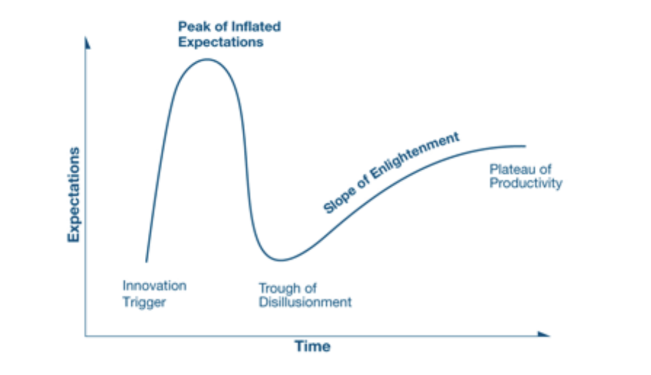
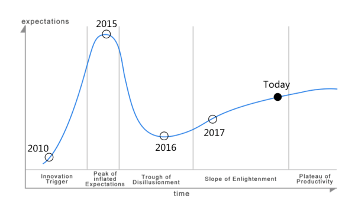

## 判断一个技术成熟与否的标准是什么？ - Gartner 技术成熟度曲线模型   
                           
### 作者                                
digoal                                                    
                                                    
### 日期                                                    
2022-03-07                                                   
                                                    
### 标签                                                 
PostgreSQL , Gartner , 成熟度曲线                      
                                                  
----                                                  
                                                  
## 背景    
https://www.zhihu.com/question/374719089  
  
https://zhuanlan.zhihu.com/p/40935699  
  
## 技术成熟度曲线模型  
“技术成熟度曲线模型”是业界公认的、用于衡量一项技术成熟度的标准模型。Gartner作为全球最权威的IT研究与顾问咨询公司，每年也是根据此模型来分析和推论各种技术的成熟度。  
  
  
  
该模型认为一项技术的发展可以分为5个阶段，并且对每个阶段的边界和特征进行了明确的定义。  
  
- 第一个阶段-技术创新的启动期：技术概念被提出、相关产品出现、媒体有报道、有早期用户尝试、行业应用可行性还没有证明  
- 第二个阶段-过高期望的高峰期：技术体系成型、更多相关产品发布、媒体大肆报道、个别成功案例出现、过多、过高的不切实际的行业期望  
- 第三个阶段-泡沫出现的低谷期：技术局限和缺点暴露、部分产品运营艰难甚至死掉、媒体兴趣下降、一些用户验证失败、行业前景不明  
- 第四个阶段-稳步攀升的光明期：技术特征清晰并且被用户理解、平台化、组件化和生态化的产品出现、媒体重新认识、大规模和重量级的成功案例出现、行业应用前景明确  
- 第五个阶段-实质生产的高峰期：技术体系完备并且标准化，产品相关的生态和产业链蓬勃发展、媒体一致好评、成为主流技术并广泛应用、行业应用稳定  
  
## 例子: 混合开发技术的成熟度曲线  
根据“技术成熟度曲线模型”的定义，我们可以绘制一条描述混合开发技术的成熟度曲线，由此可见证今天的混合开发技术正处于第四个阶段的后期，并即将从“稳步攀升的光明期”迈入“实质生产的高峰期”。  
  
  
  
我们来简单回顾一下混合开发技术的发展历程：  
  
第一个阶段：2009～2012年左右，混合开发技术的概念被正式提出，此时已经有PhoneGap类似的产品在市场上发布，并且有一定量的媒体报道。  
  
第二个阶段：2012～2015年左右，混合技术蓬勃发展并且被媒体大肆报道，2014年下半年HTML5标准定稿，同时市场上有更多混合开发技术的产品发布，比如在2014年面世的APICloud，在2015年Facebook推出的ReactNative，此时行业对混合开发技术抱有很高的期望的。  
  
第三个阶段：2015～2016年左右，混合开发技术进入了一个低谷期，至少在行业用户的眼中是一个低谷，这有多方面的原因：  
  
- 过高的期望造成在一些不适合的领域内应用  
- 由于不理解技术特点和原理，所以采用了不合理的开发方式  
- 技术产品本身不够成熟，在性能和兼容性方面还存在问题  
- 学习资源太少和缺乏优质的社区，开发者本身需要一个踩坑和成熟的过程  
- 扩展模块太少导致功能受限，这是最主要的原因之一;开发者用混合技术开发一款app，最后发现大量的功能还需要自己通过Native来扩展，最典型的就是各类开放服务SDK的封装，常见的例如：支付、地图、推送、统计、客服、IM、IoT、AI等等，每一类服务又分不同的厂商，如果混合开发技术平台本身不提供相应的模块或插件，开发者就得自己封装，这里面的工作量和要踩的坑非常之多。  
  
其实任何一门技术的成熟，一定需要经历平台化、组件化和生态化的发展过程，这个过程需要大量的开发者参与，并且需要大量的应用来验证，使用者一定会遇到问题和挑战，如果期望过高或者使用方式不正确，负面的评价和失望的结论就难免会出现。  
  
第四个阶段：在2016～2018年，混合开发技术逐渐成为一项被人熟知的常规技术，用户能够根据自身产品的研发需求自然的选择和合理的使用。虽然媒体关注度有所下降，但是却在实际应用中取得了实实在在的发展和完善，表现为：技术特点逐渐被掌握、应用领域明确、功能覆盖越来越全面、性能体验显著提升、一些优质的混合开发技术产品完成了平台化、组件化和生态化的发展过程、大规模的成功应用案例，混合开发模式已经成为一线互联网公司App开发的主流开发模式。  
  
混合开发技术处于光明期的6大特征  
- (1) 技术特点清晰，用户能够正确使用混合开发技术  
- (2) 应用领域清晰，用户根据自身需求正确选择  
- (3) 功能覆盖全面，用户无需再花精力自己扩展  
- (4) 性能体验优化，已经基本达到原生的标准  
- (5) 完成了平台化、组件化和生态化发展  
- (6) 大规模成功案例出现，成为企业App开发的主流技术  
  
第五个阶段：未来，考虑到开发效率和成本，同时又要兼顾功能和体验，纯原生的开发模式会越来越少，基于HTML5的混合开发技术将成为全行业移动应用开发的主流技术。混合开发的思想会被所有的用户接受，混合开发技术的门槛会越来越低，并且逐渐形成一些标准化的产品。  
  
  
#### [期望 PostgreSQL 增加什么功能?](https://github.com/digoal/blog/issues/76 "269ac3d1c492e938c0191101c7238216")
  
  
#### [PolarDB for PostgreSQL云原生分布式开源数据库](https://github.com/ApsaraDB/PolarDB-for-PostgreSQL "57258f76c37864c6e6d23383d05714ea")
  
  
#### [PostgreSQL 解决方案集合](https://yq.aliyun.com/topic/118 "40cff096e9ed7122c512b35d8561d9c8")
  
  
#### [德哥 / digoal's github - 公益是一辈子的事.](https://github.com/digoal/blog/blob/master/README.md "22709685feb7cab07d30f30387f0a9ae")
  
  

  
  
#### [PolarDB 学习图谱: 训练营、培训认证、在线互动实验、解决方案、生态合作、写心得拿奖品](https://www.aliyun.com/database/openpolardb/activity "8642f60e04ed0c814bf9cb9677976bd4")
  
  
#### [购买PolarDB云服务折扣活动进行中, 55元起](https://www.aliyun.com/activity/new/polardb-yunparter?userCode=bsb3t4al "e0495c413bedacabb75ff1e880be465a")
  
  
#### [About 德哥](https://github.com/digoal/blog/blob/master/me/readme.md "a37735981e7704886ffd590565582dd0")
  
