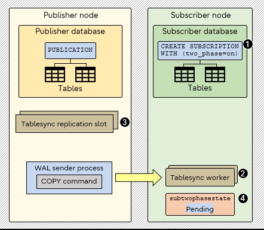
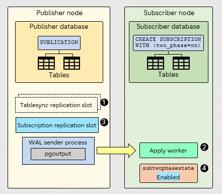

## PostgreSQL 15 2pc 逻辑复制功能测试  
          
### 作者          
digoal          
          
### 日期          
2022-04-21        
          
### 标签          
PostgreSQL , 逻辑复制 , 2pc   
          
----          
          
## 背景        
原文:     
https://www.postgresql.fastware.com/blog/two-phase-commits-for-logical-replication-publications-subscriptions  
  
This feature supports creating Publications/ Subscriptions that allow decoding of replications for two-phase transactions. We also modified the logical decoding plugin pgoutput to support all the required two-phase callbacks.  
  
  
When two-phase commit is enabled, prepared transactions are sent to the subscriber at the time of PREPARE TRANSACTION, and are processed as two-phase transactions by the subscriber also.   
  
## Background  
PostgreSQL 14 already added the framework and decoder-side infrastructure to allow decoding of two-phase commits at PREPARE TRANSACTION time. PostgreSQL 14 also modified the test_decoding plugin to use this framework.  
  
The functionality was however not directly accessible to clients that used PUBLICATION/SUBSCRIPTION for logical replication. This meant that in PostgreSQL 14, prepared transactions were not sent to the subscriber while decoding the PREPARE TRANSACTION, but instead were sent to the subscriber only when decoding the corresponding COMMIT PREPARED.  
  
For example, PostgreSQL 14 behavior is as follows:  
  
1 Publisher side  
  
```  
postgres=# CREATE TABLE test (col1 INT, col2 TEXT, PRIMARY KEY(col1));  
CREATE TABLE  
postgres=# CREATE PUBLICATION pub FOR TABLE test;  
```  
  
2 Subscriber side  
  
```  
postgres=# CREATE TABLE test (col1 INT, col2 TEXT, PRIMARY KEY(col1));  
CREATE TABLE  
postgres=# CREATE SUBSCRIPTION sub CONNECTION 'dbname=postgres host=localhost' PUBLICATION pub;  
NOTICE: created replication slot "sub" on publisher  
CREATE SUBSCRIPTION  
```  
  
3 Publisher side  
  
```  
postgres=# BEGIN;  
BEGIN  
postgres=*# INSERT INTO test VALUES (7,'aa');  
INSERT 0 1  
postgres=*# PREPARE TRANSACTION 't1';  
PREPARE TRANSACTION  
postgres=# SELECT * FROM pg_prepared_xacts;  
transaction | gid |           prepared            | owner | database  
------------+-----+-------------------------------+-------+----------  
        790 | t1  | 2022-03-14 06:59:49.341013-04 | ajin  | postgres  
(1 row)  
```  
  
4 Subscriber side  
  
```  
postgres=# SELECT * FORM pg_prepared_xacts;  
transaction  | gid | prepared | owner | database   
-------------+-----+----------+-------+----------  
(0 rows)  
```  
  
Note above that the prepared transaction is not replicated on the subscriber.  
## Feature  
### Overview  
A new SUBSCRIPTION option two_phase specifies whether two-phase commit is enabled for this SUBSCRIPTION. The default is false.  
  
```  
CREATE SUBSCRIPTION sub  
CONNECTION 'conninfo'  
PUBLICATION pub  
WITH (two_phase = on);  
```  
  
When two-phase commit is enabled, prepared transactions are sent to the subscriber at the time of PREPARE TRANSACTION, and are processed as two-phase transactions by the subscriber also. Otherwise, prepared transactions are sent to the subscriber only when committed, and are processed immediately.  
  
img-computer-programmer-using-laptop-01  
### Overcoming prepare complications  
Two-phase transactions are replayed at PREPARE TRANSACTION and then committed or rolled back at COMMIT PREPARED and ROLLBACK PREPARED, respectively.  
  
It is possible that a prepared transaction arrives at the apply worker while the tablesync worker is still busy doing the initial copy. In this case, the apply worker starts a new transaction, but then skips all subsequent changes (for example, inserts) assuming that the running tablesync worker is handling them. Meanwhile, the tablesync worker maybe never saw the prepared transaction at all (because it was prior to the consistent point from which the tablesync worker starts applying changes).  
  
Now, the tablesync worker exits without doing anything regarding the prepared transaction. Later, when the apply worker does the COMMIT PREPARED it gets an empty prepare error (the transaction is empty because the apply worker skipped the inserts earlier).  
  
To avoid this complication, the implementation of two-phase commits requires that replication has successfully finished the initial table synchronization phase. This means even when two_phase is enabled for a subscription, the internal two-phase state is temporarily pending until all table initialization completes. Refer to the following tri-state section.  
  
  
  
Going through the steps, we have:  
  
1 The subscription is created with two_phase enabled.  
  
2 Initially, the subscription is in a tablesync phase - a tablesync worker is started for each table.  
  
3 Each tablesync worker creates a tablesync slot for each table on the publisher.  
  
4 The two-phase state is set to pending (by setting the column subtwophasestate in the pg_subscription catalog - more on that later).  
  
   
  
After that, comes the apply worker phase.  
  
  
  
In apply worker phase we have:  
  
1 The tablesync workers drop their tablesync slots on the publisher and die.  
  
2 The apply worker takes over.  
  
3 The apply worker creates the subscription replication slot on the publisher.  
  
4 The two-phase state is set to enabled.  
  
### Tri-state enablement  
In the diagrams above, the change of two-phase state is done by setting the pg_subscription's new column subtwophasestate, which indicates the state of the two-phase mode.  
  
Code|	State  
---|---  
d|	Disabled  
p|	Pending enablement  
e|	Enabled  
Even if the user specifies that they want a subscription with two_phase = on, internally it will start with a tri-state of pending, and only become enabled after all tablesync initializations are completed - that is, when all tablesync workers have reached their ready state. In other words, pending is only a transitory state at subscription startup.  
  
Until the two-phase is properly available (tri-state enabled) the subscription will behave as if two_phase = off. When the apply worker detects that all tablesyncs have become ready (while the tri-state was pending) it will restart the apply worker process.  
  
When the (restarted) apply worker finds that all tablesync workers are ready for a two-phase tri-state of pending, it calls wal_startstreaming to properly enable the publisher for two-phase commits and updates the tri-state value pending to enabled.  
  
If ever a user needs to be aware of the tri-state value, they can fetch it from the pg_subscription catalog. For example:  
  
```  
postgres=# SELECT subtwophasestate FROM pg_subscription;  
subtwophasestate   
------------------  
e  
```  
  
img-man-writing-diagram-on-glass-panel-01  
### ALTER SUBSCRIPTION restriction  
It is not possible for ALTER SUBSCRIPTION to change the two_phase option.  
  
This restriction is to circumvent the case where a prepared transaction and the corresponding COMMIT PREPARED straddle the enabling or disabling of the two_phase option. In this scenario, the decoder would not be able to decide if the transaction needs to be decoded fully, or to just send the COMMIT PREPARED.  
  
### Global ID (GID) on subscriber  
Prepared transactions that are replicated on the subscriber will not have the same GID as was specified on the publisher. If there were multiple subscribers that apply a particular prepared transaction on the publisher, and all of them used the same GID as the publisher, then this would fail when the second transaction attempted to prepare using the same GID.  
  
To avoid such conflicts, the apply worker on the subscriber substitutes a generated unique GID based on the subscriber ID, and the transaction ID on the publisher: `pg_gid_<subscriber-id>_<transaction-id>`  
  
Example: `pg_gid_24576_790`  
  
### Callback APIs  
For this feature, the following pgoutput functions were implemented so that the callbacks necessary for two-phase commits could be assigned. For details on what these callbacks are about, refer to my previous blog post Logical decoding of two-phase commits in PostgreSQL 14.  
https://www.postgresql.fastware.com/blog/logical-decoding-of-two-phase-commits  
  
```  
cb->begin_prepare_cb = pgoutput_begin_prepare_txn;  
cb->prepare_cb = pgoutput_prepare_txn;  
cb->commit_prepared_cb = pgoutput_commit_prepared_txn;  
cb->rollback_prepared_cb = pgoutput_rollback_prepared_txn;  
cb->stream_prepare_cb = pgoutput_stream_prepare_txn;  
```  
  
### Examples  
1 Publisher side  
  
Create table and publication.  
  
```  
postgres=# CREATE TABLE test (col1 INT, col2 TEXT, PRIMARY KEY(col1));  
CREATE TABLE  
postgres=# CREATE PUBLICATION pub FOR TABLE test;  
```  
  
2 Subscriber side  
  
Create the same table, and create a subscription with two_phase mode enabled.  
Inspect the subtwophasestate column to verify that it is two-phase enabled (that is, if value is e).  
  
```  
postgres=# CREATE TABLE test (col1 INT, col2 TEXT, PRIMARY KEY(col1));  
CREATE TABLE  
postgres=# CREATE SUBSCRIPTION sub CONNECTION 'dbname=postgres host=localhost' PUBLICATION pub WITH (two_phase = on);  
NOTICE: created replication slot "sub" on publisher  
CREATE SUBSCRIPTION  
postgres=# SELECT subtwophasestate FROM pg_subscription;  
subtwophasestate  
------------------  
e  
(1 row)  
```  
  
3 Publisher side  
  
Start transaction.  
Insert some data.  
Prepare the transaction and inspect the GID.  
  
```  
postgres=# BEGIN;  
BEGIN  
postgres=*# INSERT INTO test VALUES (7,'aa');  
INSERT 0 1  
postgres=*# PREPARE TRANSACTION 't1';  
PREPARE TRANSACTION  
postgres=# SELECT * FROM pg_prepared_xacts;  
transaction | gid |          prepared             | owner | database  
------------+-----+-------------------------------+-------+----------  
        790 |  t1 | 2022-03-14 06:59:49.341013-04 | ajin  | postgres  
(1 row)  
```  
  
4 Subscriber side  
  
Inspect the subscriber side and see that a generated prepared transaction GID was replicated there also.  
  
```  
postgres=# SELECT * FROM pg_prepared_xacts;  
transaction |         gid      |            prepared           | owner | database  
------------+------------------+-------------------------------+-------+----------  
        877 | pg_gid_24576_790 | 2022-03-14 06:59:49.350815-04 | ajin  | postgres  
(1 row)  
```  
  
5 Publisher side  
  
Commit the prepared transaction.  
Observe that the prepared transaction GID is now gone (it was committed).  
Select the inserted data.  
  
```  
postgres=# COMMIT PREPARED 't1';  
COMMIT PREPARED  
postgres=# SELECT * FROM pg_prepared_xacts;  
transaction | gid | prepared | owner | database  
------------+-----+----------+-------+----------  
(0 rows)  
postgres=# SELECT * FROM test;  
 a | b   
---+----  
 7 | aa  
(1 row)  
```  
  
6 Subscriber side  
  
The subscriber-side generated GID is also gone (it was committed).  
Selection shows the published data was replicated.  
  
```  
postgres=# SELECT * FROM pg_prepared_xacts;  
transaction | gid | prepared | owner | database  
------------+-----+----------+-------+----------  
(0 rows)  
postgres=# SELECT * from test;  
 a | b   
---+----  
 7 | aa  
(1 row)  
```  
  
## For the future  
PostgreSQL 15 now provides the underlying framework for having a distributed database which supports two-phase commits. For two-phase transactions to work in a distributed database, the standby needs to inform the master about a failed PREPARE and initiate a rollback. This type of standby feedback mechanism is not currently present in PostgreSQL and is a candidate for future improvement.  
  
## References  
Here are the commits that authored these changes:  
  
Add support for prepared transactions to built-in logical replication  
https://github.com/postgres/postgres/commit/a8fd13cab0ba815e9925dc9676e6309f699b5f72  
  
Add prepare API support for streaming transactions in logical replication  
https://github.com/postgres/postgres/commit/63cf61cdeb7b0450dcf3b2f719c553177bac85a2  
  
https://www.postgresql.fastware.com/blog/two-phase-commits-for-logical-replication-publications-subscriptions#form-blog-subscription  
    
  
#### [期望 PostgreSQL 增加什么功能?](https://github.com/digoal/blog/issues/76 "269ac3d1c492e938c0191101c7238216")
  
  
#### [PolarDB for PostgreSQL云原生分布式开源数据库](https://github.com/ApsaraDB/PolarDB-for-PostgreSQL "57258f76c37864c6e6d23383d05714ea")
  
  
#### [PostgreSQL 解决方案集合](https://yq.aliyun.com/topic/118 "40cff096e9ed7122c512b35d8561d9c8")
  
  
#### [德哥 / digoal's github - 公益是一辈子的事.](https://github.com/digoal/blog/blob/master/README.md "22709685feb7cab07d30f30387f0a9ae")
  
  

  
  
#### [PolarDB 学习图谱: 训练营、培训认证、在线互动实验、解决方案、生态合作、写心得拿奖品](https://www.aliyun.com/database/openpolardb/activity "8642f60e04ed0c814bf9cb9677976bd4")
  
  
#### [购买PolarDB云服务折扣活动进行中, 55元起](https://www.aliyun.com/activity/new/polardb-yunparter?userCode=bsb3t4al "e0495c413bedacabb75ff1e880be465a")
  
  
#### [About 德哥](https://github.com/digoal/blog/blob/master/me/readme.md "a37735981e7704886ffd590565582dd0")
  
