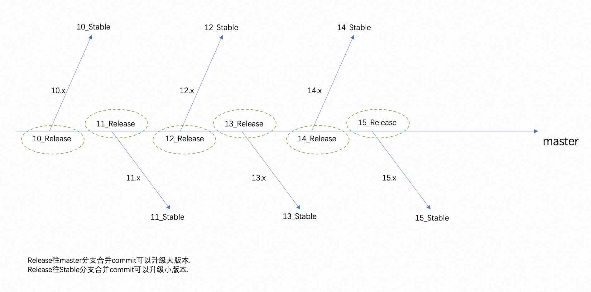

## 基于开源版本的发型版如何保持与开源版本的同步? 开源项目分支关系与开发协作 - 路口      
                        
### 作者                        
digoal                        
                        
### 日期                        
2022-08-17                       
                        
### 标签                        
PostgreSQL , 开源 , 发型 , 同步 , 合并 , commit , 升级 , 路口         
                        
----                        
                        
## 背景     
基于开源版本的发型版如何保持与开源版本的同步?  
  
  
  
PG社区版本的分支结构  
- master: 主干  
    - xx_stable: 某大版本  
        - xx_BETA: 小版本  
        - xx_RELEASE: 小版本  
        - xx_RELEASE: 小版本  
    - xx_stable: 某大版本  
        - xx_BETA: 小版本  
        - xx_RELEASE: 小版本  
        - xx_RELEASE: 小版本  
    - ...  
        - ...  
  
如果你要基于PG开发自己的产品, 怎么更好的和PG社区保持同步:    
- 必须选择master分支的某一个commit为起点.      
    - 或者叫主干道(master)的路口, 在路口你可以选择继续走主干道(master), 也可以选择拐弯进入其他道路(某个大版本的分支). 如果你继续走主干道, 那么下一次遇到的就是下一个路口(下一个更大版本的分支).
    - 拐弯之后就是进入了某个大版本的分支(某stable分支), 沿着stable分支走就在该大版本的路上. 终极可能会有些该大版本的小版本release tag.   
    - 主干道永不终结
    - 支路(各大版本的stable分支)会随着大版本的维护生命周期而终结, 通常是5-6年.  
- 这个起点必须来自master分支, 可以是master中某大版本的第一次release stamp. 例如 https://git.postgresql.org/gitweb/?p=postgresql.git;a=commit;h=86a4dc1e6f29d1992a2afa3fac1a0b0a6e84568c  
- 升级大版本, 可以从这个commit起点开始, 合并master分支的增量commit直到下一个大版本的第一次release stamp     
- 升级小版本, 可以从这个commit起点开始, 合并对应大版本的stable分支的增量commit直到下一个小版本: 例如     https://git.postgresql.org/gitweb/?p=postgresql.git;a=shortlog;h=refs/heads/REL_14_STABLE    
  
如果你还想要有自己分支的发型版和开源版, 并对发型版和开源版有所区分, 想减少管理工作量, 可以将自己的开源版再作为上游. 原理如上.   
  
例如: `centos stream->rhel, postgresql-> edb,postgres_pro,greenplum`    
  
  
#### [期望 PostgreSQL 增加什么功能?](https://github.com/digoal/blog/issues/76 "269ac3d1c492e938c0191101c7238216")
  
  
#### [PolarDB for PostgreSQL云原生分布式开源数据库](https://github.com/ApsaraDB/PolarDB-for-PostgreSQL "57258f76c37864c6e6d23383d05714ea")
  
  
#### [PostgreSQL 解决方案集合](https://yq.aliyun.com/topic/118 "40cff096e9ed7122c512b35d8561d9c8")
  
  
#### [德哥 / digoal's github - 公益是一辈子的事.](https://github.com/digoal/blog/blob/master/README.md "22709685feb7cab07d30f30387f0a9ae")
  
  

  
  
#### [PolarDB 学习图谱: 训练营、培训认证、在线互动实验、解决方案、生态合作、写心得拿奖品](https://www.aliyun.com/database/openpolardb/activity "8642f60e04ed0c814bf9cb9677976bd4")
  
  
#### [购买PolarDB云服务折扣活动进行中, 55元起](https://www.aliyun.com/activity/new/polardb-yunparter?userCode=bsb3t4al "e0495c413bedacabb75ff1e880be465a")
  
  
#### [About 德哥](https://github.com/digoal/blog/blob/master/me/readme.md "a37735981e7704886ffd590565582dd0")
  
