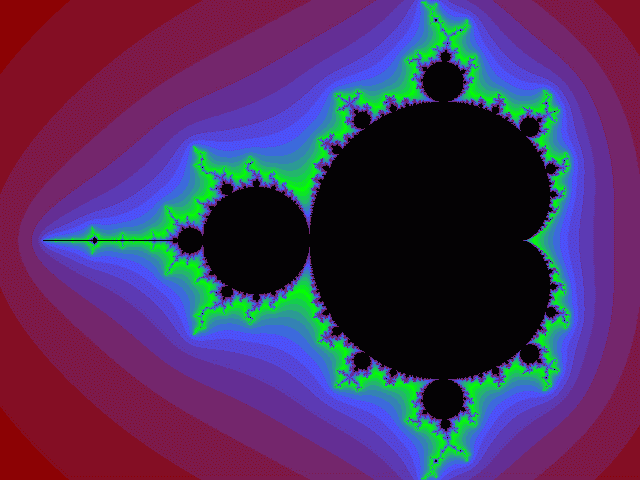
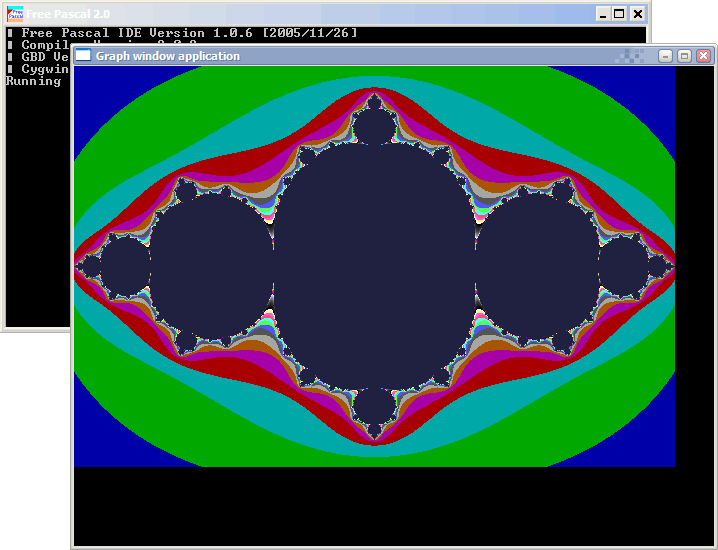

## 用PostgreSQL 递归SQL与plpgsql函数 绘制分形图 - 曼德勃罗集(Mandelbrot-上帝的指纹) 和 Julia 集 - `z->z^2+c`    
    
### 作者    
digoal    
    
### 日期    
2022-08-18    
    
### 标签    
PostgreSQL , 分形 , 曼德勃罗集 , plpgsql , 递归 , Julia , Mandelbrot    
    
----    
    
## 背景    
https://www.zhihu.com/question/265983000    
    
分形的公式非常简单, 但是却能变幻出无穷无尽的自相似状态, 所以也被誉为神性法则. (非常符合一生二二生三三生万物的特性, 无穷无尽.  )  
- 此外, 分形还能够创造维度, 例如一维的线段, 通过分形能铺满整个面, 变成二维的平面.  这个法则也适用于生物领域, 例如以氨基酸为基本单位分形而构成的生物高分子(蛋白质). 所以请想象一下, 通过分形我们也许能找到进入更高维度生命的通道?   建议阅读《规模》?    
    
1、分形公式如下:    
    
```    
z=z^2+c    
  
z可以是单数、也可以是复数、甚至可以是多维数.    
```    
    
2、复数运算:    
    
```    
(a+bi)(c+di) = (ac-bd)+(ad+bc)i    
(a+bi) + (c+di) = (a+c)+(b+d)i    
(a+bi) - (c+di) = (a-c)+(b-d)i    
```    
  
3、如何生成分形图案?  
  
当z0固定时, 取不同的c值, z的发散速度是不一样的, 例如某个c值, 100次之后z就趋于无穷大, 某个c, 不管迭代多少次, z都在某个范围内跳动.    
  
那么以一块白布为底图, 把c的坐标映射到这个二维白布中, 用颜色来标记该c值引起的z值发散速度, 越黑表示z值越不会被发散. c在复平面上的像素就组成了一副分形图案.    
  
来个简单的, 了解一下c和z0固定时, 如何产生z的迭代值, 观察z的发散速度:    
    
```    
WITH RECURSIVE t(n, zr, zi, cr, ci) AS (    
    VALUES (1, 0.15::float8, 0.15::float8, -0.75::float8, 0.0::float8)    
  UNION ALL    
    SELECT n+1, zr*zr - zi*zi + cr, zr*zi + zi*zr + ci, cr, ci FROM t WHERE n < 100    
)    
SELECT n,zr,zi FROM t;    
```    
    
```    
do language plpgsql $$    
declare    
  zr float8 := 0.15;    
  zi float8 := 0.15;    
  cr float8 := -0.75;    
  ci float8 := 0.0;    
  tmpr float8;    
  tmpi float8;    
begin    
  for i in 1..100 loop    
    raise notice '%, %i', zr, zi;    
    tmpr := zr*zr - zi*zi + cr;    
    tmpi := zr*zi + zi*zr + ci;    
    zr := tmpr;    
    zi := tmpi;    
  end loop;    
    raise notice '%, %i', zr, zi;    
end;    
$$;    
```    
  
```  
┌─────┬──────────────────────┬────────────────────────┐  
│  n  │          zr          │           zi           │  
├─────┼──────────────────────┼────────────────────────┤  
│ 1   │ 0.15                 │ 0.15                   │  
│ 2   │ -0.75                │ 0.045                  │  
│ 3   │ -0.18952500000000005 │ -0.0675                │  
│ 4   │ -0.7186365243749999  │ 0.025585875000000008   │  
│ 5   │ -0.2342161828337358  │ -0.036773888566186415  │  
│ 6   │ -0.6964950985790723  │ 0.017226079615850688   │  
│ 7   │ -0.26519131547425995 │ -0.023995760040345746  │  
│ 8   │ -0.6802493626969454  │ 0.012726934341807938   │  
│ 9   │ -0.28742277940814037 │ -0.017314977950201437  │  
│ 10  │ -0.6676879543387154  │ 0.009953438175675124   │  
│ 11  │ -0.30429186656249846 │ -0.013291581548306798  │  
│ 12  │ -0.657583126083966   │ 0.008089040317803877   │  
│ 13  │ -0.317649864862902   │ -0.010638432838401423  │  
│ 14  │ -0.6492117396058372  │ 0.006758593506942541   │  
│ 15  │ -0.3285697957441547  │ -0.008775516495861767  │  
│ 16  │ -0.6421188990144137  │ 0.005766739325189522   │  
│ 17  │ -0.3377165748109619  │ -0.007405864612787637  │  
│ 18  │ -0.6360023619286149  │ 0.005002166461088703   │  
│ 19  │ -0.34552601729052757 │ -0.006362779368025033  │  
│ 20  │ -0.6306522563366322  │ 0.0043970116278640595  │  
...  
│ 96  │ -0.5671955589513737  │ 0.0005535901325261927  │  
│ 97  │ -0.4282895043678735  │ -0.0006279877292963179 │  
│ 98  │ -0.5665684948169094  │ 0.0005379211066588526  │  
│ 99  │ -0.4290004300400187  │ -0.0006095383034599045 │  
│ 100 │ -0.5659590025624224  │ 0.0005229843886203249  │  
└─────┴──────────────────────┴────────────────────────┘  
  
100次迭代后, z依旧未发散.    
```  
    
4、Mandelbrot集分形图形(上帝的指纹): 固定z0, 以不同的c为像素点绘制复平面.    
    
     
    
我们固定`z0=0`，那么对于不同的复数c，函数的迭代结果也不同。由于复数c对应平面上的点，因此我们可以用一个平面图形来表示，对于某个复数c，函数`f(z)=z^2+c`从`z0=0`开始迭代是否会发散到无穷。我们用不同颜色来表示不同的发散速度，最后得出的就是Mandelbrot集分形图形：    
  
    
```    
do language plpgsql $$    
declare    
  zr numeric := 0.0;  -- z0r    
  zi numeric := 0.0;  -- z0i    
  tmpr numeric;    
  tmpi numeric;    
  i int;    
begin    
  <<label_x>>    
  for x in -300..300 loop  -- cr, 表示白布的x轴像素点范围是-300到300    
  <<label_y>>    
  for y in -200..200 loop  -- ci, 表示白布的y轴像素点范围是-200到200    
  <<label_i>>    
  for k in 1..200 loop  -- z的发散速度, i 表示颜色深度; 最多迭代200次, 200次就是黑色, 1次可能就接近白色.    
    tmpr := zr*zr - zi*zi + x::numeric/300.0::numeric;    
    tmpi := zr*zi + zi*zr + y::numeric/200.0::numeric;    
    zr := tmpr;    
    zi := tmpi;    
    i := k;    
    exit label_i when sqrt(zr*zr + zi*zi) > 2;    -- z的迭代次数截止于|z|>2, 因为此时z会无限发散.    
  end loop label_i ;    
  raise notice 'cr:%, ci:%, i:%', x, y, i;    
  zr := 0.0;  -- z0r    
  zi := 0.0;  -- z0i    
  end loop label_y ;    
  end loop label_x ;    
end;    
$$;    
```    
    
cr为x坐标, ci为y坐标, i为颜色深度:    
    
```    
NOTICE:  cr:-300, ci:-200, i:3    
NOTICE:  cr:-300, ci:-199, i:3    
NOTICE:  cr:-300, ci:-198, i:3    
NOTICE:  cr:-300, ci:-197, i:3    
NOTICE:  cr:-300, ci:-196, i:3    
NOTICE:  cr:-300, ci:-195, i:3    
NOTICE:  cr:-300, ci:-194, i:3    
NOTICE:  cr:-300, ci:-193, i:3    
NOTICE:  cr:-300, ci:-192, i:3    
NOTICE:  cr:-300, ci:-191, i:3    
NOTICE:  cr:-300, ci:-190, i:3    
NOTICE:  cr:-300, ci:-189, i:3    
NOTICE:  cr:-300, ci:-188, i:3    
NOTICE:  cr:-300, ci:-187, i:3    
NOTICE:  cr:-300, ci:-186, i:3    
NOTICE:  cr:-300, ci:-185, i:3    
NOTICE:  cr:-300, ci:-184, i:3    
NOTICE:  cr:-300, ci:-183, i:3    
NOTICE:  cr:-300, ci:-182, i:3    
NOTICE:  cr:-300, ci:-181, i:3    
NOTICE:  cr:-300, ci:-180, i:3    
NOTICE:  cr:-300, ci:-179, i:3    
NOTICE:  cr:-300, ci:-178, i:3    
NOTICE:  cr:-300, ci:-177, i:3    
NOTICE:  cr:-300, ci:-176, i:3    
NOTICE:  cr:-300, ci:-175, i:3    
NOTICE:  cr:-300, ci:-174, i:3    
NOTICE:  cr:-300, ci:-173, i:3    
NOTICE:  cr:-300, ci:-172, i:3    
NOTICE:  cr:-300, ci:-171, i:3    
NOTICE:  cr:-300, ci:-170, i:3    
NOTICE:  cr:-300, ci:-169, i:3    
NOTICE:  cr:-300, ci:-168, i:3    
NOTICE:  cr:-300, ci:-167, i:3    
NOTICE:  cr:-300, ci:-166, i:3    
NOTICE:  cr:-300, ci:-165, i:3    
NOTICE:  cr:-300, ci:-164, i:3    
NOTICE:  cr:-300, ci:-163, i:3    
NOTICE:  cr:-300, ci:-162, i:3    
NOTICE:  cr:-300, ci:-161, i:3    
NOTICE:  cr:-300, ci:-160, i:3    
NOTICE:  cr:-300, ci:-159, i:3    
NOTICE:  cr:-300, ci:-158, i:3    
NOTICE:  cr:-300, ci:-157, i:3    
NOTICE:  cr:-300, ci:-156, i:3    
NOTICE:  cr:-300, ci:-155, i:3    
NOTICE:  cr:-300, ci:-154, i:3    
NOTICE:  cr:-300, ci:-153, i:3    
NOTICE:  cr:-300, ci:-152, i:3    
NOTICE:  cr:-300, ci:-151, i:3    
NOTICE:  cr:-300, ci:-150, i:3    
NOTICE:  cr:-300, ci:-149, i:3    
NOTICE:  cr:-300, ci:-148, i:4    
NOTICE:  cr:-300, ci:-147, i:4    
NOTICE:  cr:-300, ci:-146, i:4    
NOTICE:  cr:-300, ci:-145, i:4    
NOTICE:  cr:-300, ci:-144, i:4    
NOTICE:  cr:-300, ci:-143, i:4    
NOTICE:  cr:-300, ci:-142, i:4    
NOTICE:  cr:-300, ci:-141, i:4    
NOTICE:  cr:-300, ci:-140, i:4    
NOTICE:  cr:-300, ci:-139, i:4    
NOTICE:  cr:-300, ci:-138, i:4    
NOTICE:  cr:-300, ci:-137, i:4    
NOTICE:  cr:-300, ci:-136, i:4    
NOTICE:  cr:-300, ci:-135, i:4    
NOTICE:  cr:-300, ci:-134, i:4    
NOTICE:  cr:-300, ci:-133, i:4    
NOTICE:  cr:-300, ci:-132, i:4    
NOTICE:  cr:-300, ci:-131, i:4    
NOTICE:  cr:-300, ci:-130, i:4    
NOTICE:  cr:-300, ci:-129, i:4    
NOTICE:  cr:-300, ci:-128, i:4    
NOTICE:  cr:-300, ci:-127, i:4    
NOTICE:  cr:-300, ci:-126, i:4    
NOTICE:  cr:-300, ci:-125, i:4    
NOTICE:  cr:-300, ci:-124, i:4    
NOTICE:  cr:-300, ci:-123, i:4    
NOTICE:  cr:-300, ci:-122, i:4    
NOTICE:  cr:-300, ci:-121, i:4    
NOTICE:  cr:-300, ci:-120, i:4    
NOTICE:  cr:-300, ci:-119, i:5    
NOTICE:  cr:-300, ci:-118, i:5    
NOTICE:  cr:-300, ci:-117, i:5    
NOTICE:  cr:-300, ci:-116, i:5    
NOTICE:  cr:-300, ci:-115, i:5    
NOTICE:  cr:-300, ci:-114, i:5    
NOTICE:  cr:-300, ci:-113, i:5    
NOTICE:  cr:-300, ci:-112, i:5    
NOTICE:  cr:-300, ci:-111, i:5    
NOTICE:  cr:-300, ci:-110, i:5    
NOTICE:  cr:-300, ci:-109, i:5    
NOTICE:  cr:-300, ci:-108, i:5    
NOTICE:  cr:-300, ci:-107, i:5    
NOTICE:  cr:-300, ci:-106, i:5    
NOTICE:  cr:-300, ci:-105, i:5    
NOTICE:  cr:-300, ci:-104, i:5    
NOTICE:  cr:-300, ci:-103, i:5    
NOTICE:  cr:-300, ci:-102, i:5    
NOTICE:  cr:-300, ci:-101, i:5    
NOTICE:  cr:-300, ci:-100, i:5    
NOTICE:  cr:-300, ci:-99, i:5    
NOTICE:  cr:-300, ci:-98, i:5    
NOTICE:  cr:-300, ci:-97, i:5    
NOTICE:  cr:-300, ci:-96, i:5    
NOTICE:  cr:-300, ci:-95, i:5    
NOTICE:  cr:-300, ci:-94, i:5    
NOTICE:  cr:-300, ci:-93, i:5    
NOTICE:  cr:-300, ci:-92, i:5    
NOTICE:  cr:-300, ci:-91, i:5    
NOTICE:  cr:-300, ci:-90, i:5    
NOTICE:  cr:-300, ci:-89, i:5    
NOTICE:  cr:-300, ci:-88, i:5    
NOTICE:  cr:-300, ci:-87, i:6    
NOTICE:  cr:-300, ci:-86, i:6    
NOTICE:  cr:-300, ci:-85, i:6    
NOTICE:  cr:-300, ci:-84, i:6    
NOTICE:  cr:-300, ci:-83, i:6    
NOTICE:  cr:-300, ci:-82, i:7    
NOTICE:  cr:-300, ci:-81, i:7    
NOTICE:  cr:-300, ci:-80, i:7    
NOTICE:  cr:-300, ci:-79, i:8    
NOTICE:  cr:-300, ci:-78, i:8    
NOTICE:  cr:-300, ci:-77, i:8    
NOTICE:  cr:-300, ci:-76, i:8    
NOTICE:  cr:-300, ci:-75, i:8    
NOTICE:  cr:-300, ci:-74, i:9    
NOTICE:  cr:-300, ci:-73, i:9    
NOTICE:  cr:-300, ci:-72, i:10    
NOTICE:  cr:-300, ci:-71, i:10    
NOTICE:  cr:-300, ci:-70, i:10    
NOTICE:  cr:-300, ci:-69, i:10    
NOTICE:  cr:-300, ci:-68, i:11    
NOTICE:  cr:-300, ci:-67, i:11    
NOTICE:  cr:-300, ci:-66, i:12    
NOTICE:  cr:-300, ci:-65, i:13    
NOTICE:  cr:-300, ci:-64, i:15    
NOTICE:  cr:-300, ci:-63, i:18    
NOTICE:  cr:-300, ci:-62, i:23    
NOTICE:  cr:-300, ci:-61, i:37    
NOTICE:  cr:-300, ci:-60, i:35    
NOTICE:  cr:-300, ci:-59, i:34    
NOTICE:  cr:-300, ci:-58, i:59    
NOTICE:  cr:-300, ci:-57, i:200    
NOTICE:  cr:-300, ci:-56, i:200    
.....    
```    
    
5、Julia集: 固定c, 以不同的z0为像素点绘制复平面.    
    
     
    
例如`f(z)=z^2+(-0.75, i0)`时的Julia集。考虑复数函数f(z)=z^2+c，不同的复数c对应着不同的Julia集。    
  
比如实数一维下, 固定`c = -0.75`, 当z0属于`[-1.5, 1.5]`时，z值始终不会超出某个范围；而当z0小于`-1.5`或大于`1.5`后，z值最终将趋于无穷。把这个函数扩展到整个复数范围。对于复数z0=x+iy，取不同的x值和y值，函数迭代的结果不一样：    
- 对于有些z0，函数值约束在某一范围内；    
- 而对于另一些z0，函数值则发散到无穷。    
  
由于复数对应平面上的点，因此我们可以用一个平面图形来表示: 哪些z0函数值最终趋于无穷，哪些z0函数值最终不会趋于无穷。    
  
我们用深灰色表示不会使函数值趋于无穷的z0；对于其它的z0，我们用不同的颜色来区别不同的发散速度。由于当某个时候`|z|>2`时，函数值一定发散，因此这里定义发散速度为：使`|z|`大于2的迭代次数越少，则发散速度越快。  
    
    
## 参考    
http://www.matrix67.com/blog/archives/4570    
    
http://www.matrix67.com/blog/archives/6231    
    
https://www.cnblogs.com/anderslly/archive/2008/10/10/mandelbrot-set-by-fsharp.html    
    
http://www.matrix67.com/blog/archives/292    
    
https://www.eefocus.com/e/500748    
    
分形艺术网: http://www.fxysw.com/    
    
https://zhuanlan.zhihu.com/p/450061289    
    
    
    
#### [期望 PostgreSQL 增加什么功能?](https://github.com/digoal/blog/issues/76 "269ac3d1c492e938c0191101c7238216")  
    
    
#### [PolarDB for PostgreSQL云原生分布式开源数据库](https://github.com/ApsaraDB/PolarDB-for-PostgreSQL "57258f76c37864c6e6d23383d05714ea")  
    
    
#### [PostgreSQL 解决方案集合](https://yq.aliyun.com/topic/118 "40cff096e9ed7122c512b35d8561d9c8")  
    
    
#### [德哥 / digoal's github - 公益是一辈子的事.](https://github.com/digoal/blog/blob/master/README.md "22709685feb7cab07d30f30387f0a9ae")  
    
    
  
    
  
  
#### [PolarDB 学习图谱: 训练营、培训认证、在线互动实验、解决方案、生态合作、写心得拿奖品](https://www.aliyun.com/database/openpolardb/activity "8642f60e04ed0c814bf9cb9677976bd4")
  
  
#### [购买PolarDB云服务折扣活动进行中, 55元起](https://www.aliyun.com/activity/new/polardb-yunparter?userCode=bsb3t4al "e0495c413bedacabb75ff1e880be465a")
  
  
#### [About 德哥](https://github.com/digoal/blog/blob/master/me/readme.md "a37735981e7704886ffd590565582dd0")
  
