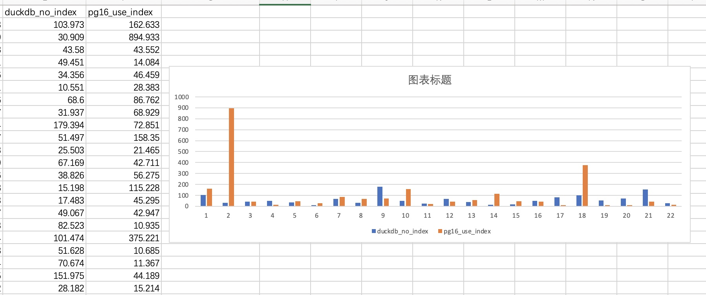

## DuckDB vs PostgreSQL TPC-H 测试      
                                    
### 作者                                    
digoal                                    
                                    
### 日期                                    
2022-08-29                                  
                                    
### 标签                                    
PostgreSQL , DuckDB , tpc-h , tpc-ds               
                                    
----                                    
                                    
## 背景    
简单对比`duckdb v0.4.0`和postgresql 16 dev版本的tpch sf=0.1的性能, PG使用索引, 强制开启8个并行度, duckdb不使用索引, 默认8并行.   
          
结论比较明确, duckdb的OLAP能力确实很强, 在完全没有索引的情况下, 所有QUERY都瞬间返回, PG没有索引的情况下有1条QUERY基本没法跑, 有索引的情况下相比duckdb也有轻微差距.   
  
  
  
## 测试过程  
从duckdb产生tpch的数据和schema  
  
```  
$ ./duckdb   
v0.4.0 da9ee490d  
Enter ".help" for usage hints.  
Connected to a transient in-memory database.  
Use ".open FILENAME" to reopen on a persistent database.  
D install tpch;  
D load tpch;  
  
D call dbgen(sf='0.1');  
D EXPORT DATABASE '/Users/digoal/Downloads/target_directory' (FORMAT CSV);  
```  
  
```  
$ pwd  
/Users/digoal/Downloads/target_directory  
  
$ ll  
total 209432  
drwx------@ 665 digoal  staff    21K Aug 29 09:45 ..  
-rw-r--r--    1 digoal  staff   2.2K Aug 29 09:45 nation.csv  
-rw-r--r--    1 digoal  staff   386B Aug 29 09:45 region.csv  
-rw-r--r--    1 digoal  staff   136K Aug 29 09:45 supplier.csv  
-rw-r--r--    1 digoal  staff   2.3M Aug 29 09:45 customer.csv  
-rw-r--r--    1 digoal  staff   2.3M Aug 29 09:45 part.csv  
-rw-r--r--    1 digoal  staff    11M Aug 29 09:45 partsupp.csv  
-rw-r--r--    1 digoal  staff    16M Aug 29 09:45 orders.csv  
-rw-r--r--    1 digoal  staff    70M Aug 29 09:45 lineitem.csv  
-rw-r--r--    1 digoal  staff   1.9K Aug 29 09:45 schema.sql  
drwxr-xr-x   12 digoal  staff   384B Aug 29 09:45 .  
-rw-r--r--    1 digoal  staff   996B Aug 29 09:45 load.sql  
```  
  
导入PG16  
  
```  
$ psql -f ./schema.sql   
CREATE TABLE  
CREATE TABLE  
CREATE TABLE  
CREATE TABLE  
CREATE TABLE  
CREATE TABLE  
CREATE TABLE  
CREATE TABLE  
  
$ psql -f ./load.sql   
COPY 600572  
COPY 150000  
COPY 80000  
COPY 20000  
COPY 15000  
COPY 1000  
COPY 25  
COPY 5  
  
$ psql  
psql (16devel)  
Type "help" for help.  
postgres=# \dt+  
                                     List of relations  
 Schema |   Name   | Type  |  Owner   | Persistence | Access method |  Size   | Description   
--------+----------+-------+----------+-------------+---------------+---------+-------------  
 public | customer | table | postgres | permanent   | heap          | 2896 kB |   
 public | lineitem | table | postgres | permanent   | heap          | 77 MB   |   
 public | nation   | table | postgres | permanent   | heap          | 16 kB   |   
 public | orders   | table | postgres | permanent   | heap          | 20 MB   |   
 public | part     | table | postgres | permanent   | heap          | 3008 kB |   
 public | partsupp | table | postgres | permanent   | heap          | 14 MB   |   
 public | region   | table | postgres | permanent   | heap          | 16 kB   |   
 public | supplier | table | postgres | permanent   | heap          | 208 kB  |   
(8 rows)  
```  
  
配置pg参数,强制开启并行:  
  
```  
listen_addresses = 'localhost'		  
port = 1921				  
max_connections = 100			  
unix_socket_directories = '/tmp,.'	  
shared_buffers = 4GB			  
work_mem = 64MB				  
hash_mem_multiplier = 3.0		  
maintenance_work_mem = 1024MB		  
dynamic_shared_memory_type = posix	  
vacuum_cost_delay = 0			  
bgwriter_delay = 20ms			  
max_worker_processes = 10		  
max_parallel_workers_per_gather = 8	  
max_parallel_workers = 8		  
wal_level = logical    
synchronous_commit = off		  
full_page_writes = off			  
wal_writer_delay = 10ms		  
max_wal_size = 4GB  
min_wal_size = 80MB  
random_page_cost = 1.1			  
parallel_setup_cost = 0	  
parallel_tuple_cost = 0		  
min_parallel_table_scan_size = 0MB  
min_parallel_index_scan_size = 0kB  
effective_cache_size = 16GB  
log_destination = 'csvlog'		  
logging_collector = on		  
log_directory = 'log'			  
log_filename = 'postgresql-%Y-%m-%d_%H%M%S.log'	  
log_file_mode = 0600			  
log_rotation_age = 1d			  
log_timezone = 'Asia/Shanghai'  
datestyle = 'iso, mdy'  
timezone = 'Asia/Shanghai'  
lc_messages = 'en_US.UTF-8'			  
lc_monetary = 'en_US.UTF-8'			  
lc_numeric = 'en_US.UTF-8'			  
lc_time = 'en_US.UTF-8'				  
default_text_search_config = 'pg_catalog.english'  
```  
  
对比duckdb的参数如下  
  
```  
D select * from duckdb_settings();  
┌──────────────────────────────┬───────────────┬────────────────────────────────────────────────────────────────────────────────────┬────────────┐  
│             name             │     value     │                                    description                                     │ input_type │  
├──────────────────────────────┼───────────────┼────────────────────────────────────────────────────────────────────────────────────┼────────────┤  
│ access_mode                  │ automatic     │ Access mode of the database (AUTOMATIC, READ_ONLY or READ_WRITE)                   │ VARCHAR    │  
│ checkpoint_threshold         │ 16.7MB        │ The WAL size threshold at which to automatically trigger a checkpoint (e.g. 1GB... │ VARCHAR    │  
│ debug_checkpoint_abort       │ NULL          │ DEBUG SETTING: trigger an abort while checkpointing for testing purposes           │ VARCHAR    │  
│ debug_force_external         │ False         │ DEBUG SETTING: force out-of-core computation for operators that support it, use... │ BOOLEAN    │  
│ debug_force_no_cross_product │ False         │ DEBUG SETTING: Force disable cross product generation when hyper graph isn't co... │ BOOLEAN    │  
│ debug_many_free_list_blocks  │ False         │ DEBUG SETTING: add additional blocks to the free list                              │ BOOLEAN    │  
│ debug_window_mode            │ NULL          │ DEBUG SETTING: switch window mode to use                                           │ VARCHAR    │  
│ default_collation            │               │ The collation setting used when none is specified                                  │ VARCHAR    │  
│ default_order                │ asc           │ The order type used when none is specified (ASC or DESC)                           │ VARCHAR    │  
│ default_null_order           │ nulls_first   │ Null ordering used when none is specified (NULLS_FIRST or NULLS_LAST)              │ VARCHAR    │  
│ disabled_optimizers          │               │ DEBUG SETTING: disable a specific set of optimizers (comma separated)              │ VARCHAR    │  
│ enable_external_access       │ True          │ Allow the database to access external state (through e.g. loading/installing mo... │ BOOLEAN    │  
│ enable_object_cache          │ False         │ Whether or not object cache is used to cache e.g. Parquet metadata                 │ BOOLEAN    │  
│ enable_profiling             │ NULL          │ Enables profiling, and sets the output format (JSON, QUERY_TREE, QUERY_TREE_OPT... │ VARCHAR    │  
│ enable_progress_bar          │ False         │ Enables the progress bar, printing progress to the terminal for long queries       │ BOOLEAN    │  
│ explain_output               │ physical_only │ Output of EXPLAIN statements (ALL, OPTIMIZED_ONLY, PHYSICAL_ONLY)                  │ VARCHAR    │  
│ external_threads             │ 0             │ The number of external threads that work on DuckDB tasks.                          │ BIGINT     │  
│ file_search_path             │               │ A comma separated list of directories to search for input files                    │ VARCHAR    │  
│ force_compression            │ NULL          │ DEBUG SETTING: forces a specific compression method to be used                     │ VARCHAR    │  
│ log_query_path               │ NULL          │ Specifies the path to which queries should be logged (default: empty string, qu... │ VARCHAR    │  
│ max_expression_depth         │ 1000          │ The maximum expression depth limit in the parser. WARNING: increasing this sett... │ UBIGINT    │  
│ max_memory                   │ 13.7GB        │ The maximum memory of the system (e.g. 1GB)                                        │ VARCHAR    │  
│ memory_limit                 │ 13.7GB        │ The maximum memory of the system (e.g. 1GB)                                        │ VARCHAR    │  
│ null_order                   │ nulls_first   │ Null ordering used when none is specified (NULLS_FIRST or NULLS_LAST)              │ VARCHAR    │  
│ perfect_ht_threshold         │ 12            │ Threshold in bytes for when to use a perfect hash table (default: 12)              │ BIGINT     │  
│ preserve_identifier_case     │ True          │ Whether or not to preserve the identifier case, instead of always lowercasing a... │ BOOLEAN    │  
│ preserve_insertion_order     │ True          │ Whether or not to preserve insertion order. If set to false the system is allow... │ BOOLEAN    │  
│ profiler_history_size        │ NULL          │ Sets the profiler history size                                                     │ BIGINT     │  
│ profile_output               │               │ The file to which profile output should be saved, or empty to print to the term... │ VARCHAR    │  
│ profiling_mode               │ NULL          │ The profiling mode (STANDARD or DETAILED)                                          │ VARCHAR    │  
│ profiling_output             │               │ The file to which profile output should be saved, or empty to print to the term... │ VARCHAR    │  
│ progress_bar_time            │ 2000          │ Sets the time (in milliseconds) how long a query needs to take before we start ... │ BIGINT     │  
│ schema                       │               │ Sets the default search schema. Equivalent to setting search_path to a single v... │ VARCHAR    │  
│ search_path                  │               │ Sets the default search search path as a comma-separated list of values            │ VARCHAR    │  
│ temp_directory               │               │ Set the directory to which to write temp files                                     │ VARCHAR    │  
│ threads                      │ 8             │ The number of total threads used by the system.                                    │ BIGINT     │  
│ wal_autocheckpoint           │ 16.7MB        │ The WAL size threshold at which to automatically trigger a checkpoint (e.g. 1GB... │ VARCHAR    │  
│ worker_threads               │ 8             │ The number of total threads used by the system.                                    │ BIGINT     │  
│ binary_as_string             │               │ In Parquet files, interpret binary data as a string.                               │ BOOLEAN    │  
│ Calendar                     │ gregorian     │ The current calendar                                                               │ VARCHAR    │  
│ TimeZone                     │ Asia/Shanghai │ The current time zone                                                              │ VARCHAR    │  
└──────────────────────────────┴───────────────┴────────────────────────────────────────────────────────────────────────────────────┴────────────┘  
```  
  
强制开启PG 8并行  
  
```  
postgres=# select 'alter table '||tablename||' set (parallel_workers=8);' from pg_tables where schemaname='public';;  
                    ?column?                      
------------------------------------------------  
 alter table region set (parallel_workers=8);  
 alter table partsupp set (parallel_workers=8);  
 alter table lineitem set (parallel_workers=8);  
 alter table orders set (parallel_workers=8);  
 alter table part set (parallel_workers=8);  
 alter table customer set (parallel_workers=8);  
 alter table supplier set (parallel_workers=8);  
 alter table nation set (parallel_workers=8);  
(8 rows)  
  
  
 alter table region set (parallel_workers=8);  
 alter table partsupp set (parallel_workers=8);  
 alter table lineitem set (parallel_workers=8);  
 alter table orders set (parallel_workers=8);  
 alter table part set (parallel_workers=8);  
 alter table customer set (parallel_workers=8);  
 alter table supplier set (parallel_workers=8);  
 alter table nation set (parallel_workers=8);  
```  
  
创建索引, 参考  
  
https://github.com/digoal/gp_tpch/blob/master/dss/tpch-index.sql  
  
  
```  
-- indexes on the foreign keys  
  
CREATE INDEX IDX_SUPPLIER_NATION_KEY ON SUPPLIER (S_NATIONKEY);  
  
CREATE INDEX IDX_PARTSUPP_PARTKEY ON PARTSUPP (PS_PARTKEY);  
CREATE INDEX IDX_PARTSUPP_SUPPKEY ON PARTSUPP (PS_SUPPKEY);  
  
CREATE INDEX IDX_CUSTOMER_NATIONKEY ON CUSTOMER (C_NATIONKEY);  
  
CREATE INDEX IDX_ORDERS_CUSTKEY ON ORDERS (O_CUSTKEY);  
  
CREATE INDEX IDX_LINEITEM_ORDERKEY ON LINEITEM (L_ORDERKEY);  
CREATE INDEX IDX_LINEITEM_PART_SUPP ON LINEITEM (L_PARTKEY,L_SUPPKEY);  
  
CREATE INDEX IDX_NATION_REGIONKEY ON NATION (N_REGIONKEY);  
  
  
-- aditional indexes  
  
CREATE INDEX IDX_LINEITEM_SHIPDATE ON LINEITEM (L_SHIPDATE, L_DISCOUNT, L_QUANTITY);  
  
CREATE INDEX IDX_ORDERS_ORDERDATE ON ORDERS (O_ORDERDATE);  
```  
  
PG 没有索引跑不出来, 有一些嵌套查询实在太慢了.  
  
q17 30秒, q20 过了十几分钟没跑出来.  
  
以下是PG增加了索引之后的结果  
  
```  
postgres=# \timing   
postgres=# \o tpch_pg.log  
postgres=# \i '~/Downloads/tpch.sql'  
  
Time: 162.633 ms  
Time: 894.933 ms  
Time: 43.552 ms  
Time: 14.084 ms  
Time: 46.459 ms  
Time: 28.383 ms  
Time: 86.762 ms  
Time: 68.929 ms  
Time: 72.851 ms  
Time: 158.350 ms  
Time: 21.465 ms  
Time: 42.711 ms  
Time: 56.275 ms  
Time: 115.228 ms  
Time: 45.295 ms  
Time: 42.947 ms  
Time: 10.935 ms  
Time: 375.221 ms  
Time: 10.685 ms  
Time: 11.367 ms  
Time: 44.189 ms  
Time: 15.214 ms  
```  
  
duckdb的结果: [《DuckDB TPC-H, TPC-DS 测试》](../202208/20220828_01.md)    
  
采用了多核, real 比user+sys更小.  
  
```  
Run Time: real 0.020 user 0.083072 sys 0.000901    
Run Time: real 0.013 user 0.016175 sys 0.001734    
Run Time: real 0.017 user 0.021799 sys 0.004781    
Run Time: real 0.016 user 0.027792 sys 0.005659    
Run Time: real 0.010 user 0.022347 sys 0.002009    
Run Time: real 0.002 user 0.008274 sys 0.000277    
Run Time: real 0.021 user 0.041274 sys 0.006326    
Run Time: real 0.011 user 0.018835 sys 0.002102    
Run Time: real 0.037 user 0.137989 sys 0.004405    
Run Time: real 0.015 user 0.033020 sys 0.003477    
Run Time: real 0.012 user 0.012397 sys 0.001106    
Run Time: real 0.020 user 0.042035 sys 0.005134    
Run Time: real 0.017 user 0.019956 sys 0.001870    
Run Time: real 0.005 user 0.009373 sys 0.000825    
Run Time: real 0.004 user 0.013022 sys 0.000461    
Run Time: real 0.021 user 0.026232 sys 0.001835    
Run Time: real 0.015 user 0.060899 sys 0.006624    
Run Time: real 0.019 user 0.070629 sys 0.011845    
Run Time: real 0.011 user 0.040045 sys 0.000583    
Run Time: real 0.017 user 0.047979 sys 0.005695    
Run Time: real 0.035 user 0.086615 sys 0.030360    
Run Time: real 0.011 user 0.013999 sys 0.003183    
```  
  
对比如下(耗时越小越好):    
  
tpch_query_id | `tpch sf=.1 duckdb_no_index(ms)`	| `pg16_use_index(ms)`  
---|---|---  
1|20  |	162.633  
2|13 |	894.933  
3|17|	43.552  
4|16 |	14.084  
5|10 |	46.459  
6|2 |	28.383  
7|21  |	86.762  
8|11  |	68.929  
9|37  |	72.851  
10|15  |	158.35  
11|12 |	21.465  
12|20 |	42.711  
13|17 |	56.275  
14|5 |	115.228  
15|4 |	45.295  
16|21 |	42.947  
17|15 |	10.935  
18|19  |	375.221  
19|11 |	10.685  
20|17  |	11.367  
21|35  |	44.189  
22|11  |	15.214  
  
  
  
#### [期望 PostgreSQL 增加什么功能?](https://github.com/digoal/blog/issues/76 "269ac3d1c492e938c0191101c7238216")
  
  
#### [PolarDB for PostgreSQL云原生分布式开源数据库](https://github.com/ApsaraDB/PolarDB-for-PostgreSQL "57258f76c37864c6e6d23383d05714ea")
  
  
#### [PostgreSQL 解决方案集合](https://yq.aliyun.com/topic/118 "40cff096e9ed7122c512b35d8561d9c8")
  
  
#### [德哥 / digoal's github - 公益是一辈子的事.](https://github.com/digoal/blog/blob/master/README.md "22709685feb7cab07d30f30387f0a9ae")
  
  

  
  
#### [PolarDB 学习图谱: 训练营、培训认证、在线互动实验、解决方案、生态合作、写心得拿奖品](https://www.aliyun.com/database/openpolardb/activity "8642f60e04ed0c814bf9cb9677976bd4")
  
  
#### [购买PolarDB云服务折扣活动进行中, 55元起](https://www.aliyun.com/activity/new/polardb-yunparter?userCode=bsb3t4al "e0495c413bedacabb75ff1e880be465a")
  
  
#### [About 德哥](https://github.com/digoal/blog/blob/master/me/readme.md "a37735981e7704886ffd590565582dd0")
  
