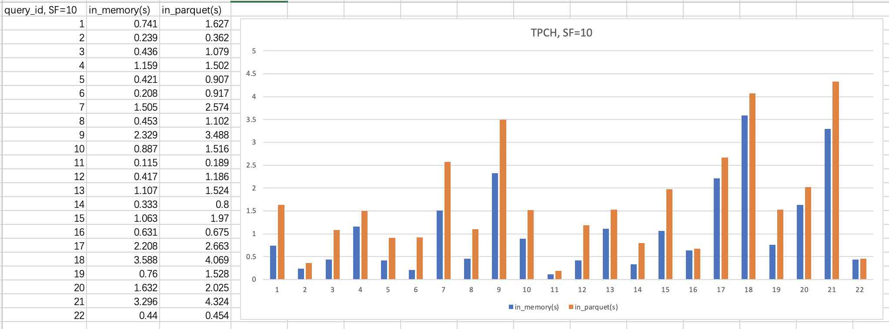

## DuckDB 采用外部 parquet 格式存储 - tpch 测试 - in_memory VS in_parquet     
        
### 作者        
digoal        
        
### 日期        
2022-09-01        
        
### 标签        
PostgreSQL , DuckDB , parquet , tpch    
        
----        
        
## 背景        
采用外部存储(parquet), tpch 测试: `sf = 10`   
  
数据生成和tpch sql的生成参考:   
- [《DuckDB TPC-H, TPC-DS 测试》](../202208/20220828_01.md)    
  
为什么要测试parquet格式, 参考:  
- [《DuckDB 数据库的数据能不能超出内存限制? 以及推荐的使用方法 - parquet》](../202209/20220901_03.md)    
  
DuckDB 推荐用法:   
- 数据都尽量存储在parquet中, 内存干嘛用呢? 计算时, hash table, 排序等用到内存.  这样duckdb能管理的数据就可以无限大.      
- duckdb自己的数据文件会膨胀, 由于数据都存储在parquet中, 膨胀后建议导出schema定义, 重新启动一份新的数据文件然后导入schema, 老的数据文件删掉即可.      
- 由于parquet支持pushdown filter\projection, 支持分区, 支持并行.  查询速度是非常快的.   甚至可以使用远程parquet文件存储 (s3, https, oss) .     
    
启动duckdb, 使用持久化文件启动  
  
```  
$ ./duckdb ./digoal.db.new  
v0.4.1-dev2371 3825e0ee7  
Enter ".help" for usage hints.  
```  
  
加载tpch, 并生成数据 (dbgen不支持直接生成外部parquet文件, 所以只能先过一道数据库.)  
  
```  
D install tpch;  
D load tpch;  
D copy (select query from tpch_queries()) to 'tpch.sql' with (quote '');    
D call dbgen(sf='10');  
```  
  
导出为parquet文件  
  
```  
D EXPORT DATABASE '/Users/digoal/duckdb/build/release/tpch_20220901' (FORMAT PARQUET);    
  
D .quit   
  
drwxr-xr-x   3 digoal  staff    96B Sep  1 17:16 digoal.db.new.tmp  
-rw-r--r--   1 digoal  staff   5.1G Sep  1 17:18 digoal.db.new  
-rw-r--r--   1 digoal  staff     0B Sep  1 17:18 digoal.db.new.wal  
```  
  
生成过程占用了大量swap  
  
```  
IT-C02YW2EFLVDL:release digoal$ sysctl vm.swapusage  
vm.swapusage: total = 12288.00M  used = 11334.00M  free = 954.00M  (encrypted)  
```  
  
使用当前格式跑一下tpch结果, 然后就可以删除digoal.db.new数据库文件  
  
```  
配置profile, 输出重定向等.    
D PRAGMA enable_profiling='QUERY_TREE_OPTIMIZER';    
D PRAGMA enable_optimizer;   
D PRAGMA explain_output='all';    
D PRAGMA profiling_mode='detailed';    
D PRAGMA profile_output='tpch.profile';    
D .timer on    
D .output my_results.txt    
  
执行SQL    
D .read tpch.sql    
  
Run Time (s): real 0.741 user 5.706895 sys 0.014485  
Run Time (s): real 0.239 user 1.222556 sys 0.082958  
Run Time (s): real 0.436 user 3.036656 sys 0.060910  
Run Time (s): real 1.159 user 4.839926 sys 0.586248  
Run Time (s): real 0.421 user 3.028173 sys 0.029702  
Run Time (s): real 0.208 user 1.574725 sys 0.004798  
Run Time (s): real 1.505 user 9.384255 sys 0.556902  
Run Time (s): real 0.453 user 3.273303 sys 0.024077  
Run Time (s): real 2.329 user 16.336593 sys 0.262405  
Run Time (s): real 0.887 user 5.570960 sys 0.409520  
Run Time (s): real 0.115 user 0.440873 sys 0.023601  
Run Time (s): real 0.417 user 3.124678 sys 0.016045  
Run Time (s): real 1.107 user 7.185678 sys 0.273737  
Run Time (s): real 0.333 user 2.278771 sys 0.077510  
Run Time (s): real 1.063 user 8.115284 sys 0.072995  
Run Time (s): real 0.631 user 0.912368 sys 0.101576  
Run Time (s): real 2.208 user 15.257795 sys 0.900340  
Run Time (s): real 3.588 user 22.501919 sys 2.134568  
Run Time (s): real 0.760 user 5.589818 sys 0.082662  
Run Time (s): real 1.632 user 9.039679 sys 0.592879  
Run Time (s): real 3.296 user 14.681672 sys 2.855988  
Run Time (s): real 0.440 user 2.177325 sys 0.274837  
  
rm -rf digoal.db.new*  
```  
  
  
进入parquet导出的目录, 查看文件列表  
  
```  
cd /Users/digoal/duckdb/build/release/tpch_20220901  
  
IT-C02YW2EFLVDL:tpch_20220901 digoal$ ll  
total 15856720  
-rw-r--r--   1 digoal  staff   1.0K Sep  1 17:04 region.parquet  
-rw-r--r--   1 digoal  staff   2.3K Sep  1 17:04 nation.parquet  
-rw-r--r--   1 digoal  staff    15M Sep  1 17:04 supplier.parquet  
-rw-r--r--   1 digoal  staff    44M Sep  1 17:04 tbl.parquet  
-rw-r--r--   1 digoal  staff   133M Sep  1 17:04 part.parquet  
-rw-r--r--   1 digoal  staff   241M Sep  1 17:04 customer.parquet  
-rw-r--r--   1 digoal  staff   865M Sep  1 17:04 partsupp.parquet  
-rw-r--r--   1 digoal  staff   1.2G Sep  1 17:05 orders.parquet  
-rw-r--r--   1 digoal  staff   5.0G Sep  1 17:07 lineitem.parquet  
-rw-r--r--   1 digoal  staff   2.1K Sep  1 17:07 schema.sql  
drwxr-xr-x  13 digoal  staff   416B Sep  1 17:07 .  
-rw-r--r--   1 digoal  staff   933B Sep  1 17:07 load.sql  
drwxr-xr-x  23 digoal  staff   736B Sep  1 17:07 ..  
  
IT-C02YW2EFLVDL:tpch_20220901 digoal$ du -sh  
3.8G   
  
parquet 压缩效果很不错 (5.1G -> 3.8G)  
```  
  
启动一个全新的数据库  
  
```  
$ ./duckdb ./digoal.db.parquet  
  
当前默认限制了75%内存. 作为执行过程中最多可以使用的内存, 例如sort, hash agg, group agg等.    
  
D select * from duckdb_settings() where name like '%memory%';  
┌──────────────┬────────┬─────────────────────────────────────────────┬────────────┐  
│     name     │ value  │                 description                 │ input_type │  
├──────────────┼────────┼─────────────────────────────────────────────┼────────────┤  
│ max_memory   │ 13.7GB │ The maximum memory of the system (e.g. 1GB) │ VARCHAR    │  
│ memory_limit │ 13.7GB │ The maximum memory of the system (e.g. 1GB) │ VARCHAR    │  
└──────────────┴────────┴─────────────────────────────────────────────┴────────────┘  
```  
  
创建视图  
  
```  
CREATE VIEW lineitem AS SELECT * FROM read_parquet('/Users/digoal/duckdb/build/release/tpch_20220901/lineitem.parquet');    
  
CREATE VIEW orders AS SELECT * FROM read_parquet('/Users/digoal/duckdb/build/release/tpch_20220901/orders.parquet');    
  
CREATE VIEW partsupp AS SELECT * FROM read_parquet('/Users/digoal/duckdb/build/release/tpch_20220901/partsupp.parquet');    
  
CREATE VIEW part AS SELECT * FROM read_parquet('/Users/digoal/duckdb/build/release/tpch_20220901/part.parquet');    
  
CREATE VIEW customer AS SELECT * FROM read_parquet('/Users/digoal/duckdb/build/release/tpch_20220901/customer.parquet');    
  
CREATE VIEW supplier AS SELECT * FROM read_parquet('/Users/digoal/duckdb/build/release/tpch_20220901/supplier.parquet');    
  
CREATE VIEW nation AS SELECT * FROM read_parquet('/Users/digoal/duckdb/build/release/tpch_20220901/nation.parquet');    
  
CREATE VIEW region AS SELECT * FROM read_parquet('/Users/digoal/duckdb/build/release/tpch_20220901/region.parquet');    
```  
  
  
执行 tpch query   
  
```  
配置profile, 输出重定向等.    
D PRAGMA enable_profiling='QUERY_TREE_OPTIMIZER';    
D PRAGMA enable_optimizer;   
D PRAGMA explain_output='all';    
D PRAGMA profiling_mode='detailed';    
D PRAGMA profile_output='tpch.profile';    
D .timer on    
D .output my_results.txt    
  
执行SQL    
D .read tpch.sql    
  
Run Time (s): real 1.627 user 11.850405 sys 0.405159  
Run Time (s): real 0.362 user 1.968710 sys 0.179403  
Run Time (s): real 1.079 user 7.420519 sys 0.338523  
Run Time (s): real 1.502 user 7.568278 sys 0.740135  
Run Time (s): real 0.907 user 6.269927 sys 0.301918  
Run Time (s): real 0.917 user 6.665746 sys 0.223548  
Run Time (s): real 2.574 user 15.294140 sys 1.005330  
Run Time (s): real 1.102 user 7.656021 sys 0.388960  
Run Time (s): real 3.488 user 25.737969 sys 0.803692  
Run Time (s): real 1.516 user 9.844495 sys 0.756891  
Run Time (s): real 0.189 user 0.970978 sys 0.092331  
Run Time (s): real 1.186 user 8.812947 sys 0.273467  
Run Time (s): real 1.524 user 10.517162 sys 0.541969  
Run Time (s): real 0.800 user 5.416071 sys 0.341637  
Run Time (s): real 1.970 user 14.342622 sys 0.545280  
Run Time (s): real 0.675 user 1.144836 sys 0.130184  
Run Time (s): real 2.663 user 18.270699 sys 1.138774  
Run Time (s): real 4.069 user 26.420741 sys 2.365622  
Run Time (s): real 1.528 user 10.837740 sys 0.425501  
Run Time (s): real 2.025 user 11.759343 sys 0.904860  
Run Time (s): real 4.324 user 23.275389 sys 3.390268  
Run Time (s): real 0.454 user 2.482367 sys 0.256567  
```  
  
对比内存表和parquet文件表tpch性能  
  
    
  
query_id, SF=10	| in_memory(s)	| in_parquet(s)  
---|---|---  
1	| 0.741	| 1.627  
2	| 0.239	| 0.362  
3	| 0.436	| 1.079  
4	| 1.159	| 1.502  
5	| 0.421	| 0.907  
6	| 0.208	| 0.917  
7	| 1.505	| 2.574  
8	| 0.453	| 1.102  
9	| 2.329	| 3.488  
10	| 0.887	| 1.516  
11	| 0.115	| 0.189  
12	| 0.417	| 1.186  
13	| 1.107	| 1.524  
14	| 0.333	| 0.8  
15	| 1.063	| 1.97  
16	| 0.631	| 0.675  
17	| 2.208	| 2.663  
18	| 3.588	| 4.069  
19	| 0.76	| 1.528  
20	| 1.632	| 2.025  
21	| 3.296	| 4.324  
22	| 0.44	| 0.454  
  
## 参考  
https://duckdb.org/docs/sql/pragmas  
  
  
  
#### [期望 PostgreSQL 增加什么功能?](https://github.com/digoal/blog/issues/76 "269ac3d1c492e938c0191101c7238216")
  
  
#### [PolarDB for PostgreSQL云原生分布式开源数据库](https://github.com/ApsaraDB/PolarDB-for-PostgreSQL "57258f76c37864c6e6d23383d05714ea")
  
  
#### [PostgreSQL 解决方案集合](https://yq.aliyun.com/topic/118 "40cff096e9ed7122c512b35d8561d9c8")
  
  
#### [德哥 / digoal's github - 公益是一辈子的事.](https://github.com/digoal/blog/blob/master/README.md "22709685feb7cab07d30f30387f0a9ae")
  
  

  
  
#### [PolarDB 学习图谱: 训练营、培训认证、在线互动实验、解决方案、生态合作、写心得拿奖品](https://www.aliyun.com/database/openpolardb/activity "8642f60e04ed0c814bf9cb9677976bd4")
  
  
#### [购买PolarDB云服务折扣活动进行中, 55元起](https://www.aliyun.com/activity/new/polardb-yunparter?userCode=bsb3t4al "e0495c413bedacabb75ff1e880be465a")
  
  
#### [About 德哥](https://github.com/digoal/blog/blob/master/me/readme.md "a37735981e7704886ffd590565582dd0")
  
