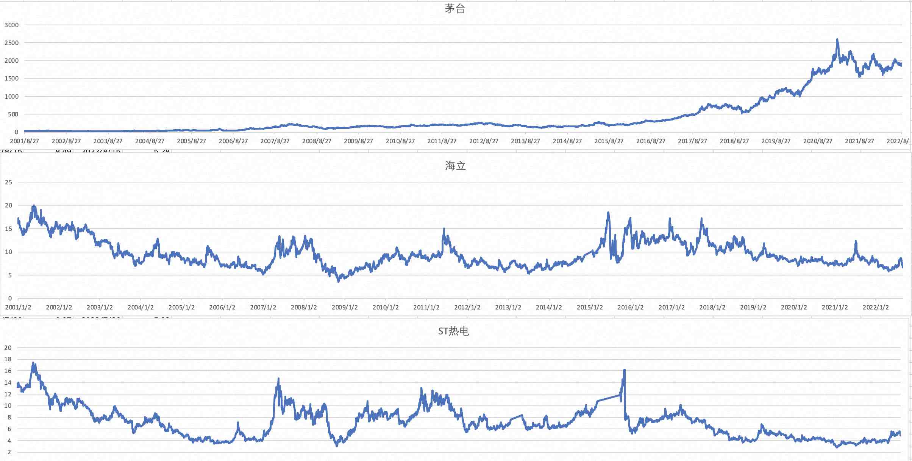

## 德说-第133期, 用PostgreSQL举证巴菲特向普通投资者传授的投资理念: 长线定投    
                        
### 作者                        
digoal                        
                        
### 日期                        
2022-09-06                        
                        
### 标签                        
PostgreSQL , DuckDB          
            
----                        
                        
## 背景      
用PostgreSQL举证巴菲特向普通投资者传授的投资理念: 长线定投.      
- 需要补充说明一下, 长期定投不是投机倒把, 长期定投是有社会价值的, 帮助上市公司筹集资金, 加大研发投入和生产. 你则在这中间获取企业业务发展带来的红利. 
- 长期定投应该成为一种年轻人的投资潮流, 拿出盈余的钱, 开始定投吧.      
    
本文的例子是: 在任何一天开始定投某一只股票|指数基金, 每个交易日定投500元, 测算每个交易日的收益率.    
    
结果惊人. 《小狗钱钱》《不上班也有钱》书上说的都是对的.      
  
现象是长线定投可以赚钱(减去通胀), 而且还比较稳. 但是支撑这个现象的背后的逻辑和公理是什么?  
- 1、首先是代际转移理论, 我们已经陷入了这样的游戏, 资源(生产资料、生产力)有限, 但是我们整个社区都假设并坚信通过未来的科技进步将获得更高的资源利用能力、生产效率; 例如石油、煤炭的过度开采虽然会造成环境破坏, 但是我们相信未来的科技进步会找到新的能源, 并填补过度开采造成的破坏. (这点和递弱代偿理论异曲同工)。 
    - [《德说-第96期, 代际转移与创新、集智(全球脑)》](../202205/20220514_03.md)  
- 2、第二个是经济周期, 以及宏观调控手段, 维持适度的通胀, 有利于经济的发展. 需要刺激经济的时候通常会有降低央行准备金率, 让商业银行可以贷出去更多钱, 可能引起通胀. (货币总量增加. 参考阅读:金融简史.). 但是有些国计民生相关商品并不是完全市场化的, 所以这些商品通胀率比较可控, 否则会引发动乱.   
    - 银行放水时也需要有法律法规和相关监管配合, 防止投机倒把贷一堆钱去炒作钱滚钱. 失去了放水的意义. 放水可能希望的是去消费、投入研发或采购生产资料、促进生产....  
- 3、第三是数学支撑: 微笑曲线
    - [《德说-第56期, 微笑曲线 - 基金定投》](../202110/20211029_02.md)  
- 4、严格的止盈线. 可不要太贪, 过了止盈线就卖掉, 重新开始定投. 
- 5、不要过于分散, 例如就选一个投资对象(例如50, 500指数), 而且你的钱要能cover这只对象的整微笑周期.  
    
   
## 例子
      
数据来源参考, 取2001年开始茅台的数据为例:     
- [《DuckDB 线性回归预测股价的例子》](../202209/20220902_01.md)      
    
```    
postgres=# drop table his;    
DROP TABLE    
postgres=# create table his (c1 date, c2 text, c3 text, c4 numeric, c5 numeric);      
CREATE TABLE    
postgres=#     
postgres=# copy his from '/Users/digoal/Downloads/2.csv' ( format csv, HEADER , quote '"');      
COPY 5101    
postgres=# delete from his where c4=0 or c5=0;    
DELETE 74    
postgres=# create index idx_his_1 on his(c1);    
CREATE INDEX    
```    
    
```    
select     
c1, -- 日期    
price, -- 当前价    
round(cost_avg,4), -- 成本价    
round(100 * ((price-cost_avg)/cost_avg) / ((c1-start_c1+1)/365.0), 2) as revenue_year_ratio, -- 年化收益率    
rn * 500 as invest,  -- 截止当前总投入. (假设每个交易日投入500)      
round(rn * 500 * (1+ (price-cost_avg)/cost_avg ), 2) as v_value,  -- 当前持有股票的价值     
round(rn * 500 * (1+ (price-cost_avg)/cost_avg ), 2) - rn * 500 as v_make_money,  -- 赚了多少钱     
c1-start_c1 as keep_days  -- 持有天数    
from     
(    
  select     
    c1,     
    c5 as price,     
    avg(c5) over w as cost_avg,     
    min(c1) over w as start_c1,    
    row_number() over w as rn    
  from his     
  where c1 >= '2014-10-01'   -- 从2014-10-01开始投入, 你可以随意选择投入开始日期     
  -- 经济越低迷的时候股价越低, 从那时开始投入是比较好的.     
  -- 如果你的投入周期足够长, 可以从任意时间开始投入, 总会遇到可以收割的时候.      
  window w as (order by c1 range between UNBOUNDED PRECEDING and CURRENT ROW)    
) t     
order by c1;     
```    
    
从2014-10-01开始投入, 每个交易日投入500元.     
    
你可以随意选择投入开始日期, 经济越低迷的时候股价越低, 从那时开始投入是比较好的. 走低不用怕, 周期过去后总会上来的. (不经历风雨, 怎么见彩虹?)    
    
如果你的投入周期足够长, 可以从任意时间开始投入, 总会遇到可以收割的时候.      
    
    
结果如下:      
    
日期, 当前价格, 成本价, 年化收益率, 总投入, 股票价值, 赚了多少, 持有天数      
    
```    
     c1     |  price  |  round   | revenue_year_ratio | invest |  v_value   | v_make_money | keep_days     
------------+---------+----------+--------------------+--------+------------+--------------+-----------    
 2014-10-08 |  160.73 | 160.7300 |               0.00 |    500 |     500.00 |         0.00 |         0    
 2014-10-09 |  160.01 | 160.3700 |             -40.97 |   1000 |     997.76 |        -2.24 |         1    
 2014-10-10 |  159.02 | 159.9200 |             -68.47 |   1500 |    1491.56 |        -8.44 |         2    
 2014-10-13 |   156.1 | 158.9650 |            -109.64 |   2000 |    1963.95 |       -36.05 |         5    
 2014-10-14 |  154.91 | 158.1540 |            -106.95 |   2500 |    2448.72 |       -51.28 |         6    
 2014-10-15 |  157.32 | 158.0150 |             -20.07 |   3000 |    2986.81 |       -13.19 |         7    
 2014-10-16 |  157.32 | 157.9157 |             -15.30 |   3500 |    3486.80 |       -13.20 |         8    
 2014-10-17 |  158.38 | 157.9738 |               9.39 |   4000 |    4010.29 |        10.29 |         9    
 2014-10-20 |  156.92 | 157.8567 |             -16.66 |   4500 |    4473.30 |       -26.70 |        12    
....    
 2022-08-17 |  1918.0 | 921.1272 |              13.76 | 958500 | 1995818.89 |   1037318.89 |      2870    
 2022-08-18 |  1895.5 | 921.6352 |              13.43 | 959000 | 1972347.12 |   1013347.12 |      2871    
 2022-08-19 | 1895.01 | 922.1424 |              13.40 | 959500 | 1971780.14 |   1012280.14 |      2872    
 2022-08-22 | 1893.98 | 922.6486 |              13.36 | 960000 | 1970653.66 |   1010653.66 |      2875    
 2022-08-23 | 1870.01 | 923.1417 |              13.01 | 960500 | 1945686.70 |    985186.70 |      2876    
 2022-08-24 |  1854.2 | 923.6262 |              12.78 | 961000 | 1929228.81 |    968228.81 |      2877    
 2022-08-25 |  1885.0 | 924.1261 |              13.18 | 961500 | 1961233.98 |    999733.98 |      2878    
 2022-08-26 |  1898.0 | 924.6323 |              13.34 | 962000 | 1974705.04 |   1012705.04 |      2879    
 2022-08-29 | 1878.82 | 925.1279 |              13.05 | 962500 | 1954718.00 |    992218.00 |      2882    
 2022-08-30 |  1870.0 | 925.6185 |              12.91 | 963000 | 1945520.68 |    982520.68 |      2883    
 2022-08-31 |  1924.0 | 926.1366 |              13.63 | 963500 | 2001620.41 |   1038120.41 |      2884    
 2022-09-01 | 1880.89 | 926.6318 |              13.02 | 964000 | 1956740.40 |    992740.40 |      2885    
(1928 rows)    
```    
    
    
最高收益时: 持有2317天, 年化收益率43.77%, 投入77.55万, 赚了215.5万.      
    
```    
select     
c1, -- 日期    
price, -- 当前价    
round(cost_avg,4), -- 成本价    
round(100 * ((price-cost_avg)/cost_avg) / ((c1-start_c1+1)/365.0), 2) as revenue_year_ratio, -- 年化收益率    
rn * 500 as invest,  -- 截止当前总投入. (假设每个交易日投入500)      
round(rn * 500 * (1+ (price-cost_avg)/cost_avg ), 2) as v_value,  -- 当前持有股票的价值     
round(rn * 500 * (1+ (price-cost_avg)/cost_avg ), 2) - rn * 500 as v_make_money,  -- 赚了多少钱     
c1-start_c1 as keep_days  -- 持有天数    
from     
(    
  select     
    c1,     
    c5 as price,     
    avg(c5) over w as cost_avg,     
    min(c1) over w as start_c1,    
    row_number() over w as rn    
  from his     
  where c1 >= '2014-10-01'   -- 从2014-10-01开始投入, 你可以随意选择投入开始日期     
  -- 经济越低迷的时候股价越低, 从那时开始投入是比较好的.     
  -- 如果你的投入周期足够长, 可以从任意时间开始投入, 总会遇到可以收割的时候.      
  window w as (order by c1 range between UNBOUNDED PRECEDING and CURRENT ROW)    
) t     
order by round(rn * 500 * (1+ (price-cost_avg)/cost_avg ), 2) - rn * 500 desc limit 1;     
    
    
     c1     | price  |  round   | revenue_year_ratio | invest |  v_value   | v_make_money | keep_days     
------------+--------+----------+--------------------+--------+------------+--------------+-----------    
 2021-02-10 | 2601.0 | 688.1936 |              43.77 | 775500 | 2930970.87 |   2155470.87 |      2317    
(1 row)    
```    
  
附上另外两只比较糟糕的股票的数据, 现在已经跌破发行价了, 虽然如此, 巴菲特投资理念依旧成立.    
  
  
  
- 600619 | 海立股份  
  
```  
 2015-10-27 | 11.22 | 10.8041 |               3.65 | 101000 | 104888.35 |      3888.35 |       384  
 2015-10-28 | 11.69 | 10.8084 |               7.71 | 101500 | 109778.73 |      8278.73 |       385  
 2015-10-29 | 12.86 | 10.8185 |              17.80 | 102000 | 121248.08 |     19248.08 |       386  
 2015-10-30 | 12.44 | 10.8264 |              14.02 | 102500 | 117777.02 |     15277.02 |       387  
 2015-11-02 | 12.09 | 10.8325 |              10.84 | 103000 | 114956.59 |     11956.59 |       390  
 2015-11-03 | 12.39 | 10.8400 |              13.31 | 103500 | 118298.83 |     14798.83 |       391  
 2015-11-04 | 12.88 | 10.8499 |              17.38 | 104000 | 123459.71 |     19459.71 |       392  
 2015-11-05 | 12.88 | 10.8596 |              17.24 | 104500 | 123942.30 |     19442.30 |       393  
 2015-11-06 | 13.39 | 10.8716 |              21.41 | 105000 | 129322.96 |     24322.96 |       394  
 2015-11-09 | 14.25 | 10.8876 |              28.32 | 105500 | 138081.01 |     32581.01 |       397  
 2015-11-10 | 14.69 | 10.9056 |              31.74 | 106000 | 142783.97 |     36783.97 |       398  
 2015-11-11 | 15.15 | 10.9255 |              35.28 | 106500 | 147679.84 |     41179.84 |       399  
 2015-11-12 | 14.81 | 10.9436 |              32.16 | 107000 | 144802.76 |     37802.76 |       400  
...  
 2015-12-08 |  15.4 | 11.2300 |              31.74 | 116000 | 159074.52 |     43074.52 |       426  
 2015-12-09 | 15.09 | 11.2465 |              29.14 | 116500 | 156313.64 |     39813.64 |       427  
 2015-12-10 |  15.2 | 11.2634 |              29.74 | 117000 | 157891.67 |     40891.67 |       428  
 2015-12-11 | 15.06 | 11.2796 |              28.45 | 117500 | 156880.92 |     39380.92 |       429  
 2015-12-14 | 15.28 | 11.2965 |              29.73 | 118000 | 159610.14 |     41610.14 |       432  
 2015-12-15 | 15.41 | 11.3139 |              30.45 | 118500 | 161402.16 |     42902.16 |       433  
 2015-12-16 | 15.68 | 11.3322 |              32.19 | 119000 | 164656.07 |     45656.07 |       434  
 2015-12-17 | 15.83 | 11.3510 |              33.03 | 119500 | 166652.92 |     47152.92 |       435  
 2015-12-18 | 15.84 | 11.3698 |              32.84 | 120000 | 167180.46 |     47180.46 |       436  
 2015-12-21 | 16.55 | 11.3912 |              37.57 | 120500 | 175070.86 |     54570.86 |       439  
 2015-12-22 | 17.03 | 11.4145 |              40.72 | 121000 | 180526.68 |     59526.68 |       440  
```  
  
```  
     c1     | price |  round  | revenue_year_ratio | invest |  v_value  | v_make_money | keep_days   
------------+-------+---------+--------------------+--------+-----------+--------------+-----------  
 2017-09-26 | 17.22 | 12.1651 |              13.98 | 328500 | 465000.50 |    136500.50 |      1084  
(1 row)  
```  
  
  
- 600719 | ST热电  
  
```  
 2015-11-06 | 14.57 |  9.5301 |              48.87 |  65500 | 100139.28 |     34639.28 |       394  
 2015-11-09 | 14.32 |  9.5664 |              45.57 |  66000 |  98796.16 |     32796.16 |       397  
 2015-11-10 | 14.17 |  9.6010 |              43.53 |  66500 |  98146.78 |     31646.78 |       398  
 2015-11-11 | 14.46 |  9.6372 |              45.66 |  67000 | 100528.79 |     33528.79 |       399  
 2015-11-12 | 14.14 |  9.6706 |              42.07 |  67500 |  98696.12 |     31196.12 |       400  
 2015-11-13 | 13.44 |  9.6983 |              35.03 |  68000 |  94234.99 |     26234.99 |       401  
 2015-11-16 | 14.16 |  9.7309 |              41.02 |  68500 |  99678.59 |     31178.59 |       404  
 2015-11-17 | 14.28 |  9.7638 |              41.58 |  69000 | 100915.21 |     31915.21 |       405  
 2015-11-18 |  14.7 |  9.7994 |              44.85 |  69500 | 104256.89 |     34756.89 |       406  
 2015-11-19 |  15.0 |  9.8365 |              46.96 |  70000 | 106745.29 |     36745.29 |       407  
 2015-11-20 | 16.11 |  9.8810 |              56.26 |  70500 | 114943.41 |     44443.41 |       408  
 2015-11-23 |  15.9 |  9.9234 |              53.36 |  71000 | 113761.64 |     42761.64 |       411  
 2015-11-24 | 15.31 |  9.9610 |              47.46 |  71500 | 109894.55 |     38394.55 |       412  
 2015-11-25 |  16.2 | 10.0044 |              54.60 |  72000 | 116588.99 |     44588.99 |       413  
 2015-11-26 | 16.19 | 10.0470 |              53.78 |  72500 | 116828.01 |     44328.01 |       414  
 2015-11-27 | 15.22 | 10.0825 |              44.71 |  73000 | 110197.25 |     37197.25 |       415  
...  
 2017-04-06 | 10.18 |  8.3120 |               8.99 | 237500 | 290875.38 |     53375.38 |       911  
 2017-04-07 | 10.02 |  8.3156 |               8.19 | 238000 | 286782.60 |     48782.60 |       912  
 2017-04-10 | 10.18 |  8.3195 |               8.91 | 238500 | 291836.89 |     53336.89 |       915  
 2017-04-11 | 10.05 |  8.3231 |               8.26 | 239000 | 288588.52 |     49588.52 |       916  
 2017-04-12 |  9.62 |  8.3258 |               6.18 | 239500 | 276728.84 |     37228.84 |       917  
 2017-04-13 |  9.67 |  8.3286 |               6.40 | 240000 | 278654.14 |     38654.14 |       918  
 2017-04-14 |  9.41 |  8.3309 |               5.14 | 240500 | 271653.47 |     31153.47 |       919  
 2017-04-17 |  9.47 |  8.3332 |               5.39 | 241000 | 273876.26 |     32876.26 |       922  
 2017-04-18 |   9.3 |  8.3352 |               4.57 | 241500 | 269453.08 |     27953.08 |       923  
 2017-04-19 |   8.9 |  8.3364 |               2.67 | 242000 | 258361.41 |     16361.41 |       924  
 2017-04-20 |   8.7 |  8.3371 |               1.72 | 242500 | 253054.59 |     10554.59 |       925  
```  
  
```  
     c1     | price | round  | revenue_year_ratio | invest |  v_value  | v_make_money | keep_days   
------------+-------+--------+--------------------+--------+-----------+--------------+-----------  
 2017-04-06 | 10.18 | 8.3120 |               8.99 | 237500 | 290875.38 |     53375.38 |       911  
(1 row)  
```  
  
## 注意, 定投的止盈点计算方法  
前面例子计算年化收益的方法实际上是不准确的, 因为不是每一笔钱都和第一笔一样投入了 `(c1-start_c1+1)/365.0` 年.   
  
实际年化收益大约是2倍于以上算法:    
```  
-- 年化收益率     
round(100 * ((price-cost_avg)/cost_avg) / ((c1-start_c1+1)/365.0), 2) as revenue_year_ratio,   
```  
  
为什么呢?   
  
假设每天投入100元, 按日计息, 一笔钱存1年的年化收益为5%.    
  
1年后实际得到的利息为:     
  
```  
postgres=# select sum(500), -- 总投入   
sum(500)*0.05,   -- 第一天就全部存入的年化收益   
sum(500*0.05*(during/365.0))  -- 每天定投的年化收益   
from generate_series(1,365) as during;  
  
  sum   | ?column? |             sum               
--------+----------+-----------------------------  
 182500 |  9125.00 | 4575.0000000000000000000000  
(1 row)  
```  
  
得到结果:  
  
- 1年共投入 182500  
- 如果第一天一次性投入 182500, 那么利息是 9125  
- 如果是每天投入 500, 那么利息是 4575  
  
```  
postgres=# select 9125.00/4575.0;   
      ?column?        
--------------------  
 1.9945355191256831  
(1 row)  
```  
  
所以, 定投的实际年化利息目标大概应该设置为一把梭哈的一半左右.    
  
<b>定投的止盈点正确计算方法</b>   
   
例如你期望的年化收益是10%, 那么按本文提供的算法, 定投的止盈点应该设置为5%就卖出.    
  
如果再考虑复利, 那么止盈点是动态变化的, 例如未考虑复利的止盈点是5%, 那么考虑复利则和持有年限有关.   
  
```
postgres=# select (1.05^5 - 1)/5;
        ?column?        
------------------------
 0.05525631250000000000  -- 持有5年, 考虑复利止盈点 ~= 5.5% 
(1 row)

postgres=# select (1.05^10 - 1)/10;
        ?column?        
------------------------
 0.06288946267774414000  -- 持有10年, 考虑复利止盈点 ~= 6.3% 
(1 row)
```
  
  
  
  
    
  
#### [期望 PostgreSQL 增加什么功能?](https://github.com/digoal/blog/issues/76 "269ac3d1c492e938c0191101c7238216")
  
  
#### [PolarDB for PostgreSQL云原生分布式开源数据库](https://github.com/ApsaraDB/PolarDB-for-PostgreSQL "57258f76c37864c6e6d23383d05714ea")
  
  
#### [PostgreSQL 解决方案集合](https://yq.aliyun.com/topic/118 "40cff096e9ed7122c512b35d8561d9c8")
  
  
#### [德哥 / digoal's github - 公益是一辈子的事.](https://github.com/digoal/blog/blob/master/README.md "22709685feb7cab07d30f30387f0a9ae")
  
  

  
  
#### [PolarDB 学习图谱: 训练营、培训认证、在线互动实验、解决方案、生态合作、写心得拿奖品](https://www.aliyun.com/database/openpolardb/activity "8642f60e04ed0c814bf9cb9677976bd4")
  
  
#### [购买PolarDB云服务折扣活动进行中, 55元起](https://www.aliyun.com/activity/new/polardb-yunparter?userCode=bsb3t4al "e0495c413bedacabb75ff1e880be465a")
  
  
#### [About 德哥](https://github.com/digoal/blog/blob/master/me/readme.md "a37735981e7704886ffd590565582dd0")
  
