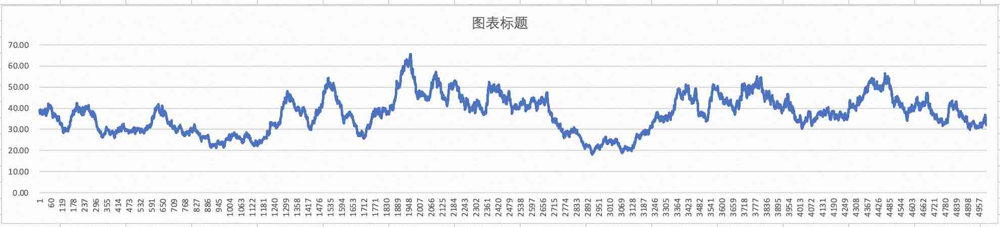

## 分析股票涨跌幅概率分布特征, 用PolarDB模拟股票数据  
                    
### 作者                    
digoal                    
                    
### 日期                    
2022-09-09          
                    
### 标签                    
PostgreSQL , PolarDB  
                    
----                    
                    
## 背景       
  
要模拟较为逼真的股票数据, 首先需要分析真实数据的特征.      
    
股票数据关键的数据特征:     
- 1、股票的日涨跌幅波动范围: `[-10%, 10%]`  (这个应该是国内股市交易限制?)  
- 2、日涨跌幅的幅度在`[-10%, 10%]`范围内符合高斯分布. 本文将介绍这个结论怎么得到的?   
    - 靠近0的最多, 靠近正负10%的概率逐渐回落.   
  
## 分析过程  
1、一键部署PolarDB请参考:    
  
[《如何用 PolarDB 证明巴菲特的投资理念》](../202209/20220908_02.md)    
  
2、随便下载几只股票的数据: 茅台,ST热电,海立股份   
  
https://zhuanlan.zhihu.com/p/65662875        
        
```        
curl "http://quotes.money.163.com/service/chddata.html?code=0600519&start=20010101&end=20220901&fields=TOPEN;TCLOSE" -o ./0600519.SH.csv      
curl "http://quotes.money.163.com/service/chddata.html?code=0600619&start=20010101&end=20220901&fields=TOPEN;TCLOSE" -o ./0600619.SH.csv    
curl "http://quotes.money.163.com/service/chddata.html?code=0600719&start=20010101&end=20220901&fields=TOPEN;TCLOSE" -o ./0600719.SH.csv    
```        
      
转换处理一下编码的问题:          
        
```        
$ iconv -f GBK -t UTF-8 ./0600519.SH.csv > ./1.csv     
$ iconv -f GBK -t UTF-8 ./0600619.SH.csv > ./2.csv    
$ iconv -f GBK -t UTF-8 ./0600719.SH.csv > ./3.csv    
```  
  
```  
[postgres@d6b4778340d1 ~]$ head -n 5 1.csv 2.csv 3.csv   
==> 1.csv <==  
日期,股票代码,名称,开盘价,收盘价  
2022-09-01,'600519,贵州茅台,1912.15,1880.89  
2022-08-31,'600519,贵州茅台,1860.1,1924.0  
2022-08-30,'600519,贵州茅台,1882.35,1870.0  
2022-08-29,'600519,贵州茅台,1883.0,1878.82  
  
==> 2.csv <==  
日期,股票代码,名称,开盘价,收盘价  
2022-09-01,'600619,海立股份,6.77,6.67  
2022-08-31,'600619,海立股份,7.06,6.77  
2022-08-30,'600619,海立股份,7.3,7.19  
2022-08-29,'600619,海立股份,7.0,7.26  
  
==> 3.csv <==  
日期,股票代码,名称,开盘价,收盘价  
2022-09-01,'600719,ST热电,5.01,4.9  
2022-08-31,'600719,ST热电,5.34,5.05  
2022-08-30,'600719,ST热电,5.38,5.32  
2022-08-29,'600719,ST热电,5.33,5.38  
```  
  
2、将数据导入到PolarDB  
  
```    
create table t1 (c1 date, c2 text, c3 text, c4 numeric, c5 numeric);      
copy t1 from '/home/postgres/1.csv' ( format csv, HEADER , quote '"');      
delete from t1 where c4 =0 or c5=0 ;       
  
create table t2 (c1 date, c2 text, c3 text, c4 numeric, c5 numeric);      
copy t2 from '/home/postgres/2.csv' ( format csv, HEADER , quote '"');      
delete from t2 where c4 =0 or c5=0 ;       
  
create table t3 (c1 date, c2 text, c3 text, c4 numeric, c5 numeric);      
copy t3 from '/home/postgres/3.csv' ( format csv, HEADER , quote '"');      
delete from t3 where c4 =0 or c5=0 ;       
```  
  
3、分析涨跌幅的数据分布, 从结果来看, 涨跌幅度符合高斯分布.   
  
```  
select width_bucket(v, -0.1, 0.1, 10), count(*) from (      
select (lag(c5) over w - c5)/c5 as v from t1 window w as (order by c1)      
) t group by 1 order by 2 desc, 1 asc;      
  
select width_bucket(v, -0.1, 0.1, 10), count(*) from (      
select (lag(c5) over w - c5)/c5 as v from t2 window w as (order by c1)      
) t group by 1 order by 2 desc, 1 asc;     
  
select width_bucket(v, -0.1, 0.1, 10), count(*) from (      
select (lag(c5) over w - c5)/c5 as v from t3 window w as (order by c1)      
) t group by 1 order by 2 desc, 1 asc;      
```    
  
柱状图如下:  
  
```  
 width_bucket | count   
--------------+-------  
            6 |  1925  
            5 |  1813  
            4 |   528  
            7 |   459  
            3 |   130  
            8 |    91  
            2 |    23  
            9 |    21  
            1 |    20  
           11 |    11  
           10 |     5  
              |     1  
(12 rows)  
  
 width_bucket | count   
--------------+-------  
            6 |  1624  
            5 |  1570  
            4 |   658  
            7 |   575  
            8 |   201  
            3 |   178  
            1 |    80  
           11 |    71  
            9 |    67  
            2 |    57  
           10 |    37  
              |     1  
(12 rows)  
  
 width_bucket | count   
--------------+-------  
            5 |  1611  
            6 |  1576  
            4 |   599  
            7 |   576  
            8 |   203  
            3 |   177  
            9 |    70  
            1 |    63  
           11 |    49  
            2 |    47  
           10 |    26  
              |     1  
(12 rows)  
```  
  
## 模拟过程  
  
基于这两个特征, 可以模拟股票数据.      
  
使用PolarDB for PostgreSQL pgbench random_gaussian 进行模拟.       
  
1、思路:    
- 1、生成涨跌幅数据, 在`[-10%, 10%]`内按高斯分布.     
- 2、用递归语法, 输入一个上市价格, 根据日涨跌幅得到上市后的每日价格.     
    
2、建表, 存放pgbench生成的涨跌幅结果    
    
```    
create table tbl (id serial primary key, v numeric(20,3));    
```    
    
3、使用pgbench生成涨跌幅数据    
    
```    
vi test.sql     
\set r random_gaussian(0, 20000, 5)     
insert into tbl (v) values ((:r-10000)/100000.0);    
    
pgbench -h 127.0.0.1 -n -r -f ./test.sql -c 1 -j 1 -t 5000    
```    
    
简单解释一下 test.sql    
- random_gaussian, 生成 0-20000 的数据, 其中概率高密度分布在中间 10000. 5是random_gaussian的微调参数, 可以调整, 决定了中间的概率集中度.      
- 这个随机数减去10000, 刚好得到正负10000 (`[-10000, 10000]`) 的范围, 再除以100000, 得到正负10% (`[-10%, 10%]`)的范围.      
    
模拟数据的涨跌幅概率分布如下, 接近真实股票数据的涨跌幅概率分布:     
    
```    
select width_bucket(v,-0.1,0.1,10),count(*) from tbl group by 1 order by 2 desc,1;    
 width_bucket | count   
--------------+-------  
            6 |  1755  
            5 |  1661  
            7 |   701  
            4 |   668  
            8 |   112  
            3 |    87  
            9 |    10  
            2 |     5  
           10 |     1  
(9 rows)  
```    
    
4、假设上市价格为38.101, 使用如下递归SQL, 使用生成的涨跌幅数据生成每交易日价格    
    
```    
create table tbl1 (c1 int, c5 numeric);  
  
with recursive a as (    
(select id, (38.101 * (1 + tbl.v))::numeric(20,3) as price from tbl order by id limit 1)     
union all     
(select tbl.id, (a.price * (1 + tbl.v))::numeric(20,3) from tbl join a on (tbl.id > a.id) where a.* is not null order by tbl.id limit 1)    
)    
insert into tbl1   
select * from a     
where a.* is not null;    
  
INSERT 0 5000  
```    
  
生成的数据绘图如下:  
  
     
    
5、随便选一个定投起点, 模拟的数据和真实数据一样, 也符合巴菲特的投资理念.    
  
[《如何用 PolarDB 证明巴菲特的投资理念》](../202209/20220908_02.md)    
  
持有500个交易日以后的收益:  
  
```  
  607 | 37.385 | 32.2845 |              11.35 |  254000 |  294128.47 |     40128.47 |       507  
  608 | 37.759 | 32.2953 |              12.13 |  254500 |  297556.59 |     43056.59 |       508  
  609 | 37.835 | 32.3061 |              12.25 |  255000 |  298640.82 |     43640.82 |       509  
  610 | 37.986 | 32.3172 |              12.53 |  255500 |  300317.28 |     44817.28 |       510  
  611 | 38.822 | 32.3299 |              14.32 |  256000 |  307406.49 |     51406.49 |       511  
  612 | 40.025 | 32.3449 |              16.89 |  256500 |  317404.02 |     60904.02 |       512  
  613 | 39.665 | 32.3592 |              16.03 |  257000 |  315023.62 |     58023.62 |       513  
  614 | 38.673 | 32.3714 |              13.80 |  257500 |  307626.06 |     50126.06 |       514  
  615 | 38.712 | 32.3837 |              13.82 |  258000 |  308417.15 |     50417.15 |       515  
  616 | 39.293 | 32.3971 |              15.03 |  258500 |  313523.25 |     55023.25 |       516  
  617 | 39.647 | 32.4111 |              15.73 |  259000 |  316822.87 |     57822.87 |       517  
  618 | 40.123 | 32.4259 |              16.69 |  259500 |  321098.39 |     61598.39 |       518  
...   
 1383 | 37.699 | 31.0363 |               6.10 |  642000 |  779819.74 |    137819.74 |      1283  
 1384 | 37.963 | 31.0417 |               6.33 |  642500 |  785755.81 |    143255.81 |      1284  
 1385 | 37.507 | 31.0468 |               5.91 |  643000 |  776795.88 |    133795.88 |      1285  
 1386 | 37.995 | 31.0522 |               6.34 |  643500 |  787377.68 |    143877.68 |      1286  
 1387 | 38.869 | 31.0582 |               7.13 |  644000 |  805958.09 |    161958.09 |      1287  
 1388 | 38.791 | 31.0642 |               7.04 |  644500 |  804809.78 |    160309.78 |      1288  
 1389 | 40.226 | 31.0713 |               8.34 |  645000 |  835038.75 |    190038.75 |      1289  
 1390 | 39.341 | 31.0777 |               7.52 |  645500 |  817131.93 |    171631.93 |      1290  
 1391 | 38.554 | 31.0835 |               6.79 |  646000 |  801256.65 |    155256.65 |      1291  
  
  
最大收益:   
  c1  | price  |  round  | revenue_year_ratio | invest  |  v_value   | v_make_money | keep_days   
------+--------+---------+--------------------+---------+------------+--------------+-----------  
 4463 | 56.423 | 37.1193 |               4.35 | 2182000 | 3316734.30 |   1134734.30 |      4363  
(1 row)  
```  
  
```  
select             
c1, -- 日期            
price, -- 当前价            
round(cost_avg,4), -- 成本价            
round(100 * ((price-cost_avg)/cost_avg) / ((c1-start_c1+1)/365.0), 2) as revenue_year_ratio, -- 年化收益率            
rn * 500 as invest,  -- 截止当前总投入. (假设每个交易日投入500)              
round(rn * 500 * (1+ (price-cost_avg)/cost_avg ), 2) as v_value,  -- 当前持有股票的价值             
round(rn * 500 * (1+ (price-cost_avg)/cost_avg ), 2) - rn * 500 as v_make_money,  -- 赚了多少钱             
c1-start_c1 as keep_days  -- 持有天数            
from             
(            
  select             
    c1,             
    c5 as price,             
    avg(c5) over w as cost_avg,             
    min(c1) over w as start_c1,            
    row_number() over w as rn            
  from tbl1             
  where c1 >= 100          
  -- 经济越低迷的时候股价越低, 从那时开始投入是比较好的.             
  -- 如果你的投入周期足够长, 可以从任意时间开始投入, 总会遇到可以收割的时候.              
  window w as (order by c1 range between UNBOUNDED PRECEDING and CURRENT ROW)            
) t             
order by c1;      
    
    
    
select             
c1, -- 日期            
price, -- 当前价            
round(cost_avg,4), -- 成本价            
round(100 * ((price-cost_avg)/cost_avg) / ((c1-start_c1+1)/365.0), 2) as revenue_year_ratio, -- 年化收益率            
rn * 500 as invest,  -- 截止当前总投入. (假设每个交易日投入500)              
round(rn * 500 * (1+ (price-cost_avg)/cost_avg ), 2) as v_value,  -- 当前持有股票的价值             
round(rn * 500 * (1+ (price-cost_avg)/cost_avg ), 2) - rn * 500 as v_make_money,  -- 赚了多少钱             
c1-start_c1 as keep_days  -- 持有天数            
from             
(            
  select             
    c1,             
    c5 as price,             
    avg(c5) over w as cost_avg,             
    min(c1) over w as start_c1,            
    row_number() over w as rn            
  from tbl1             
  where c1 >= 100          
  -- 经济越低迷的时候股价越低, 从那时开始投入是比较好的.             
  -- 如果你的投入周期足够长, 可以从任意时间开始投入, 总会遇到可以收割的时候.              
  window w as (order by c1 range between UNBOUNDED PRECEDING and CURRENT ROW)            
) t             
order by round(rn * 500 * (1+ (price-cost_avg)/cost_avg ), 2) - rn * 500 desc limit 1;     
```  
  
为了满足杠精的需要, 我再选了一个点: 1900, 也就是差不多到达最高价, 然后连续下跌前的那个点. 即使从那开始定投, 依旧满足巴菲特的投资理念.    
  
```
 3368 | 47.851 | 37.8497 |               6.57 | 734500 |  928582.39 |    194082.39 |      1468
 3369 | 48.664 | 37.8571 |               7.09 | 735000 |  944818.44 |    209818.44 |      1469
 3370 | 48.956 | 37.8646 |               7.27 | 735500 |  950944.72 |    215444.72 |      1470
 3371 | 48.662 | 37.8719 |               7.06 | 736000 |  945693.31 |    209693.31 |      1471
 3372 | 49.149 | 37.8796 |               7.37 | 736500 |  955613.33 |    219113.33 |      1472
 3373 | 48.608 | 37.8869 |               7.01 | 737000 |  945554.49 |    208554.49 |      1473
 3374 | 49.434 | 37.8947 |               7.54 | 737500 |  962075.98 |    224575.98 |      1474
 3375 | 48.248 | 37.9017 |               6.75 | 738000 |  939456.96 |    201456.96 |      1475
 3376 | 48.875 | 37.9091 |               7.15 | 738500 |  952123.66 |    213623.66 |      1476
 3377 | 47.995 | 37.9160 |               6.56 | 739000 |  935445.21 |    196445.21 |      1477
 3378 | 47.755 | 37.9226 |               6.40 | 739500 |  931233.85 |    191733.85 |      1478
 3379 | 48.567 | 37.9298 |               6.92 | 740000 |  947528.69 |    207528.69 |      1479
 3380 | 48.373 | 37.9369 |               6.78 | 740500 |  944205.93 |    203705.93 |      1480
...
 3807 | 53.445 | 39.5058 |               6.75 | 954000 | 1290608.01 |    336608.01 |      1907
 3808 | 53.659 | 39.5132 |               6.84 | 954500 | 1296211.63 |    341711.63 |      1908
 3809 | 54.518 | 39.5211 |               7.25 | 955000 | 1317389.98 |    362389.98 |      1909
 3810 | 53.973 | 39.5287 |               6.98 | 955500 | 1304653.62 |    349153.62 |      1910
(169 rows)

在选择最差的日期开始定投的情况下, 你依旧有一共有169次年化大于6% , 75次大于8%, 69次大于 10%
所以设置好止盈点, 定投的回报妥妥的.   
```
    
pgbench目前支持生成泊松、高斯、指数、随机分布的数据. 有兴趣的小伙伴可以学习一下, 文末提供了参考文档.   
  
## 参考    
1、width_bucket    
    
https://www.postgresql.org/docs/15/functions-math.html    
    
2、gaussian分布, 参数越大, 随机值的概率分布越集中在中间.      
    
https://www.postgresql.org/docs/15/pgbench.html    
    
```    
\set r random_gaussian(0, 20000, 2.5)     
\set r random_gaussian(0, 20000, 10)     
\set r random_gaussian(0, 20000, 5)     
```    
    
```    
-- 10的分布    
    
postgres=# select width_bucket(v,-0.1,0.1,10),count(*) from tbl group by 1 order by 2 desc,1;    
 width_bucket | count     
--------------+-------    
            6 |  9583    
            5 |  9511    
            4 |   459    
            7 |   447    
(4 rows)    
    
-- 5的分布    
    
postgres=# select width_bucket(v,-0.1,0.1,10),count(*) from tbl group by 1 order by 2 desc,1;     
 width_bucket | count     
--------------+-------    
            6 |  6852    
            5 |  6828    
            4 |  2766    
            7 |  2668    
            8 |   430    
            3 |   397    
            2 |    36    
            9 |    21    
           10 |     2    
(9 rows)    
    
-- 2.5的分布    
    
postgres=# select width_bucket(v,-0.1,0.1,10),count(*) from tbl group by 1 order by 2 desc,1;    
 width_bucket | count     
--------------+-------    
            5 |  3971    
            6 |  3791    
            4 |  3035    
            7 |  3028    
            3 |  1900    
            8 |  1872    
            9 |   898    
            2 |   855    
           10 |   330    
            1 |   322    
(10 rows)    
```    
    
```    
random ( lb, ub ) → integer    
Computes a uniformly-distributed random integer in [lb, ub].    
random(1, 10) → an integer between 1 and 10    
    
random_exponential ( lb, ub, parameter ) → integer    
Computes an exponentially-distributed random integer in [lb, ub], see below.    
random_exponential(1, 10, 3.0) → an integer between 1 and 10    
    
random_gaussian ( lb, ub, parameter ) → integer    
Computes a Gaussian-distributed random integer in [lb, ub], see below.    
random_gaussian(1, 10, 2.5) → an integer between 1 and 10    
    
random_zipfian ( lb, ub, parameter ) → integer    
Computes a Zipfian-distributed random integer in [lb, ub], see below.    
random_zipfian(1, 10, 1.5) → an integer between 1 and 10    
```    
    
3、[《生成泊松、高斯、指数、随机分布数据 - PostgreSQL 9.5 new feature - pgbench improve, gaussian (standard normal) & exponential distribution》](../201506/20150618_01.md)      
    
4、[《DuckDB 线性回归预测股价的例子》](../202209/20220902_01.md)      
    
对比真实的茅台涨跌幅概率分布, 采用pgbench 生成的高斯分布    
    
```    
create table his (c1 date, c2 text, c3 text, c4 numeric, c5 numeric);    
  
copy his from '/Users/digoal/Downloads/2.csv' ( format csv, HEADER , quote '"');    
    
select width_bucket(v,-0.1,0.1,10), count(*) from (    
select (lag(c5) over w - c5)/c5 as v from his window w as (order by c1)    
) t group by 1 order by 2 desc, 1 asc;     
    
 width_bucket | count     
--------------+-------    
            6 |  1925    
            5 |  1813    
            4 |   528    
            7 |   459    
            3 |   130    
            8 |    91    
            2 |    23    
            9 |    21    
            1 |    20    
           11 |    11    
           10 |     5    
              |     1    
(12 rows)    
```    
    
```    
-- 5的分布    
-- random_gaussian(0, 20000, 5)     
    
 width_bucket | count     
--------------+-------    
            5 |  1711    
            6 |  1676    
            7 |   704    
            4 |   660    
            8 |   121    
            3 |   117    
            9 |     6    
            2 |     4    
            1 |     1    
(9 rows)    
```    
  
## 注意, 定投的止盈点计算方法  
前面例子计算年化收益的方法实际上是不准确的, 因为不是每一笔钱都和第一笔一样投入了 `(c1-start_c1+1)/365.0` 年.   
  
实际年化收益大约是2倍于以上算法:    
```  
-- 年化收益率     
round(100 * ((price-cost_avg)/cost_avg) / ((c1-start_c1+1)/365.0), 2) as revenue_year_ratio,   
```  
  
为什么呢?   
  
假设每天投入100元, 按日计息, 一笔钱存1年的年化收益为5%.    
  
1年后实际得到的利息为:     
  
```  
postgres=# select sum(500), -- 总投入   
sum(500)*0.05,   -- 第一天就全部存入的年化收益   
sum(500*0.05*(during/365.0))  -- 每天定投的年化收益   
from generate_series(1,365) as during;  
  
  sum   | ?column? |             sum               
--------+----------+-----------------------------  
 182500 |  9125.00 | 4575.0000000000000000000000  
(1 row)  
```  
  
得到结果:  
  
- 1年共投入 182500  
- 如果第一天一次性投入 182500, 那么利息是 9125  
- 如果是每天投入 500, 那么利息是 4575  
  
```  
postgres=# select 9125.00/4575.0;   
      ?column?        
--------------------  
 1.9945355191256831  
(1 row)  
```  
  
所以, 定投的实际年化利息目标大概应该设置为一把梭哈的一半左右.    
  
<b>定投的止盈点正确计算方法</b>   
   
例如你期望的年化收益是10%, 那么按本文提供的算法, 定投的止盈点应该设置为5%就卖出.    
  
如果再考虑复利, 那么止盈点是动态变化的, 例如未考虑复利的止盈点是5%, 那么考虑复利则和持有年限有关.   
  
```
postgres=# select (1.05^5 - 1)/5;
        ?column?        
------------------------
 0.05525631250000000000  -- 持有5年, 考虑复利止盈点 ~= 5.5% 
(1 row)

postgres=# select (1.05^10 - 1)/10;
        ?column?        
------------------------
 0.06288946267774414000  -- 持有10年, 考虑复利止盈点 ~= 6.3% 
(1 row)
```
  
  
  
  
  
  
#### [期望 PostgreSQL 增加什么功能?](https://github.com/digoal/blog/issues/76 "269ac3d1c492e938c0191101c7238216")
  
  
#### [PolarDB for PostgreSQL云原生分布式开源数据库](https://github.com/ApsaraDB/PolarDB-for-PostgreSQL "57258f76c37864c6e6d23383d05714ea")
  
  
#### [PostgreSQL 解决方案集合](https://yq.aliyun.com/topic/118 "40cff096e9ed7122c512b35d8561d9c8")
  
  
#### [德哥 / digoal's github - 公益是一辈子的事.](https://github.com/digoal/blog/blob/master/README.md "22709685feb7cab07d30f30387f0a9ae")
  
  

  
  
#### [PolarDB 学习图谱: 训练营、培训认证、在线互动实验、解决方案、生态合作、写心得拿奖品](https://www.aliyun.com/database/openpolardb/activity "8642f60e04ed0c814bf9cb9677976bd4")
  
  
#### [购买PolarDB云服务折扣活动进行中, 55元起](https://www.aliyun.com/activity/new/polardb-yunparter?userCode=bsb3t4al "e0495c413bedacabb75ff1e880be465a")
  
  
#### [About 德哥](https://github.com/digoal/blog/blob/master/me/readme.md "a37735981e7704886ffd590565582dd0")
  
