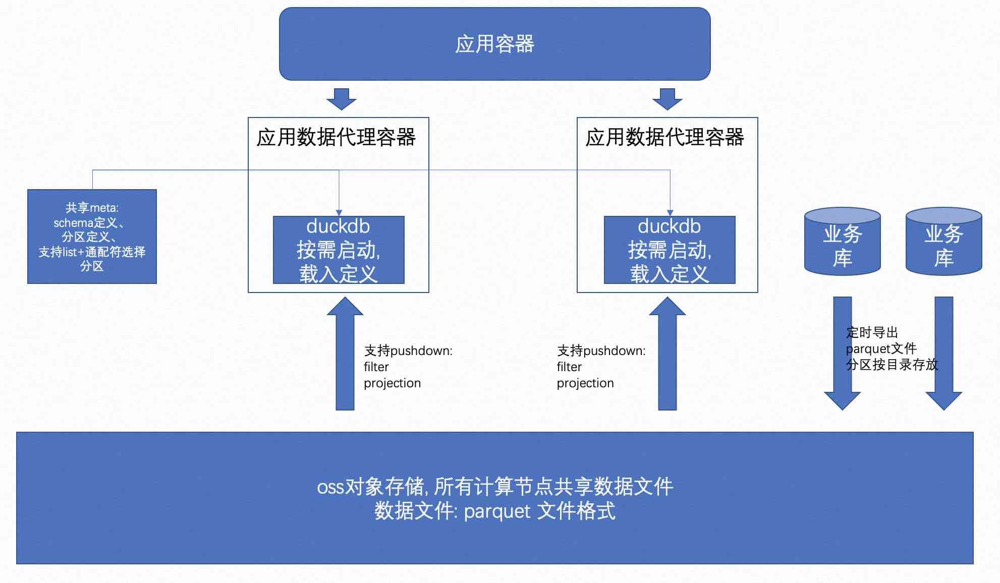

## 德说-第140期, duckdb+容器+parquet+对象存储, 实现SaaS场景, 低代码拖拉拽多维度实时分析 降本提效  
                                          
### 作者                                          
digoal                             
                                          
### 日期                                          
2022-09-13                                          
                                          
### 标签                                          
PostgreSQL , duckdb , saas , 分析             
                              
----                                          
                                          
## 背景     
duckdb+容器+parquet+对象存储, 实现SaaS场景, 低代码拖拉拽多维度实时分析  
  
我们知道SaaS类的数据实时分析面临一些挑战:  
- 由于saas面向很多客户, 而客户往往会有很多定制化的分析维度需求, 报表根据客户维度、业务周期变化多端, 通常的数据库只能通过暴力计算来支撑这类业务, 效率较低, 而且费钱. 
- 用户业务数据增长无序, 而数据库中存放着大量不同用户的数据, 某些用户数据无序增长, 导致数据库性能无法满足需求, 可能要经常腾挪数据来保证数据库响应时间的平顺性. 管理成本非常高、而且腾挪过程可能影响用户体验. 
- 数据库的数据+计算未分离, 所以资源持续占有. 用户未查询时, 由于资源持续的占有, 也在花钱. 比较费钱.    
  
duckdb来解决这个场景问题, 架构非常简单:    
- duckdb 做计算    
- 容器做计算层调度. 由于duckdb是无状态的, 所以可以根据SaaS业务查询的需要, 随时通过容器拉起.       
- parquet 做数据文件存储格式, 列存储, 内部block级别metadata实现高效过滤, 支持filter, projection的pushdown. 是大数据分析优秀的数据存储格式.  
- 对象存储做集中式分布式存储, 便于所有计算节点访问    
- 再加一个PG做元数据存储, 保存parquet的位置信息、业务映射关系等等    
  
  
  
架构优势:  
- 弹性扩缩容. 结合云上的docker容器服务. 按需付费, 节省成本.   
- duckdb 由于是纯计算, 启动非常快, 毫秒级别. 相比于SQL查询的时间, 可忽略不计.  适合按需拉起.  节省成本.   
- 数据使用对象存储(例如阿里云oss, aws s3), 相比于数据库的ECS+SSD存储, 非常非常省钱.   
- parquet 做数据文件存储格式, 列存储, 内部block级别metadata实现高效过滤, 支持filter, projection的pushdown. 并且支持压缩, 真的是又省钱又高效.  是大数据分析优秀的数据存储格式.   
  
架构缺陷:  
- parquet文件需要定期生成, 文件不宜过小.  所以和业务数据会有一定的时延.  
  
扩展阅读  
- [《德说-第135期, duckdb的产品形态如何盈利? 未来数据库产品的商业形态》](../202209/20220909_02.md)    
- [《DuckDB parquet 分区表 / Delta Lake(数据湖) 应用》](../202209/20220905_01.md)    
- [《DuckDB 采用外部 parquet 格式存储 - tpch 测试 - in_memory VS in_parquet》](../202209/20220901_05.md)    
- [《DuckDB 读写 Parquet 文件 - 同时支持远程s3, oss, http等parquet文件读写》](../202209/20220901_01.md)    
  
  
  
#### [期望 PostgreSQL 增加什么功能?](https://github.com/digoal/blog/issues/76 "269ac3d1c492e938c0191101c7238216")
  
  
#### [PolarDB for PostgreSQL云原生分布式开源数据库](https://github.com/ApsaraDB/PolarDB-for-PostgreSQL "57258f76c37864c6e6d23383d05714ea")
  
  
#### [PostgreSQL 解决方案集合](https://yq.aliyun.com/topic/118 "40cff096e9ed7122c512b35d8561d9c8")
  
  
#### [德哥 / digoal's github - 公益是一辈子的事.](https://github.com/digoal/blog/blob/master/README.md "22709685feb7cab07d30f30387f0a9ae")
  
  

  
  
#### [PolarDB 学习图谱: 训练营、培训认证、在线互动实验、解决方案、生态合作、写心得拿奖品](https://www.aliyun.com/database/openpolardb/activity "8642f60e04ed0c814bf9cb9677976bd4")
  
  
#### [购买PolarDB云服务折扣活动进行中, 55元起](https://www.aliyun.com/activity/new/polardb-yunparter?userCode=bsb3t4al "e0495c413bedacabb75ff1e880be465a")
  
  
#### [About 德哥](https://github.com/digoal/blog/blob/master/me/readme.md "a37735981e7704886ffd590565582dd0")
  
