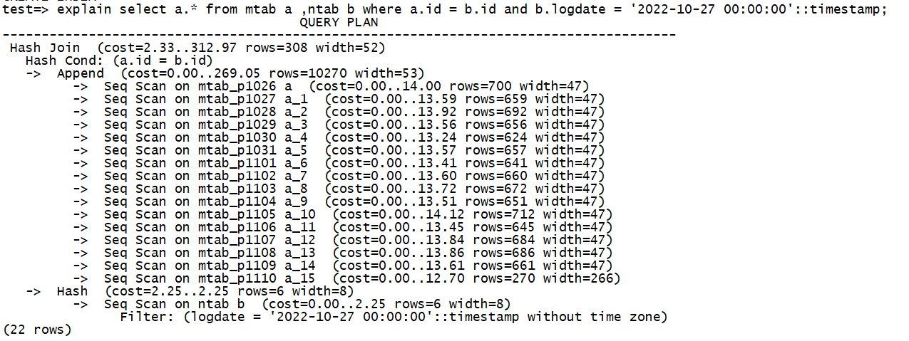

## 德说-第167期, 水中捞月      
            
### 作者            
digoal            
            
### 日期            
2022-10-27            
            
### 标签            
PostgreSQL , 目的 , 六祖        
            
----            
            
## 背景    
  
1、水中捞月的故事大家都耳熟能详. 猴子的目的是要拿到月亮, 月亮看似在水中, 但是猴子如果去水中求, 永远都捞不到月亮.    
  
2、东施效颦: 《庄子·天运》载：美女西施因为心口疼，便经常手捂胸口，皱着眉头。邻家丑女看见了，觉得姿态很美，也学她的样子，结果丑女更丑了。后人将这个丑女称作东施。“东施效颦”这个成语比喻模仿别人，不但模仿不好，反而出丑（东施：越国的丑女。效：模仿。颦：皱眉）。  
  
3、六祖指月的故事. 所谓“指月”, 源于六祖慧能与无尽藏尼对话的一个典故：无尽藏尼对慧能说：”你连字都不识，怎谈得上解释经典呢？“   慧能回答：”真理是与文字无关的，真理好像天上的明月，而文字只是指月的手指，手指可指出明月的所在，但手指并不是明月。“     
    
4、例如KPI 和 OKR: 如果给警察定KPI, 是定抓多少犯人为目标, 还是提高人民和谐稳定为目标?    
  
5、文字是语言的符号, 语言是思想的符号.  (摘自 王东岳-中西哲学启蒙课)    
  
6、圣经说: 那字句杀死人.  (书不是真理, 书好比船, 帮助渡人去到真理的彼岸的.  如果只注重知识, 而不明其背后的原因, 不明其经纶, 不去经历, 不去见证, 则只停留在书本(船)上, 无法达到彼岸.)     
  
辅助手段不是目的, 如果你注重辅助手段, 久而久之就可能偏离真正的目的.    
  
  
为什么经典的字很少? 例如 道德经、黄帝内经  
- 字多, 描写越详细, 就越框定边界, 越容易让读者画地为牢.   
- 字少, 想象空间大, 边界越不受限, 更能超脱时空限制的表达其真正思想. 实现渡人的目的.   
  
7、操场问荀彧和郭奉孝立谁为世子的事. 荀彧:立长, 郭奉孝:立贤(真月);    
  
  
## 运用:  
  
1、误区1, 开源是为商业服务的?   
  
请追问: 商业的目的是什么?   
  
按前面的逻辑, 商业只是水中月, 请继续追问真实的月亮在哪里. 开源才不会跑偏.     
  
2、误区2, 有位朋友今天发来一个截图, 问为什么这个地方PG不走索引, Oracle是走索引的. 怎样才能让PG走索引?    
  
    
  
这也是典型的追寻水中月的问题, 你的目的是要让请求变快, 而不是让数据库走索引. (可能你脑子里认为走索引就一定更快? 所以你的物理月亮就变成索引了, 变成框定你的牢笼.)  
  
这个问题背后的原理大家可以思考一下优化器的原理, 优化算法, 代价因子. 存储结构, 索引结构, 数据扫描方法, 资源消耗的计算方法 等等.    
  
[《优化器成本因子校对(disk,ssd,memory IO开销精算) - PostgreSQL real seq_page_cost & random_page_cost in disks,ssd,memory》](../201404/20140423_01.md)    
  
[《优化器成本因子校对 - PostgreSQL explain cost constants alignment to timestamp》](../201311/20131126_03.md)    
  
当然, 这个case的目的也许是快, 其他case可能又是快和稳定的平衡. 所以说字句杀死人, 原因就在这里(也许你曾经看到索引可以加速的文章, 并误以为目的是让执行计划走索引). 不要忘记真实目的, 迷信字句.   
  
3、圣经说的 字句杀死人, 要表达什么?   
  
圣经的目的是: 人与神的灵互相内住并调和成为一, 组成高维生命.    
- 所以圣徒应该做的事不仅仅是学习, 而应该是去: 学习(把内容刷到脑子里去, 高度一致)、用实际行动经历(谱写)神的经纶、见证 
  
4、误区3, 别人搞了大型的黑客松, 你是不是也要搞呢?   
  
搞黑客松的目的是什么? 影响力、行业心智、吸引队伍参加并培养开发者成为产品的未来贡献者? ...   
所以这些目标是不是和你的目标一致? 如果是的话, 是不是一定要搞黑客松才能完成这些指标? 还有没有ROI更高的策略? 而不是直接跟进.    
如果目标和你的目标不一致, 你还有必要跟进吗?  
  
## 发散问题:   
活着是不是终极目的?   
  
永恒是不是终极目的?   
  
存在是不是终极目的?   
  
企业创新是目的?   
  
和客户交流时, 客户描述的需求就是终极目的?    
  
只要还能继续追问, 就说明还没有到达真理.    
  
- 上班不是目的
- 赚钱不是目的
- 学习不是目的
- 求存才是目的
    - 时间空间内永恒的存在？
    - 永恒是目的？活得久？
    - 活得精彩？昙花一现？
    - 又猛又持久？
- 存在(包括非物质存在)高于一切。
    - 升华：存在的意义高于一切，存在必须找到一个内在或外在的供需连闭环。才有存在的意义。
  
## 参考  
[《DB吐槽大会,第12期 - 没有自动成本校准器》](../202108/20210830_03.md)    
  
[《优化器成本因子校对(disk,ssd,memory IO开销精算) - PostgreSQL real seq_page_cost & random_page_cost in disks,ssd,memory》](../201404/20140423_01.md)    
  
[《优化器成本因子校对 - PostgreSQL explain cost constants alignment to timestamp》](../201311/20131126_03.md)    
  
[《德说-第23期, KPI & OKR 陷阱 与 六祖指月》](../202108/20210827_01.md)    
  
急中生智, 定静生慧.    
  
[《德说-第161期, 人生最重要的事7: 知行合一, 空谈误国》](../202210/20221021_01.md)    
  
  
  
#### [期望 PostgreSQL 增加什么功能?](https://github.com/digoal/blog/issues/76 "269ac3d1c492e938c0191101c7238216")
  
  
#### [PolarDB for PostgreSQL云原生分布式开源数据库](https://github.com/ApsaraDB/PolarDB-for-PostgreSQL "57258f76c37864c6e6d23383d05714ea")
  
  
#### [PostgreSQL 解决方案集合](https://yq.aliyun.com/topic/118 "40cff096e9ed7122c512b35d8561d9c8")
  
  
#### [德哥 / digoal's github - 公益是一辈子的事.](https://github.com/digoal/blog/blob/master/README.md "22709685feb7cab07d30f30387f0a9ae")
  
  

  
  
#### [PolarDB 学习图谱: 训练营、培训认证、在线互动实验、解决方案、生态合作、写心得拿奖品](https://www.aliyun.com/database/openpolardb/activity "8642f60e04ed0c814bf9cb9677976bd4")
  
  
#### [购买PolarDB云服务折扣活动进行中, 55元起](https://www.aliyun.com/activity/new/polardb-yunparter?userCode=bsb3t4al "e0495c413bedacabb75ff1e880be465a")
  
  
#### [About 德哥](https://github.com/digoal/blog/blob/master/me/readme.md "a37735981e7704886ffd590565582dd0")
  
