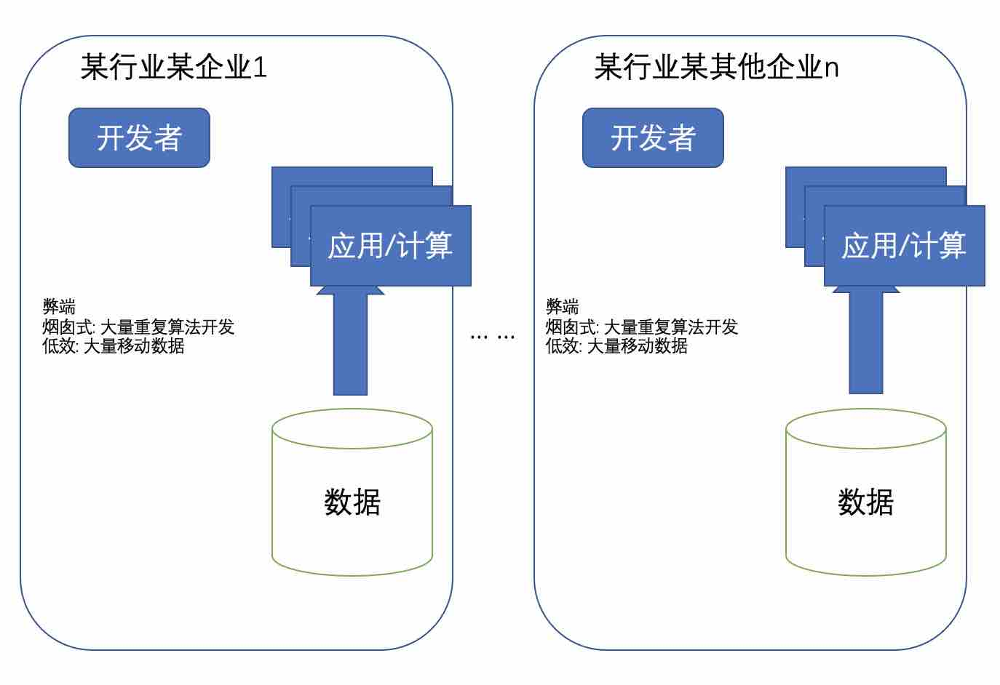
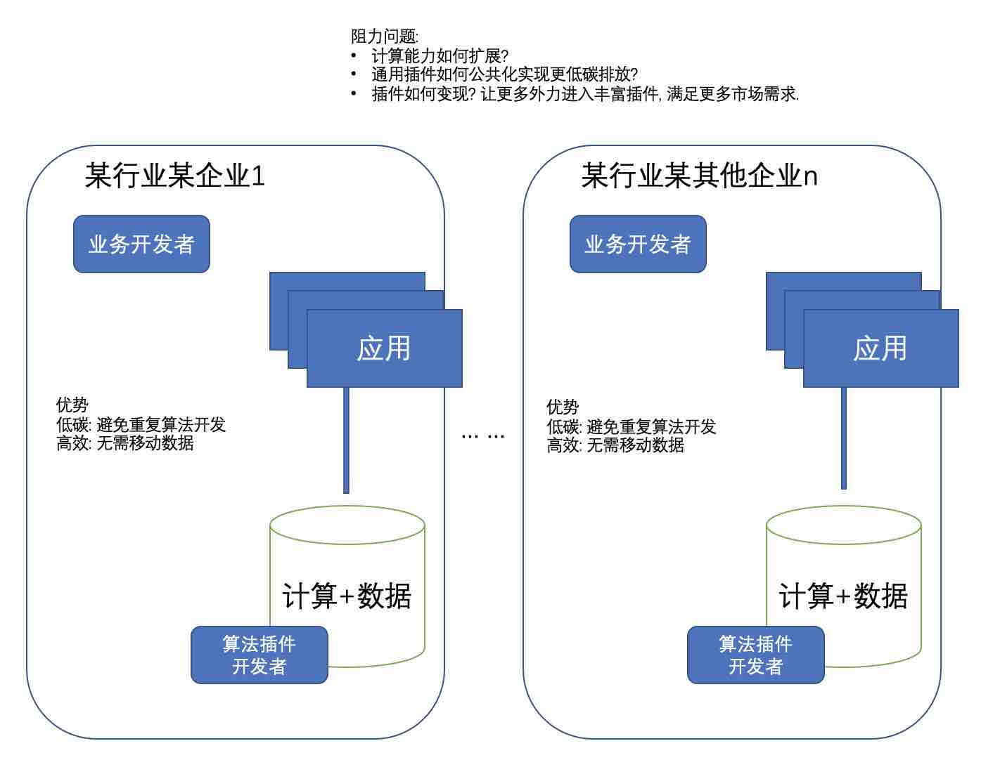
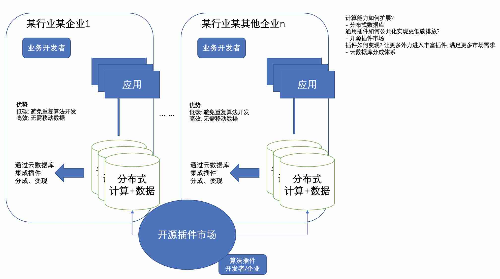

## 德说-第184期, 云分布式数据库可能会改变数据库地位   
                                            
### 作者                                            
digoal                                            
                                            
### 日期                                            
2022-12-06                                         
                                            
### 标签                                            
PostgreSQL , PolarDB , 云 , 分布式 , 插件市场 , 高效 , 低碳 , 业务属性 , 数据价值                     
                                            
----                                            
                                            
## 背景    
一直以来数据库都比较独立, 在企业的偏后端, 业务搞业务的, 数据库更多承担的是数据存储的角色, 保障数据可靠性, 数据安全等.    
  
随着竞争越来越激烈, 通过挖掘数据价值来驱动业务的需求会越来越凸显, 这样的传统架构会带来如下问题:    
- 1、同一个行业内存在大量烟囱式开发: 相同或相似场景存在大量重复算法开发, 浪费社会资源. (根据代际转移理论, 这种架构一定会被颠覆.)  [《德说-第96期, 代际转移与创新、集智(全球脑)》](../202205/20220514_03.md)    
- 2、业务低效: 因为需要大量移动数据进行计算.    
  
    
  
如何解决这2个问题?    
  
1、将计算下移: 算法作为数据库公共插件集成到数据库内. 解决大量移动数据的低效行为. 提升业务能力.    
  
2、算法插件作为开源模块, 数据库可以自由加载, 在同类场景中避免了重复开发.   
- 证据:  PG插件市场.    
    - [《2021-重新发现PG之美 系列 - 适合架构师与业务开发者》](../202105/20210526_02.md)    
  
优势:   
- 低碳: 避免重复算法开发  
- 高效: 无需移动数据  
  
  
目标低碳高效, 看起来很美好, 会面临哪些阻力呢?       
- 1、计算能力如何扩展?  
- 2、通用插件如何公共化实现更低碳排放?  
- 3、插件如何变现? 从而可以有更多外力进入丰富插件, 从而满足更多市场需求.    
   
这个问题为什么会存在?[《DB吐槽大会,第36期 - PG 没有官方插件市场》](../202109/20210904_05.md)  
  
    
  
云分布式数据库可能是能够落地这件事情的最好选择, 为什么?   
  
1、计算能力如何扩展? 为什么要在分布式数据库上做计算?    
- 单机的计算能力不够  
- 单机的存储能力不够  
- 分布式数据库OK  
  
PolarDB是很好的选择:  
- [《配置 madlib for PolarDB 实现数据库机器学习功能》](../202212/20221202_03.md)  
- [《配置 pgcat for PolarDB 读写分离连接池》](../202212/20221202_02.md)  
- [《如何用 PolarDB 整合age算法插件, 实现图式搜索加速 - 刑侦、社交、风控、族谱、推荐等业务图谱类关系数据搜索》](../202212/20221202_01.md)  
- [《如何用 PolarDB 在不确定世界寻找确定答案 (例如图像相似) - vector|pase》](../202212/20221201_02.md)  
- [《PolarDB for PostgreSQL SPGiST 实现超光速 - 全球化业务根据来源IP智能DNS路由就近分配本地机房访问, 提升用户体验》](../202211/20221130_01.md)  
  
2、通用插件如何公共化实现更低碳排放?  
- 开源插件市场  
  
3、插件如何变现? 从而可以有更多外力进入丰富插件, 从而满足更多市场需求.    
- 云数据库分成体系.  
    - 基本上没有其他变现方法.  
  
  
    
  
  
紧接着就是市场评估, "云数据库插件市场"可能是水中月, 真月是(低碳: 避免重复算法开发. 高效: 无需移动数据.)   [《德说-第167期, 水中捞月》](../202210/20221027_01.md)    
  
所以必须要完成市场评估, 才能去有效的落地.    
  
回答以下问题:   
- 投入与回报?   
- 动态分成?   
- 插件品质运维和技术保障?   
- 插件、产品的问题排查?   
- 自我保护? 协议许可等、法律免责声明?   
  
  
  
云分布式数据库+开源插件+用户 如何形成增长飞轮?    
- 用户: 更快、更稳、更廉价、更多数据价值被挖掘的需求      
- 云数据库: 更多用户、生态壁垒.  (开放式插件市场, 为了让更多计算算法与数据结合, 发挥数据价值, 留住并拓展更多用户.)   
- 插件开发商: 钱. (插件要与开源云数据库结合, 为了变现.) (插件开源: 通过开源推广市场.)  
  
  
论计算与数据结合的重要性.  
- 只有计算能发挥数据价值.  
- 只有数据价值能把用户留住.  
- 只有用户才有未来.  
- 只有计算是数据库的未来.  
- 只有计算和数据结合能更好满足用户诉求: 让计算产生数据价值!    
  
  
  
云分布式数据库+开源插件+用户 不是改变数据库本身, 而是改变数据库的地位!!!  
- 通过什么? 插件生态  
- 为什么?  
    - 插件具有业务属性, 将计算下移到数据端, 让数据库的距离和用户更近一步.  
  
## 终局之战:   
- 11、[《云、商业、开源数据库终局之战 - 商业角度解读PG如何破局 - openapi 、 扩展能力、插件开源协议》](../202007/20200727_04.md)    
- 12、[《[直播]大话数据库终局之战》](../202009/20200926_03.md)     
  
看谁能如何快速搞定商业闭环, 把生态建立起来. 头部厂商已经在尝试数据库服务的用户可加载插件(背后的逻辑就是让计算靠近数据, 发挥数据价值, 谁最懂计算?当然是业务自己.).   
   
你去看一下为什么oss要搞lambada 计算? 不也是数据价值?    
   
需求的几个维度:    
- 快速进入   
- 快速根据需求过滤(需要支撑更多算法、结构、搜索路径、运算符等)   
- 快速传输   
- 快速结合业务代码发挥价值(代码下沉, 例如pl...)   
- 打破孤岛(联邦计算等)   
   
实现手段各异, 功能形态:   
- plxxx   
- 数据结构   
- 数据类型   
- 索引结构   
- 操作(计算)符   
- udf   
- 联邦查询   
  
### 其他方法
1、数据库与应用之间的传输层压缩, 或者类似duckdb的透明压缩(轻量级压缩)能力. 也可以减少传输时间, 但是对于大计算量的场景, 传输时间再怎么压缩也是耗时大头部分.   
- [《DuckDB 轻量级压缩解读》](../202211/20221128_01.md)  
- [《duckdb postgres_scan 插件 - 不落地数据, 加速PostgreSQL数据分析》](../202210/20221001_02.md)  
  
#### [期望 PostgreSQL|开源PolarDB 增加什么功能?](https://github.com/digoal/blog/issues/76 "269ac3d1c492e938c0191101c7238216")
  
  
#### [PolarDB 云原生分布式开源数据库](https://github.com/ApsaraDB "57258f76c37864c6e6d23383d05714ea")
  
  
#### [PolarDB 学习图谱: 训练营、培训认证、在线互动实验、解决方案、内核开发公开课、生态合作、写心得拿奖品](https://www.aliyun.com/database/openpolardb/activity "8642f60e04ed0c814bf9cb9677976bd4")
  
  
#### [PostgreSQL 解决方案集合](../201706/20170601_02.md "40cff096e9ed7122c512b35d8561d9c8")
  
  
#### [德哥 / digoal's github - 公益是一辈子的事.](https://github.com/digoal/blog/blob/master/README.md "22709685feb7cab07d30f30387f0a9ae")
  
  

  
  
#### [购买PolarDB云服务折扣活动进行中, 55元起](https://www.aliyun.com/activity/new/polardb-yunparter?userCode=bsb3t4al "e0495c413bedacabb75ff1e880be465a")
  
  
#### [About 德哥](https://github.com/digoal/blog/blob/master/me/readme.md "a37735981e7704886ffd590565582dd0")
  
