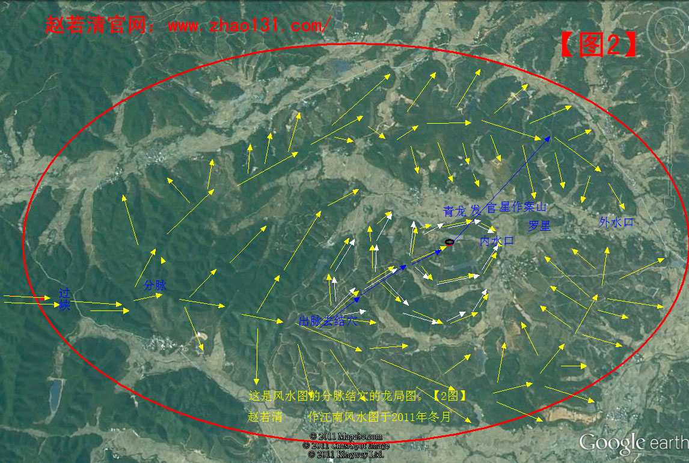
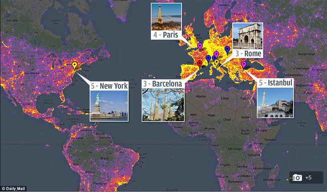
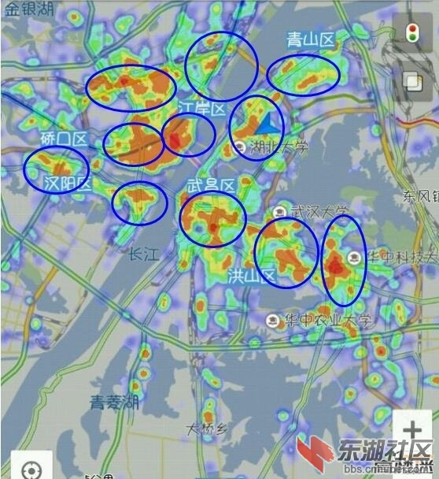
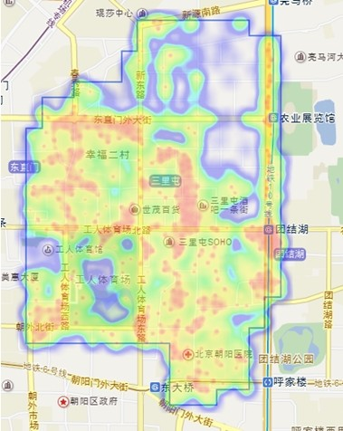
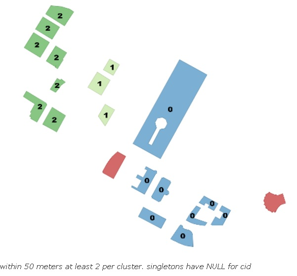
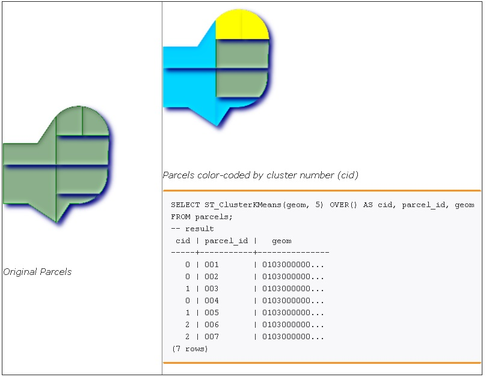
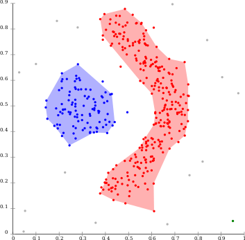

## PolarDB 开源版 使用PostGIS 数据寻龙点穴（空间聚集分析）- 大数据与GIS分析解决线下店铺选址问题       
                          
### 作者                          
digoal                          
                          
### 日期                          
2023-01-04           
                          
### 标签                          
PostgreSQL , PolarDB , PostGIS , 寻龙点穴 , 选址          
                          
----                          
                          
## 背景            
PolarDB 的云原生存算分离架构, 具备低廉的数据存储、高效扩展弹性、高速多机并行计算能力、高速数据搜索和处理; PolarDB与计算算法结合, 将实现双剑合璧, 推动业务数据的价值产出, 将数据变成生产力.                          
                          
本文将介绍PolarDB 开源版 使用PostGIS 数据寻龙点穴（空间聚集分析）- 大数据与GIS分析解决线下店铺选址问题         
                          
测试环境为macOS+docker, PolarDB部署请参考下文:                          
- [《如何用 PolarDB 证明巴菲特的投资理念 - 包括PolarDB简单部署》](../202209/20220908_02.md)               
               
## 业务介绍        
最近鬼吹灯热播，胡八一的《十六字阴阳风水秘术》到底是什么武功秘籍？寻龙点穴又是什么？别问我，不知道。      
      
      
      
PS：以下截取自互联网。       
      
寻龙点穴是风水学术语。古人说：三年寻龙，十年点穴。意思就是说，学会寻龙脉要很长的时间，但要懂得点穴，并且点得准则难上加难，甚至须要用“十年”时间。 但是，若没正确方法，就是用百年时间，也不能够点中风水穴心聚气的真点，这样一来，寻龙的功夫也白费了。 准确地点正穴心，并不是一件容易的事，对初学者来说如此，就是久年经验老手，也常常点错点偏。       
      
      
       
寻龙点穴旨在寻找龙气聚集之地，而现实中，我们也有类似需求，比如找的可能是人气聚集之地。         
      
我们要相信科学的力量，如今大数据、AI这么发达，实际上我们可以在海量数据的情况下总结经验，和前人通过古老的夜观星象总结的经验可能会出现惊人的相似。      
      
我们有海量的人物活动数据、汽车活动数据、传感器数据等等。完全可以分析出来什么样的地方适合居住，什么样的地方适合做生意，等等。      
      
扯远了，我们回到主题 - 空间数据寻龙点穴。实际上就是PostGIS 2.3的两个新特性，空间数据的聚集分析。      
      
例如我们有人物活动的点数据组成的海量数据，通过空间聚集分析，可以汇聚出指定时间段，数据聚集的热力图。是不是和寻龙点穴有点相似呢？      
      
      
      
      
      
      
      
## 空间聚集窗口分析函数      
鬼吹灯中有一段关于“龟眠之地”的描述：      
      
我掏出《十六字阴阳风水秘术》翻了翻，找到一段“龟眠之地”的传说，书中记载，当年有人在海边，见到海中突然浮出一座黑山，再细观之，原来是数十只老龟，驮负着一头死去的巨龟自海中而出，这些老龟把死龟驮至一处山崖下地洞穴里藏好，这才陆续离去游回大海，偷偷看到这一切的那个人，擅长相地择穴之术，知道此穴乃是四灵所钟。洞中“龙气冲天”，其时正好他家中有先人故去，于是他探明洞中龟尸的特形后，把自己的先人不用棺椁裸身葬入其中。此后这个人飞黄腾达、平步青云，成就了一方霸业。那处龟眠洞日后就成了他家宗室的专用慕穴，数百年后龙气已尽，地崩，露出尸体无数，当地人争相围观，所有尸身皆生鸟羽龙鳞，被海风吹了一天一夜之后，全部尸体同时化为乌有。      
      
鬼吹灯和数据分析有什么关联呢？必须有啊，你想想，古人为了找到一块“龟眠之地”得费劲多少心思了。而现在我们有了数据，是不是很好找了呢。      
      
假设我们的数据包含这些维度：      
      
1、时间      
      
2、人物位置      
      
3、人物属性（收入、行业、年龄、等等）      
      
好了，想象一下，你是不是可以按人物属性、时间，对数据进行空间聚集分析。生成不同分析维度的人群热力图。颇有寻龙点穴范。      
      
那么怎么做空间数据的聚集分析呢？      
      
PostGIS 2.3 新增了两个窗口函数，就是用于         
      
1、基于[Density-based spatial clustering of applications with noise (DBSCAN)](https://en.wikipedia.org/wiki/DBSCAN) 算法的空间数据聚集分析函数[ST_ClusterDBSCAN](https://postgis.net/docs/manual-dev/ST_ClusterDBSCAN.html)：      
      
      
  
`integer ST_ClusterDBSCAN(geometry winset geom, float8 eps, integer minpoints);`
- 一个cluster内的任意对象之间距离在eps米内, 一个cluster必须至少包含minpoints个对象.   
      
2、基于 [k-means](https://en.wikipedia.org/wiki/K-means_clustering) 算法的空间数据聚集分析函数[ST_ClusterKMeans](http://postgis.net/docs/manual-dev/ST_ClusterKMeans.html)：      
      
      
  
`integer ST_ClusterKMeans(geometry winset geom, integer number_of_clusters, float max_radius);`
- number_of_clusters 聚集为多少个cluster
- max_radius 一个cluster内的所有对象之间距离不能大于max_radius, 避免一个cluster的范围太广
  
      
有意思。      
      
      
      
### 例子      
1、      
      
```      
 -- Partitioning parcel clusters by type      
SELECT ST_ClusterKMeans(geom,3) over (PARTITION BY type) AS cid, parcel_id, type      
FROM parcels;      
-- result      
 cid | parcel_id |    type      
-----+-----------+-------------      
   1 | 005       | commercial      
   1 | 003       | commercial      
   2 | 007       | commercial      
   0 | 001       | commercial      
   1 | 004       | residential      
   0 | 002       | residential      
   2 | 006       | residential      
(7 rows)      
```      
      
2、      
      
```      
SELECT name, ST_ClusterDBSCAN(geom, eps := 50, minpoints := 2) over () AS cid      
FROM boston_polys      
WHERE name > '' AND building > ''      
        AND ST_DWithin(geom,      
        ST_Transform(      
            ST_GeomFromText('POINT(-71.04054 42.35141)', 4326), 26986),      
           500);      
```      
      
## st_union 空间对象聚合      
前面提到的两个窗口函数只是生产每条记录所属的聚集ID，按这个聚集ID在聚合，就可以聚合成一个个的几何对象（例如点集），通过点集再可以生成sufface。      
      
http://postgis.net/docs/manual-dev/ST_MemUnion.html      
      
http://postgis.net/docs/manual-dev/ST_Union.html      
      
## 凶相洞察 - 流式计算    
人流量大就一定是风水宝地吗？有河流的地方也不一定就是风水宝地。    
    
我们还需要从多个维度分析人流量，同时还需要分析人口的驻留时间，新增人口，流失人口等。    
    
比如地铁站，人流量是非常庞大，但是驻留时间非常短，你在这里开个SUPER MARKT也许就不合适了。但是便利店、奶茶店也许是很棒的。    
    
这些通过流计算+PostGIS很容易实现。    
    
[《流计算风云再起 - PostgreSQL携PipelineDB力挺IoT》](../201612/20161220_01.md)      
    
1、创建多边形（行政区、小区、热区等）表1，这个表可以通过前面讲的空间数据聚合得到。    
    
2、创建流，JOIN表1。    
    
3、创建流视图，根据"多边形+时间窗口"（例如10分钟、30分钟、1小时等多个分组）进行分组，统计"多边形+时间窗口"的 新增人口，流失人口，人口数。    
    
4、往流里写入人口的实时位置数据。    
    
具体的玩法详见pipelinedb手册。(pipelinedb即将成为PostgreSQL 10的一个插件。安装到postgresql 10中即可使用, polardb for postgreSQL 也可以使用.)    
    
http://docs.pipelinedb.com/    
        
## 空间聚集分析业务场景      
空间聚集分析窗口函数，非常有助于基于人物、被检测对象在时间、空间、对象属性等多种维度层面的空间聚集透视。      
      
关于多维数据透视，也可以参考我以前写的文章。      
      
[《时间、空间、对象多维属性 海量数据任意多维 高效检索》](../201707/20170722_01.md)        
      
实际上除了这两个窗口分析函数，PostgreSQL还提供了[MADlib机器学习库](http://madlib.incubator.apache.org/index.html)，通过SQL接口、R接口（pitovalR）、Python接口可以进行调用，利用数据库的分析能力完成数据透视和编程的易用性（海量数据有MPP，中等体量有PG的多核并行计算、向量计算、JIT等大幅度提升计算能力的特性）。        
        
## 参考      
http://planet.postgis.net/index.html      
      
https://postgis.net/docs/manual-dev/ST_ClusterKMeans.html      
      
https://en.wikipedia.org/wiki/K-means_clustering      
      
https://postgis.net/docs/manual-dev/ST_ClusterDBSCAN.html      
        
http://planet.qgis.org/planet/tag/postgis/       
      
http://2012.ogrs-community.org/2012_papers/d3_10_bonin_presentation.pdf       
      
http://www.waurisa.org/conferences/2009/presentations/Tues/OpenSourceWebModelingAndVisualization_Tues_Vennemann_TerraGIS.pdf       
       
    
  
#### [期望 PostgreSQL|开源PolarDB 增加什么功能?](https://github.com/digoal/blog/issues/76 "269ac3d1c492e938c0191101c7238216")
  
  
#### [PolarDB 云原生分布式开源数据库](https://github.com/ApsaraDB "57258f76c37864c6e6d23383d05714ea")
  
  
#### [PolarDB 学习图谱: 训练营、培训认证、在线互动实验、解决方案、内核开发公开课、生态合作、写心得拿奖品](https://www.aliyun.com/database/openpolardb/activity "8642f60e04ed0c814bf9cb9677976bd4")
  
  
#### [PostgreSQL 解决方案集合](../201706/20170601_02.md "40cff096e9ed7122c512b35d8561d9c8")
  
  
#### [德哥 / digoal's github - 公益是一辈子的事.](https://github.com/digoal/blog/blob/master/README.md "22709685feb7cab07d30f30387f0a9ae")
  
  

  
  
#### [购买PolarDB云服务折扣活动进行中, 55元起](https://www.aliyun.com/activity/new/polardb-yunparter?userCode=bsb3t4al "e0495c413bedacabb75ff1e880be465a")
  
  
#### [About 德哥](https://github.com/digoal/blog/blob/master/me/readme.md "a37735981e7704886ffd590565582dd0")
  
