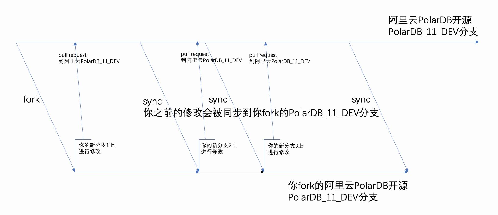

## 手把手教你如何参与开源项目的协作、贡献代码: 以PolarDB开源项目为例    
                    
### 作者                    
digoal                    
                    
### 日期                    
2023-01-30                  
                    
### 标签                    
PostgreSQL , PolarDB , 开源协作   
                    
----                    
                    
## 背景      
开源协作是一种社会进化的体现吗?   
  
昨天体验了一下ChatGPT, 对这几个回答深有感触, 开源协作一定是未来会长期存在的, 更大规模化的人类协作模式. 所以我想写一点东西, 来帮助更多人参与开源协作.    
  
1、三体的黑暗丛林法则是社会达尔文主义的体现吗    
    
不是。三体的黑暗森林法则是一种民族和文化发展观，源于中国古老文化中著名的《三体》系列小说。其认为，世界上所有文明都在竞争中进化，只有最强者才能存活。而社会达尔文主义是一种倡导“演化后成长”的社会学理论，它认为，演化不是一种竞争，而是一种合作和协作，因此任何文明走向协作而不是竞争，都会获得更多的发展及成功。    
    
    
2、请解释一下社会达尔文主义    
    
社会达尔文主义是一种形而上学社会理论，它倡导“演化后成长”的理念，认为演化不是一种竞争，而是一种协作的智慧，个体应该以合作精神更多的关注大环境和社会需要，以满足自己的更多发挥和增长。它认为社会的发展应该综合考虑各方的利益，而不是仅仅考虑个人的利益。社会达尔文主义提出了一种协作的概念，认为任何文明走向协作而不是竞争，都会获得更多的发展及成功。    
    
    
3、马尔萨斯陷阱是社会达尔文主义的延伸吗    
    
是的，马尔萨斯陷阱是社会达尔文主义的延伸，它可以用来描述一种社会演化的过程，即一个社会会认为比竞争更重要的是合作，因此会相互促进，从而达到一种共赢的状态。比如，若某社区的人们都采取协作精神，那么社区将更加繁荣，而如果社区里面存在竞争，每个人争夺自己的利益，则会带来更多的紧张和冲突，更不利于社会发展。    
    
    
4、请解释一下马尔萨斯陷阱    
    
马尔萨斯陷阱是指当一个社会采取竞争策略而不是合作策略时，成员会受到损害，从而导致社会质量下降。这种概念是由社会学家和哲学家弗朗索瓦·马尔萨斯在上世纪20年代提出的，他提出，在一个社会，如果每个人都只关心自  
己的利益，这将会导致整个社会陷入低效的、限制发展的困境中。    
  
  
## PolarDB的分支解释  
https://github.com/ApsaraDB/PolarDB-for-PostgreSQL  
- `polardb_11_dev` 是 `polardb v11` 的 `master` 分支 , 类似 `postgresql` 的 `master` 分支.   
- `polardb_11_stable` 是 polardb v11的 `stable` 分支 , 类似 `postgresql` 的 `REL_11_STABLE` 分支.   
    - https://git.postgresql.org/gitweb/?p=postgresql.git;a=summary  
  
将来`Polardb`发布14版本, 则会新建2个分支:  
- `polardb_14_dev` 是 `polardb v14`的 `master`分支 , 依旧类似`postgresql`的`master`分支.   
- `polardb_14_stable` 是 `polardb v14`的 `stable`分支 , 类似`postgresql`的`REL_14_STABLE`分支.   
  
实际上`polardb_11_dev`是`postgresql`的`REL_11_STABLE`分支的下游分支. `polardb_14_dev`是`postgresql`的`REL_14_STABLE`分支的下游分支.   
- [《基于开源版本的发型版如何保持与开源版本的同步? - 路口》](../202208/20220817_01.md)    
   
协作模式: 所有的开发者都将代码贡献到dev分支, PolarDB核心组会选择性的将dev的commit merge到stable稳定分支.  
  
  
## 推荐的PolarDB贡献流程  
  
第一次贡献:  
- `fork`  -- 第一次  
- `sync polardb_11_dev`  -- 每次贡献前, 在github官网, 你fork的polardb repo中进行操作. (或者使用openapi?)  
- `checkout newbranch1 base on polardb_11_dev`    
- `modify` -- 基于polardb的开发者规范进行代码修改  
- `git add`  
- `git commit`  
- `git push`   
- `pull request` -- 在`github`官网, `pull newbranch1` to `polardb` 上游 `polardb_11_dev`  
    - -- 如果合并未通过, 根据建议进行修改, 自己的仓库`push`后再次提交`pull`  
  
  
新的贡献:   
- `sync polardb_11_dev`  -- 每次贡献前, 在github官网, 你fork的polardb repo中进行操作. (或者使用openapi?)  
- `checkout newbranch2 base on polardb_11_dev`    
- `modify` -- 基于polardb的开发者规范进行代码修改  
- `git add`  
- `git commit`  
- `git push`   
- `pull request` -- 在`github`官网, `pull newbranch2` to `polardb` 上游 `polardb_11_dev`  
    - -- 如果合并未通过, 根据建议进行修改, 自己的仓库`push`后再次提交`pull`  
  
FAQ:  
  
1、为什么建议每次都先 `checkout newbranch2 base on polardb_11_dev`  , 然后在`newbranch2`进行修改.    
保证你的`polardb_11_dev`永远是干净的, 可以从上游同步最新变动.  
  
  
如图:    
  
  
  
2、为什么每次修改前都要先 `sync polardb_11_dev` 到最新状态?   
  
如果你已经落后于上游, 上游如果对你将要修改的文件已经修改过, 你基于老的文件修改, 会出现冲突, 导致pull失败.   
  
你之前给上游提交的修改会被合并到`polardb_11_dev`, 所以保持`sync polardb_11_dev`可以保证拿到你以及其他开发者对上游的最新贡献.   
  
所有人都这么做, 则保证了上游`polardb_11_dev`分支永远是最新的开发分支.    
  
  
## 实操演示: 贡献polardb文档  
环境: macOS   
  
1、假设你已经有github账号  
  
并且已经签署CLA :  
https://cla-assistant.io/ApsaraDB/PolarDB-for-PostgreSQL  
   
注意cla签署后, 会比对commit log里面的email是否与已登记到你github里的email一致, 如果不一致则cla检测无法通过.  
  
https://help.github.com/articles/why-are-my-commits-linked-to-the-wrong-user/#commits-are-not-linked-to-any-user   
  
digoal zhou seems not to be a GitHub user. You need a GitHub account to be able to sign the CLA. If you have already a GitHub account, please add the email address used for this commit to your account.   
  
You have signed the CLA already but the status is still pending? Let us recheck it.  
  
具体操作:   
  
1\.1、在github网站进行设置, 将email地址添加到github邮件里面.   
  
1\.2、同时, 修改本地的email信息, 每次提交会从 `~/.gitconfig` 读取.  
  
```  
git config --global user.name "Your Name"   
git config --global user.email "youremail@yourdomain.com"   
  
  
IT-C02YW2EFLVDL:.git digoal$ git config --global user.name "digoal zhou"   
IT-C02YW2EFLVDL:.git digoal$ git config --global user.email "dege.zzz@alibaba-inc.com"   
  
  
IT-C02YW2EFLVDL:.git digoal$ cat ~/.gitconfig   
# This is Git's per-user configuration file.  
[user]  
# Please adapt and uncomment the following lines:  
	name = digoal zhou  
	email = dege.zzz@alibaba-inc.com  
[http]  
	postBuffer = 10485760000  
	lowSpeedLimit = 0  
	lowSpeedTime = 999999  
```  
  
如果你已经使用了未登记在github内的email进行了commit, 可以通过如下方法修改commit log, 改成已登记到你github里的email, 然后进行覆盖. 例如:    
  
```  
git commit --amend --author="digoal zhou <dege.zzz@alibaba-inc.com>"  
git push -f origin 20230130_01  
```  
    
  
  
2、假设你本地已经配置好了github ssh-key for git push    
  
3、假设你已经登陆了github  
  
4、fork PolarDB-for-PostgreSQL  
  
打开github: https://github.com/ApsaraDB/PolarDB-for-PostgreSQL  
  
点击 fork  
- 不要勾选: `Copy the POLARDB_11_STABLE branch only`  
  
fork到我的github, 新的repo如下:   
  
https://github.com/digoal/PolarDB-for-PostgreSQL  
  
然后修改一下默认分支为POLARDB_11_DEV, 因为后面经常要跟上游sync这个分支. 同时也可以避免一些误操作.    
- 在 https://github.com/digoal/PolarDB-for-PostgreSQL 项目中打开settings进行修改, switch default branch.  
  
5、clone到本地   
  
```  
git clone --depth 1 -b POLARDB_11_DEV git@github.com:digoal/PolarDB-for-PostgreSQL.git  
  
如下  
  
IT-C02YW2EFLVDL:~ digoal$ git clone --depth 1 -b POLARDB_11_DEV git@github.com:digoal/PolarDB-for-PostgreSQL.git  
Cloning into 'PolarDB-for-PostgreSQL'...  
Enter passphrase for key '/Users/digoal/.ssh/id_rsa':   
remote: Enumerating objects: 11564, done.  
remote: Counting objects: 100% (11564/11564), done.  
remote: Compressing objects: 100% (7895/7895), done.  
remote: Total 11564 (delta 3531), reused 9781 (delta 3404), pack-reused 0  
Receiving objects: 100% (11564/11564), 82.38 MiB | 6.91 MiB/s, done.  
Resolving deltas: 100% (3531/3531), done.  
Updating files: 100% (11024/11024), done.  
  
IT-C02YW2EFLVDL:~ digoal$ cd PolarDB-for-PostgreSQL/  
IT-C02YW2EFLVDL:PolarDB-for-PostgreSQL digoal$ git branch  
* POLARDB_11_DEV  
```  
  
6、sync polardb_11_dev   
  
在github网站操作, 点击`Sync fork`.  https://github.com/digoal/PolarDB-for-PostgreSQL/tree/POLARDB_11_DEV  
  
然后本地pull最新代码   
  
```  
IT-C02YW2EFLVDL:PolarDB-for-PostgreSQL digoal$ git pull origin POLARDB_11_DEV  
Enter passphrase for key '/Users/digoal/.ssh/id_rsa':   
From github.com:digoal/PolarDB-for-PostgreSQL  
 * branch            POLARDB_11_DEV -> FETCH_HEAD  
Already up to date.  
```  
  
7、checkout 到本地新分支, 在新分支上进行修改  
  
```  
IT-C02YW2EFLVDL:PolarDB-for-PostgreSQL digoal$ git branch 20230130_01  
IT-C02YW2EFLVDL:PolarDB-for-PostgreSQL digoal$ git branch  
  20230130_01  
* POLARDB_11_DEV  
IT-C02YW2EFLVDL:PolarDB-for-PostgreSQL digoal$ git checkout 20230130_01  
Switched to branch '20230130_01'  
```  
  
查看当前是否切换到新分支  
  
```  
IT-C02YW2EFLVDL:PolarDB-for-PostgreSQL digoal$ git branch  
* 20230130_01  
  POLARDB_11_DEV  
```  
  
8、以贡献polardb 文档为例:  
  
详细参考:  
  
https://apsaradb.github.io/PolarDB-for-PostgreSQL/zh/contributing/contributing-polardb-docs.html  
  
8\.1、先配置一下依赖环境 (配置一次就可以).     
  
通过 curl 安装 Node 版本管理器 nvm。  
  
```  
cd ~  
  
curl -o- https://raw.githubusercontent.com/nvm-sh/nvm/v0.39.1/install.sh | sudo bash  
```  
  
由于我使用的是bash shell, 添加一下环境变量, 否则找不到nvm命令.  
  
```  
vi ~/.bash_profile  
# nvm add  
. $HOME/.profile  
  
. ~/.bash_profile  
IT-C02YW2EFLVDL:~ digoal$ command -v nvm  
nvm  
```  
  
如果 nvm 已经被成功安装，执行以下命令安装 Node 的 LTS 版本：  
  
```  
nvm install --lts  
```  
  
Node.js 安装完毕后，使用如下命令检查安装是否成功：  
  
```  
node -v  
npm -v  
  
如下  
  
IT-C02YW2EFLVDL:~ digoal$ node -v  
v18.13.0  
IT-C02YW2EFLVDL:~ digoal$ npm -v  
8.19.3  
```  
  
使用 npm 全局安装软件包管理器 yarn：  
  
```  
npm install -g yarn  
yarn -v  
  
如下  
  
IT-C02YW2EFLVDL:~ digoal$ yarn -v  
1.22.19  
```  
  
  
贡献文档, 需要安装一些依赖:   
  
在 PolarDB for PostgreSQL 工程的根目录下运行以下命令，yarn 将会根据 package.json 安装所有依赖：  
  
查看当前是否切换到新分支  
  
```  
IT-C02YW2EFLVDL:~ digoal$ cd PolarDB-for-PostgreSQL/  
  
IT-C02YW2EFLVDL:PolarDB-for-PostgreSQL digoal$ git branch  
* 20230130_01  
  POLARDB_11_DEV  
  
  
IT-C02YW2EFLVDL:PolarDB-for-PostgreSQL digoal$ yarn  
  
  
yarn install v1.22.19  
[1/4] 🔍  Resolving packages...  
[2/4] 🚚  Fetching packages...  
[3/4] 🔗  Linking dependencies...  
warning "@vuepress/plugin-docsearch > @docsearch/react@3.1.1" has unmet peer dependency "@types/react@>= 16.8.0 < 19.0.0".  
warning "@vuepress/plugin-docsearch > @docsearch/react@3.1.1" has unmet peer dependency "react@>= 16.8.0 < 19.0.0".  
warning "@vuepress/plugin-docsearch > @docsearch/react@3.1.1" has unmet peer dependency "react-dom@>= 16.8.0 < 19.0.0".  
warning "@vuepress/plugin-docsearch > @docsearch/react > @algolia/autocomplete-preset-algolia@1.7.1" has unmet peer dependency "@algolia/client-search@^4.9.1".  
warning "vuepress > vuepress-vite@2.0.0-beta.49" has unmet peer dependency "@vuepress/client@^2.0.0-beta.42".  
warning "vuepress > vuepress-vite@2.0.0-beta.49" has unmet peer dependency "vue@^3.2.36".  
[4/4] 🔨  Building fresh packages...  
✨  Done in 35.31s.  
```  
  
  
运行文档开发服务器 (如果你想退出, ctrl+c 可以退出)  
  
在 PolarDB for PostgreSQL 工程的根目录下运行以下命令：  
  
```  
yarn docs:dev  
  
  
IT-C02YW2EFLVDL:PolarDB-for-PostgreSQL digoal$ yarn docs:dev  
yarn run v1.22.19  
$ vuepress dev docs  
info Initializing VuePress and preparing data...  
  
  vite v2.9.14 dev server running at:  
  
  > Local:    http://localhost:8080/PolarDB-for-PostgreSQL/  
  > Network:  http://30.221.96.221:8080/PolarDB-for-PostgreSQL/  
4:35:17 PM [vite] ✨ optimized dependencies changed. reloading  
```  
  
文档开发服务器将运行于 http://localhost:8080/PolarDB-for-PostgreSQL/   ，打开浏览器即可访问。对 Markdown 文件作出修改后，可以在网页上实时查看变化。  
  
  
8\.2、修改或新增贡献内容  
  
查看当前是否切换到新分支  
  
```  
IT-C02YW2EFLVDL:PolarDB-for-PostgreSQL digoal$ git branch  
* 20230130_01  
  POLARDB_11_DEV  
```  
  
进入文档目录, 并新增最佳实践目录, 新增postgis部署文档.   
  
```  
IT-C02YW2EFLVDL:zh digoal$ pwd  
/Users/digoal/PolarDB-for-PostgreSQL/docs/zh  
  
IT-C02YW2EFLVDL:zh digoal$ mkdir practice  

cd practice
  
vi postgis_deploy.md   
```  
       
文档使用markdown格式编写, 内容如下, 这里就不做展示了:    
  
https://raw.githubusercontent.com/digoal/PolarDB-for-PostgreSQL/20230130_01/docs/zh/practice/postgis_deploy.md  
  
  
8\.3、格式化文档  
  
修改文档后，使用 Prettier 工具对 Markdown 文档进行格式化：  
直接在源码根目录运行：`npx prettier --write docs/`  
  
  
```  
IT-C02YW2EFLVDL:PolarDB-for-PostgreSQL digoal$ pwd  
/Users/digoal/PolarDB-for-PostgreSQL  
IT-C02YW2EFLVDL:PolarDB-for-PostgreSQL digoal$ git branch  
* 20230130_01  
  POLARDB_11_DEV  
IT-C02YW2EFLVDL:PolarDB-for-PostgreSQL digoal$ npx prettier --write docs/  
docs/.vuepress/.cache/deps/_metadata.json 64ms  
docs/.vuepress/.cache/deps/@vue_devtools-api.js 15ms  
...  
docs/zh/theory/buffer-management.md 54ms  
docs/zh/theory/ddl-synchronization.md 35ms  
docs/zh/theory/logindex.md 80ms  
docs/zh/theory/polar-sequence-tech.md 79ms  
```  
  
8\.4、  
  
新的文档写好后，需要在文档配置中配置路由使其在导航栏和侧边栏中显示（可参考其他已有文档）   
  
```  
/Users/digoal/PolarDB-for-PostgreSQL/docs/.vuepress/configs/navbar    
```  
  
增加导航(因为没有英文的版本, 所以只需要修改zh.ts)  
  
```  
  {  
    text: "最佳实践",  
    link: "/zh/practice/",  
    children: [  
      {  
        text: "插件应用",  
        children: [  
          "/zh/practice/postgis_deploy.html",  
        ],  
      },  
    ],  
  },  
```  
  
  
在浏览器中观察修改是否正常:  
  
http://localhost:8080/PolarDB-for-PostgreSQL/zh/  
  
正常的话就继续下一步  
  
  
8\.5、提交到fork的项目中  
  
```  
IT-C02YW2EFLVDL:navbar digoal$ cd ~/PolarDB-for-PostgreSQL  
IT-C02YW2EFLVDL:PolarDB-for-PostgreSQL digoal$   
  
  
IT-C02YW2EFLVDL:PolarDB-for-PostgreSQL digoal$ git add .  
  
  
IT-C02YW2EFLVDL:PolarDB-for-PostgreSQL digoal$ git commit -m 'add a zh document: deploy postgis on polardb'  
  
  
IT-C02YW2EFLVDL:PolarDB-for-PostgreSQL digoal$ git push origin 20230130_01  
Enter passphrase for key '/Users/digoal/.ssh/id_rsa':   
Enumerating objects: 12, done.  
Counting objects: 100% (12/12), done.  
Delta compression using up to 8 threads  
Compressing objects: 100% (7/7), done.  
Writing objects: 100% (7/7), 2.26 KiB | 2.26 MiB/s, done.  
Total 7 (delta 5), reused 0 (delta 0), pack-reused 0  
remote: Resolving deltas: 100% (5/5), completed with 5 local objects.  
remote:   
remote: Create a pull request for '20230130_01' on GitHub by visiting:  
remote:      https://github.com/digoal/PolarDB-for-PostgreSQL/pull/new/20230130_01  
remote:   
To github.com:digoal/PolarDB-for-PostgreSQL.git  
 * [new branch]      20230130_01 -> 20230130_01  
```  
  
  
8\.6、发起pull request  
  
打开github  
  
https://github.com/digoal/PolarDB-for-PostgreSQL/pulls  
  
点击 new pull requests  
  
上游选中`POLARDB_11_DEV`分支, 下游(你的repo)选中刚才修改的`20230130_01`分支.    
  
comment里面填写和本次提交相关的内容.    
  
在github中可以看到pull request的进展  
  
https://github.com/ApsaraDB/PolarDB-for-PostgreSQL/pull/333  
  
如果合并未通过, 根据建议进行修改, 自己的仓库`push`后再次提交`pull`  
   
8\.7、未来你的临时分支会越来越多, 可以使用以下方法删除一些临时分支:    
- 1、删除本地分支，使用 `git branch --delete 20230130_01` 来执行；  
- 2、删除远程分支，使用 `git push origin --delete 20230130_01` 指令；  
  
  
## 参考  
https://www.cnblogs.com/jinqi520/p/10384225.html  
  
https://zhuanlan.zhihu.com/p/347918608  
  
https://apsaradb.github.io/PolarDB-for-PostgreSQL/zh/contributing/contributing-polardb-kernel.html  
  
https://apsaradb.github.io/PolarDB-for-PostgreSQL/zh/contributing/contributing-polardb-docs.html  
  
  
  
#### [期望 PostgreSQL|开源PolarDB 增加什么功能?](https://github.com/digoal/blog/issues/76 "269ac3d1c492e938c0191101c7238216")
  
  
#### [PolarDB 云原生分布式开源数据库](https://github.com/ApsaraDB "57258f76c37864c6e6d23383d05714ea")
  
  
#### [PolarDB 学习图谱: 训练营、培训认证、在线互动实验、解决方案、内核开发公开课、生态合作、写心得拿奖品](https://www.aliyun.com/database/openpolardb/activity "8642f60e04ed0c814bf9cb9677976bd4")
  
  
#### [PostgreSQL 解决方案集合](../201706/20170601_02.md "40cff096e9ed7122c512b35d8561d9c8")
  
  
#### [德哥 / digoal's github - 公益是一辈子的事.](https://github.com/digoal/blog/blob/master/README.md "22709685feb7cab07d30f30387f0a9ae")
  
  

  
  
#### [购买PolarDB云服务折扣活动进行中, 55元起](https://www.aliyun.com/activity/new/polardb-yunparter?userCode=bsb3t4al "e0495c413bedacabb75ff1e880be465a")
  
  
#### [About 德哥](https://github.com/digoal/blog/blob/master/me/readme.md "a37735981e7704886ffd590565582dd0")
  
