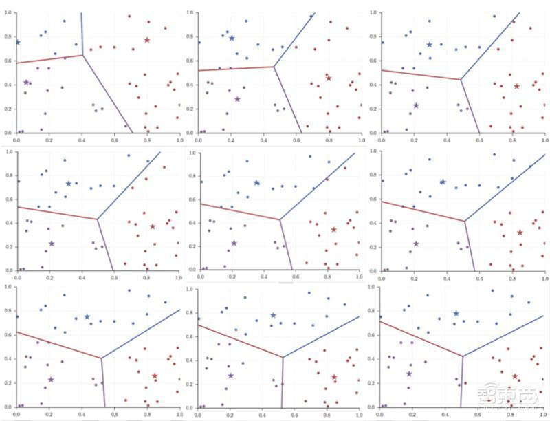
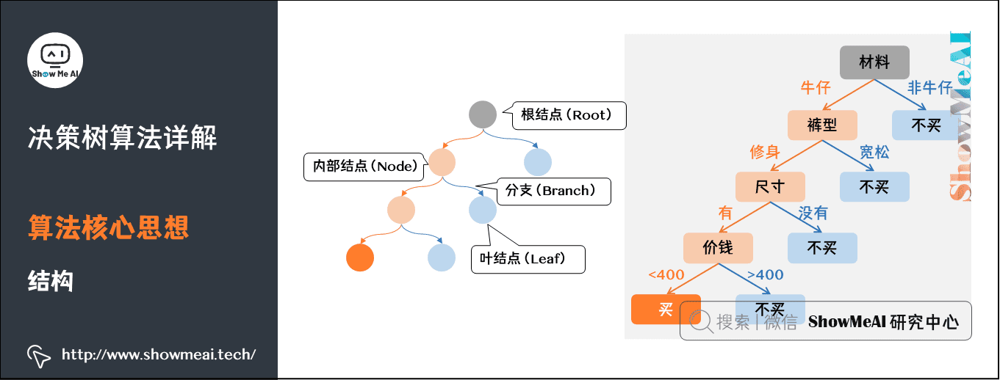
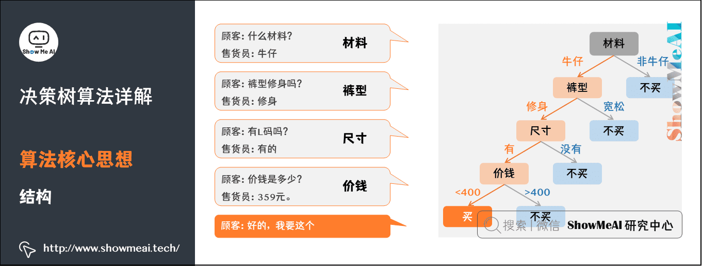
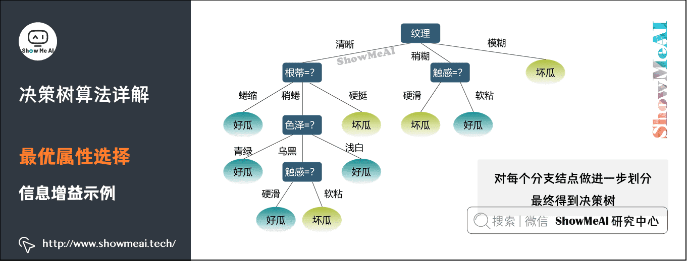

## 机器学习中常见的 : 非监督学习 & 监督学习    
                                
### 作者                                
digoal                                
                                
### 日期                                
2023-02-27                              
                                
### 标签                                
PostgreSQL , PolarDB , 机器学习 , 非监督学习 , 监督学习 , madlib               
                                
----                                
                                
## 背景       
    
## 人工智能与数据挖掘    
    
https://zhuanlan.zhihu.com/p/56957787    
    
数据挖掘从一个新的视角将数据库技术、统计学、机器学习、信息检索技术、数据可视化和模式识别与人工智能等领域有机结合起来，它组合了各个领域的优点，因而能从数据中挖掘到运用其他传统方法不能发现的有用知识。    
    
一般来说，统计特征只能反映数据的极少量信息。简单的统计分析可以帮助我们了解数据，如果希望对大数据进行逐个地、更深层次地探索，总结出规律和模型，则需要更加智能的基于机器学习的数据分析方法。    
    
所谓“机器学习”，是基于数据本身的，自动构建解决问题的规则与方法。数据挖掘中既可以用到非监督学习方法，也可以用到监督学习方法。    
    
### 1、非监督学习    
    
非监督学习是建立在所有数据的标签，即所属的类别都是未知的情况下使用的分类方法。对于特定的一组数据，不知道这些数据应该分为哪几类，也不知道这些类别本来应该有怎样的特征，只知道每个数据的特征向量。若按它们的相关程度分成很多类，最先想到的想法就是认为特征空间中距离较近的向量之间也较为相关，倘若一个元素只和其中某些元素比较接近，和另一些元素则相距较远。    
    
这时候，我们就希望每一个类有一个“中心”，“中心”也是特征向量空间中的向量，是所有那一类的元素在向量空间上的重心，即他的每一维为所有包含在这一类中的元素的那一维的平均值。如果每一类都有这么一个“中心”，那么我们在分类数据时，只需要看他离哪个“中心”的距离最近，就将他分到该类即可，这也就是K-means算法的思路。    
    
K-means算法，在1957年由Stuart Lloyd在贝尔实验室提出，最初用于解决连续的图区域划分问题，1982年正式发表。1965年，E.W.Forgy发明了Lloyd-Forgy or。James MacQueen在1967年将其命名为K-means算法。    
    
      
    
上图是以随机生成的数据点为例，k=3的K-means算法的迭代过程，其中五角星为聚类中心，点的颜色是其类别。在实际应用中，为了获得一个比较好的特征空间，使得“数据之间的相似性与他们在特征空间上的距离有关，距离越近越相似”这句话尽可能成立，我们往往会构建模型来把原数据变换到这么一个特征空间，然后使用K-means算法来进行分类。    
    
### 2、监督学习    
    
不同于非监督学习，若已知一些数据上的真实分类情况，现在要对新的未知的数据进行分类。这时候利用已知的分类信息，可以得到一些更精确的分类方法，这些就是监督学习方法。    
  
监督学习通常有训练集和测试集, 训练集用于训练生成模型, 测试集校验生成模型的准确率.    
  
https://www.showmeai.tech/article-detail/185  
  
  
      
#### 1）决策树模型    
    
所谓决策树，即是一种根据条件来进行判断的逻辑框架。其中，判断的条件，即提出有区分性的问题，以及对于不同的回答下一步的反映，以及最终的决策给出标签。    
    
决策树是一种预测模型，代表的是对象属性与对象值之间的映射关系。决策树是一种树形结构，其中：    
- 每个内部结点表示一个属性的测试    
- 每个分支表示一个测试输出    
- 每个叶结点代表一种类别    
    
      
    
以买衣服为例，一个顾客在商店买裤子，于是有了下面的对话：第一个「内部结点」对应于属性「材料」上的测试，两个分支分别是该属性取值为「牛仔」和「非牛仔」两种可能结果。当取值为「牛仔」时，则对下个属性「裤型」进行测试；若取值为「非牛仔」时，则对应于「叶结点」——「不买」。    
    
      
    
决策树算法：    
    
1.选取包含所有数据的全集为算法的初始集合A0：    
    
2.对于当前的集合A，计算所有可能的“问题”在训练集上的F（A,D）：    
    
3.选择F（A,D）最大的“问题”，对数据进行提问，将当前的集合由“问题”的不同回答，划分为数个子集；    
    
4.对每个子集，重复b、c，直到所有子集内所有元素的类别相同；    
    
5.在实际应用中，数据往往有很多特征，因此，“问题”往往是选取数据的某一特征，而“回答”则是此特征对应的值。    
    
在决策树中，效度函数F（A,D）的选择非常重要。决策树的发展历史，也基本是围绕着F（A,D）的优化而展开。    
    
      
    
#### 2）kNN算法    
    
只知道每个数据在特征空间下的特征向量情况下，可以对数据采用无监督分类方法K-means。如果我们拥有了其中一部分数据的标签，我们就可以利用这些标签进行kNN分类。    
    
数据之间的相似性与他们在特征空间上的距离有关。距离越近越相似，越可能拥有相同的标签。    
    
假设我们已经有了很多既知道特征向量也知道具体标签的数据对于新的只知道特征向量却不知道具体标签的数据，我们可以选取离这个特征向量最近的k个已经知道标签的数据，然后选取他们中间最多的元素所属于的那个标签，作为新数据的预测标签。也可以根据他们与新数据的特征向量之间的距离加权（如最近得5分，第二近得4分等），取权重总和最大的标签作为预测标签。    
    
kNN算法不需要构建模型或者训练，和K-means算法一样，往往是和某个构建特征空间的模型一起使用。    
    
此外，还有回归分类、神经网络、朴素贝叶斯分类等等。    
    
    
    
## 图解机器学习 | 决策树模型详解    
    
https://www.showmeai.tech/article-detail/190    
    
## madlib 相关    
madlib是PG的机器学习库, 接口非常丰富, 以下列举了本文提到的几个接口. madlib也可以结合PolarDB使用:        
[《配置 madlib for PolarDB 实现数据库机器学习功能》](../202212/20221202_03.md)  
    
k-means 非监督学习接口:    
- https://madlib.apache.org/docs/latest/group__grp__kmeans.html    
    
kNN 监督学习接口:    
- https://madlib.apache.org/docs/latest/group__grp__knn.html    
    
决策树监督学习接口:    
- https://madlib.apache.org/docs/latest/group__grp__decision__tree.html    
    
    
  
#### [期望 PostgreSQL|开源PolarDB 增加什么功能?](https://github.com/digoal/blog/issues/76 "269ac3d1c492e938c0191101c7238216")
  
  
#### [PolarDB 云原生分布式开源数据库](https://github.com/ApsaraDB "57258f76c37864c6e6d23383d05714ea")
  
  
#### [PolarDB 学习图谱: 训练营、培训认证、在线互动实验、解决方案、内核开发公开课、生态合作、写心得拿奖品](https://www.aliyun.com/database/openpolardb/activity "8642f60e04ed0c814bf9cb9677976bd4")
  
  
#### [PostgreSQL 解决方案集合](../201706/20170601_02.md "40cff096e9ed7122c512b35d8561d9c8")
  
  
#### [德哥 / digoal's github - 公益是一辈子的事.](https://github.com/digoal/blog/blob/master/README.md "22709685feb7cab07d30f30387f0a9ae")
  
  

  
  
#### [购买PolarDB云服务折扣活动进行中, 55元起](https://www.aliyun.com/activity/new/polardb-yunparter?userCode=bsb3t4al "e0495c413bedacabb75ff1e880be465a")
  
  
#### [About 德哥](https://github.com/digoal/blog/blob/master/me/readme.md "a37735981e7704886ffd590565582dd0")
  
