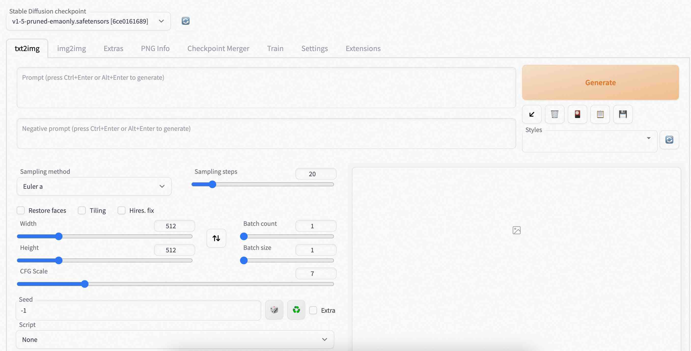

## 在debian中部署"人工智能生成内容"(Artificial Intelligence Generated Content,简称 AIGC)      
                                                              
### 作者                                        
digoal                                        
                                        
### 日期                                        
2023-03-06                                     
                              
### 标签                                        
PostgreSQL , PolarDB , aigc , macOS , debian , docker     
                                        
----                                        
                                        
## 背景      
素材是吸引流量的关键, 最近看到一些UP主的内容(例如西瓜视频的: 思想史万有引力, B站海哥: 唠点历史), 每一集视频都包含了大量符合内容的精美图片, 制作内容一定话费了很多时间. 而使用AIGC生成图片可以帮助UP主缩短大量制作时间.    
  
大家可以通过云起实验免费体验AIGC: https://developer.aliyun.com/adc/scenario/13c7c3f7e06042578862c25b6ce12a80  
  
也可以跟着本文, 在macOS中的debian 容器中部署aigc环境, 体验AI生成图片的功能.    
  
人工智能生成内容（Artificial Intelligence Generated Content，简称 AIGC）是当下最火的概念之一。AIGC 被认为是继专业生成内容（Professional Generated Content, PGC）和用户生成内容（User Generated Content, UGC）之后，利用人工智能技术自动生成内容的新型生产方式。  
  
AI 生成内容的形式相当丰富，除了文字外，还可以进行绘画、作曲、演唱、编剧、设计等。最近热度非常高的 Text to Image 就是 AI 加持下非常时髦的一种图片创造方式。看看下面这些图片，你一定很难想象它们都是 AI 生成的吧。  
  
许多人可能觉得，使用 AIGC 有很高的门槛，普通人是很难入门的。其实不然，随着 AI 技术的快速发展以及众多开源项目的诞生，我们每个人都可以很轻松且廉价的使用到 AIGC。谁能想到，在 2018 年，人工智能生成的画作在佳士得拍卖价还高达 43.25 万美元，而时隔才数年，让 AI 为我们创作绘画已经成了人人触手可及的事情。  
  
在这些开源项目中，Stable Diffusion 无疑是优秀生之一。Stable Diffusion 是一种扩散模型（Diffusion Model）的变体，称为“潜在扩散模型”（Latent Diffusion Model），由CompVis、Stability AI 和 LAION 的研究人员和工程师创建。它使用来自 LAION-5B 数据库子集的图像进行训练。使用这个模型，可以生成包括人脸在内的任何图像，因为有开源的预训练模型，所以我们也可以在自己的机器上运行它。Stable Diffusion 能够根据我们提供的一些提示词以及可以调整的部分参数，通过模型计算生成一张不错的图片。  
  
以下是baipiao的一份 Stable Diffusion 的上手教程，分享给大家。这其中包括了 Stable Diffusion 的安装和基本使用方法，以及使用 Lora 模型调整图片生成的风格。这是一项接近零基础的教程，其中并不会包含复杂的概念或者深奥的算法。换句话说，只要你稍有计算机基础，了解如何敲入命令，知道怎么使用浏览器打开网页，你就能很轻松的学会。  
    
Stable Diffusion 是一个 Python 命令行程序，我们直接使用需要对它的命令和参数有详尽的了解，有一定学习成本。  
  
https://github.com/CompVis/stable-diffusion  
  
好在，有一个 Stable Diffusion WebUI 的开源项目，可以直接将 Stable Diffusion 的操作通过网页透出，让我们轻松通过 Web 页面就能使用 Stable Diffusion 生成图片。  
  
https://github.com/AUTOMATIC1111/stable-diffusion-webui    
   
另一个推荐的现成服务:   https://huggingface.co/    
  
## 在macOS中的debian 容器中部署AIGC环境  
1、下载debian容器镜像, 可以参考:  
  
[《Debian学习入门 - (作为服务器使用, Debian 操作系统可能是长期更好的选择?)》](../202302/20230217_02.md)    
  
  
```    
docker pull debian:stable    
      
IT-C02YW2EFLVDL:~ digoal$ docker images    
REPOSITORY                          TAG       IMAGE ID       CREATED        SIZE    
debian                              stable    046baf13c189   10 days ago    124MB    
```    
    
2、启动并进入容器,  Stable Diffusion WebUI会启动端口 7860 , 所以可以在创建容器是设置一下映射.   
    
```    
docker run -d -it --cap-add=SYS_PTRACE --privileged=true -p 7860:7860 --name aigc debian:stable     
      
docker exec -it -u root --privileged -w /root aigc /bin/bash      
```    
  
3、将软件包仓库地址替换为国内镜像    
    
一般情况下，将 `/etc/apt/sources.list` 文件中Debian默认的软件仓库地址和安全更新仓库地址修改为国内的镜像地址即可，比如将 `deb.debian.org` 和 `security.debian.org` 改为 `mirrors.xxx.com` ，并使用 `https` 访问，可使用如下命令：    
      
```    
// 先替换为http.  
root@9b780f5ea2e8:~# cp /etc/apt/sources.list /etc/apt/sources.list.bak     
  
sed -i "s@http://\(deb\|security\).debian.org@http://mirrors.aliyun.com@g" /etc/apt/sources.list    
    
// 刷新apt缓存, 便于安装新的包.   
  
apt update    
  
// 安装ca-certificates   
  
apt-get reinstall apt-transport-https ca-certificates     
    
// 替换为https  
sed -i "s@http://mirrors.aliyun.com@https://mirrors.aliyun.com@g" /etc/apt/sources.list    
```    
  
4、安装一些常用开发者工具    
    
```  
apt install -y git libreadline-dev libedit-dev g++ make cmake man-db vim dnsutils libssl-dev curl   
```  
    
  
5、Stable Diffusion WebUI 的安装与运行需要使用到一些工具软件, 例如conda    
  
https://repo.anaconda.com/archive/  
  
https://tecadmin.net/how-to-install-anaconda-on-debian-11/  
  
https://www.yundongfang.com/Yun71085.html  
  
```  
curl --output anaconda.sh https://repo.anaconda.com/archive/Anaconda3-2022.10-Linux-x86_64.sh  
  
bash anaconda.sh  
  
  
// 配置  
by running conda init? [yes|no]  
[no] >>> yes  
modified      /root/anaconda3/condabin/conda  
modified      /root/anaconda3/bin/conda  
modified      /root/anaconda3/bin/conda-env  
no change     /root/anaconda3/bin/activate  
no change     /root/anaconda3/bin/deactivate  
no change     /root/anaconda3/etc/profile.d/conda.sh  
no change     /root/anaconda3/etc/fish/conf.d/conda.fish  
no change     /root/anaconda3/shell/condabin/Conda.psm1  
no change     /root/anaconda3/shell/condabin/conda-hook.ps1  
no change     /root/anaconda3/lib/python3.9/site-packages/xontrib/conda.xsh  
no change     /root/anaconda3/etc/profile.d/conda.csh  
modified      /root/.bashrc  
  
==> For changes to take effect, close and re-open your current shell. <==  
  
If you'd prefer that conda's base environment not be activated on startup,   
   set the auto_activate_base parameter to false:   
  
conda config --set auto_activate_base false  
  
Thank you for installing Anaconda3!  
  
// 自动进入conda环境  
root@887062b1acbf:~# . ./.bashrc  
(base) root@887062b1acbf:~#   
```  
  
6、安装 mesa 3d graphics library  
  
https://mesa3d.org/  
  
```  
apt install -y libgl1-mesa-dev libglib2.0-dev    
```  
  
7、初始化 conda aigc 环境, 之后的操作都将基于 aigc 这个虚拟环境  
  
```  
conda create -y -n aigc python=3.10.6  
```  
  
  
```  
# To activate this environment, use  
#  
#     $ conda activate aigc  
#  
# To deactivate an active environment, use  
#  
#     $ conda deactivate  
```  
  
```  
// 进入aigc 虚拟环境  
(base) root@887062b1acbf:~# conda activate aigc  
(aigc) root@887062b1acbf:~#   
```  
  
注意：之后的操作都将基于 aigc 这个虚拟环境，如果你切换了 Terminal 或者不小心退出了环境，可以再次使用 `conda activate aigc` 回到 aigc 虚拟环境中。  
  
```  
可以写入bashrc, 每次进入debian容器都会自动进入aigc conda环境  
  
vi ~/.bashrc  
# appended by digoal  
conda activate aigc   
```  
  
  
8、拉取 Stable Diffusion WebUI 代码:   
  
```  
git clone --depth 1 https://github.com/AUTOMATIC1111/stable-diffusion-webui.git  
  
  
cd stable-diffusion-webui  
```  
  
9、安装项目依赖  
  
Stable Diffusion 的运行还需要许多依赖包，通过下面的命令可以把它们都安装到 Conda 提供的虚拟环境中。  
  
```  
conda install -y pytorch torchvision torchaudio cpuonly -c pytorch  
pip3 install opencv-python-headless gfpgan open-clip-torch xformers pyngrok clip-anytorch  
pip3 install -r requirements_versions.txt  
```  
  
10、启动 Stable Diffusion WebUI   
  
当一切准备就绪，我们可以使用以下命令启动 Stable Diffusion WebUI。  
  
```  
python launch.py --listen --lowvram --no-half --skip-torch-cuda-test   
```  
  
  
在启动时，Stable Diffusion WebUI 会根据需要下载一些必要模型数据，另外，加载模型也需要花费一些时间，所以我们现在要做的就是耐心等待。当 Terminal 中显示出 `Running on local URL:  http://0.0.0.0:7860` 字样，就表示程序已经启动并对外提供服务了。  
  
  
```  
Python 3.10.6 (main, Oct 24 2022, 16:07:47) [GCC 11.2.0]  
Commit hash: 0cc0ee1bcb4c24a8c9715f66cede06601bfc00c8  
Cloning Stable Diffusion into repositories/stable-diffusion-stability-ai...  
Cloning Taming Transformers into repositories/taming-transformers...  
Cloning K-diffusion into repositories/k-diffusion...  
Cloning CodeFormer into repositories/CodeFormer...  
Cloning BLIP into repositories/BLIP...  
Installing requirements for CodeFormer  
Installing requirements for Web UI  
Launching Web UI with arguments: --listen --lowvram --no-half  
Warning: caught exception 'Torch not compiled with CUDA enabled', memory monitor disabled  
No module 'xformers'. Proceeding without it.  
```  
  
  
11、使用 Stable Diffusion WebUI 生成图片  
  
当 Stable Diffusion WebUI 启动后，会对外监听 7860 端口。在宿主机使用  `http://localhost:7860`  来访问程序。  
  
     
  
12、使用文字生成图片  
  
生成图片的操作方式非常简单，只需要在左侧的 Prompt 输出框中填入提示词，之后点击右侧的 Generate 按钮即可。提示词就是生成图片的依据，既可以是描述需要生成内容的词，如：girl, sunset, forest 等；也可以是用于是描述图像属性的词，如：best quality, beautiful, masterpiece 等。我们甚至可以通过提示词选择图片生成的视角、光线、画风；人物的姿势、着装、表情；背景的内容等。  
  
  
图片生成的速度根据机器配置的不同有所差异。在图片生成的过程中，我们可以在页面上看到生成过程的中间图片逐渐变得清晰。同时，也可以通过进度条直观的了解图片生成的进度和预估剩余时间。  
  
  
13、学习使用 LoRA 模型  
  
除了使用基础模型生成图片外，我们还可以使用 LoRA 模型（Low-Rank Adaptation of Large Language Models）进行图片的生成。LoRA 直译为大语言模型的低阶适应，这是微软的研究人员为了解决大语言模型微调而开发的一项技术。LoRA 能够冻结预训练好的模型权重参数，然后在每个 Transformer 块里注入可训练的层，由于不需要对模型的权重参数重新计算梯度，从而大大减少了需要训练的计算量。从实际效果来说，LoRA 模型可以帮助我们生成指定风格、面孔、动作等要求的图片。  
  
14、使用 LoRA 模型  
打开 WebUI 界面，点击 Generate 按钮下方的 扩展配置图标按钮，之后选择 Lora 标签，就能看到我们可以使用的 LoRA 模型了。  
  
  
在文末提到的云起实验场景中，已经准备了数个比较热门的 LoRA 模型，你可以尝试使用它们生成不同风格的图片。  
  
我们在macOS debian安装的环境没有准备lora模型, 需要自己安装.   
  
```  
Nothing here. Add some content to the following directories:  
/root/stable-diffusion-webui/models/Lora  
```  
  
当我们点击某个 LoRA 模型后，Prompt 中会加入 `<lora:模型名的格式:数字>` 这些内容。最后的数字代表着 LoRA 模型的权重，默认为 1。接着，我们输入提示词，再点击 Generate 按钮，就可以使用 LoRA 模型将文字转化为图片了。  
  
例如:    
  
```  
<lora:1MbLORATrainedIn5MinsThatDoes_1:1> one women with wavy hair and detailed alluring eyes  
```  
  
  
15、获得更多的 LoRA 模型  
  
如果觉得现有的 LoRA 模型还不符合自己的审美，我们可以从 Civitai https://civitai.com/tag/lora 等网站里找到许多其他爱好者预先训练好的 LoRA 模型，我们只需要将这些模型下载到 `stable-diffusion-webui/models/Lora` 目录内（需要放置在上面提示的 `/root/stable-diffusion-webui/models/Lora` 目录内），接着我们就可以在 Stable Diffusion WebUI 中使用它们。如果是新下载的模型没有出现在页面上，可以点击 Refresh 按钮重新载入它们。  
  
  
如果还不会，你还能在如下云起实验室再次体验这个场景哦！如下:    
  
https://developer.aliyun.com/adc/scenario/13c7c3f7e06042578862c25b6ce12a80  
  
  
16、其他问题  
  
例如dns可能要配置为`8.8.8.8`  
  
https://zhuanlan.zhihu.com/p/571519560  
  
17、更多launch参数:   
  
```
(aigc) root@887062b1acbf:~/stable-diffusion-webui# python launch.py --skip-torch-cuda-test -h    
Python 3.10.6 (main, Oct 24 2022, 16:07:47) [GCC 11.2.0]
Commit hash: 0cc0ee1bcb4c24a8c9715f66cede06601bfc00c8
Installing requirements for Web UI
Launching Web UI with arguments: -h
usage: launch.py [-h] [--data-dir DATA_DIR] [--config CONFIG] [--ckpt CKPT] [--ckpt-dir CKPT_DIR] [--vae-dir VAE_DIR] [--gfpgan-dir GFPGAN_DIR] [--gfpgan-model GFPGAN_MODEL] [--no-half]
                 [--no-half-vae] [--no-progressbar-hiding] [--max-batch-count MAX_BATCH_COUNT] [--embeddings-dir EMBEDDINGS_DIR] [--textual-inversion-templates-dir TEXTUAL_INVERSION_TEMPLATES_DIR]
                 [--hypernetwork-dir HYPERNETWORK_DIR] [--localizations-dir LOCALIZATIONS_DIR] [--allow-code] [--medvram] [--lowvram] [--lowram] [--always-batch-cond-uncond] [--unload-gfpgan]
                 [--precision {full,autocast}] [--upcast-sampling] [--share] [--ngrok NGROK] [--ngrok-region NGROK_REGION] [--enable-insecure-extension-access]
                 [--codeformer-models-path CODEFORMER_MODELS_PATH] [--gfpgan-models-path GFPGAN_MODELS_PATH] [--esrgan-models-path ESRGAN_MODELS_PATH] [--bsrgan-models-path BSRGAN_MODELS_PATH]
                 [--realesrgan-models-path REALESRGAN_MODELS_PATH] [--clip-models-path CLIP_MODELS_PATH] [--xformers] [--force-enable-xformers] [--xformers-flash-attention] [--deepdanbooru]
                 [--opt-split-attention] [--opt-sub-quad-attention] [--sub-quad-q-chunk-size SUB_QUAD_Q_CHUNK_SIZE] [--sub-quad-kv-chunk-size SUB_QUAD_KV_CHUNK_SIZE]
                 [--sub-quad-chunk-threshold SUB_QUAD_CHUNK_THRESHOLD] [--opt-split-attention-invokeai] [--opt-split-attention-v1] [--disable-opt-split-attention] [--disable-nan-check]
                 [--use-cpu USE_CPU [USE_CPU ...]] [--listen] [--port PORT] [--show-negative-prompt] [--ui-config-file UI_CONFIG_FILE] [--hide-ui-dir-config] [--freeze-settings]
                 [--ui-settings-file UI_SETTINGS_FILE] [--gradio-debug] [--gradio-auth GRADIO_AUTH] [--gradio-auth-path GRADIO_AUTH_PATH] [--gradio-img2img-tool GRADIO_IMG2IMG_TOOL]
                 [--gradio-inpaint-tool GRADIO_INPAINT_TOOL] [--opt-channelslast] [--styles-file STYLES_FILE] [--autolaunch] [--theme THEME] [--use-textbox-seed] [--disable-console-progressbars]
                 [--enable-console-prompts] [--vae-path VAE_PATH] [--disable-safe-unpickle] [--api] [--api-auth API_AUTH] [--api-log] [--nowebui] [--ui-debug-mode] [--device-id DEVICE_ID]
                 [--administrator] [--cors-allow-origins CORS_ALLOW_ORIGINS] [--cors-allow-origins-regex CORS_ALLOW_ORIGINS_REGEX] [--tls-keyfile TLS_KEYFILE] [--tls-certfile TLS_CERTFILE]
                 [--server-name SERVER_NAME] [--gradio-queue] [--skip-version-check] [--no-hashing] [--no-download-sd-model] [--ldsr-models-path LDSR_MODELS_PATH] [--lora-dir LORA_DIR]
                 [--scunet-models-path SCUNET_MODELS_PATH] [--swinir-models-path SWINIR_MODELS_PATH]

options:
  -h, --help            show this help message and exit
  --data-dir DATA_DIR   base path where all user data is stored
  --config CONFIG       path to config which constructs model
  --ckpt CKPT           path to checkpoint of stable diffusion model; if specified, this checkpoint will be added to the list of checkpoints and loaded
  --ckpt-dir CKPT_DIR   Path to directory with stable diffusion checkpoints
  --vae-dir VAE_DIR     Path to directory with VAE files
  --gfpgan-dir GFPGAN_DIR
                        GFPGAN directory
  --gfpgan-model GFPGAN_MODEL
                        GFPGAN model file name
  --no-half             do not switch the model to 16-bit floats
  --no-half-vae         do not switch the VAE model to 16-bit floats
  --no-progressbar-hiding
                        do not hide progressbar in gradio UI (we hide it because it slows down ML if you have hardware acceleration in browser)
  --max-batch-count MAX_BATCH_COUNT
                        maximum batch count value for the UI
  --embeddings-dir EMBEDDINGS_DIR
                        embeddings directory for textual inversion (default: embeddings)
  --textual-inversion-templates-dir TEXTUAL_INVERSION_TEMPLATES_DIR
                        directory with textual inversion templates
  --hypernetwork-dir HYPERNETWORK_DIR
                        hypernetwork directory
  --localizations-dir LOCALIZATIONS_DIR
                        localizations directory
  --allow-code          allow custom script execution from webui
  --medvram             enable stable diffusion model optimizations for sacrificing a little speed for low VRM usage
  --lowvram             enable stable diffusion model optimizations for sacrificing a lot of speed for very low VRM usage
  --lowram              load stable diffusion checkpoint weights to VRAM instead of RAM
  --always-batch-cond-uncond
                        disables cond/uncond batching that is enabled to save memory with --medvram or --lowvram
  --unload-gfpgan       does not do anything.
  --precision {full,autocast}
                        evaluate at this precision
  --upcast-sampling     upcast sampling. No effect with --no-half. Usually produces similar results to --no-half with better performance while using less memory.
  --share               use share=True for gradio and make the UI accessible through their site
  --ngrok NGROK         ngrok authtoken, alternative to gradio --share
  --ngrok-region NGROK_REGION
                        The region in which ngrok should start.
  --enable-insecure-extension-access
                        enable extensions tab regardless of other options
  --codeformer-models-path CODEFORMER_MODELS_PATH
                        Path to directory with codeformer model file(s).
  --gfpgan-models-path GFPGAN_MODELS_PATH
                        Path to directory with GFPGAN model file(s).
  --esrgan-models-path ESRGAN_MODELS_PATH
                        Path to directory with ESRGAN model file(s).
  --bsrgan-models-path BSRGAN_MODELS_PATH
                        Path to directory with BSRGAN model file(s).
  --realesrgan-models-path REALESRGAN_MODELS_PATH
                        Path to directory with RealESRGAN model file(s).
  --clip-models-path CLIP_MODELS_PATH
                        Path to directory with CLIP model file(s).
  --xformers            enable xformers for cross attention layers
  --force-enable-xformers
                        enable xformers for cross attention layers regardless of whether the checking code thinks you can run it; do not make bug reports if this fails to work
  --xformers-flash-attention
                        enable xformers with Flash Attention to improve reproducibility (supported for SD2.x or variant only)
  --deepdanbooru        does not do anything
  --opt-split-attention
                        force-enables Doggettx's cross-attention layer optimization. By default, it's on for torch cuda.
  --opt-sub-quad-attention
                        enable memory efficient sub-quadratic cross-attention layer optimization
  --sub-quad-q-chunk-size SUB_QUAD_Q_CHUNK_SIZE
                        query chunk size for the sub-quadratic cross-attention layer optimization to use
  --sub-quad-kv-chunk-size SUB_QUAD_KV_CHUNK_SIZE
                        kv chunk size for the sub-quadratic cross-attention layer optimization to use
  --sub-quad-chunk-threshold SUB_QUAD_CHUNK_THRESHOLD
                        the percentage of VRAM threshold for the sub-quadratic cross-attention layer optimization to use chunking
  --opt-split-attention-invokeai
                        force-enables InvokeAI's cross-attention layer optimization. By default, it's on when cuda is unavailable.
  --opt-split-attention-v1
                        enable older version of split attention optimization that does not consume all the VRAM it can find
  --disable-opt-split-attention
                        force-disables cross-attention layer optimization
  --disable-nan-check   do not check if produced images/latent spaces have nans; useful for running without a checkpoint in CI
  --use-cpu USE_CPU [USE_CPU ...]
                        use CPU as torch device for specified modules
  --listen              launch gradio with 0.0.0.0 as server name, allowing to respond to network requests
  --port PORT           launch gradio with given server port, you need root/admin rights for ports < 1024, defaults to 7860 if available
  --show-negative-prompt
                        does not do anything
  --ui-config-file UI_CONFIG_FILE
                        filename to use for ui configuration
  --hide-ui-dir-config  hide directory configuration from webui
  --freeze-settings     disable editing settings
  --ui-settings-file UI_SETTINGS_FILE
                        filename to use for ui settings
  --gradio-debug        launch gradio with --debug option
  --gradio-auth GRADIO_AUTH
                        set gradio authentication like "username:password"; or comma-delimit multiple like "u1:p1,u2:p2,u3:p3"
  --gradio-auth-path GRADIO_AUTH_PATH
                        set gradio authentication file path ex. "/path/to/auth/file" same auth format as --gradio-auth
  --gradio-img2img-tool GRADIO_IMG2IMG_TOOL
                        does not do anything
  --gradio-inpaint-tool GRADIO_INPAINT_TOOL
                        does not do anything
  --opt-channelslast    change memory type for stable diffusion to channels last
  --styles-file STYLES_FILE
                        filename to use for styles
  --autolaunch          open the webui URL in the system's default browser upon launch
  --theme THEME         launches the UI with light or dark theme
  --use-textbox-seed    use textbox for seeds in UI (no up/down, but possible to input long seeds)
  --disable-console-progressbars
                        do not output progressbars to console
  --enable-console-prompts
                        print prompts to console when generating with txt2img and img2img
  --vae-path VAE_PATH   Checkpoint to use as VAE; setting this argument disables all settings related to VAE
  --disable-safe-unpickle
                        disable checking pytorch models for malicious code
  --api                 use api=True to launch the API together with the webui (use --nowebui instead for only the API)
  --api-auth API_AUTH   Set authentication for API like "username:password"; or comma-delimit multiple like "u1:p1,u2:p2,u3:p3"
  --api-log             use api-log=True to enable logging of all API requests
  --nowebui             use api=True to launch the API instead of the webui
  --ui-debug-mode       Don't load model to quickly launch UI
  --device-id DEVICE_ID
                        Select the default CUDA device to use (export CUDA_VISIBLE_DEVICES=0,1,etc might be needed before)
  --administrator       Administrator rights
  --cors-allow-origins CORS_ALLOW_ORIGINS
                        Allowed CORS origin(s) in the form of a comma-separated list (no spaces)
  --cors-allow-origins-regex CORS_ALLOW_ORIGINS_REGEX
                        Allowed CORS origin(s) in the form of a single regular expression
  --tls-keyfile TLS_KEYFILE
                        Partially enables TLS, requires --tls-certfile to fully function
  --tls-certfile TLS_CERTFILE
                        Partially enables TLS, requires --tls-keyfile to fully function
  --server-name SERVER_NAME
                        Sets hostname of server
  --gradio-queue        Uses gradio queue; experimental option; breaks restart UI button
  --skip-version-check  Do not check versions of torch and xformers
  --no-hashing          disable sha256 hashing of checkpoints to help loading performance
  --no-download-sd-model
                        don't download SD1.5 model even if no model is found in --ckpt-dir
  --ldsr-models-path LDSR_MODELS_PATH
                        Path to directory with LDSR model file(s).
  --lora-dir LORA_DIR   Path to directory with Lora networks.
  --scunet-models-path SCUNET_MODELS_PATH
                        Path to directory with ScuNET model file(s).
  --swinir-models-path SWINIR_MODELS_PATH
                        Path to directory with SwinIR model file(s).
```
  
  
  
#### [期望 PostgreSQL|开源PolarDB 增加什么功能?](https://github.com/digoal/blog/issues/76 "269ac3d1c492e938c0191101c7238216")
  
  
#### [PolarDB 云原生分布式开源数据库](https://github.com/ApsaraDB "57258f76c37864c6e6d23383d05714ea")
  
  
#### [PolarDB 学习图谱: 训练营、培训认证、在线互动实验、解决方案、内核开发公开课、生态合作、写心得拿奖品](https://www.aliyun.com/database/openpolardb/activity "8642f60e04ed0c814bf9cb9677976bd4")
  
  
#### [PostgreSQL 解决方案集合](../201706/20170601_02.md "40cff096e9ed7122c512b35d8561d9c8")
  
  
#### [德哥 / digoal's github - 公益是一辈子的事.](https://github.com/digoal/blog/blob/master/README.md "22709685feb7cab07d30f30387f0a9ae")
  
  

  
  
#### [购买PolarDB云服务折扣活动进行中, 55元起](https://www.aliyun.com/activity/new/polardb-yunparter?userCode=bsb3t4al "e0495c413bedacabb75ff1e880be465a")
  
  
#### [About 德哥](https://github.com/digoal/blog/blob/master/me/readme.md "a37735981e7704886ffd590565582dd0")
  
