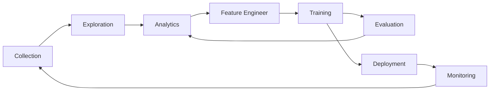

## DuckDB 存储生态: lance(向量存储引擎): Modern columnar data format for ML/超越parquet            
                                                                                  
### 作者                                                            
digoal                                                            
                                                            
### 日期                                                            
2023-03-19                                                        
                                                            
### 标签                                                            
PostgreSQL , PolarDB , duckdb , 存储 , parquet , lance , ML , 向量                             
                                                            
----                                                            
                                                            
## 背景   
向量数据库是什么?  存储向量(多维数组表示), 基于向量进行相似搜索.    
  
为什么会有向量数据库?  非结构化数据太多, 原始信息量太大, 通常需要转成特征向量进行存储.   
- 非结构化数据的搜索与标量数据搜索的最大区别是, 非结构化大多数时候是相似查询, 而结构化数据是精确查询.  
- 大多数数据库的优化器、存储、索引都是围绕精确查询、排序来设计的.   
- 为了提高向量相似查询、存储的速度, 有了向量数据库.   
  
题外话: PG也支持向量存储和搜索. 通过扩展插件, 例如vector, pase, cube.   
  
今天的主角是lance,  这算是一个适合非结构化数据存储、查询的存储引擎, 优化自parquet.   
  
lance兼容duckdb, 因为我非常喜欢duckdb的小而美, 而且未来数据库的发展方向也是在非结构化这个方向, 所以非常关注lance的发展.   
  
duckdb支持lance也使得duckdb可以进军非结构化赛道, 如果再支持gpu计算加速就更完美了.   参考pg-strom, pg是怎么进到大数据赛道的?     
  
https://github.com/eto-ai/lance  
  
与lance类似 ( 或者说生态更全面的是星爵老哥创办的 milvus. )  
  
https://milvus.io/  
  
https://github.com/milvus-io/milvus  
  
更多, 支持向量搜索（Support Vector Search）是一种高效的近似最近邻搜索算法，能够在高维空间中快速找到最近的点。以下是一些开源的支持向量搜索列存储引擎：
- Faiss：由Facebook开发的高性能相似度搜索库，支持GPU加速和多种相似度度量方式。
- Annoy：基于C++的近似最近邻搜索库，支持多种距离度量方式，适用于大规模数据集。
- NMSLIB：开源的高效相似度搜索库，支持多种距离度量方式和多种索引结构，可用于大规模数据集。
- SPTAG：微软开发的高性能相似度搜索引擎，支持多种距离度量方式和多种索引结构，适用于大规模数据集。
- Milvus：由Zilliz开发的开源向量相似度搜索引擎，支持多种距离度量方式和多种索引结构，适用于大规模数据集和分布式部署。
  
回到主角lance, 更多信息参考lance的github.   
  
<div align="center">  
<p align="center">  
   
  
  
**Modern columnar data format for ML. Convert from parquet in 2-lines of code for 100x faster random access, a vector index, data versioning, and more.<br/>**  
**Compatible with pandas, duckdb, polars, pyarrow, with more integrations on the way.**  
  
<a href="https://eto-ai.github.io/lance/">Documentation</a> •  
<a href="https://blog.eto.ai/">Blog</a> •  
<a href="https://discord.gg/zMM32dvNtd">Discord</a> •  
<a href="https://twitter.com/etodotai">Twitter</a>  
  
[CI]: https://github.com/eto-ai/lance/actions/workflows/rust.yml  
[CI Badge]: https://github.com/eto-ai/lance/actions/workflows/rust.yml/badge.svg  
[Docs]: https://eto-ai.github.io/lance/  
[Docs Badge]: https://img.shields.io/badge/docs-passing-brightgreen  
[crates.io]: https://crates.io/crates/lance  
[crates.io badge]: https://img.shields.io/crates/v/lance.svg  
[Python versions]: https://pypi.org/project/pylance/  
[Python versions badge]: https://img.shields.io/pypi/pyversions/pylance  
  
[![CI Badge]][CI]  
[![Docs Badge]][Docs]  
[![crates.io badge]][crates.io]  
[![Python versions badge]][Python versions]  
  
</p>  
</div>  
  
<hr />  
  
Lance is a modern columnar data format that is optimized for ML workflows and datasets. Lance is perfect for:  
  
1. Building search engines and features stores.  
2. Large-scale ML training requiring high performance IO and shuffles.  
3. Storing, querying, and inspecting deeply nested data for robotics or large blobs like images, point-clouds, and more.  
  
The key features of Lance include:  
  
* **High-performance random access:** 100x faster than Parquet without sacrificing scan performance.  
  
* **Vector search:** find nearest neighbors in milliseconds and combine OLAP-queries with vector search.  
  
* **Zero-copy, automatic versioning:** manage versions of your data without needing extra infrastructure.  
  
* **Ecosystem integrations:** Apache-Arrow, Pandas, Polars, DuckDB and more on the way.  
  
## Quick Start  
  
**Installation**  
  
```shell  
pip install pylance  
```  
  
**Converting to Lance**  
  
```python  
import lance  
  
import pandas as pd  
import pyarrow as pa  
import pyarrow.dataset  
  
df = pd.DataFrame({"a": [5], "b": [10]})  
uri = "/tmp/test.parquet"  
tbl = pa.Table.from_pandas(df)  
pa.dataset.write_dataset(tbl, uri, format='parquet')  
  
parquet = pa.dataset.dataset(uri, format='parquet')  
lance.write_dataset(parquet, "/tmp/test.lance")  
```  
  
**Reading Lance data**  
```python  
dataset = lance.dataset("/tmp/test.lance")  
assert isinstance(dataset, pa.dataset.Dataset)  
```  
  
**Pandas**  
```python  
df = dataset.to_table().to_pandas()  
df  
```  
  
**DuckDB**  
```python  
import duckdb  
  
# If this segfaults, make sure you have duckdb v0.7+ installed  
duckdb.query("SELECT * FROM dataset LIMIT 10").to_df()  
```  
  
**Vector search**  
  
Download the sift1m subset  
  
```shell  
wget ftp://ftp.irisa.fr/local/texmex/corpus/sift.tar.gz  
tar -xzf sift.tar.gz  
```  
  
Convert it to Lance  
  
```python  
import lance  
from lance.vector import vec_to_table  
import numpy as np  
import struct  
  
nvecs = 1000000  
ndims = 128  
with open("sift/sift_base.fvecs", mode="rb") as fobj:  
    buf = fobj.read()  
    data = np.array(struct.unpack("<128000000f", buf[4 : 4 + 4 * nvecs * ndims])).reshape((nvecs, ndims))  
    dd = dict(zip(range(nvecs), data))  
  
table = vec_to_table(dd)  
uri = "vec_data.lance"  
sift1m = lance.write_dataset(table, uri, max_rows_per_group=8192, max_rows_per_file=1024*1024)  
```  
  
Build the index  
  
```python  
sift1m.create_index("vector",  
                    index_type="IVF_PQ",   
                    num_partitions=256,  # IVF  
                    num_sub_vectors=16)  # PQ  
```  
  
Search the dataset  
  
```python  
# Get top 10 similar vectors  
import duckdb  
  
dataset = lance.dataset(uri)  
  
# Sample 100 query vectors. If this segfaults, make sure you have duckdb v0.7+ installed  
sample = duckdb.query("SELECT vector FROM dataset USING SAMPLE 100").to_df()  
query_vectors = np.array([np.array(x) for x in sample.vector])  
  
# Get nearest neighbors for all of them  
rs = [dataset.to_table(nearest={"column": "vector", "k": 10, "q": q})        
      for q in query_vectors]  
```  
  
## Directory structure  
  
| Directory          | Description              |  
|--------------------|--------------------------|  
| [rust](./rust)     | Core Rust implementation |  
| [python](./python) | Python bindings (pyo3)   |  
| [docs](./docs)     | Documentation source     |  
  
## What makes Lance different  
  
Here we will highlight a few aspects of Lance’s design. For more details, see the full [Lance design document](https://eto-ai.github.io/lance/format.html).  
  
**Vector index**: Vector index for similarity search over embedding space  
  
**Encodings**: to achieve both fast columnar scan and sub-linear point queries, Lance uses custom encodings and layouts.  
  
**Nested fields**: Lance stores each subfield as a separate column to support efficient filters like “find images where detected objects include cats”.  
  
**Versioning**: a Manifest can be used to record snapshots. Currently we support creating new versions automatically via appends, overwrites, and index creation   
  
**Fast updates** (ROADMAP): Updates will be supported via write-ahead logs.  
  
**Rich secondary indices** (ROADMAP):   
  - Inverted index for fuzzy search over many label / annotation fields  
  
## Benchmarks  
  
### Vector search  
  
We used the sift dataset to benchmark our results with 1M vectors of 128D  
  
1. For 100 randomly sampled query vectors, we get <1ms average response time (on a 2023 m2 macbook air)  
  
  
  
2. ANN is always a trade-off between recall and performance  
  
  
  
### Vs parquet  
  
We create a Lance dataset using the Oxford Pet dataset to do some preliminary performance testing of Lance as compared to Parquet and raw image/xmls. For analytics queries, Lance is 50-100x better than reading the raw metadata. For batched random access, Lance is 100x better than both parquet and raw files.  
  
  
  
## Why are you building yet another data format?!  
  
Machine Learning development cycle involves the steps:  
  

  
People use different data representations to varying stages for the performance or limited by the tooling available.  
The academia mainly uses XML / JSON for annotations and zipped images/sensors data for deep learning, which  
is difficult to integrated into data infrastructure and slow to train over cloud storage.  
While the industry uses data lake (Parquet-based techniques, i.e., Delta Lake, Iceberg) or data warehouse (AWS Redshift  
or Google BigQuery) to collect and analyze data, they have to convert the data into training-friendly formats, such  
as [Rikai](https://github.com/eto-ai/rikai)/[Petastorm](https://github.com/uber/petastorm)  
or [Tfrecord](https://www.tensorflow.org/tutorials/load_data/tfrecord).  
Multiple single-purpose data transforms, as well as syncing copies between cloud storage to local training  
instances have become a common practice among ML practices.  
  
While each of the existing data formats excel at its original designed workload, we need a new data format  
to tailored for multistage ML development cycle to reduce the fraction in tools and data silos.  
  
A comparison of different data formats in each stage of ML development cycle.  
  
|                     | Lance | Parquet & ORC | JSON & XML | Tfrecord | Database | Warehouse |  
|---------------------|-------|---------------|------------|----------|----------|-----------|  
| Analytics           | Fast  | Fast          | Slow       | Slow     | Decent   | Fast      |  
| Feature Engineering | Fast  | Fast          | Decent     | Slow     | Decent   | Good      |  
| Training            | Fast  | Decent        | Slow       | Fast     | N/A      | N/A       |  
| Exploration         | Fast  | Slow          | Fast       | Slow     | Fast     | Decent    |  
| Infra Support       | Rich  | Rich          | Decent     | Limited  | Rich     | Rich      |  
  
## Presentations and Talks  
  
* [Lance: A New Columnar Data Format](https://docs.google.com/presentation/d/1a4nAiQAkPDBtOfXFpPg7lbeDAxcNDVKgoUkw3cUs2rE/edit#slide=id.p), [Scipy 2022, Austin, TX](https://www.scipy2022.scipy.org/posters). July, 2022.  
   
  
#### [期望 PostgreSQL|开源PolarDB 增加什么功能?](https://github.com/digoal/blog/issues/76 "269ac3d1c492e938c0191101c7238216")
  
  
#### [PolarDB 云原生分布式开源数据库](https://github.com/ApsaraDB "57258f76c37864c6e6d23383d05714ea")
  
  
#### [PolarDB 学习图谱: 训练营、培训认证、在线互动实验、解决方案、内核开发公开课、生态合作、写心得拿奖品](https://www.aliyun.com/database/openpolardb/activity "8642f60e04ed0c814bf9cb9677976bd4")
  
  
#### [PostgreSQL 解决方案集合](../201706/20170601_02.md "40cff096e9ed7122c512b35d8561d9c8")
  
  
#### [德哥 / digoal's github - 公益是一辈子的事.](https://github.com/digoal/blog/blob/master/README.md "22709685feb7cab07d30f30387f0a9ae")
  
  

  
  
#### [购买PolarDB云服务折扣活动进行中, 55元起](https://www.aliyun.com/activity/new/polardb-yunparter?userCode=bsb3t4al "e0495c413bedacabb75ff1e880be465a")
  
  
#### [About 德哥](https://github.com/digoal/blog/blob/master/me/readme.md "a37735981e7704886ffd590565582dd0")
  
