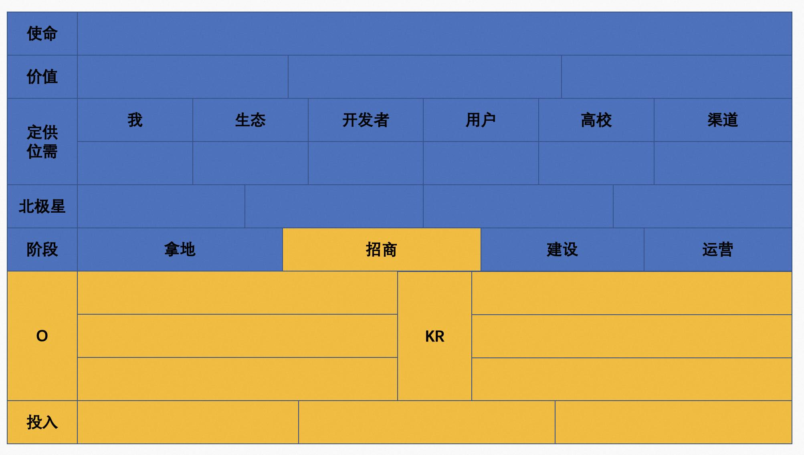

## 德说-第211期, okr 方法论: 以果决行&动态规划    
                                                                          
### 作者                                                    
digoal                                                    
                                                    
### 日期                                                    
2023-03-19                                                
                                                    
### 标签                                                    
PostgreSQL , PolarDB , okr , 以果决行 , 动态规划                   
                                                    
----                                                    
                                                    
## 背景   
什么是以果决行?  
- 你相信一个象, 这个象当然是未来的, 然后你的行为都围绕怎么实现|达到这个象而展开. 
- 例如, 你相信未来的计算和存储都会在云端, 万物互联的象.  你的行为就应该与这个象相匹配.  
   
OKR 是企业常用的 “定目标 定策略 跟踪执行过程” 的管理工具.         
  
### okr 方法论  
一句话来表达: 以果决行 & 动态规划    
  
结果|需求|目标导向:    
- [《保持 数字\需求、目标、结果导向 敏感度》](../202104/20210414_05.md)    
- [《活着要有目标 - 目标导向 要 长在肌肉里面, 深入骨髓》](../202101/20210128_04.md)    
    
### 思想工具  
- 供需连，哲科，一战略，第一性原理，正名，四看三定五明确    
  
### 智能工具  
用好AI.   
- [《德说-第208期, 如何与 ChatGPT代表的AI 合作?》](../202303/20230317_01.md)    
  
### okr 方法论实施步骤  
  
  
1、结果/大方向  
- 大O的明确叙述？    
- 类似使命愿景价值观的东西。     
  
2、正名/原则/契机/师出有名/微言大义 (出现战略分歧时, 用什么东西来进行决断)    
- 就是为什么要设置这样的大O？  
- 这个大O带来的用户价值、产业链价值、国家价值、公司价值，个人价值等。  
  
3、定位, 为什么是你来做?  
- 这个事情的参与方有哪些, 各自优势, 各自供需. (供需连)     
- 需要训练爱和奉献:   
    - [《德说-第205期, 爱是一元的》](../202303/20230312_01.md)  
    - [《德说-第127期, 人生最重要的事1: 相信爱与奉献》](../202208/20220822_01.md)  
    - [《德说-第126期, 人生最重要的事2: 定位-找回迷失在现象界的本我-完成生命的高维跃迁》](../202208/20220819_03.md)  
  
4、对“结果/大方向”进行数字化，定义度量方法。(因为没有数字，这个O就不可达。也无法说清做得好还是不好。)。  
- 用什么数字可以表达O，达成这个目的可以体现在哪些数字上。衡量标准是什么。    
  
5、目标分解.  逻辑分析，产出规划，里程碑。得到小O。     
- 分解为一个个阶段应该做到什么数字，即来自顶层的“静态规划”, 以及战略取舍(一战略, 四看三定五明确)。     
    - 目标(包括下面的OKR)需要有清晰的衡量标准(大多数时候可能是数字), 度量要清晰(例如分子、分母), 时间要明确.  这样的目标才有意义(怎么判断是否达成、什么时候要达成、达成之后的象是什么.)   [《产品经理：依存度、规模化、可度量、周期性》](../202012/20201225_02.md)  何为象?   
    - [《德说-第173期, 人生最重要的事8: 成象能力》](../202211/20221116_03.md)  
    - [《德说-第166期, 象(决定人生命运的机会)只出现一次, 就看你能不能发现 - PolarDB的象》](../202210/20221025_06.md)  
- 并与所有参与方(包括外部)的 “里程碑目标” 对齐.     
  
6、要产出什么。即将到来的阶段性 里程碑定义。  (这一步开始才到基层的财年规划.)     
- 里程碑：半年或一年？  (业务、战略、生态、组织 等维度目标)    
- 细化这个阶段的O是什么：价值是什么，用什么数字衡量。  
- 目标的合理性怎么定义?   思考. 描述清楚: 怎么判断 不足|刚好|优秀?  
  
7、要做什么。得到KR。  
- KR即实现策略是什么？做什么事情，也需要有数字。  
- KR就是O的充分必要条件。   
  
8、要投入什么。    
- 需要投入什么资源，人力，横向团队的保障等。    
  
9、风险是什么?  
  
10、风险应对预案是什么?   
  
#### 其他  
怎么定义好目标: 
- 属于哪2种类型: 承诺型，挑战型
- 属于哪3种范畴: 组织目标的承接，岗位关键职责目标，超越岗位职责目标。
- 数字化: 做到什么样是什么是优秀? 做到什么样是合格? 
  
  
### okr 动态规划 & 可观测    
先说说数据库动态规划是什么？  
- 传统优化是根据统计信息依据代价模型算出代价最低的SQL执行路径. 但是对于步骤很多, 组合很多, JOIN层级很深的SQL, 中间路径的代价估计、行评估结果的误差会逐级数量级的放大误差. 导致规划的执行路径不是最好的.    
- 动态规划的方法, 边执行, 根据执行过程的真实统计, 逐级建立后续的执行路径, 解决传统方法逐级放大的误差带来的问题.    
- [《PostgreSQL SQL动态优化器 aqo 背景论文》](../202101/20210122_02.md)    
  
从“静态okr规划”到“动态okr规划”的改进：  
- 以应对变化的世界。  
  
怎么做？  
- 建立可观测体系(定义埋点、关系、采集数据、分析、可视化等), 支持定期的复盘，类似优化器的动态规划：  
    - 实际做了什么, 预期目标是什么, 观测到的实际结果是什么，原因分析，用以修正下一步的策略。  
  
## 例子
```
copy (
select 
pgp_sym_decrypt($_$\xc30d04090302389edbafa4c1650afdd2c556015514106c714e74607d41b17a5de4ec099add7fb4bd2e3bd2d234b82efe088ad1193b75459ccc6e72202ca558e4067a4c2f7cca0f7ef612990df02ea6af3ef1e1f996321dc3659a80a64b0157eb3a49afa3ee94998b6bc318709c5a3a93365f69f108261c944c30f4f19122884448035ae8e11f7a66a9065de2a4a2358e6da999214cd48b1f0042bc447192e9fb5b10d2d6adae9977a7cdfee593d2ca12c8cafe664c3a864e6f517c67fbe757760b5737539fe653b422f5b11f6fca5f8e7d29e3905f03c7b59bbebc162addbec295b530ca93cb5f7543322b7bd6404477246a26a59e8d257eabfd0c78c3d1a879fcc50a207473f1e7a8a60e538706173c189e9c43716f8edd2217a298ec1b890a21461f918fef9d41b918ebc1c4c066b8cbf0e35adf36daf8de5503266c5c68ce328e15bd5eaddf7d795450aea64d0f0316b6abd046dd56b8eddb288f747aef125c3373887cb59a05332c2c5311d26b77d39fdd7801add607e900bb4bf2ac635391a59648d70f1b6d618ba3aeb12ce820a0f94c37d8ee07a1327757c2d2eb9f0a72270cb7db6489e179c1660b0f98bf1a1c2a440872f33c115e1bc9f82d15fb1488c337fa5743fd4dfb5a59ae89fc03f8f1745b3e77fb31c1d15c618d6a906dbe92ba4c2e01f5f6061593a9cb45375bfcd55332bd41301d75cea7f5d3cbe307d4ec2bffa5870a55c722cedf233c056d303c4dccd9871ebbd3ea591c7c47e23550b3ee204d450173f11a7c6282b82f524dc7eac42c667820949a8d93461e09723c1000da8cab65858c05a1accdab8246f8ff5dd9b2a035401194b1a4343037d5ac300891b06622882a2d27adf81ec79e748d6379aae270aa8ed872ae220a93f2b40f0e432ac8516cc7db82b90bb5ab4aa8e9f0e7b3862fcf87b5c0380e6a55e549fbcea349d0b69597d403fed70d3b5275c052adcab5e542377f6f79c780ae61a1ebb1403a4ee648f269b0e53aeb3be232b27b045f2c61abc83c87823a398af97275a44bc08febff4ec983efb84cb346a78234129925181a8faaa1fa88bb4803101cda9eee1ac95097dd1be6a023376e9b756c62f6fffb8f40e49c8ea804bf779e4f6a80a8755df696d23a557936acd1f94587cb32e9436f319c8072294e4fabf57bb2a0a18b5275b979dcdd55113a63e6a61dc195b9b152a97ebc70fc75a154935b257049c0df1352fca1473e9e8fe57ee771953107b87d8d24e02fe9c987ab4d318887a088fd466ae760158d1add654f3d8cd36b0a9add3d6903f8f5d68b236bff5115f7b13daa3f7b4f32b015c05ca6459666c879c41f39071231ba5e594c018a6b96fe8adc446ae1ed7b82b430f9d9f7bb8ca7dbc16372657e64b68c1e9bd258d4e0d1b3e7f15af0243e8039c8a3eaea2c6234953d8103807cca77f38a0990fbaa87afdb6f31e2b1bcd012877bc332aaf856480d81eb9575ca605f578865a66c367bfd36fa15cea699acba609f8d05db85c702d9cfbc8cbaa1dcfc9f3b5ef0f45767db93ae2e779e771112568a5ebb080b04792b59278f32826f34dd1b0a08d521c00cf44ecc6fe0ba8cde8fc10f317b707a40fb51af50a2c5719a7e22a36ff26470f38f73803268811a351fef4f5b28eb5da7a4263a0abf945971584b2b3920d2a63f6374b2e610bc6b6b4c9e781a75fca936639972ce5b9e35f01197dcd7ded4e8fb515f91d6fcb09941272c7f32af862a529ec938c8e52be551a0b54ae7f7dece443c57a8a712b84822a1d6c5d426c46055be722c59b4f9055f20730fd33af80039110310feccfd4847a7e1970324f7ee0e15d2a32f579b77f73942804ef2ff92dfb927e5735588f26c7ccd717f416d738c68f3e7a2c176e2a3570df47d0382c20d0f26a768ec9922f3c3178dcc490c0df4e567aa64f618845260515a3629a7645cb0338bbb8c8814f9f733041a3153b981a9ac442659b933eb9a9e6555398bae0c2bfbc3ccb3432d01102979e5cacbb3ce40f00fe0277589bad7a05b330419a37d26f22b14c7efd15df8b2a58a628b571a34beb91e522d9dc5f91c2dd244c766245bb35347fd89933e476c204c3bc896d9b6311041fc621d320d4a56bf44114f3ed42ed0bb1c1cfd6dc4553ef4c87ae6bb2bdd3fd17b6cc9aadd1ffb8e08591de680fedb92add9d8adaf1ccf4d5dcfaee259dcf1fe84eaf77cc57c310f0a0e92dfc36badb7$_$, 'z...j'
)) to stdout with csv;
```
  
  
## 参考  
[《德说-第122期, 隆中对 - 五看三定四配-华为基本法-战略制定》](../202208/20220811_02.md)    
  
[《德说-第208期, 如何与 ChatGPT代表的AI 合作?》](../202303/20230317_01.md)    
  
[《德说-第175期, 抽象一套模板, 支撑“思想、方法论、白皮书、BP”的编写》](../202211/20221119_01.md)    
  
[《德说-第151期, 什么是高质量OKR, 以及开源社区运营OKR举例》](../202209/20220929_01.md)    
  
[《德说-第145期, 人生最重要的事4: 刻意练习逻辑能力,储备命题 - 以OKR命题为例》](../202209/20220917_01.md)    
  
[《产品与运营-OKR的设计、总结、复盘、规划、组织保障和考核例子》](../202203/20220308_01.md)    
  
[《开源产品建设OKR规划、月历、进度、目标预期、效果、跟踪、复盘》](../202106/20210619_01.md)    
  
[《如何定义开源产品OKR》](../202106/20210618_03.md)    
  
[《产品OKR规划、月历、进度、目标预期、效果、跟踪、复盘》](../202106/20210618_02.md)    
    
  
#### [期望 PostgreSQL|开源PolarDB 增加什么功能?](https://github.com/digoal/blog/issues/76 "269ac3d1c492e938c0191101c7238216")
  
  
#### [PolarDB 云原生分布式开源数据库](https://github.com/ApsaraDB "57258f76c37864c6e6d23383d05714ea")
  
  
#### [PolarDB 学习图谱: 训练营、培训认证、在线互动实验、解决方案、内核开发公开课、生态合作、写心得拿奖品](https://www.aliyun.com/database/openpolardb/activity "8642f60e04ed0c814bf9cb9677976bd4")
  
  
#### [PostgreSQL 解决方案集合](../201706/20170601_02.md "40cff096e9ed7122c512b35d8561d9c8")
  
  
#### [德哥 / digoal's github - 公益是一辈子的事.](https://github.com/digoal/blog/blob/master/README.md "22709685feb7cab07d30f30387f0a9ae")
  
  

  
  
#### [购买PolarDB云服务折扣活动进行中, 55元起](https://www.aliyun.com/activity/new/polardb-yunparter?userCode=bsb3t4al "e0495c413bedacabb75ff1e880be465a")
  
  
#### [About 德哥](https://github.com/digoal/blog/blob/master/me/readme.md "a37735981e7704886ffd590565582dd0")
  
