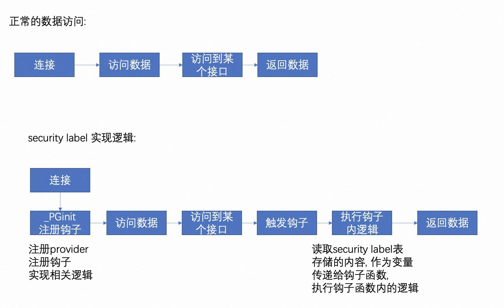

## PostgreSQL的安全场景介绍, 以及security label(安全标签功能)和两个label provider: anon, sepgsql的介绍(隐藏|加密敏感信息)  
    
### 作者    
digoal    
    
### 日期    
2023-07-07    
    
### 标签    
PostgreSQL , PolarDB , 安全 , 敏感信息 , 加密 , security label , row security policy , anon , sepgsql    
    
----    
    
## 背景    
  
## 安全场景需求介绍  
1、根据来源用户、IP限制可以访问的数据库.   
- 通过pg_hba.conf可以实现.  
  
2、根据用户限制可以访问的表、视图、函数等数据库实体对象.   
- 通过grant对象权限控制可以实现.   
  
3、根据用户限制可以访问的数据表的列范围.   
- 通过grant表相关column权限可以实现.   
  
4、不同的用户读到的数据行范围不一样.   
- 通过行级别安全策略可以实现.   
- [《PostgreSQL 行安全策略 - PostgreSQL 9.5 new feature - can define row security policy for table》](../201504/20150409_01.md)      
  
5、不同的用户读到的数据记录内容不一样. 例如a看到的是原始值, b看到的是加密后的值.  
- 通过安全标签可以实现.  https://www.postgresql.org/docs/16/sql-security-label.html  
- [《PostgreSQL 敏感信息遮掩插件 anon (Anonymizer) - security label provider - anon》](../201911/20191115_03.md)    
- [《Anonymization & Data Masking for PostgreSQL - 自动脱敏控制 - oracle data vault - postgresql-anonymizer》](../201908/20190817_03.md)    
  
## 安全标签 sql-security-label 原理  
这篇文章进行了详细的介绍: https://zhuanlan.zhihu.com/p/597950184  
  
我这里摘取一下内容:  
  
最近一段时间我都在给我们自己的系统适配PostgreSQL Anonymizer 这个插件，它基于SECURITY LABEL机制提供了数据脱敏的功能。在接下来的内容中，我将详细介绍SECURITY LABEL的实现原理以及这个插件是如何利用这个功能的。  
  
我在这篇文章中混用了role和user这两个概念，但其实role和user是不同的两个概念，role包含了user和group。具体可以阅读PG文档。  
  
### Security Label实现原理  
SECURITY LABEL是PostgreSQL（下文以PG代称）在PG11中引入的功能，它能够为一个数据库对象（object）指定Security Label。基本语法是：`SECURITY LABEL FOR provider ON object IS 'label'`。provider是可以动态加载的模块，比如说插件。label是一个字符串，由provider提供的hook来检测是否有效。label的含义完全由provider来决定，PG只是负责存储他们。  
  
PG在planner阶段会生成`SecLabelStmt`。可以看到这个结构体还是非常简单的，基本上和SQL语句中的各个部分一一对应。  
  
```  
typedef struct SecLabelStmt  
{  
    NodeTag     type;  
    ObjectType  objtype;        /* Object's type */  
    Node       *object;         /* Qualified name of the object */  
    char       *provider;       /* Label provider (or NULL) */  
    char       *label;          /* New security label to be assigned */  
} SecLabelStmt;  
```  
  
执行器部分的代码基本都在`src/backend/commands/seclabel.c`这个文件里。`ExecSecLabelStmt` 的执行思路为：先对当前用户的ownership以及其他需满足的条件做一些检查；接着调用provider提供的hook来检查label是否有效；最后调用`SetSecurityLabel`来设置security label。 下面简单讲讲`SetSecurityLabel`的执行过程：  
  
```  
void  
SetSecurityLabel(const ObjectAddress *object,  
                 const char *provider, const char *label)  
{  
    ...  
  
    // 打开存储Security Label的表  
    // 从pg_class中查询得知这个表的名称为pg_seclabel  
    pg_seclabel = table_open(SecLabelRelationId, RowExclusiveLock);   
  
    // 根据ScanKey来扫描系统表得到对应的tuple  
    scan = systable_beginscan(pg_seclabel, SecLabelObjectIndexId, true,  
                              NULL, 4, keys);  
    oldtup = systable_getnext(scan);  
  
    // 根据tuple是否为NULL以及label是否为NULL来决定采取什么操作  
    if (HeapTupleIsValid(oldtup))  
    {  
        if (label == NULL)  
            CatalogTupleDelete(pg_seclabel, &oldtup->t_self);  
        else  
        {  
            replaces[Anum_pg_seclabel_label - 1] = true;  
            newtup = heap_modify_tuple(oldtup, RelationGetDescr(pg_seclabel),  
                                       values, nulls, replaces);  
            CatalogTupleUpdate(pg_seclabel, &oldtup->t_self, newtup);  
        }  
    }  
    systable_endscan(scan);  
  
    if (newtup == NULL && label != NULL)  
    {  
        newtup = heap_form_tuple(RelationGetDescr(pg_seclabel),  
                                 values, nulls);  
        CatalogTupleInsert(pg_seclabel, newtup);  
    }  
  
    ...  
}  
```  
  
我们可以看到对于SECURITY LABEL语句，PG做的其实不多，只是提供了一个表来存储label。而label要怎么用则要看provider的功能，因此接下来我将借助PostgreSQL Anonymizer这个插件来讲解具体的使用。  
  
### PostgreSQL Anonymizer实现原理  
PostgreSQL Anonymizer是一个提供数据脱敏功能的PG插件。数据脱敏是指对某些敏感信息通过脱敏规则进行数据的变形，实现敏感隐私数据的可靠保护。这里的关键词是脱敏规则，事实上这个插件就是使用Security Label来为数据库对象指定脱敏规则，从而达到数据脱敏的效果。  
  
PostgreSQL Anonymizer提供了Anonymous Dumps, Static Masking, Dynamic Masking和Generalization四种功能。这里我仅使用Dynamic Masking来介绍Security Label的使用。所谓的Dynamic Masking说的就是将一个用户指定为"MASKED"后，这个用户读取出来的数据就是经过了数据脱敏的，而其他未被指定为"MASKED"的用户读取出来的还是原始数据。  
  
以下是测试使用的SQL语句：  
  
```  
-- 指定连接开始时要加载的共享库  
-- 注意：设置完这个参数后需要新开一个连接才会生效  
ALTER DATABASE :DBNAME SET session_preload_libraries = 'anon';  
  
-- 创建扩展并初始化  
CREATE EXTENSION IF NOT EXISTS anon CASCADE;  
SELECT anon.init();  
  
-- 创建测试使用的表  
CREATE TABLE people ( id TEXT, firstname TEXT, lastname TEXT, phone TEXT); INSERT INTO people VALUES ('T1','Sarah', 'Conor','0609110911'); SELECT * FROM people;  
  
-- 为people的列指定脱敏规则  
SECURITY LABEL FOR anon ON COLUMN people.lastname IS 'MASKED WITH FUNCTION anon.fake_last_name()';  
SECURITY LABEL FOR anon ON COLUMN people.phone IS 'MASKED WITH FUNCTION anon.partial(phone,2,$$******$$,2)';  
  
-- 创建新的用户，并将其指定为"MASKED"  
CREATE ROLE skynet LOGIN;  
SECURITY LABEL FOR anon ON ROLE skynet IS 'MASKED';  
  
-- 开始Dynamic Masking  
SELECT anon.start_dynamic_masking();  
  
-- 切换到新用户后，查看脱敏后的数据  
\c - skynet  
SELECT * FROM people;  
以下是测试结果，可以看到lastname和phone这两列已经完成了数据脱敏。  
  
dynamic_masking=> SELECT * FROM people;  
 id | firstname | lastname |   phone  
----+-----------+----------+------------  
 T1 | Sarah     | Watsica  | 06******11  
(1 row)  
```  
  
要探寻Dynamic Masking的实现原理，我们可以从测试使用的SQL语句开始。通过观察，我们发现了几个特殊的函数：`anon.init`，`anon.start_dynamic_masking`，`anon.fake_last_name`，`anon.partial`。后两者是在label里面指定的，显然它们就是所谓的脱敏规则了。由于不管使用什么脱敏规则都不会影响Dynamic Masking的基本实现原理，所以我们先关注前面两个函数。  
  
在`anon.sql`这个文件中可以找到所有和这个插件有关的函数实现。通过阅读`anon.init`的实现不难发现这个函数主要就是加载了几个后续可能会用到的表，因此这不是我们想探寻的Dynamic Masking的实现原理。  
  
我们接着来看`anon.start_dynamic_masking`的实现。在这个函数的函数体中，我们发现了下面两个语句，它们可能就和我们想探究的原理有关。  
  
```  
EXECUTE format('CREATE SCHEMA IF NOT EXISTS %I',  
                  pg_catalog.current_setting('anon.maskschema')::NAME  
  );  
  
PERFORM anon.mask_update();  
```  
  
先来看前者，它创建了一个schema。那这个schema叫什么名字呢？我们直接在psql里执行`SELECT pg_catalog.current_setting('anon.maskschema')::NAME`就知道了。  
  
```  
dynamic_masking=> select pg_catalog.current_setting('anon.maskschema')::NAME;  
 current_setting  
-----------------  
 mask  
(1 row)  
```  
  
这个叫mask的schema有什么用呢？我们暂时还不知道，不过相信我们会在后面的探索过程中发现它的真正作用。  
  
再来看看`anon.mask_update`的具体实现。我们同样在它的函数体中发现了两段有意思的语句。  
  
```  
  -- Walk through all tables in the source schema  
  -- and build a dynamic masking view  
  PERFORM anon.mask_create_view(oid)  
  FROM pg_catalog.pg_class  
  WHERE relnamespace = quote_ident(pg_catalog.current_setting('anon.sourceschema'))::REGNAMESPACE  
  AND relkind IN ('r','p','f') -- relations or partitions or foreign tables;  
  
  -- Walk through all masked roles and apply the restrictions  
  PERFORM anon.mask_role(oid::REGROLE)  
  FROM pg_catalog.pg_roles  
  WHERE anon.hasmask(oid::REGROLE);  
```  
  
看到这里我们大概就能明白了，前者就是在为原来的表创建view，后者则是在为被指定为"MASKED"的用户设置一些东西，从而让我们能从中读取到脱敏后的数据。不过为了能够完全弄清楚它的实现原理，我们继续来看`anon.mask_create_view`和`anon.mask_role`这两个函数的实现。  
  
`anon.mask_create_view`在mask这个schema下为指定的表创建view，它调用了`anon.mask_select`函数。这个函数为被创建的view构造了一个SELECT查询语句，查询语句中的表达式为`anon.mask_filters`的返回值。`anon.mask_filters`接着又调用`anon.mask_columns`来为表的各个列返回对应的脱敏函数，如果某列没有对应的脱敏函数，则返回NULL。`anon.mask_columns`会使用`anon.pg_masking_rules`来列出所有被mask了的列。从`anon.pg_masking_rules`的实现中我们不难发现它会去从`pg_seclabel`这个系统表中读取对应的`label`，这也就对应上了之前说的`SECURITY LABEL`会将`label`存在`pg_seclabel`中。  
  
我们还剩一个问题没有解决：这个插件是如何对某些特定的用户起作用的呢？这个答案就在`anon.mask_role`中。它禁止了被mask的用户读取原来的schema，而允许它读取插件创建的两个schema。并且它还设置了`search_path`这个参数，使得在mask这个schema下创建的view可以被优先读到。  
  
```  
  -- The masked role cannot read the authentic data in the source schema  
  EXECUTE format('REVOKE ALL ON SCHEMA %s FROM %s', sourceschema, maskedrole);  
  -- The masked role can use the anon schema  
  EXECUTE format('GRANT USAGE ON SCHEMA anon TO %s', maskedrole);  
  EXECUTE format('GRANT SELECT ON ALL TABLES IN SCHEMA anon TO %s', maskedrole);  
  EXECUTE format('GRANT SELECT ON ALL SEQUENCES IN SCHEMA anon TO %s', maskedrole);  
  -- The masked role can use the masking schema  
  EXECUTE format('GRANT USAGE ON SCHEMA %s TO %s', maskschema, maskedrole);  
  EXECUTE format('GRANT SELECT ON ALL TABLES IN SCHEMA %s TO %s', maskschema, maskedrole);  
  -- This is how we "trick" the masked role  
  EXECUTE format('ALTER ROLE %s SET search_path TO %s, %s;', maskedrole, maskschema,sourceschema);  
```  
  
通过简单的测试就可以验证我们的想法：  
  
```  
dynamic_masking=# \c - skynet  
You are now connected to database "dynamic_masking" as user "skynet".  
dynamic_masking=> show search_path;  
 search_path  
--------------  
 mask, public  
(1 row)  
  
dynamic_masking=> \d people;  
                View "mask.people"  
  Column   | Type | Collation | Nullable | Default  
-----------+------+-----------+----------+---------  
 id        | text |           |          |  
 firstname | text |           |          |  
 lastname  | text |           |          |  
 phone     | text |           |          |  
```  
  
在切换到skynet这个用户后，我们读取到不再是原来的那个table，而变成view了。  
  
总结一下，这个插件利用PG的`SECURITY LABEL`来存储脱敏规则，并且会在mask这个schema下为那些表创建对应的view。当切换到被指定为“MASKED”的用户时，会从mask而不是原来的public schema下读取对应的view，从而达成替换原来SQL语句的效果。  
  
## security label provider: anon  
anon 用法参考:   
- https://postgresql-anonymizer.readthedocs.io/en/latest/  
- [《PostgreSQL 敏感信息遮掩插件 anon (Anonymizer) - security label provider - anon》](../201911/20191115_03.md)    
- [《Anonymization & Data Masking for PostgreSQL - 自动脱敏控制 - oracle data vault - postgresql-anonymizer》](../201908/20190817_03.md)    
  
  
`git clone --depth 1 https://gitlab.com/dalibo/postgresql_anonymizer/ ` 
  
security label的实现逻辑如下:    
  
  
  
security label的实现核心是通过钩子加入一些执行代码, 例如将原始值进行修改, 限制权限等.     
  
以anon插件为例.  
  
使用`_PG_init`注册了几个钩子函数, 在parser analyze产生raw query tree后植入代码逻辑. 在ProcessUtility (也就是ddl, dcl等语句)后执行代码逻辑.   
  
  
```  
/*  
 * Register the extension and declare its GUC variables  
 */  
void  
_PG_init(void)  
{  
  
...  
  
  /* Install the hooks */  
  prev_post_parse_analyze_hook = post_parse_analyze_hook;  
  post_parse_analyze_hook = pa_post_parse_analyze_hook;  
  
  prev_ProcessUtility_hook = ProcessUtility_hook;  
  ProcessUtility_hook = pa_ProcessUtility_hook;  
  
  
  
  
  
/* Hook for plugins to get control at end of parse analysis */  
typedef void (*post_parse_analyze_hook_type) (ParseState *pstate,  
                                                                                          Query *query,  
                                                                                          JumbleState *jstate);  
  
  
/* Hook for plugins to get control in ProcessUtility() */  
typedef void (*ProcessUtility_hook_type) (PlannedStmt *pstmt,  
                                                                                  const char *queryString,  
                                                                                  bool readOnlyTree,  
                                                                                  ProcessUtilityContext context,  
                                                                                  ParamListInfo params,  
                                                                                  QueryEnvironment *queryEnv,  
                                                                                  DestReceiver *dest, QueryCompletion *qc);  
```  
  
anon pa_post_parse_analyze_hook钩子的逻辑:    
  
```  
/*  
 * Post-parse-analysis hook: mask query  
 * https://github.com/taminomara/psql-hooks/blob/master/Detailed.md#post_parse_analyze_hook  
 */  
static void  
#if PG_VERSION_NUM >= 140000  
pa_post_parse_analyze_hook(ParseState *pstate, Query *query, JumbleState *jstate)  
#else  
pa_post_parse_analyze_hook(ParseState *pstate, Query *query)  
#endif  
{  
  char * policy = NULL;  
  
  if (prev_post_parse_analyze_hook)  
    #if PG_VERSION_NUM >= 140000  
    prev_post_parse_analyze_hook(pstate, query, jstate);  
    #else  
    prev_post_parse_analyze_hook(pstate, query);  
    #endif  
  
  if (!IsTransactionState()) return;  
  if (!guc_anon_transparent_dynamic_masking) return;  
  
  policy = pa_get_masking_policy(GetUserId());  
  if (policy)  
    pa_rewrite(query,policy);  
  
  return;  
}  
```  
  
  
  
PostgreSQL 中post_parse_analyze_hook 钩子的植入部位:    
  
```  
/*  
 * parse_analyze_fixedparams  
 *              Analyze a raw parse tree and transform it to Query form.  
 *  
 * Optionally, information about $n parameter types can be supplied.  
 * References to $n indexes not defined by paramTypes[] are disallowed.  
 *  
 * The result is a Query node.  Optimizable statements require considerable  
 * transformation, while utility-type statements are simply hung off  
 * a dummy CMD_UTILITY Query node.  
 */  
Query *  
parse_analyze_fixedparams(RawStmt *parseTree, const char *sourceText,  
                                                  const Oid *paramTypes, int numParams,  
                                                  QueryEnvironment *queryEnv)  
{  
.......  
  
        if (post_parse_analyze_hook)  
                (*post_parse_analyze_hook) (pstate, query, jstate);  
......  
}  
```  
  
  
## security label provider: sepgsql  
  
https://www.postgresql.org/docs/16/sepgsql.html  
  
因为sepgsql这个provider用到了selinux, 所以我这里摘录了selinux的一篇比较通熟易懂的文章: https://zhuanlan.zhihu.com/p/165974960  
  
### 一、前言  
  
安全增强型 Linux（Security-Enhanced Linux）简称 SELinux，它是一个 Linux 内核模块，也是 Linux 的一个安全子系统。  
  
SELinux 主要由美国国家安全局开发。2.6 及以上版本的 Linux 内核都已经集成了 SELinux 模块。  
  
SELinux 的结构及配置非常复杂，而且有大量概念性的东西，要学精难度较大。很多 Linux 系统管理员嫌麻烦都把 SELinux 关闭了。  
  
如果可以熟练掌握 SELinux 并正确运用，我觉得整个系统基本上可以到达"坚不可摧"的地步了（请永远记住没有绝对的安全）。  
  
掌握 SELinux 的基本概念以及简单的配置方法是每个 Linux 系统管理员的必修课。  
  
本文均在 CentOS 7.4.1708 系统中操作。  
  
本文纯属个人学习经验分享交流，出错再所难免，仅供参考！如果发现错误的地方，可以的话麻烦指点下，特别感谢！  
  
### 二、SELinux 的作用及权限管理机制  
  
2.1 SELinux 的作用  
  
SELinux 主要作用就是最大限度地减小系统中服务进程可访问的资源（最小权限原则）。  
  
设想一下，如果一个以 root 身份运行的网络服务存在 0day 漏洞，黑客就可以利用这个漏洞，以 root 的身份在您的服务器上为所欲为了。是不是很可怕？  
  
SELinux 就是来解决这个问题的。  
  
2.2 DAC  
  
在没有使用 SELinux 的操作系统中，决定一个资源是否能被访问的因素是：某个资源是否拥有对应用户的权限（读、写、执行）。  
  
只要访问这个资源的进程符合以上的条件就可以被访问。  
  
而最致命问题是，root 用户不受任何管制，系统上任何资源都可以无限制地访问。  
  
这种权限管理机制的主体是用户，也称为自主访问控制（DAC）。  
  
2.3 MAC  
  
在使用了 SELinux 的操作系统中，决定一个资源是否能被访问的因素除了上述因素之外，还需要判断每一类进程是否拥有对某一类资源的访问权限。  
  
这样一来，即使进程是以 root 身份运行的，也需要判断这个进程的类型以及允许访问的资源类型才能决定是否允许访问某个资源。进程的活动空间也可以被压缩到最小。  
  
即使是以 root 身份运行的服务进程，一般也只能访问到它所需要的资源。即使程序出了漏洞，影响范围也只有在其允许访问的资源范围内。安全性大大增加。  
  
这种权限管理机制的主体是进程，也称为强制访问控制（MAC）。  
  
而 MAC 又细分为了两种方式，一种叫类别安全（MCS）模式，另一种叫多级安全（MLS）模式。  
  
下文中的操作均为 MCS 模式。  
  
2.4 DAC 和 MAC 的对比  
  
在 DAC 模式下，只要相应目录有相应用户的权限，就可以被访问。而在 MAC 模式下，还要受进程允许访问目录范围的限制。  
  
### 三、SELinux 基本概念  
  
3.1 主体（Subject）  
  
可以完全等同于进程。  
  
注：为了方便理解，如无特别说明，以下均把进程视为主体。  
  
3.2 对象（Object）  
  
被主体访问的资源。可以是文件、目录、端口、设备等。  
  
注：为了方便理解，如无特别说明，以下均把文件或者目录视为对象。  
  
3.3 政策和规则（Policy & Rule）  
  
系统中通常有大量的文件和进程，为了节省时间和开销，通常我们只是选择性地对某些进程进行管制。  
  
而哪些进程需要管制、要怎么管制是由政策决定的。  
  
一套政策里面有多个规则。部分规则可以按照需求启用或禁用（以下把该类型的规则称为布尔型规则）。  
  
规则是模块化、可扩展的。在安装新的应用程序时，应用程序可通过添加新的模块来添加规则。用户也可以手动地增减规则。  
  
在 CentOS 7 系统中，有三套政策，分别是：  
  
1. targeted：对大部分网络服务进程进行管制。这是系统默认使用的政策（下文均使用此政策）。  
  
2. minimum：以 targeted 为基础，仅对选定的网络服务进程进行管制。一般不用。  
  
3. mls：多级安全保护。对所有的进程进行管制。这是最严格的政策，配置难度非常大。一般不用，除非对安全性有极高的要求。  
  
政策可以在 `/etc/selinux/config` 中设定。  
  
3.4 安全上下文（Security Context）  
  
安全上下文是 SELinux 的核心。  
  
安全上下文我自己把它分为「进程安全上下文」和「文件安全上下文」。  
  
一个「进程安全上下文」一般对应多个「文件安全上下文」。  
  
只有两者的安全上下文对应上了，进程才能访问文件。它们的对应关系由政策中的规则决定。  
  
文件安全上下文由文件创建的位置和创建文件的进程所决定。而且系统有一套默认值，用户也可以对默认值进行设定。  
  
需要注意的是，单纯的移动文件操作并不会改变文件的安全上下文。  
  
安全上下文的结构及含义  
  
安全上下文有四个字段，分别用冒号隔开。形如：`system_u:object_r:admin_home_t:s0`。  
  
3.5 SELinux 的工作模式  
  
SELinux 有三种工作模式，分别是：  
  
1. enforcing：强制模式。违反 SELinux 规则的行为将被阻止并记录到日志中。  
  
2. permissive：宽容模式。违反 SELinux 规则的行为只会记录到日志中。一般为调试用。  
  
3. disabled：关闭 SELinux。  
  
SELinux 工作模式可以在 `/etc/selinux/config` 中设定。  
  
如果想从 disabled 切换到 enforcing 或者 permissive 的话，需要重启系统。反过来也一样。  
  
enforcing 和 permissive 模式可以通过 `setenforce 1|0` 命令快速切换。  
  
需要注意的是，如果系统已经在关闭 SELinux 的状态下运行了一段时间，在打开 SELinux 之后的第一次重启速度可能会比较慢。因为系统必须为磁盘中的文件创建安全上下文（我表示我重启了大约 10 分钟，还以为是死机了……）。  
  
SELinux 日志的记录需要借助 `auditd.service` 这个服务，请不要禁用它。  
  
3.6 SELinux 工作流程  
  
注：上面的安全文本指的就是安全上下文。  
  
### 四、SELinux 基本操作  
  
4.1 查询文件或目录的安全上下文  
  
命令基本用法  
  
`ls -Z`  
  
用法举例  
  
查询 `/etc/hosts` 的安全上下文。  
  
`ls -Z /etc/hosts`  
  
执行结果  
  
`-rw-r--r--. root root system_u:object_r:net_conf_t:s0 /etc/hosts`  
  
4.2 查询进程的安全上下文  
  
命令基本用法  
  
`ps auxZ | grep -v grep | grep`  
  
用法举例  
  
查询 Nginx 相关进程的安全上下文。  
  
`ps auxZ | grep -v grep | grep nginx`  
  
执行结果  
  
```  
system_u:system_r:httpd_t:s0 root 7997 0.0 0.0 122784 2156 ? Ss 14:31 0:00 nginx: master process /usr/sbin/nginx  
  
system_u:system_r:httpd_t:s0 nginx 7998 0.0 0.0 125332 7560 ? S 14:31 0:00 nginx: worker process  
```  
  
4.3 手动修改文件或目录的安全上下文  
  
命令基本用法  
  
`chcon [...]`  
  
选项功能  
```  
-u 修改安全上下文的用户字段  
-r 修改安全上下文的角色字段  
-t 修改安全上下文的类型字段  
-l 修改安全上下文的级别字段  
--reference 修改与指定文件或目录相一致的安全上下文  
-R 递归操作  
-h 修改软链接的安全上下文（不加此选项则修改软链接对应文件）  
```  
  
用法举例  
  
修改 test 的安全上下文为 `aaa_u:bbb_r:ccc_t:s0`。  
  
`chcon -u aaa_u -r bbb_r -t ccc_t test`  
  
4.4 把文件或目录的安全上下文恢复到默认值  
  
命令基本用法  
  
`restorecon [选项] [...]`  
  
选项功能  
```  
-v打印操作过程  
-R递归操作  
```  
  
用法举例  
  
添加一些网页文件到 Nginx 服务器的目录之后，为这些新文件设置正确的安全上下文。  
  
`restorecon -R /usr/share/nginx/html/`  
  
4.5 查询系统中的布尔型规则及其状态  
  
命令基本用法  
  
`getsebool -a`  
  
由于该命令要么查询所有规则，要么只查询一个规则，所以一般都是先查询所有规则然后用 grep 筛选。  
  
用法举例  
  
查询与 httpd 有关的布尔型规则。  
  
`getsebool -a | grep httpd`  
  
执行结果  
```  
httpd_anon_write --> off  
  
httpd_builtin_scripting --> on  
  
httpd_can_check_spam --> off  
  
httpd_can_connect_ftp --> off  
#以下省略  
```  
  
4.6 开关一个布尔型规则  
  
命令基本用法  
  
`setsebool [选项]`  
  
选项功能-P重启依然生效  
  
用法举例  
  
开启 httpd_anon_write 规则。  
  
`setsebool -P httpd_anon_write on`  
  
4.7 添加目录的默认安全上下文  
  
命令基本用法  
  
`semanage fcontext -a -t "(/.*)?"`  
  
注：目录或文件的默认安全上下文可以通过 `semanage fcontext -l` 命令配合 grep过滤查看。  
  
用法举例  
  
为 Nginx 新增一个网站目录 `/usr/share/nginx/html2` 之后，需要为其设置与原目录相同的默认安全上下文。  
  
`semanage fcontext -a -t httpd_sys_content_t "/usr/share/nginx/html2(/.*)?"`  
  
4.8 添加某类进程允许访问的端口  
  
命令基本用法  
  
`semanage port -a -t -p`  
  
注：各种服务类型所允许的端口号可以通过 `semanage port -l` 命令配合 grep 过滤查看。  
  
用法举例  
  
为 Nginx 需要使用 10080 的端口用于 HTTP 服务。  
  
`semanage port -a -t http_port_t -p tcp 10080`  
  
### 五、SELinux 错误分析和解决  
  
5.1 认识 SELinux 日志  
  
当开启了 SELinux 之后，很多服务的一些正常行为都会被视为违规行为（标题及下文中的错误均指违规行为）。  
  
这时候我们就需要借助 SELinux 违规日志来分析解决。  
  
SELinux 违规日志保存在 `/var/log/audit/audit.log` 中。  
  
`/var/log/audit/audit.log` 的内容大概是这样的。  
  
```  
type=LOGIN msg=audit(1507898701.391:515): pid=8523 uid=0 subj=system_u:system_r:crond_t:s0-s0:c0.c1023 old-auid=4294967295 auid=0 tty=(none) old-ses=4294967295 ses=25 res=1  
  
type=USER_START msg=audit(1507898701.421:516): pid=8523 uid=0 auid=0 ses=25 subj=system_u:system_r:crond_t:s0-s0:c0.c1023 msg='op=PAM:session_open grantors=pam_loginuid,pam_keyinit,pam_limits,pam_systemd acct="root" exe="/usr/sbin/crond" hostname=? addr=? terminal=cron res=success'  
  
...  
```  
  
该文件的内容很多，而且混有很多与 SELinux 错误无关的系统审计日志。我们要借助 sealert 这个实用工具来帮忙分析（如果提示找不到命令的话请安装 `setroubleshoot` 软件包）。  
  
5.2 使用sealert分析错误  
  
命令基本用法  
  
`sealert -a /var/log/audit/audit.log`  
  
执行完命令之后，系统需要花一段时间去分析日志中的违规行为并给出分析报告。  
  
## 参考  
https://postgresql-anonymizer.readthedocs.io/en/latest/  
  
https://zhuanlan.zhihu.com/p/597950184  
  
https://zhuanlan.zhihu.com/p/165974960  
  
https://www.postgresql.org/docs/16/sepgsql.html  
  
https://www.postgresql.org/docs/16/sql-security-label.html  
  
- [《PostgreSQL 敏感信息遮掩插件 anon (Anonymizer) - security label provider - anon》](../201911/20191115_03.md)    
- [《Anonymization & Data Masking for PostgreSQL - 自动脱敏控制 - oracle data vault - postgresql-anonymizer》](../201908/20190817_03.md)    
  
  
  
#### [期望 PostgreSQL|开源PolarDB 增加什么功能?](https://github.com/digoal/blog/issues/76 "269ac3d1c492e938c0191101c7238216")
  
  
#### [PolarDB 云原生分布式开源数据库](https://github.com/ApsaraDB "57258f76c37864c6e6d23383d05714ea")
  
  
#### [PolarDB 学习图谱: 训练营、培训认证、在线互动实验、解决方案、内核开发公开课、生态合作、写心得拿奖品](https://www.aliyun.com/database/openpolardb/activity "8642f60e04ed0c814bf9cb9677976bd4")
  
  
#### [PostgreSQL 解决方案集合](../201706/20170601_02.md "40cff096e9ed7122c512b35d8561d9c8")
  
  
#### [德哥 / digoal's github - 公益是一辈子的事.](https://github.com/digoal/blog/blob/master/README.md "22709685feb7cab07d30f30387f0a9ae")
  
  

  
  
#### [购买PolarDB云服务折扣活动进行中, 55元起](https://www.aliyun.com/activity/new/polardb-yunparter?userCode=bsb3t4al "e0495c413bedacabb75ff1e880be465a")
  
  
#### [About 德哥](https://github.com/digoal/blog/blob/master/me/readme.md "a37735981e7704886ffd590565582dd0")
  
