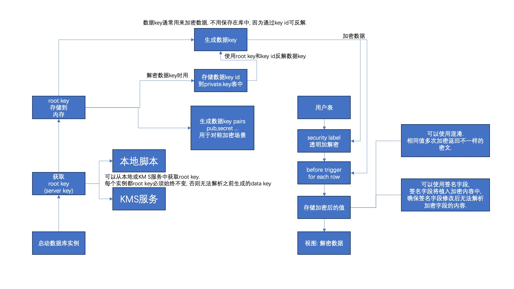

## PostgreSQL的安全场景介绍, 以及security label(安全标签功能)的label provider: pgsodium 加密库介绍(隐藏|加密敏感信息) - 字段透明加解密 - libsodium 加密库实现   
      
### 作者      
digoal      
      
### 日期      
2023-07-07      
      
### 标签      
PostgreSQL , PolarDB , 安全 , 敏感信息 , 加密 , security label , row security policy , anon , sepgsql , libsodium , pgsodium , 字段透明加密 , 触发器。     
      
----      
      
## 背景    
接上一篇:  
- [《PostgreSQL的安全场景介绍, 以及security label(安全标签功能)和两个label provider: anon, sepgsql的介绍(隐藏|加密敏感信息)》](../202307/20230707_01.md)    
  
pgsodium是一款利用libsodium加密库的PosgreSQL安全插件, 可以用来管理密钥, 加解密数据. 相比pgcrypt功能更加强大.   
- 启动数据库实例时需要给定 root key (即server key)   
- root key可以从kms服务器获取, 也可以本地生成. 推荐生产中使用kms管理.   
- 使用root key可以生成很多数据key以及对应key id  
- 使用root key可以生成很多数据key pair (public , secret)  
- 使用root key可以从key id反解析出对应的key 原始值  
- 结合security label , 可以自动对字段内容进行加密. (实现字段内容透明加解密. 注意由于原始内容未实际存储, 所以不支持索引排序操作, 这里说的透明是指自动完成加密存储, 并从视图读取解密数据.)  
- 提供了libsodium加密库对应的SQL API  
  
  
  
## 测试  
在macOS pg 15环境中测试  
  
1、先安装libsodium  
  
```  
git clone --depth 1 --branch stable https://github.com/jedisct1/libsodium   
cd libsodium  
CC=clang CXX=clang++ ./configure  
make  
make check  
sudo make install  
```  
  
2、安装pgsodium  
  
```  
git clone --depth 1 https://github.com/michelp/pgsodium  
cd pgsodium  
C_INCLUDE_PATH=/usr/local/include PG_LDFLAGS=-L/usr/local/lib USE_PGXS=1 make   
C_INCLUDE_PATH=/usr/local/include PG_LDFLAGS=-L/usr/local/lib USE_PGXS=1 make install  
```  
  
3、安装pgsodium插件  
  
```  
psql  
create extension pgsodium;  
  
postgres=# \dx  
                               List of installed extensions  
   Name   | Version |   Schema   |                       Description                         
----------+---------+------------+---------------------------------------------------------  
 pgsodium | 3.1.7   | pgsodium   | Pgsodium is a modern cryptography library for Postgres.  
 plpgsql  | 1.0     | pg_catalog | PL/pgSQL procedural language  
(2 rows)  
  
postgres=# \dn  
          List of schemas  
      Name      |       Owner         
----------------+-------------------  
 pgsodium       | postgres  
 pgsodium_masks | postgres  
 public         | pg_database_owner  
(3 rows)  
```  
  
注意要将pgsodium配置到第一搜索路径  
  
```  
set search_path=pgsodium, "$user", public;  
```  
  
可以看到key表, 就是保存create_key创建的key的地方. 使用security label进行透明字段加密时, 必须使用key表中的key id.   
  
```  
postgres=# \dt  
         List of relations  
  Schema  | Name | Type  |  Owner     
----------+------+-------+----------  
 pgsodium | key  | table | postgres  
(1 row)  
  
postgres=# \dv  
             List of relations  
  Schema  |     Name      | Type |  Owner     
----------+---------------+------+----------  
 pgsodium | decrypted_key | view | postgres  
 pgsodium | mask_columns  | view | postgres  
 pgsodium | masking_rule  | view | postgres  
 pgsodium | valid_key     | view | postgres  
(4 rows)  
  
postgres=# \x  
Expanded display is on.  
postgres=# \df create*  
List of functions  
-[ RECORD 1 ]-------+--------------------------------------------------------------------------------------------------------------------------------------------------------------------------------------------------------------------------------------------------------------------------------------------------------------------------------------------------------------------  
Schema              | pgsodium  
Name                | create_key  
Result data type    | valid_key  
Argument data types | key_type key_type DEFAULT 'aead-det'::key_type, name text DEFAULT NULL::text, raw_key bytea DEFAULT NULL::bytea, raw_key_nonce bytea DEFAULT NULL::bytea, parent_key uuid DEFAULT NULL::uuid, key_context bytea DEFAULT '\x7067736f6469756d'::bytea, expires timestamp with time zone DEFAULT NULL::timestamp with time zone, associated_data text DEFAULT ''::text  
Type                | func  
```  
  
使用create_key()可以创建key, 并存储到key表中.  
  
```  
postgres=# select * from create_key();  
-[ RECORD 1 ]---+-------------------------------------  
id              | b9250679-be72-49f8-be33-efec93116659  
name            |   
status          | valid  
key_type        | aead-det  
key_id          | 1  
key_context     | \x7067736f6469756d  
created         | 2023-07-07 21:19:10.464761+08  
expires         |   
associated_data |   
  
  
postgres=# select * from key;  
-[ RECORD 1 ]---+-------------------------------------  
id              | b9250679-be72-49f8-be33-efec93116659  
status          | valid  
created         | 2023-07-07 21:19:10.464761+08  
expires         |   
key_type        | aead-det  
key_id          | 1  
key_context     | \x7067736f6469756d  
name            |   
associated_data |   
raw_key         |   
raw_key_nonce   |   
parent_key      |   
comment         |   
user_data       |   
```  
  
4、配置pgsodium自动加载, 并且使用本地生成root key的脚本来进行测试.   
  
```  
postgresql.conf  
  
shared_preload_libraries = 'pgsodium'   
```  
  
查看一下生成root key的脚本内容  
  
```  
digoaldeMacBook-Pro:getkey_scripts digoal$ pwd  
/Users/digoal/Downloads/pgsodium/getkey_scripts  
  
digoaldeMacBook-Pro:getkey_scripts digoal$ ll  
total 40  
-rwxr-xr-x   1 digoal  staff   593B  7  7 20:21 pgsodium_getkey_aws.sh  
-rw-r--r--   1 digoal  staff   547B  7  7 20:21 pgsodium_getkey_doppler.sh  
-rwxr-xr-x   1 digoal  staff   1.3K  7  7 20:21 pgsodium_getkey_gcp.sh  
-rwxr-xr-x   1 digoal  staff   165B  7  7 20:21 pgsodium_getkey_urandom.sh  
drwxr-xr-x   7 digoal  staff   224B  7  7 20:21 .  
-rwxr-xr-x   1 digoal  staff   747B  7  7 20:21 pgsodium_getkey_zmk.sh  
drwxr-xr-x  31 digoal  staff   992B  7  7 21:13 ..  
  
digoaldeMacBook-Pro:getkey_scripts digoal$ cat pgsodium_getkey_urandom.sh  
#!/bin/bash  
KEY_FILE=$PGDATA/pgsodium_root.key  
  
if [ ! -f "$KEY_FILE" ]; then  
    head -c 32 /dev/urandom | od -A n -t x1 | tr -d ' \n' > $KEY_FILE  
fi  
cat $KEY_FILE  
```  
  
这个脚本用了`$PGDATA`变量, key文件第一次获取后将会存储下来. 所以server key的内容是不变的, 内容变了的话就危险了, 因为后面要通过这个key来解码它之前生成的key id对应的secret key.   
  
```  
digoaldeMacBook-Pro:getkey_scripts digoal$ ./pgsodium_getkey_urandom.sh  
d5acd8b85d370bd418ed56dc6a54e56f2336ac235af9db7aa7d06b051ac21507  
```  
  
将生成root key的脚本拷贝到pghome对应子目录, 然后启动数据库实例  
  
```  
cp pgsodium_getkey_urandom.sh $PGHOME/share/postgresql/extension/pgsodium_getkey  
  
digoaldeMacBook-Pro:getkey_scripts digoal$ pg_ctl start  
waiting for server to start....2023-07-07 21:33:57.435 CST [33286] LOG:  pgsodium primary server secret key loaded  
2023-07-07 21:33:57.457 CST [33286] LOG:  redirecting log output to logging collector process  
2023-07-07 21:33:57.457 CST [33286] HINT:  Future log output will appear in directory "log".  
 done  
server started  
```  
  
  
5、继续创建data key  
  
```  
postgres=# set search_path=pgsodium, "$user", public;  
SET  
postgres=# select * from create_key();  
                  id                  | name | status | key_type | key_id |    key_context     |            created            | expires | associated_data   
--------------------------------------+------+--------+----------+--------+--------------------+-------------------------------+---------+-----------------  
 82730add-3c8e-4e5c-96ce-2d722e74e1a0 |      | valid  | aead-det |      2 | \x7067736f6469756d | 2023-07-07 21:34:25.439691+08 |         |   
(1 row)  
  
postgres=# select * from create_key();  
                  id                  | name | status | key_type | key_id |    key_context     |            created            | expires | associated_data   
--------------------------------------+------+--------+----------+--------+--------------------+-------------------------------+---------+-----------------  
 877f8bd5-334b-4e6e-9d18-849f65f2c669 |      | valid  | aead-det |      3 | \x7067736f6469756d | 2023-07-07 21:34:28.490552+08 |         |   
(1 row)  
```  
  
查看key表  
  
```  
postgres=# select * from key;  
                  id                  | status |            created            | expires | key_type | key_id |    key_context     | name | associated_data | raw_key | raw_key_nonce | parent_key | comment | user_data   
--------------------------------------+--------+-------------------------------+---------+----------+--------+--------------------+------+-----------------+---------+---------------+------------+---------+-----------  
 b9250679-be72-49f8-be33-efec93116659 | valid  | 2023-07-07 21:19:10.464761+08 |         | aead-det |      1 | \x7067736f6469756d |      |                 |         |               |            |         |   
 82730add-3c8e-4e5c-96ce-2d722e74e1a0 | valid  | 2023-07-07 21:34:25.439691+08 |         | aead-det |      2 | \x7067736f6469756d |      |                 |         |               |            |         |   
 877f8bd5-334b-4e6e-9d18-849f65f2c669 | valid  | 2023-07-07 21:34:28.490552+08 |         | aead-det |      3 | \x7067736f6469756d |      |                 |         |               |            |         |   
(3 rows)  
```  
  
  
6、测试security label 透明加密列的内容  
  
```  
postgres=# create schema private;  
CREATE SCHEMA  
postgres=# CREATE TABLE private.users (  
id bigserial primary key,   
secret text);  
CREATE TABLE  
postgres=# SECURITY LABEL FOR pgsodium ON COLUMN private.users.secret IS 'ENCRYPT WITH KEY ID b9250679-be72-49f8-be33-efec93116659';  
NOTICE:  view "decrypted_users" does not exist, skipping  
NOTICE:  function private.users_encrypt_secret_secret() does not exist, skipping  
NOTICE:  trigger "users_encrypt_secret_trigger_secret" for relation "private.users" does not exist, skipping  
NOTICE:  about to masking role private.users private.decrypted_users  
SECURITY LABEL  
```  
  
可以看到自动创建了触发器  
  
```  
postgres=# \d private.users   
                               Table "private.users"  
 Column |  Type  | Collation | Nullable |                  Default                    
--------+--------+-----------+----------+-------------------------------------------  
 id     | bigint |           | not null | nextval('private.users_id_seq'::regclass)  
 secret | text   |           |          |   
Indexes:  
    "users_pkey" PRIMARY KEY, btree (id)  
Triggers:  
    users_encrypt_secret_trigger_secret BEFORE INSERT OR UPDATE OF secret ON private.users FOR EACH ROW EXECUTE FUNCTION private.users_encrypt_secret_secret()  
  
postgres=# \df private.users_encrypt_secret_secret  
                                   List of functions  
 Schema  |            Name             | Result data type | Argument data types | Type   
---------+-----------------------------+------------------+---------------------+------  
 private | users_encrypt_secret_secret | trigger          |                     | func  
(1 row)  
```  
  
查看触发器函数内容可以了解到自动使用加密函数, 以及指定的key id对应的原始key内容来加密数据.  
  
```  
postgres=# \sf private.users_encrypt_secret_secret  
CREATE OR REPLACE FUNCTION private.users_encrypt_secret_secret()  
 RETURNS trigger  
 LANGUAGE plpgsql  
AS $function$  
		BEGIN  
		        new.secret = CASE WHEN new.secret IS NULL THEN NULL ELSE  
			CASE WHEN 'b9250679-be72-49f8-be33-efec93116659' IS NULL THEN NULL ELSE pg_catalog.encode(  
			  pgsodium.crypto_aead_det_encrypt(  
				pg_catalog.convert_to(new.secret, 'utf8'),  
				pg_catalog.convert_to(('')::text, 'utf8'),  
				'b9250679-be72-49f8-be33-efec93116659'::uuid,  
				NULL  
			  ),  
				'base64') END END;  
		RETURN new;  
		END;  
		$function$  
```  
  
插入数据, 查看原始表的内容已经自动加密  
  
```  
postgres=# insert into private.users (secret ) values ('test');  
INSERT 0 1  
postgres=# select * from private.users;  
 id |                      secret                        
----+--------------------------------------------------  
  1 | If9GBZHYdD3fZK+JSTQixjKUqLb5GjxESo+9oxL98S5TlFj6  
(1 row)  
```  
  
查看解密后的视图.  
  
```  
postgres=# \dv private.  
private.decrypted_users  
  
  
postgres=# \d+ private.decrypted_users  
                           View "private.decrypted_users"  
      Column      |  Type  | Collation | Nullable | Default | Storage  | Description   
------------------+--------+-----------+----------+---------+----------+-------------  
 id               | bigint |           |          |         | plain    |   
 secret           | text   |           |          |         | extended |   
 decrypted_secret | text   | C         |          |         | extended |   
View definition:  
 SELECT users.id,  
    users.secret,  
        CASE  
            WHEN users.secret IS NULL THEN NULL::text  
            ELSE  
            CASE  
                WHEN 'b9250679-be72-49f8-be33-efec93116659' IS NULL THEN NULL::text  
                ELSE convert_from(crypto_aead_det_decrypt(decode(users.secret, 'base64'::text), convert_to(''::text, 'utf8'::name), 'b9250679-be72-49f8-be33-efec93116659'::uuid, NULL::bytea), 'utf8'::name)  
            END  
        END AS decrypted_secret  
   FROM private.users;  
```  
  
数据导出后是加密的, 没有server key无法查看. 所以比较安全.    
  
7、使用nonce支持混淆, 使得相同明文值加密后的秘文内容不一样, 提高破解难度.   
  
```
drop table private.users cascade;

CREATE TABLE private.users (
	id bigserial primary key,
	secret text,
	key_id uuid not null,
    nonce bytea
);

SECURITY LABEL FOR pgsodium
  ON COLUMN private.users.secret
  IS 'ENCRYPT WITH KEY COLUMN key_id NONCE nonce';

insert into private.users (secret, key_id, nonce) values ('test', 'b9250679-be72-49f8-be33-efec93116659', crypto_aead_det_noncegen());

postgres=# insert into private.users (secret, key_id, nonce) values ('test', 'b9250679-be72-49f8-be33-efec93116659', crypto_aead_det_noncegen());
INSERT 0 1
postgres=# insert into private.users (secret, key_id, nonce) values ('test', 'b9250679-be72-49f8-be33-efec93116659', crypto_aead_det_noncegen());
INSERT 0 1
postgres=# insert into private.users (secret, key_id, nonce) values ('test', 'b9250679-be72-49f8-be33-efec93116659', crypto_aead_det_noncegen());
INSERT 0 1
postgres=# select * from private.users;
 id |                      secret                      |                key_id                |               nonce                
----+--------------------------------------------------+--------------------------------------+------------------------------------
  1 | sZ3+VD4kIgff6ihiRo6cbl7Xy7V2wO4kTteFCXQhvBQ8HCwV | b9250679-be72-49f8-be33-efec93116659 | \x97f516fc29c18fd45694a18b5c9cde32
  2 | 2z4DaZd7JtmYmKXhhyOi1sZ0eBvA7fZpeG7TT60V3NDydyOL | b9250679-be72-49f8-be33-efec93116659 | \x4cda34af1ec0197bb9cdd0d164a1a738
  3 | 0aBqxB2Ws8GyGIq5EhvOOcje4xJ1bz7ksObhw70RYeW9f3Jb | b9250679-be72-49f8-be33-efec93116659 | \x7789e26345d1e1194ac5a876881ce42d
(3 rows)

postgres=# \d+ private.users
                                                          Table "private.users"
 Column |  Type  | Collation | Nullable |                  Default                  | Storage  | Compression | Stats target | Description 
--------+--------+-----------+----------+-------------------------------------------+----------+-------------+--------------+-------------
 id     | bigint |           | not null | nextval('private.users_id_seq'::regclass) | plain    |             |              | 
 secret | text   |           |          |                                           | extended |             |              | 
 key_id | uuid   |           | not null |                                           | plain    |             |              | 
 nonce  | bytea  |           |          |                                           | extended |             |              | 
Indexes:
    "users_pkey" PRIMARY KEY, btree (id)
Triggers:
    users_encrypt_secret_trigger_secret BEFORE INSERT OR UPDATE OF secret ON private.users FOR EACH ROW EXECUTE FUNCTION private.users_encrypt_secret_secret()
Access method: heap

postgres=# \sf private.users_encrypt_secret_secret
CREATE OR REPLACE FUNCTION private.users_encrypt_secret_secret()
 RETURNS trigger
 LANGUAGE plpgsql
AS $function$
		BEGIN
		        new.secret = CASE WHEN new.secret IS NULL THEN NULL ELSE
			CASE WHEN new.key_id IS NULL THEN NULL ELSE pg_catalog.encode(
			  pgsodium.crypto_aead_det_encrypt(
				pg_catalog.convert_to(new.secret, 'utf8'),
				pg_catalog.convert_to(('')::text, 'utf8'),
				new.key_id::uuid,
				new.nonce
			  ),
				'base64') END END;
		RETURN new;
		END;
		$function$

		postgres=# \d+ private.decrypted_users
                           View "private.decrypted_users"
      Column      |  Type  | Collation | Nullable | Default | Storage  | Description 
------------------+--------+-----------+----------+---------+----------+-------------
 id               | bigint |           |          |         | plain    | 
 secret           | text   |           |          |         | extended | 
 decrypted_secret | text   | C         |          |         | extended | 
 key_id           | uuid   |           |          |         | plain    | 
 nonce            | bytea  |           |          |         | extended | 
View definition:
 SELECT users.id,
    users.secret,
        CASE
            WHEN users.secret IS NULL THEN NULL::text
            ELSE
            CASE
                WHEN users.key_id IS NULL THEN NULL::text
                ELSE convert_from(crypto_aead_det_decrypt(decode(users.secret, 'base64'::text), convert_to(''::text, 'utf8'::name), users.key_id, users.nonce), 'utf8'::name)
            END
        END AS decrypted_secret,
    users.key_id,
    users.nonce
   FROM private.users;

postgres=# select * from private.decrypted_users ;
 id |                      secret                      | decrypted_secret |                key_id                |               nonce                
----+--------------------------------------------------+------------------+--------------------------------------+------------------------------------
  1 | sZ3+VD4kIgff6ihiRo6cbl7Xy7V2wO4kTteFCXQhvBQ8HCwV | test             | b9250679-be72-49f8-be33-efec93116659 | \x97f516fc29c18fd45694a18b5c9cde32
  2 | 2z4DaZd7JtmYmKXhhyOi1sZ0eBvA7fZpeG7TT60V3NDydyOL | test             | b9250679-be72-49f8-be33-efec93116659 | \x4cda34af1ec0197bb9cdd0d164a1a738
  3 | 0aBqxB2Ws8GyGIq5EhvOOcje4xJ1bz7ksObhw70RYeW9f3Jb | test             | b9250679-be72-49f8-be33-efec93116659 | \x7789e26345d1e1194ac5a876881ce42d
(3 rows)
``` 
  
8、接下来的例子, 使用混淆, 同时使用签名字段.  
  
```  
CREATE TABLE private.users (  
	id bigserial primary key,  
	secret text,  
	key_id uuid not null,  
    nonce bytea,  
    associated_data text  
);  
  
SECURITY LABEL FOR pgsodium ON COLUMN private.users.secret  
  IS 'ENCRYPT WITH KEY COLUMN key_id NONCE nonce ASSOCIATED (id, associated_data)';  
```  
  
  
```  
postgres=# drop table private.users ;  
ERROR:  cannot drop table private.users because other objects depend on it  
DETAIL:  view private.decrypted_users depends on table private.users  
HINT:  Use DROP ... CASCADE to drop the dependent objects too.  
postgres=# drop table private.users cascade;  
NOTICE:  drop cascades to view private.decrypted_users  
DROP TABLE  
postgres=# CREATE TABLE private.users (  
postgres(# id bigserial primary key,  
postgres(# secret text,  
postgres(# key_id uuid not null,  
postgres(#     nonce bytea,  
postgres(#     associated_data text  
postgres(# );  
CREATE TABLE  
postgres=#   
postgres=# SECURITY LABEL FOR pgsodium ON COLUMN private.users.secret  
postgres-#   IS 'ENCRYPT WITH KEY COLUMN key_id NONCE nonce ASSOCIATED (id, associated_data)';  
NOTICE:  view "decrypted_users" does not exist, skipping  
NOTICE:  trigger "users_encrypt_secret_trigger_secret" for relation "private.users" does not exist, skipping  
NOTICE:  about to masking role private.users private.decrypted_users  
SECURITY LABEL  
```  
  
```  
postgres=# \d private.users  
                                    Table "private.users"  
     Column      |  Type  | Collation | Nullable |                  Default                    
-----------------+--------+-----------+----------+-------------------------------------------  
 id              | bigint |           | not null | nextval('private.users_id_seq'::regclass)  
 secret          | text   |           |          |   
 key_id          | uuid   |           | not null |   
 nonce           | bytea  |           |          |   
 associated_data | text   |           |          |   
Indexes:  
    "users_pkey" PRIMARY KEY, btree (id)  
Triggers:  
    users_encrypt_secret_trigger_secret BEFORE INSERT OR UPDATE OF secret ON private.users FOR EACH ROW EXECUTE FUNCTION private.users_encrypt_secret_secret()  
  
postgres=# \sf private.users_encrypt_secret_secret  
CREATE OR REPLACE FUNCTION private.users_encrypt_secret_secret()  
 RETURNS trigger  
 LANGUAGE plpgsql  
AS $function$  
		BEGIN  
		        new.secret = CASE WHEN new.secret IS NULL THEN NULL ELSE  
			CASE WHEN new.key_id IS NULL THEN NULL ELSE pg_catalog.encode(  
			  pgsodium.crypto_aead_det_encrypt(  
				pg_catalog.convert_to(new.secret, 'utf8'),  
				pg_catalog.convert_to((new.id::text || new.associated_data::text)::text, 'utf8'),  
				new.key_id::uuid,  
				new.nonce  
			  ),  
				'base64') END END;  
		RETURN new;  
		END;  
		$function$  
postgres=#   
```  
  
  
使用nonce混淆, 插入两条一样的记录, 可以看到秘文不一样(包含了签名字段内容).     
  
```  
postgres=# insert into private.users (secret , key_id,  associated_data) values ('test123','b9250679-be72-49f8-be33-efec93116659',  'hello world');   
INSERT 0 1  
postgres=# select * from private.users;  
 id |                        secret                        |                key_id                | nonce | associated_data   
----+------------------------------------------------------+--------------------------------------+-------+-----------------  
 10 | EreR7oSr0LhsSnpMGuNyCJU6oAckbAYHJvI6b2QEK1g9XtIiucLz | b9250679-be72-49f8-be33-efec93116659 |       | hello world  
(1 row)  
  
postgres=# insert into private.users (secret , key_id,  associated_data) values ('test123','b9250679-be72-49f8-be33-efec93116659',  'hello world');  
INSERT 0 1  
postgres=# select * from private.users;  
 id |                        secret                        |                key_id                | nonce | associated_data   
----+------------------------------------------------------+--------------------------------------+-------+-----------------  
 10 | EreR7oSr0LhsSnpMGuNyCJU6oAckbAYHJvI6b2QEK1g9XtIiucLz | b9250679-be72-49f8-be33-efec93116659 |       | hello world  
 11 | eQVxDgWz/uT4mLFVcPqj1ieU7xfh7tIj45hFtLoMjhIMA20Kra8c | b9250679-be72-49f8-be33-efec93116659 |       | hello world  
(2 rows)  
```  
  
  
签名值修改后不可查看解密数据.  
  
```  
postgres=# update private.users set associated_data ='new' where id=10;  
UPDATE 1  
postgres=# select * from private.decrypted_users ;  
ERROR:  22000: pgsodium_crypto_aead_det_decrypt_by_id: invalid ciphertext  
CONTEXT:  PL/pgSQL function pgsodium.crypto_aead_det_decrypt(bytea,bytea,uuid,bytea) line 12 at RETURN  
LOCATION:  pgsodium_crypto_aead_det_decrypt_by_id, aead.c:493  
postgres=# select * from private.decrypted_users where id=11;  
 id |                        secret                        | decrypted_secret |                key_id                | nonce | associated_data   
----+------------------------------------------------------+------------------+--------------------------------------+-------+-----------------  
 11 | eQVxDgWz/uT4mLFVcPqj1ieU7xfh7tIj45hFtLoMjhIMA20Kra8c | test123          | b9250679-be72-49f8-be33-efec93116659 |       | hello world  
(1 row)  
  
postgres=# select * from private.decrypted_users where id=10;  
ERROR:  22000: pgsodium_crypto_aead_det_decrypt_by_id: invalid ciphertext  
CONTEXT:  PL/pgSQL function pgsodium.crypto_aead_det_decrypt(bytea,bytea,uuid,bytea) line 12 at RETURN  
LOCATION:  pgsodium_crypto_aead_det_decrypt_by_id, aead.c:493  
postgres=#   
```  
  
9、更多用法可以结合RLS(行级安全策略), kms(key管理服务, 如aws或阿里云 的key管理服务), security lable, 角色权限区分等, 解决更多安全需求.   
  
```  
postgres=# \du  
                                                       List of roles  
     Role name      |                         Attributes                         |                Member of                  
--------------------+------------------------------------------------------------+-----------------------------------------  
 pgsodium_keyholder | Cannot login                                               | {pgsodium_keyiduser}  
 pgsodium_keyiduser | Cannot login                                               | {}  
 pgsodium_keymaker  | Cannot login                                               | {pgsodium_keyiduser,pgsodium_keyholder}  
 postgres           | Superuser, Create role, Create DB, Replication, Bypass RLS | {}  
```  
  
  
## 参考  
https://github.com/michelp/pgsodium  
  
https://doc.libsodium.org/  
  
[《PostgreSQL的安全场景介绍, 以及security label(安全标签功能)和两个label provider: anon, sepgsql的介绍(隐藏|加密敏感信息)》](../202307/20230707_01.md)    
  
[《PostgreSQL 行安全策略 - PostgreSQL 9.5 new feature - can define row security policy for table》](../201504/20150409_01.md)        
    
https://www.postgresql.org/docs/16/sql-security-label.html    
  
[《PostgreSQL 敏感信息遮掩插件 anon (Anonymizer) - security label provider - anon》](../201911/20191115_03.md)      
  
[《Anonymization & Data Masking for PostgreSQL - 自动脱敏控制 - oracle data vault - postgresql-anonymizer》](../201908/20190817_03.md)      
    
  
  
#### [期望 PostgreSQL|开源PolarDB 增加什么功能?](https://github.com/digoal/blog/issues/76 "269ac3d1c492e938c0191101c7238216")
  
  
#### [PolarDB 云原生分布式开源数据库](https://github.com/ApsaraDB "57258f76c37864c6e6d23383d05714ea")
  
  
#### [PolarDB 学习图谱: 训练营、培训认证、在线互动实验、解决方案、内核开发公开课、生态合作、写心得拿奖品](https://www.aliyun.com/database/openpolardb/activity "8642f60e04ed0c814bf9cb9677976bd4")
  
  
#### [PostgreSQL 解决方案集合](../201706/20170601_02.md "40cff096e9ed7122c512b35d8561d9c8")
  
  
#### [德哥 / digoal's github - 公益是一辈子的事.](https://github.com/digoal/blog/blob/master/README.md "22709685feb7cab07d30f30387f0a9ae")
  
  

  
  
#### [购买PolarDB云服务折扣活动进行中, 55元起](https://www.aliyun.com/activity/new/polardb-yunparter?userCode=bsb3t4al "e0495c413bedacabb75ff1e880be465a")
  
  
#### [About 德哥](https://github.com/digoal/blog/blob/master/me/readme.md "a37735981e7704886ffd590565582dd0")
  
