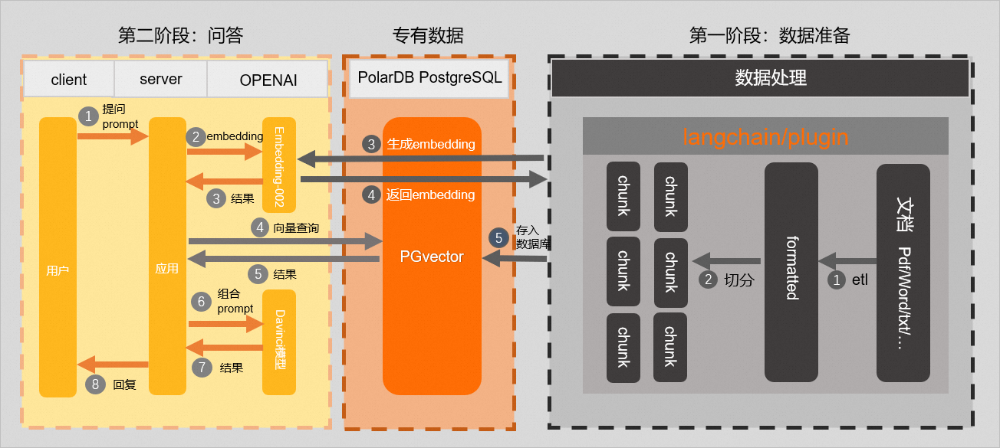
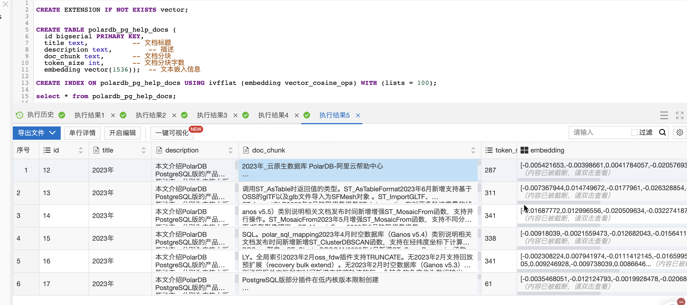
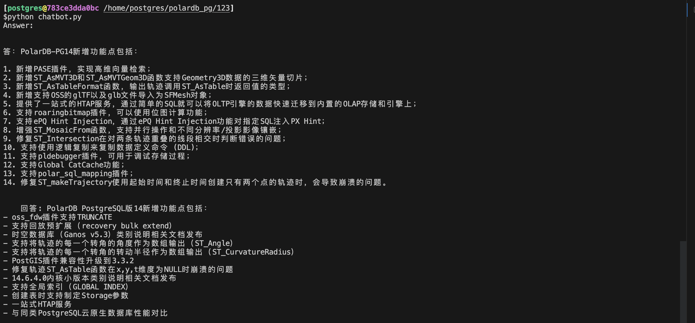

## 沉浸式学习PostgreSQL|PolarDB 9: AI大模型+向量数据库, 提升AI通用机器人在专业领域的精准度, 完美诠释柏拉图提出的“知识是回忆而不是知觉”   
    
### 作者    
digoal    
    
### 日期    
2023-08-31    
    
### 标签    
PostgreSQL , PolarDB , 数据库 , 教学    
    
----    
    
## 背景    
欢迎数据库应用开发者参与贡献场景, 在此[issue](https://github.com/digoal/blog/issues/121)回复即可, 共同建设《沉浸式数据库学习教学素材库》, 帮助开发者用好数据库, 提升开发者职业竞争力, 同时为企业降本提效.    
- 系列课程的核心目标是教大家怎么用好数据库, 而不是怎么运维管理数据库、怎么开发数据库内核. 所以面向的对象是数据库的用户、应用开发者、应用架构师、数据库厂商的产品经理、售前售后专家等角色.    
    
本文的实验可以使用永久免费的阿里云[云起实验室](https://developer.aliyun.com/adc/scenario/exp/f55dbfac77c0467a9d3cd95ff6697a31)来完成.    
    
如果你本地有docker环境也可以把镜像拉到本地来做实验:    
    
x86_64机器使用以下docker image:    
- [《amd64 image》](../202307/20230710_03.md)    
    
ARM机器使用以下docker image:    
- [《arm64 image》](../202308/20230814_02.md)    
    
## 业务场景1 介绍: AI大模型+向量数据库, 提升AI通用机器人在专业领域的精准度, 完美诠释柏拉图提出的“知识是回忆而不是知觉”     
越来越多的企业和个人希望能够利用LLM和生成式人工智能来构建专注于其特定领域的具备AI能力的产品。目前，大语言模型在处理通用问题方面表现较好，但由于训练语料和大模型的生成限制，对于垂直专业领域，则会存在知识深度和时效性不足的问题。在信息时代，由于企业的知识库更新频率越来越高，并且企业所拥有的垂直领域知识库（例如文档、图像、音视频等）往往是未公开或不可公开的。因此，对于企业而言，如果想在大语言模型的基础上构建属于特定垂直领域的AI产品，就需要不断将自身的知识库输入到大语言模型中进行训练。  
  
目前有两种常见的方法实现, 提升AI通用机器人在专业领域的精准度：  
- 微调（Fine-tuning）：通过提供新的数据集对已有模型的权重进行微调，不断更新输入以调整输出，以达到所需的结果。这适用于数据集规模不大或针对特定类型任务或风格进行训练，但训练成本和价格较高。  
- 提示调整（Prompt-tuning）：通过调整输入提示而非修改模型权重，从而实现调整输出的目的。相较于微调，提示调整具有较低的计算成本，需要的资源和训练时间也较少，同时更加灵活。  
  
综上所述，微调的方案投入成本较高，更新频率较低，并不适合所有企业。提示调整的方案是在向量库中构建企业的知识资产，通过LLM+向量库构建垂直领域的深度服务。本质是利用数据库进行提示工程（Prompt Engineering）将企业知识库文档和实时信息通过向量特征提取然后存储到向量数据库，结合LLM可以让Chatbot的回答更具专业性和时效性，也更适合中小型企业构建企业专属Chatbot。  
  
在机器学习领域，为了能够处理大量的非结构化的数据，通常会使用人工智能技术提取这些非结构化数据的特征，并将其转化为特征向量，再对这些特征向量进行分析和检索以实现对非结构化数据的处理。将这种能存储、分析和检索特征向量的数据库称之为向量数据库。  
  
实现原理:  
  
第一阶段：数据准备  
- 1\. 知识库信息提取和分块：从领域知识库中提取相关的文本信息，并将其分块处理。这可以包括将长文本拆分为段落或句子，提取关键词或实体等。这样可以将知识库的内容更好地组织和管理。  
- 2\. 调用LLM接口生成embedding(向量)：利用LLM（如OpenAI）提供的接口，将分块的文本信息输入到模型中，并生成相应的文本embedding。这些embedding将捕捉文本的语义和语境信息，为后续的搜索和匹配提供基础。你可以理解为“正确答案”(或者prompt).  
- 3\. 存储embedding(向量)信息：将生成的文本embedding(向量)信息、文本分块以及文本关联的metadata信息存入PolarDB|PostgreSQL 数据库中, 使用vector或embedding插件提供的向量数据类型。  
  
第二阶段：问答过程  
- 1\. 用户使用自然语言提问。  
- 2\. 通过OpenAI提供的embedding接口创建该问题的embedding(向量)。  
- 3\. 使用该问题等向量, 在PolarDB|PostgreSQL 数据库中, 搜索到向量相似度大于一定阈值的文档块, 作为用户原始问题的提示传递给OpenAI, 作为问题的Prompt。  
- 4\. 将用户输入的问题 + 最相似问题和答案(如果有)输入OpenAI, 向OpenAI提问, 从而修正直接向OpenAI问“用户输入的问题”的结果. 提升OpenAI专业领域回答的准确度.    
  
  
  
  
  
柏拉图是古希腊三贤之一, 他有个这样的观点: 人类的知识并非来自于感知和经验，而是存在于灵魂中的先前的灵魂经验的回忆。   
  
从上面的实现原理我们可以理解为 “AI的知识并非来自感知和经验, 而是存在于灵魂中的先前的灵魂经验的回忆” , 回忆的源头在PolarDB|PostgreSQL 数据库中, 通过问题embedding得到相似向量(prompt)的过程就是回忆.    
  
### 实现和对照      
  
#### 传统方法 设计和实验      
传统数据库没有数组类型, 只能使用text表达, 或者使用多个数值字段的组合来表达向量.    
    
传统数据库没有向量距离搜索的操作符, 无法实现向量特征相似搜索.    
    
传统数据库没有办法在text或者多个数值字段组合上建立向量索引, 因此即使实现了计算2个向量距离的函数, 也无法实现高效率的向量相似检索.    
  
#### PolarDB|PG新方法1 设计和实验  
第一阶段：数据准备  
  
数据准备阶段的关键在于将专属领域知识转化为文本embedding，并有效地存储和匹配这些信息。通过利用LLM的强大语义理解能力，您可以获得与特定领域相关的高质量回答和建议。当前的一些开源框架，可以方便您上传和解析知识库文件，包括URL、Markdown、PDF、Word等格式。例如[LangChain](https://python.langchain.com/en/latest/index.html)和OpenAI开源的[ChatGPT Retrieval Plugin](https://github.com/openai/chatgpt-retrieval-plugin)。LangChain和ChatGPT Retrieval Plugin均已经支持了基于PGVector扩展的PostgreSQL作为其后端向量数据库，这使得与PolarDB PostgreSQL版集群的集成变得更加便捷。通过这样的集成，您可以方便地完成第一阶段领域知识库的数据准备，并充分利用PGVector提供的向量索引和相似度搜索功能，实现高效的文本匹配和查询操作。  
  
1\. 连接PolarDB | PostgreSQL 。  
2\. 创建测试数据库，以testdb为例。  
```  
CREATE DATABASE testdb;  
```  
  
3\. 进入测试数据库，并创建PGvector插件。  
```  
CREATE EXTENSION IF NOT EXISTS vector;  
```  
  
4\. 创建测试表（本文以`polardb_pg_help_docs`为例），用于存储知识库内容。  
```  
CREATE TABLE polardb_pg_help_docs (  
  id bigserial PRIMARY KEY,   
  title text,           -- 文档标题  
  description text,         -- 描述  
  doc_chunk text,       -- 文档分块  
  token_size int,       -- 文档分块字数  
  embedding vector(1536));  -- 文本嵌入信息  
```  
  
5\. 为embedding列创建索引，用于查询优化和加速。  
```  
CREATE INDEX ON polardb_pg_help_docs USING ivfflat (embedding vector_cosine_ops) WITH (lists = 100);  
  
-- 或者使用hnsw算法  
CREATE INDEX ON polardb_pg_help_docs USING hnsw (embedding vector_cosine_ops) WITH (m = 12, ef_construction=40;  
```  
  
算法解读:    
- [《沉浸式学习PostgreSQL|PolarDB 8: 电商|短视频|新闻|内容推荐业务(根据用户行为推荐相似内容)、监控预测报警系统(基于相似指标预判告警)、音视图文多媒体相似搜索、人脸|指纹识别|比对 - 向量搜索应用》](../202308/20230829_02.md)    
  
6\. 在PyCharm中，创建项目，然后打开Terminal，输入如下语句，安装如下依赖库。  
```  
pip install openai psycopg2 tiktoken requests beautifulsoup4 numpy  
```  
  
7\. 创建.py文件（本文以`knowledge_chunk_storage.py`为例），拆分知识库文档内容并存储到数据库中，示例代码如下：  
  
说明   
> 如下示例代码中，自定义的拆分方法仅仅是将知识库文档内容按固定字数进行了拆分，您可以使用LangChain和OpenAI开源的ChatGPT Retrieval Plugin等开源框架中提供的方法进行拆分。知识库中的文档质量和分块结果对最终的输出的结果有较大的影响。  
  
```  
import openai  
import psycopg2  
import tiktoken  
import requests  
from bs4 import BeautifulSoup  
EMBEDDING_MODEL = "text-embedding-ada-002"  
tokenizer = tiktoken.get_encoding("cl100k_base")  
# 连接PolarDB-PG数据库  
conn = psycopg2.connect(database="<数据库名>",  
                        host="<PolarDB PostgreSQL版集群连接地址>",  
                        user="<用户名>",  
                        password="<密码>",  
                        port="<数据库端口>")  
conn.autocommit = True  
# OpenAI的API Key  
openai.api_key = '<Secret API Key>'  
# 自定义拆分方法（仅为示例）  
def get_text_chunks(text, max_chunk_size):  
    chunks_ = []  
    soup_ = BeautifulSoup(text, 'html.parser')  
    content = ''.join(soup_.strings).strip()  
    length = len(content)  
    start = 0  
    while start < length:  
        end = start + max_chunk_size  
        if end >= length:  
            end = length  
        chunk_ = content[start:end]  
        chunks_.append(chunk_)  
        start = end  
    return chunks_  
# 指定需要拆分的网页  
url = 'https://help.aliyun.com/document_detail/602217.html?spm=a2c4g.468881.0.0.5a2c72c2cnmjaL'  
response = requests.get(url)  
if response.status_code == 200:  
    # 获取网页内容  
    web_html_data = response.text  
    soup = BeautifulSoup(web_html_data, 'html.parser')  
    # 获取标题（H1标签）  
    title = soup.find('h1').text.strip()  
    # 获取描述（class为shortdesc的p标签内容）  
    description = soup.find('p', class_='shortdesc').text.strip()  
    # 拆分并存储  
    chunks = get_text_chunks(web_html_data, 500)  
    for chunk in chunks:  
        doc_item = {  
            'title': title,  
            'description': description,  
            'doc_chunk': chunk,  
            'token_size': len(tokenizer.encode(chunk))  
        }  
        query_embedding_response = openai.Embedding.create(  
            model=EMBEDDING_MODEL,  
            input=chunk,  
        )  
        doc_item['embedding'] = query_embedding_response['data'][0]['embedding']  
        cur = conn.cursor()  
        insert_query = '''  
        INSERT INTO polardb_pg_help_docs   
            (title, description, doc_chunk, token_size, embedding) VALUES (%s, %s, %s, %s, %s);  
        '''  
        cur.execute(insert_query, (  
            doc_item['title'], doc_item['description'], doc_item['doc_chunk'], doc_item['token_size'],  
            doc_item['embedding']))  
        conn.commit()  
else:  
    print('Failed to fetch web page')  
```  
  
8\. 运行python程序。  
  
9\. 登录数据库使用如下命令查看是否已将知识库文档内容拆分并存储为向量数据。  
```  
SELECT * FROM polardb_pg_help_docs;  
```  
  
  
第二阶段：问答  
  
1\. 在python项目中，创建`.py`文件（本文以`chatbot.py`为例），创建问题并与数据库中的知识库内容比较相似度，返回结果。  
  
```  
# 连接PolarDB | PostgreSQL版集群数据库  
conn = psycopg2.connect(database="<数据库名>",  
                        host="<PolarDB PostgreSQL版集群连接地址>",  
                        user="<用户名>",  
                        password="<密码>",  
                        port="<数据库端口>")  
conn.autocommit = True  
def answer(prompt_doc, prompt):  
    improved_prompt = f"""  
    按下面提供的文档和步骤来回答接下来的问题：  
    (1) 首先，分析文档中的内容，看是否与问题相关  
    (2) 其次，只能用文档中的内容进行回复,越详细越好，并且以markdown格式输出  
    (3) 最后，如果问题与PolarDB PostgreSQL版不相关，请回复"我对PolarDB PostgreSQL版以外的知识不是很了解"  
    文档:  
    \"\"\"  
    {prompt_doc}  
    \"\"\"  
    问题: {prompt}  
    """  
    response = openai.Completion.create(  
        model=GPT_COMPLETIONS_MODEL,  
        prompt=improved_prompt,  
        temperature=0.2,  
        max_tokens=MAX_TOKENS  
    )  
    print(f"{response['choices'][0]['text']}\n")  
similarity_threshold = 0.78  
max_matched_doc_counts = 8  
# 通过pgvector过滤出相似度大于一定阈值的文档块  
similarity_search_sql = f'''  
SELECT doc_chunk, token_size, 1 - (embedding <=> '{prompt_embedding}') AS similarity   
FROM polardb_pg_help_docs WHERE 1 - (embedding <=> '{prompt_embedding}') > {similarity_threshold} ORDER BY id LIMIT {max_matched_doc_counts};  
'''  
cur = conn.cursor(cursor_factory=DictCursor)  
cur.execute(similarity_search_sql)  
matched_docs = cur.fetchall()  
total_tokens = 0  
prompt_doc = ''  
print('Answer: \n')  
for matched_doc in matched_docs:  
    if total_tokens + matched_doc['token_size'] <= 1000:  
        prompt_doc += f"\n---\n{matched_doc['doc_chunk']}"  
        total_tokens += matched_doc['token_size']  
        continue  
    answer(prompt_doc,prompt)  
    total_tokens = 0  
    prompt_doc = ''  
answer(prompt_doc,prompt)  
```  
  
  
2\. 运行Python程序后，您可以在运行窗口看到类似如下的对应答案：  
  
  
  
说明   
> 您可以对拆分方法以及问题prompt进行优化，以获得更加准确、完善的回答，本文仅为示例。  
  
  
总结  
如果未接入向量数据库，OpenAI对于问题“列举2023年PolarDB PostgreSQL 14版本新增功能点”的回答往往与阿里云不相关(因为大模型未训练相关知识点, 所以需要prompt来提升精准度).   
  
在接入存储在PolarDB | PostgreSQL版数据库中的专属知识库后，对于问题“列举2023年PolarDB PostgreSQL 14版本新增功能点”，我们将会得到只属于阿里云PolarDB PostgreSQL版数据库的相关回答。  
  
根据上述实践内容，可以看出PolarDB | PostgreSQL版完全具备构建基于LLM的垂直领域知识库的能力。  
  
#### PolarDB|PG新方法2 设计和实验   
ChatGPT 这类通用机器人在专业领域的回答可能不是那么精准, 原因有可能是通用机器人在专业领域的语料库学习有限, 或者是没有经过专业领域的正反馈训练.      
    
为了提升通用机器人在专业领域的回答精准度, 可以输入更多专业领域相似内容作为prompt来提升通用ai机器人在专业领域的精准度.     
- 参考openai文档. https://help.openai.com/en/articles/4936848-how-do-i-create-a-good-prompt    
    
PolarDB | PostgreSQL 开源数据库在与openai结合的过程中起到的核心作用是什么?    
    
将PolarDB|PG 作为OpenAI(大模型)的外脑, 当需要回忆知识时, 基于PolarDB|PG数据库向量插件的向量类型、向量索引、向量相似搜索操作符, 加速相似内容的搜索. 通过“问题 和 prompt:可能的正确答案(来自外脑的回忆)”作为参考输入, 修正OpenAI(大模型)在专业领域的回答精准度.       
    
1、准备:      
- PolarDB | PostgreSQL 开源数据库       
- plpython3u 函数插件  以及 python openai 包    
- 向量插件 (pgvector, hnsw, embedding等插件都可以)      
- openai 账号       
- 参考文档库素材      
    
2、建设专业领域的“参考文档库”, 问题+答案的格式. 这一步可能是人肉工作, 比如从文档提炼成“问题+答案”的格式. 例如:     
- 问题: 如何使用PolarDB的eqp功能实现多机并行计算?     
- 答案: 以htap模式构建PolarDB集群, 配置xxx相关并行参数, explain sql 观察执行计划, 执行sql; (实际情况你可以写得更详细一些.)    
    
3、创建向量插件    
    
4、创建openai的辅助参考表, 包括“问题文本、问题向量、答案文本”几个字段.  你可以理解为“正确答案”(或者prompt).     
    
5、将"参考文档库"导入数据库, 并调用openai得到辅助参考表“问题文本字段对应的vector值, 1536维度的向量”写入到辅助参考表.      
    
6、创建辅助参考表vector字段的向量索引.     
    
7、在用户向openai问非常专业的问题时,     
- 将“用户输入的问题1”抛给openai得到“向量值1”,     
    - 这一步的tiktoken过程介绍:     
    - [《PostgreSQL 或PolarDB 使用插件pg_tiktoken - 使用 OpenAI tiktoken库文本向量化(tokenization) - 使用分词算法BPE - NLP 自然语言处理》](../202307/20230706_05.md)     
- 使用“向量值1”搜索辅助参考表, 找到最相似的“向量2”(这一步就是向量检索, 可以用到向量索引), 取出与之相对应的“问题和答案”, (这一步可以设置阈值, 如果没有特别相似的就不要了.)      
- 将“用户输入的问题1 + 最相似问题和答案(如果有)”输入, 向openai提问, 从而修正直接向openai问“用户输入的问题1”的结果. 提升openai专业领域回答的准确度.      
    
    
  
Demo 演示  
  
1、通过云起实验启动数据库, 这个实验室是永久免费的.     
- https://developer.aliyun.com/adc/scenario/exp/f55dbfac77c0467a9d3cd95ff6697a31    
    
参考:    
- https://github.com/digoal/blog/blob/master/202307/20230710_03.md    
    
创建并启动容器    
```    
docker run -d -it --cap-add=SYS_PTRACE --cap-add SYS_ADMIN --privileged=true --name pg registry.cn-hangzhou.aliyuncs.com/digoal/opensource_database:pg14_with_exts      
```    
    
进入容器    
```    
docker exec -ti pg bash      
```    
    
连接数据库    
```    
psql      
```    
    
这个容器支持如下相似搜索插件, 接下来的例子使用pgvector插件, 如果向量文本特别多, 建议使用hnsw或pg_embedding插件.    
- similarity, 近似算法, 类型+索引      
- imgsmlr, 图像搜索, 类型+索引    
- pgvector, 向量搜索, 类型+索引(ivfflat)    
- hnsw, 向量搜索, 类型+索引(hnsw)    
- embedding, 向量搜索, 类型+索引(hnsw)    
    
    
2、创建插件以及 python openai 包    
    
```    
# apt install -y python3-pip    
# pip3 install openai    
    
root@689ed216de12:/tmp# psql    
psql (14.8 (Debian 14.8-1.pgdg110+1))    
Type "help" for help.    
    
postgres=# create extension plpython3u ;    
CREATE EXTENSION    
postgres=# create extension vector ;    
CREATE EXTENSION    
```    
    
    
    
3、准备"参考文档库", 你可以理解为“正确答案”.     
    
    
4、创建openai的辅助参考表, 包括“问题文本、问题向量、答案文本”几个字段.      
    
```    
create table tbl_faq (    
  id serial8 primary key,    
  f text,  -- 问题    
  q text,  -- 标准答案    
  v vector(1536)  -- 文本格式: faq (textcat('title: '||f, ' --- '||q)) 文本向量    
);    
```    
    
5、将"参考文档库"导入数据库, 并调用openai得到辅助参考表“问题文本字段对应的vector值, 1536维度的向量”写入到辅助参考表.      
    
直接update全表的话容易造成表膨胀, 建议从外面的文件导入的过程中调用openai实时计算vector值并导入.      
    
配置环境变量(启动数据库时的环境变量OPENAI_API_KEY. 用于存储openai key, 当然你也可以使用其他方式获取key, 改写下列function即可.)    
    
```    
create or replace function get_v (faq text) returns vector as $$    
  import openai    
  import os    
  text = faq    
  openai.api_key = os.getenv("OPENAI_API_KEY")    
  response = openai.Embedding.create(    
      model = "text-embedding-ada-002",    
      input = text.replace("\n", " ")    
    )    
    
  embedding = response['data'][0]['embedding']    
  return embedding    
$$ language plpython3u;    
```    
    
```    
insert into tbl_faq(f,q,v) select f,q,get_v(textcat('title: '||f, ' --- '||q)) from 外部表;    
```    
    
6、创建辅助参考表vector字段的向量索引.     
    
```    
create index on tbl_faq using ivfflat (v vector_cosine_ops);    
analyze tbl_faq;    
```    
    
7、在用户向openai问非常专业的问题时:     
    
将“用户输入的问题1”抛给openai得到“向量值1”,     
    
```    
select get_v('用户输入的问题1');    
```    
    
使用“向量值1”搜索辅助参考表, 找到最相似的“向量2”(这一步就是向量检索, 可以用到向量索引), 取出与之相对应的“问题和答案”, (这一步可以设置阈值, 如果没有特别相似的就不要了.)      
    
```    
create or replace function get_faq(    
  v vector(1536),   -- 用户抛出问题向量    
  th float,  -- 相似度阈值    
  cnt int    -- 返回多少条    
)    
returns table (    
  id int8,   -- 辅助表ID    
  faq text,   -- 辅助表问题+答案    
  similarity float   -- 相似度    
)    
as $$    
  select     
    tbl_faq.id,     
    textcat('title: '||tbl_faq.f, ' --- '||tbl_faq.q) as faq,    
    1 - (tbl_faq.v <=> v) as similarity    
  from tbl_faq    
  where 1 - (tbl_faq.v <=> v) > th    
  order by similarity desc    
  limit cnt;    
$$ language sql strict stable;    
```    
    
```    
select t.id, t.faq, t.similarity    
from get_faq(    
  (select get_v('用户输入的问题1')),    
  0.8,   -- 相似度阈值    
  1      -- 返回最相似的1条    
) as t;    
```    
    
将“用户输入的问题1 + 最相似问题和答案(如果有)”输入, 向openai提问, 从而修正直接向openai问“用户输入的问题1”的结果. 提升openai专业领域回答的准确度.      
    
```    
create or replace function ask_openai(    
  user_input text,  -- 用户输入问题    
  faq text   -- get_faq()得到的参考问题和答案    
)    
returns text as    
$$    
  import openai    
  import os    
    
  openai.api_key = os.getenv("OPENAI_API_KEY")    
  search_string = user_input    
  docs_text = faq    
    
  messages = [{"role": "system", "content": "You concisely answer questions based on text provided to you."}]    
    
  prompt = """Answer the user's prompt or question:     
    
  {search_string}    
    
  by summarising the following text:    
    
  {docs_text}    
    
  Keep your answer direct and concise. Provide code snippets where applicable.    
  The question is about a Greenplum/PostgreSQL/PolarDB database. You can enrich the answer with other     
  Greenplum or PostgreSQ-relevant details if applicable.""".format(search_string=search_string, docs_text=docs_text)    
    
  messages.append({"role": "user", "content": prompt})    
    
  response = openai.ChatCompletion.create(model="gpt-3.5-turbo", messages=messages)    
  return response.choices[0]["message"]["content"]    
$$ language plpython3u;    
```    
    
整合成一个函数:    
(用户输入, openai返回基于辅助参考表修正后的答案.)    
    
```    
create or replace function good_ai_assistant(    
  user_input text  -- 只需要用户输入    
)    
returns table (    
  content text    
)    
language sql stable    
as $$    
  select ask_openai(user_input,    
    (select t.faq from get_faq( (select get_v('用户输入的问题1')), 0.8, 1 ) as t)    
  );    
$$;     
```    
    
```    
select content from good_ai_assistant('用户输入的问题');    
```    
      
#### 对照  
传统数据库不支持向量类型、向量距离计算、向量类型索引.    
    
PolarDB|PG 支持向量类型、向量距离计算操作符和函数、向量索引. 可以存储向量、进行向量距离计算、快速检索相似向量(向量距离相近).    
  
将PolarDB|PG 作为OpenAI(大模型)的外脑, 当需要回忆知识时, 基于PolarDB|PG数据库向量插件的向量类型、向量索引、向量相似搜索操作符, 加速相似内容的搜索. 通过“问题 和 prompt:可能的正确答案(来自外脑的回忆)”作为参考输入, 修正OpenAI(大模型)在专业领域的回答精准度.       
  
  
## 知识点      
外脑词条转换, 关键词提取  
- https://github.com/kelvich/pg_tiktoken    
  
向量类型  
- vector  
  
向量索引组织方法:  
- ivfflat  
- hnsw  
  
向量距离算法  
- Euclidean distance    
- negative inner product    
- cosine distance    
- taxicab distance    
  
## 思考   
  
向量搜索   
- chatgpt 外脑专属知识库  
- 柏拉图是古希腊三贤之一, 他有个这样的观点: 人类的知识并非来自于感知和经验，而是存在于灵魂中的先前的灵魂经验的回忆。   
- 从上面的实现原理我们可以理解为 “AI的知识并非来自感知和经验, 而是存在于灵魂中的先前的灵魂经验的回忆” , 回忆的源头在PolarDB|PostgreSQL 数据库中, 通过问题embedding得到相似向量(prompt)的过程就是回忆.    
  
自建大模型  
  
通义大模型  
  
如何在数据库中直接调用大模型api?  
- plpython3u  
  
如果不是用openai?      
- 由于openai的访问受限, 换一个基于开源自建的大模型或者使用国内大厂的大模型, 也可以使用同样的方法提升其他大模型在专业领域的回答问题精准度.    
- 参考对应模型的api进行相应调整即可.     
  
还有什么AI结合的应用    
- gitee+ai    
- 语雀知识库|钉钉文档+ai    
- 帮助文档+ai    
- 钉钉聊天工具+ai    
- 图片,音频搜索+ai    
- ...    
  
## 参考    
[《沉浸式学习PostgreSQL|PolarDB 8: 电商|短视频|新闻|内容推荐业务(根据用户行为推荐相似内容)、监控预测报警系统(基于相似指标预判告警)、音视图文多媒体相似搜索、人脸|指纹识别|比对 - 向量搜索应用》](../202308/20230829_02.md)  
  
[《标准知识库 + PostgreSQL或PolarDB + 向量插件 + openai(或其他大模型) 提升通用ai机器人在专业领域的精准度》](../202307/20230726_02.md)    
  
https://developer.aliyun.com/article/1308443    
  
https://github.com/openai/openai-cookbook/tree/main/examples/vector_databases/PolarDB  
  
https://github.com/kelvich/pg_tiktoken    
  
https://mp.weixin.qq.com/s/TEEdmOXvS5Wm2ajsJ7ejOg    
    
https://tanzu.vmware.com/content/webinars/jul-11-building-ai-powered-search-applications-on-vmware-greenplum-data-warehouse-with-pgvector    
    
https://www.brighttalk.com/webcast/14883/586427    
    
https://supabase.com/blog/openai-embeddings-postgres-vector    
    
https://help.openai.com/en/articles/4936848-how-do-i-create-a-good-prompt    
    
[《PostgreSQL 阿里云rds pg发布高维向量索引，支持图像识别、人脸识别 - pase 插件, 以及ivfflat,hnsw搜索算法说明》](../201912/20191219_02.md)    
    
  
#### [期望 PostgreSQL|开源PolarDB 增加什么功能?](https://github.com/digoal/blog/issues/76 "269ac3d1c492e938c0191101c7238216")
  
  
#### [PolarDB 云原生分布式开源数据库](https://github.com/ApsaraDB "57258f76c37864c6e6d23383d05714ea")
  
  
#### [PolarDB 学习图谱: 训练营、培训认证、在线互动实验、解决方案、内核开发公开课、生态合作、写心得拿奖品](https://www.aliyun.com/database/openpolardb/activity "8642f60e04ed0c814bf9cb9677976bd4")
  
  
#### [PostgreSQL 解决方案集合](../201706/20170601_02.md "40cff096e9ed7122c512b35d8561d9c8")
  
  
#### [德哥 / digoal's github - 公益是一辈子的事.](https://github.com/digoal/blog/blob/master/README.md "22709685feb7cab07d30f30387f0a9ae")
  
  

  
  
#### [购买PolarDB云服务折扣活动进行中, 55元起](https://www.aliyun.com/activity/new/polardb-yunparter?userCode=bsb3t4al "e0495c413bedacabb75ff1e880be465a")
  
  
#### [About 德哥](https://github.com/digoal/blog/blob/master/me/readme.md "a37735981e7704886ffd590565582dd0")
  
