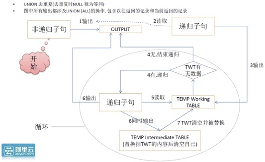

## 沉浸式学习PostgreSQL|PolarDB 10: 社交、刑侦等业务, 关系图谱搜索  
  
### 作者  
digoal  
  
### 日期  
2023-08-31  
  
### 标签  
PostgreSQL , PolarDB , 数据库 , 教学  
  
----  
  
## 背景  
欢迎数据库应用开发者参与贡献场景, 在此[issue](https://github.com/digoal/blog/issues/121)回复即可, 共同建设《沉浸式数据库学习教学素材库》, 帮助开发者用好数据库, 提升开发者职业竞争力, 同时为企业降本提效.  
- 系列课程的核心目标是教大家怎么用好数据库, 而不是怎么运维管理数据库、怎么开发数据库内核. 所以面向的对象是数据库的用户、应用开发者、应用架构师、数据库厂商的产品经理、售前售后专家等角色.  
  
本文的实验可以使用永久免费的阿里云[云起实验室](https://developer.aliyun.com/adc/scenario/exp/f55dbfac77c0467a9d3cd95ff6697a31)来完成.  
  
如果你本地有docker环境也可以把镜像拉到本地来做实验:  
  
x86_64机器使用以下docker image:  
- [《amd64 image》](../202307/20230710_03.md)  
  
ARM机器使用以下docker image:  
- [《arm64 image》](../202308/20230814_02.md)  
  
## 业务场景1 介绍: 社交、刑侦等业务, 关系图谱搜索 - 营销、分销、流量变现、分佣、引爆流行、裂变式传播、家谱、选课、社交、人才库、刑侦、农产品溯源、药品溯源  
图式搜索是PolarDB | PostgreSQL在（包括流计算、全文检索、图式搜索、K-V存储、图像搜索、指纹搜索、空间数据、时序数据、推荐等）诸多特性中的一个。  
  
采用CTE语法，可以很方便的实现图式搜索（N度搜索、最短路径、点、边属性等）。  
  
其中图式搜索中的：层级深度，是否循环，路径，都是可表述的。  
  
可以使用图式搜索(递归查询)的业务场景如下:  
  
- 营销、分销业务系统:  
    - 多层分佣, 递归关系  
    - 短视频工会, 联盟等分级体系.  
    - 喜马拉雅这类音频的工会、联盟等分级体系.  
    - 网约车运营公司、联盟等分级体系.  
- 流量变现系统  
    - 裂变传播, 按裂变递归分组统计分析裂变效果  
- 分佣例如类保险行业  
    - 多层分佣, 递归关系  
- 引爆流行系统  
    - 类似裂变传播, 按裂变层级设置积分规则, 刺激裂变  
- 家谱  
    - 树状关系数据  
- 选课  
    - 选了A课的同学还选了其他哪些课(并按热度TOP返回). 用于图谱推荐.  
- 社交关系  
    - like了A的人还like哪些人. 用于图谱推荐.  
    - 一度关系, N度关系  
    - 两个用户之间的最短关系路径  
- 人才库人脉系统  
    - 一度关系, N度关系  
    - 两个用户之间的最短关系路径  
- 刑侦系统  
    - 一度关系, N度关系  
    - 两个相关人之间的最短关系路径  
- 金融风控  
    - 一度关系, N度关系  
- 农产品溯源  
    - 递归追溯源头  
- 药品溯源  
    - 递归追溯源头  
  
  
### 实现和对照  
创建20万用户，每5万作为一个有牵连的群体，平均每个用户牵连500个用户，形成1亿的大规模关系网。  
  
在此基础上，演示如下业务需求:  
- 1、如何实现N度搜索，边的属性查看，以及最短路径搜索等需求。  
- 2、如何去除循环点，如何控制深度，如何展示路径等。  
- 3、如何生成绘图数据。  
  
1、建表，表结构如下，可以描述点、边。  
  
```  
drop table if exists a;  
  
-- 为了加快数据生成速度, 使用unlogged table.  
create unlogged table a(  
  c1 int,                -- 点1  
  c2 int,                -- 点2  
  prop jsonb,            -- 点1,2对应的边的属性，使用JSON存储，包括权重，关系等等。  
  primary key (c1,c2)    -- 主键  
);  
  
-- 为了加快数据生成速度, 关闭表的autovacuum, 全部写入完成再执行 vacuum analyze a;  
alter table a set (autovacuum_enabled =off);  
alter table a set (toast.autovacuum_enabled =off);  
  
-- 如果不需要查权重, 可以不用加以上索引, c1是驱动列, c1的过滤查询会直接走PK.  
create index on a(c1, COALESCE(((prop ->> 'weight'::text))::float8, 0));  
```  
  
2、生成测试数据：  
  
```  
-- 20万用户每5万隔离成一个有连接的群体, 总共分成4个独立bucket区间,  -- ((width_bucket(:id,1,200001,4)-1)*50000 + (random()*50000)::int)  
postgres=# select width_bucket(1,1,200001,4);  
 width_bucket  
--------------  
            1  
(1 row)  
  
postgres=# select width_bucket(50000,1,200001,4);  
 width_bucket  
--------------  
            1  
(1 row)  
  
postgres=# select width_bucket(50001,1,200001,4);  
 width_bucket  
--------------  
            2  
(1 row)  
  
postgres=# select width_bucket(200001,1,200001,4);  
 width_bucket  
--------------  
            5  
(1 row)  
  
postgres=# select width_bucket(200000,1,200001,4);  
 width_bucket  
--------------  
            4  
(1 row)  
  
这条sql 一次生成1个ID的500条关系.  -- generate_series(1,500)  
```  
  
```  
drop sequence seq;  
create sequence seq INCREMENT 1 START 1 ;  
  
vi t.sql  
  
select nextval('seq') as id \gset  
insert into a select :id, ((width_bucket(:id,1,200001,4)-1)*50000 + ceil(random()*50000)::int) from generate_series(1,500) on conflict (c1,c2) do nothing;  
```  
  
开始生成数据  
  
```  
10个并发, 每个执行20000次刚好覆盖20万用户.  
200000/10 = 20000  
  
pgbench -M prepared -n -r -P 5 -f ./t.sql -c 10 -j 10 -t 20000  
```  
  
生成结果  
  
```  
transaction type: ./t.sql  
scaling factor: 1  
query mode: prepared  
number of clients: 10  
number of threads: 10  
number of transactions per client: 20000  
number of transactions actually processed: 200000/200000  
latency average = 4.657 ms  
latency stddev = 1.981 ms  
initial connection time = 22.792 ms  
tps = 2142.670807 (without initial connection time)  
statement latencies in milliseconds:  
         0.323  select nextval('seq') as id  
         4.334  insert into a select :id, ((width_bucket(:id,1,200001,4)-1)*50000 + ceil(random()*50000)::int) from generate_series(1,500) on c  
  
  
postgres=# select count(*) from a;  
  count  
----------  
 99502172  
(1 row)  
  
postgres=# select c1,count(*) from a where c1 in (1,2,3,5000) group by c1;  
  c1  | count  
------+-------  
    1 |   498  
    2 |   497  
    3 |   499  
 5000 |   499  
(4 rows)  
  
postgres=# \dt+  
                                   List of relations  
 Schema | Name | Type  |  Owner   | Persistence | Access method |  Size   | Description  
--------+------+-------+----------+-------------+---------------+---------+-------------  
 public | a    | table | postgres | unlogged    | heap          | 3441 MB |  
(1 row)  
  
postgres=# \di+  
                                              List of relations  
 Schema |       Name        | Type  |  Owner   | Table | Persistence | Access method |  Size   | Description  
--------+-------------------+-------+----------+-------+-------------+---------------+---------+-------------  
 public | a_c1_coalesce_idx | index | postgres | a     | unlogged    | btree         | 3255 MB |  
 public | a_pkey            | index | postgres | a     | unlogged    | btree         | 3101 MB |  
(2 rows)  
```  
  
  
3、数据约`3.4GB`  
  
#### 传统方法 设计和实验  
传统数据库不支持递归查询语法, 以下请求无法实现.  
- 1、N度搜索，边的属性查看，以及最短路径搜索等需求。  
- 2、去除循环点，如何控制深度，如何展示路径等。  
- 3、生成绘图数据。  
  
#### PolarDB|PG新方法1 设计和实验  
演示如下业务需求:  
- 1、如何实现N度搜索，边的属性查看，以及最短路径搜索等需求。  
- 2、如何去除循环点，如何控制深度，如何展示路径等。  
- 3、如何生成绘图数据。  
  
##### 如何去除循环点、控制深度、展示路径  
  
当路径中重复出现某个点时，说明发生了关系的闭环, 如果不控制, 会导致递归查询死循环。 解决方法:  
- 1、每递归一次，深度加1。  
- 2、使用数组存储路径(点组成的数组)。单列数组，或多列（ROW数组），多列路径参考:  https://www.postgresql.org/docs/14/static/queries-with.html  
- 3、判断新出现的点是否存在于路径中.  如果存在, 说明有闭环存在, 不返回这条关系即可避免递归查询死循环.  
  
SQL如下：  
  
```  
\set v_root_id 2  
\set v_depth_limit 3  
\set v_row_limits 1000  
```  
  
```  
WITH RECURSIVE search_graph(  
  c1,   -- 点1  
  c2,   -- 点2  
  prop, -- 边的属性  
  depth, -- 深度，从1开始  
  path  -- 路径，数组存储  
) AS (  
        SELECT    -- ROOT节点查询  
          g.c1,   -- 点1  
          g.c2,   -- 点2  
          g.prop,   -- 边的属性  
          1 as depth,        -- 初始深度=1  
          ARRAY[g.c1] as path  -- 初始路径  
        FROM a AS g  
        WHERE  
          c1 = :v_root_id         -- ROOT节点=?  
      UNION ALL  
        SELECT     -- 递归子句  
          g.c1,    -- 点1  
          g.c2,    -- 点2  
          g.prop,          -- 边的属性  
          sg.depth + 1 as depth,    -- 深度+1  
          path || g.c1 as path   -- 路径中加入新的点  
        FROM a AS g, search_graph AS sg   -- 循环 INNER JOIN  
        WHERE  
          g.c1 = sg.c2         -- 递归JOIN条件  
          AND (g.c1 <> ALL(sg.path))        -- 防止循环  
          AND sg.depth <= :v_depth_limit    -- 搜索深度=?  
)  
SELECT * FROM search_graph limit :v_row_limits;    -- 查询递归表，可以加LIMIT输出，也可以使用游标  
```  
  
##### N度搜索  
N度搜索，如上SQL，输入`sg.depth <= N`。  
  
例如，搜索`ROOT=31208`的三度数据。  
  
```  
\set ROOT 31208  
\set v_depth_limit 3  
\set v_row_limits 1000  
```  
  
```  
WITH RECURSIVE search_graph(  
  c1,   -- 点1  
  c2,   -- 点2  
  prop, -- 边的属性  
  depth, -- 深度，从1开始  
  path  -- 路径，数组存储  
) AS (  
        SELECT    -- ROOT节点查询  
          g.c1,   -- 点1  
          g.c2,   -- 点2  
          g.prop,   -- 边的属性  
          1 as depth,        -- 初始深度=1  
          ARRAY[g.c1] as path  -- 初始路径  
        FROM a AS g  
        WHERE  
          c1 = :ROOT         -- ROOT节点=?  
      UNION ALL  
        SELECT     -- 递归子句  
          g.c1,    -- 点1  
          g.c2,    -- 点2  
          g.prop,          -- 边的属性  
          sg.depth + 1 as depth,    -- 深度+1  
          path || g.c1 as path   -- 路径中加入新的点  
        FROM a AS g, search_graph AS sg   -- 循环 INNER JOIN  
        WHERE  
          g.c1 = sg.c2         -- 递归JOIN条件  
          AND (g.c1 <> ALL(sg.path))        -- 防止循环  
          AND sg.depth <= :v_depth_limit    -- 搜索深度=?  
)  
SELECT * FROM search_graph limit :v_row_limits;    -- 查询递归表，可以加LIMIT输出，也可以使用游标  
```  
  
##### 最短路径  
去掉搜索深度，并且在查询递归表的语句中，加上WHERE条件（过滤C2）以及LIMIT 1 即可。  
  
注意搜索时确保输入的两个点的变量值在同一个5万的群体内, 否则会遍历`50000*500 也就是2500万条边`最终无结果返回.  
  
例如 `1,50000` 是第一个群体区间.  
  
SQL如下：  
  
```  
-- 例如搜索 1 到 9898 的最短路径.  
-- 深度超过 10 则认为这两个点不可得到.  
  
\set v_point1 1  
\set v_point2 9898  
\set v_max_depth 10  
```  
  
```  
WITH RECURSIVE search_graph(  
  c1,   -- 点1  
  c2,   -- 点2  
  prop, -- 边的属性  
  depth, -- 深度，从1开始  
  path  -- 路径，数组存储  
) AS (  
        SELECT    -- ROOT节点查询  
          g.c1,   -- 点1  
          g.c2,   -- 点2  
          g.prop,   -- 边的属性  
          1 as depth,        -- 初始深度=1  
          ARRAY[g.c1] as path  -- 初始路径  
        FROM a AS g  
        WHERE  
          c1 = :v_point1         -- ROOT节点=?  
      UNION ALL  
        SELECT     -- 递归子句  
          g.c1,    -- 点1  
          g.c2,    -- 点2  
          g.prop,          -- 边的属性  
          sg.depth + 1 as depth,    -- 深度+1  
          path || g.c1 as path   -- 路径中加入新的点  
        FROM a AS g, search_graph AS sg   -- 循环 INNER JOIN  
        WHERE  
          g.c1 = sg.c2         -- 递归JOIN条件  
          AND (g.c1 <> ALL(sg.path))        -- 防止循环  
          AND sg.depth <= :v_max_depth    -- 搜索深度=?   也可以保留，防止搜索太深影响性能，比如深入10以后就不返回了  
)  
SELECT * FROM search_graph  
  where c2 = :v_point2    -- 最短路径的终点  
  limit 1;         -- 查询递归表，可以加LIMIT输出，也可以使用游标  
```  
  
```  
  c1   |  c2  | prop | depth |   path  
-------+------+------+-------+-----------  
 11667 | 9898 |      |     2 | {1,11667}  
(1 row)  
```  
  
##### 如何生成绘图数据  
如果不使用游标, 以上请求要hold所有记录后才开始返回, 而绘图场景可以在接收到一批点后, 就开始生成图像.  
  
为了提高绘图场景的响应速度，使用游标返回。  
  
```  
begin;  
declare cur1 cursor for $query;  
FETCH 1000 from cur1;  
....  
close cur1;  
end;  
```  
  
响应时间飞快，毫秒级响应。  
  
##### 控制每一层的返回记录数  
层级越深，返回的记录就越多，而实际上在图搜索中，并不需要返回每个层级的所有记录，（例如只返回相关性较高的前N条，或者是满足权重大于多少的，前N条），从而控制每个层级的记录数。  
  
在实际场景中, 层次越深关系越弱. weigth越小关系越弱. 所以limit在业务上是有价值的, 同时还能提高性能.  
- 或者用邓巴数: 150 (根据邓巴的研究, 一个人的强关系网极限是150), 每层除了weight来过滤, 同时增加limit 150的限制.  
  
```  
-- 搜索root = 31208的 3度关系数据，同时限制每个层级返回100条。  
  
\set v_root 31208  
\set v_max_depth 3  
\set v_limit_per_layer 100  
```  
  
```  
WITH RECURSIVE search_graph(  
  c1,     -- 点1  
  c2,     -- 点2  
  prop,   -- 边的属性  
  depth,  -- 深度，从1开始  
  path   -- 路径，数组存储  
) AS (  
        select c1,c2,prop,depth,path from (  
        SELECT    -- ROOT节点查询  
          g.c1,   -- 点1  
          g.c2,   -- 点2  
          g.prop,   -- 边的属性  
          1 depth,        -- 初始深度=1  
          ARRAY[g.c1] path   -- 初始路径  
        FROM a AS g  
        WHERE  
          c1 = :v_root             -- ROOT节点=?  
          -- AND coalesce((prop->>'weight')::float8,0) >= ?        -- 相关性权重  
          -- ORDER BY coalesce((prop->>'weight')::float8,0) desc   -- 可以使用ORDER BY，例如返回权重排在前面的N条。  
          limit :v_limit_per_layer            -- 每个层级限制多少条？  
        ) t  
      UNION ALL  
        select c1,c2,prop,depth,path from (  
        SELECT     -- 递归子句  
          g.c1,    -- 点1  
          g.c2,    -- 点2  
          g.prop,          -- 边的属性  
          sg.depth + 1 depth,    -- 深度+1  
          path || g.c1 path    -- 路径中加入新的点  
        FROM a AS g, search_graph AS sg   -- 循环 INNER JOIN  
        WHERE  
          g.c1 = sg.c2         -- 递归JOIN条件  
          AND (g.c1 <> ALL(sg.path))        -- 防止循环  
          AND sg.depth <= :v_max_depth    -- 搜索深度=?  
          -- AND coalesce((prop->>'weight')::float8,0) >= ?   -- 相关性权重  
          -- ORDER BY coalesce((prop->>'weight')::float8,0) desc   -- 可以使用ORDER BY，例如返回权重排在前面的N条。  
          limit :v_limit_per_layer            -- 每个层级限制多少条？  
        ) t  
)  
SELECT * FROM search_graph;    -- 查询递归表，可以加LIMIT输出，也可以使用游标  
```  
  
  
```  
  c1   |  c2   | prop | depth |        path  
-------+-------+------+-------+---------------------  
 31208 |    22 |      |     1 | {31208}  
 31208 |   644 |      |     1 | {31208}  
 31208 |   809 |      |     1 | {31208}  
 31208 |   879 |      |     1 | {31208}  
 31208 |   977 |      |     1 | {31208}  
 31208 |  1011 |      |     1 | {31208}  
 31208 |  1023 |      |     1 | {31208}  
 31208 |  1096 |      |     1 | {31208}  
 31208 |  1118 |      |     1 | {31208}  
 31208 |  1305 |      |     1 | {31208}  
 31208 |  1376 |      |     1 | {31208}  
 31208 |  1440 |      |     1 | {31208}  
...  
   743 |  6823 |      |     4 | {31208,644,384,743}  
   743 | 29440 |      |     4 | {31208,644,384,743}  
   743 | 24514 |      |     4 | {31208,644,384,743}  
   743 | 10329 |      |     4 | {31208,644,384,743}  
   743 | 19528 |      |     4 | {31208,644,384,743}  
   743 | 39914 |      |     4 | {31208,644,384,743}  
   743 |  7904 |      |     4 | {31208,644,384,743}  
   743 | 14666 |      |     4 | {31208,644,384,743}  
   743 | 32060 |      |     4 | {31208,644,384,743}  
(400 rows)  
```  
  
响应速度1.7毫秒。(理由很简单，因为每一个层级都是索引命中，结合PG的cluster特性(按c1排序存储)，可以降低块数，再次提高性能)  
  
```  
set enable_hashjoin=off;  
set enable_mergejoin=off;  
set max_parallel_workers_per_gather=0;  
  
  
                                                                     QUERY PLAN  
-----------------------------------------------------------------------------------------------------------------------------------------------------  
 CTE Scan on search_graph  (cost=611.63..633.63 rows=1100 width=76) (actual time=0.058..1.632 rows=400 loops=1)  
   CTE search_graph  
     ->  Recursive Union  (cost=0.56..611.63 rows=1100 width=76) (actual time=0.055..1.331 rows=400 loops=1)  
           ->  Limit  (cost=0.56..87.76 rows=100 width=76) (actual time=0.052..0.137 rows=100 loops=1)  
                 ->  Index Scan using a_pkey on a g  (cost=0.56..230332.47 rows=264166 width=76) (actual time=0.051..0.104 rows=100 loops=1)  
                       Index Cond: (c1 = 31208)  
           ->  Limit  (cost=0.56..49.09 rows=100 width=76) (actual time=0.071..0.245 rows=75 loops=4)  
                 ->  Nested Loop  (cost=0.56..40596743.28 rows=83666633 width=76) (actual time=0.070..0.231 rows=75 loops=4)  
                       ->  WorkTable Scan on search_graph sg  (cost=0.00..22.50 rows=333 width=40) (actual time=0.005..0.005 rows=1 loops=4)  
                             Filter: (depth <= 3)  
                             Rows Removed by Filter: 25  
                       ->  Index Scan using a_pkey on a g_1  (cost=0.56..118143.31 rows=251251 width=40) (actual time=0.079..0.221 rows=100 loops=3)  
                             Index Cond: (c1 = sg.c2)  
                             Filter: (c1 <> ALL (sg.path))  
 Planning Time: 0.319 ms  
 Execution Time: 1.736 ms  
(16 rows)  
```  
  
##### 图式搜索UDF封装例子  
将冗长的SQL封装成UDF，可以简化应用调用的接口。  
  
##### 1、UDF1 ，N度搜索, 返回记录  
  
```  
create or replace function graph_search1(  
  IN i_root int,                       -- 根据哪个节点开始搜  
  IN i_depth int  default 99999,       -- 搜索层级、深度限制  
  IN i_limit int8 default 2000000000,  -- 限制每一层返回的记录数  
  IN i_weight float8 default 0,        -- 限制权重  
  OUT o_path int[],                    -- 输出：路径, ID 组成的数组  
  OUT o_point1 int,                    -- 输出：点1 ID  
  OUT o_point2 int,                    -- 输出：点2 ID  
  OUT o_link_prop jsonb,               -- 输出：当前两点之间的连接属性  
  OUT o_depth int                      -- 输出：当前深度、层级  
) returns setof record as $$  
declare  
  sql text;  
begin  
  
sql := format($_$  
WITH RECURSIVE search_graph(  
  c1,     -- 点1  
  c2,     -- 点2  
  prop,   -- 当前边的属性  
  depth,  -- 当前深度，从1开始  
  path   -- 路径，数组存储  
) AS (  
        select c1,c2,prop,depth,path from (  
        SELECT                               -- ROOT节点查询  
          g.c1,                              -- 点1  
          g.c2,                              -- 点2  
          g.prop,                            -- 边的属性  
          1 depth,                           -- 初始深度=1  
          ARRAY[g.c1] path                  -- 初始路径  
        FROM a AS g  
        WHERE  
          c1 = %s                                                    -- ROOT节点=?  
          AND coalesce((g.prop->>'weight')::float8,0) >= %s          -- 相关性权重  
          ORDER BY coalesce((g.prop->>'weight')::float8,0) desc      -- 可以使用ORDER BY，例如返回权重排在前面的N条。  
          limit %s                           -- 每个层级限制多少条？  
        ) t  
      UNION ALL  
        select c1,c2,prop,depth,path from (  
        SELECT                               -- 递归子句  
          g.c1,                              -- 点1  
          g.c2,                              -- 点2  
          g.prop,                            -- 边的属性  
          sg.depth + 1 depth,                -- 深度+1  
          path || g.c1 path                 -- 路径中加入新的点  
        FROM a AS g, search_graph AS sg      -- 循环 INNER JOIN  
        WHERE  
          g.c1 = sg.c2                       -- 递归JOIN条件  
          AND (g.c1 <> ALL(sg.path))                      -- 防止循环  
          AND sg.depth <= %s                 -- 搜索深度=?  
          AND coalesce((g.prop->>'weight')::float8,0) >= %s          -- 相关性权重  
          ORDER BY coalesce((g.prop->>'weight')::float8,0) desc      -- 可以使用ORDER BY，例如返回权重排在前面的N条。  
          limit %s                           -- 每个层级限制多少条？  
        ) t  
)  
SELECT path||c2 as o_path, c1 as o_point1, c2 as o_point2, prop as o_link_prop, depth as o_depth  
FROM search_graph;                           -- 查询递归表，可以加LIMIT输出，也可以使用游标  
$_$, i_root, i_weight, i_limit, i_depth, i_weight, i_limit  
);  
  
return query execute sql;  
  
end;  
$$ language plpgsql strict;  
  
alter function graph_search1 set enable_hashjoin=off ;  
alter function graph_search1 set enable_mergejoin=off ;  
alter function graph_search1 set max_parallel_workers_per_gather=0 ;  
```  
  
使用举例：  
  
```  
postgres=# select * from graph_search1(31208, 3, 100, 0);  
             o_path             | o_point1 | o_point2 | o_link_prop | o_depth  
--------------------------------+----------+----------+-------------+---------  
 {31208,48457}                  |    31208 |    48457 |             |       1  
 {31208,13510}                  |    31208 |    13510 |             |       1  
 {31208,40244}                  |    31208 |    40244 |             |       1  
 {31208,35727}                  |    31208 |    35727 |             |       1  
 {31208,27956}                  |    31208 |    27956 |             |       1  
 {31208,5247}                   |    31208 |     5247 |             |       1  
......  
 {31208,48457,2885,33117,6646}  |    33117 |     6646 |             |       4  
 {31208,48457,2885,33117,20697} |    33117 |    20697 |             |       4  
 {31208,48457,2885,33117,37024} |    33117 |    37024 |             |       4  
 {31208,48457,2885,33117,45377} |    33117 |    45377 |             |       4  
 {31208,48457,2885,33117,13240} |    33117 |    13240 |             |       4  
 {31208,48457,2885,33117,22473} |    33117 |    22473 |             |       4  
 {31208,48457,2885,33117,10808} |    33117 |    10808 |             |       4  
 {31208,48457,2885,33117,13325} |    33117 |    13325 |             |       4  
(400 rows)  
  
postgres=# explain analyze select * from graph_search1(31208, 3, 100, 0);  
                                                      QUERY PLAN  
-----------------------------------------------------------------------------------------------------------------------  
 Function Scan on graph_search1  (cost=0.25..10.25 rows=1000 width=76) (actual time=166.703..166.715 rows=400 loops=1)  
 Planning Time: 0.128 ms  
 Execution Time: 166.760 ms  
(3 rows)  
```  
  
##### 2、UDF2，N度搜索, 返回游标  
  
```  
create or replace function graph_search2(  
  IN i_root int,                       -- 根据哪个节点开始搜  
  IN i_res name,                       -- 游标名  
  IN i_depth int  default 99999,       -- 搜索层级、深度限制  
  IN i_limit int8 default 2000000000,  -- 限制每一层返回的记录数  
  IN i_weight float8 default 0         -- 限制权重  
) returns refcursor as $$  
declare  
  sql text;  
  res refcursor := i_res;  
begin  
sql := format($_$  
WITH RECURSIVE search_graph(  
  c1,     -- 点1  
  c2,     -- 点2  
  prop,   -- 当前边的属性  
  depth,  -- 当前深度，从1开始  
  path   -- 路径，数组存储  
) AS (  
        select c1,c2,prop,depth,path from (  
        SELECT                               -- ROOT节点查询  
          g.c1,                              -- 点1  
          g.c2,                              -- 点2  
          g.prop,                            -- 边的属性  
          1 depth,                           -- 初始深度=1  
          ARRAY[g.c1] path                  -- 初始路径  
        FROM a AS g  
        WHERE  
          c1 = %s                                                    -- ROOT节点=?  
          AND coalesce((g.prop->>'weight')::float8,0) >= %s          -- 相关性权重  
          ORDER BY coalesce((g.prop->>'weight')::float8,0) desc      -- 可以使用ORDER BY，例如返回权重排在前面的N条。  
          limit %s                           -- 每个层级限制多少条？  
        ) t  
      UNION ALL  
        select c1,c2,prop,depth,path from (  
        SELECT                               -- 递归子句  
          g.c1,                              -- 点1  
          g.c2,                              -- 点2  
          g.prop,                            -- 边的属性  
          sg.depth + 1 depth,                -- 深度+1  
          path || g.c1 path                 -- 路径中加入新的点  
        FROM a AS g, search_graph AS sg      -- 循环 INNER JOIN  
        WHERE  
          g.c1 = sg.c2                       -- 递归JOIN条件  
          AND (g.c1 <> ALL(sg.path))                      -- 防止循环  
          AND sg.depth <= %s                 -- 搜索深度=?  
          AND coalesce((g.prop->>'weight')::float8,0) >= %s          -- 相关性权重  
          ORDER BY coalesce((g.prop->>'weight')::float8,0) desc      -- 可以使用ORDER BY，例如返回权重排在前面的N条。  
          limit %s                           -- 每个层级限制多少条？  
        ) t  
)  
SELECT path||c2 as o_path, c1 as o_point1, c2 as o_point2, prop as o_link_prop, depth as o_depth  
FROM search_graph;                           -- 查询递归表，可以加LIMIT输出，也可以使用游标  
$_$, i_root, i_weight, i_limit, i_depth, i_weight, i_limit  
);  
  
  
open res for execute sql;  
return res;  
  
end;  
$$ language plpgsql strict;  
  
alter function graph_search2 set enable_hashjoin=off ;  
alter function graph_search2 set enable_mergejoin=off ;  
alter function graph_search2 set max_parallel_workers_per_gather=0 ;  
```  
  
使用举例，  
  
```  
postgres=# begin;  
BEGIN  
postgres=# select * from graph_search2(31208, 'cur1', 3, 100, 0);  
 graph_search2  
---------------  
 cur1  
(1 row)  
  
postgres=# fetch 10 from cur1;  
    o_path     | o_point1 | o_point2 | o_link_prop | o_depth  
---------------+----------+----------+-------------+---------  
 {31208,48457} |    31208 |    48457 |             |       1  
 {31208,13510} |    31208 |    13510 |             |       1  
 {31208,40244} |    31208 |    40244 |             |       1  
 {31208,35727} |    31208 |    35727 |             |       1  
 {31208,27956} |    31208 |    27956 |             |       1  
 {31208,5247}  |    31208 |     5247 |             |       1  
 {31208,18618} |    31208 |    18618 |             |       1  
 {31208,2597}  |    31208 |     2597 |             |       1  
 {31208,33921} |    31208 |    33921 |             |       1  
 {31208,4054}  |    31208 |     4054 |             |       1  
(10 rows)  
  
postgres=# close cur1;  
CLOSE CURSOR  
postgres=# end;  
COMMIT  
```  
  
##### 3、UDF3，返回某两个点的最短路径  
返回某两个点的最短路径，同时限定深度，超过深度则认为不可达。  
  
例如搜索 1 到 100 的最短路径。  
  
```  
create or replace function graph_search3(  
  IN i_p1 int,                       -- 根据哪个节点开始搜  
  IN i_p2 int,                       -- 游标名  
  IN i_depth int  default 99999,     -- 搜索层级、深度限制  
  OUT o_path int[],                    -- 输出：路径, ID 组成的数组  
  OUT o_point1 int,                    -- 输出：点1 ID  
  OUT o_point2 int,                    -- 输出：点2 ID  
  OUT o_link_prop jsonb,               -- 输出：当前两点之间的连接属性  
  OUT o_depth int                      -- 输出：当前深度、层级  
) returns record as $$  
declare  
  sql text;  
begin  
sql := format($_$  
WITH RECURSIVE search_graph(  
  c1,   -- 点1  
  c2,   -- 点2  
  prop, -- 边的属性  
  depth, -- 深度，从1开始  
  path  -- 路径，数组存储  
) AS (  
        SELECT    -- ROOT节点查询  
          g.c1,   -- 点1  
          g.c2,   -- 点2  
          g.prop,   -- 边的属性  
          1 depth,        -- 初始深度=1  
          ARRAY[g.c1] path   -- 初始路径  
        FROM a AS g  
        WHERE  
          c1 = %s         -- ROOT节点=?      --（最短路径的起点）  
      UNION ALL  
        SELECT     -- 递归子句  
          g.c1,    -- 点1  
          g.c2,    -- 点2  
          g.prop,          -- 边的属性  
          sg.depth + 1 as depth,    -- 深度+1  
          path || g.c1 as path    -- 路径中加入新的点  
        FROM a AS g, search_graph AS sg   -- 循环 INNER JOIN  
        WHERE  
          g.c1 = sg.c2                      -- 递归JOIN条件  
          AND (g.c1 <> ALL(sg.path))        -- 防止循环  
          AND sg.depth <= %s    -- 搜索深度=?  
  
)  
SELECT  
  c1 as o_point1,  
  c2 as o_point2,  
  path as o_path,  
  prop as o_link_prop,  
  depth as o_depth  
FROM search_graph  
  where c2 = %s   -- 最短路径的终点  
  limit 1         -- 查询递归表，可以加LIMIT输出，也可以使用游标  
$_$, i_p1, i_depth, i_p2);  
  
execute sql into o_point1,o_point2,o_path,o_link_prop,o_depth;  
return;  
end;  
$$ language plpgsql strict;  
  
  
alter function graph_search3 set enable_hashjoin=off ;  
alter function graph_search3 set enable_mergejoin=off ;  
alter function graph_search3 set max_parallel_workers_per_gather=0 ;  
```  
  
如果要控制深度，比如5度以内搜不到就不搜了，把搜索深度的条件再加进去即可。  
  
例子  
  
```  
postgres=# select * from graph_search3(31208, 50000, 3);  
    o_path     | o_point1 | o_point2 | o_link_prop | o_depth  
---------------+----------+----------+-------------+---------  
 {31208,30555} |    30555 |    50000 |             |       2  
(1 row)  
  
Time: 170.662 ms  
```  
  
##### 4、UDF4，返回某两个点的最短路径，同时允许设置weight条件作为过滤条件，允许设置每一层的搜索记录数限制  
返回某两个点的最短路径，同时限定最大深度(超过认为2个点不可达)，限定每一层的搜索限制.  
  
```  
create or replace function graph_search4(  
  IN i_p1 int,                       -- 根据哪个节点开始搜  
  IN i_p2 int,                       -- 游标名  
  IN i_depth int  default 99999,     -- 搜索层级、深度限制  
  IN i_limit int8 default 2000000000,  -- 限制每一层返回的记录数  
  IN i_weight float8 default 0,        -- 限制权重  
  OUT o_path int[],                    -- 输出：路径, ID 组成的数组  
  OUT o_point1 int,                    -- 输出：点1 ID  
  OUT o_point2 int,                    -- 输出：点2 ID  
  OUT o_link_prop jsonb,               -- 输出：当前两点之间的连接属性  
  OUT o_depth int                      -- 输出：当前深度、层级  
) returns record as $$  
declare  
  sql text;  
begin  
sql := format($_$  
WITH RECURSIVE search_graph(  
  c1,   -- 点1  
  c2,   -- 点2  
  prop, -- 边的属性  
  depth, -- 深度，从1开始  
  path,  -- 路径，数组存储  
  cycle  -- 是否循环  
) AS (  
        select c1,c2,prop,depth,path,cycle from (  
        SELECT    -- ROOT节点查询  
          g.c1,   -- 点1  
          g.c2,   -- 点2  
          g.prop,   -- 边的属性  
          1 as depth,        -- 初始深度=1  
          ARRAY[g.c1] path,   -- 初始路径  
          false as cycle         -- 是否循环(初始为否)  
        FROM a AS g  
        WHERE  
          c1 = %s         -- ROOT节点=?      --（最短路径的起点）  
          AND coalesce((g.prop->>'weight')::float8,0) >= %s          -- 相关性权重  
          -- ORDER BY coalesce((g.prop->>'weight')::float8,0) desc      -- 可以使用ORDER BY，例如返回权重排在前面的N条。  
          limit %s                           -- 每个层级限制多少条？  
        ) t  
      UNION ALL  
        select c1,c2,prop,depth,path,cycle from (  
        SELECT     -- 递归子句  
          g.c1,    -- 点1  
          g.c2,    -- 点2  
          g.prop,          -- 边的属性  
          sg.depth + 1 as depth,    -- 深度+1  
          path || g.c1 as path,    -- 路径中加入新的点  
          (g.c1 = ANY(sg.path)) as cycle    -- 是否循环，判断新点是否已经在之前的路径中  
        FROM a AS g, search_graph AS sg   -- 循环 INNER JOIN  
        WHERE  
          g.c1 = sg.c2         -- 递归JOIN条件  
          AND (g.c1 <> ALL(sg.path))       -- 防止循环  
          AND sg.depth <= %s    -- 搜索深度=?  
          AND coalesce((g.prop->>'weight')::float8,0) >= %s          -- 相关性权重  
          -- ORDER BY coalesce((g.prop->>'weight')::float8,0) desc      -- 可以使用ORDER BY，例如返回权重排在前面的N条。  
          limit %s                           -- 每个层级限制多少条？  
        ) t  
)  
SELECT  
  c1 as o_point1,  
  c2 as o_point2,  
  path as o_path,  
  prop as o_link_prop,  
  depth as o_depth  
FROM search_graph  
  where c2 = %s   -- 最短路径的终点  
  limit 1         -- 查询递归表，可以加LIMIT输出，也可以使用游标  
$_$, i_p1, i_weight, i_limit, i_depth, i_weight, i_limit, i_p2);  
  
execute sql into o_point1,o_point2,o_path,o_link_prop,o_depth;  
return;  
end;  
$$ language plpgsql strict;  
  
  
alter function graph_search4 set enable_hashjoin=off ;  
alter function graph_search4 set enable_mergejoin=off ;  
alter function graph_search4 set max_parallel_workers_per_gather=0 ;  
```  
  
例子  
  
```  
postgres=# select * from graph_search4(31208, 50000, 3, 10000, 0);  
       o_path        | o_point1 | o_point2 | o_link_prop | o_depth  
---------------------+----------+----------+-------------+---------  
 {31208,27242,31772} |    31772 |    50000 |             |       3  
(1 row)  
  
Time: 38.276 ms  
```  
  
##### 使用psql客户端观测性能  
1、观察N度人脉性能:  
  
```  
\timing on  
\set v_root_point 1  
\set v_limit_per_layer 100000  
```  
  
```  
begin;  
set local enable_hashjoin=off;  
set local enable_mergejoin=off;  
set local max_parallel_workers_per_gather=0;  
  
DECLARE cur1 cursor for  
WITH RECURSIVE search_graph(  
  c1,   -- 点1  
  c2,   -- 点2  
  prop, -- 边的属性  
  depth, -- 深度，从1开始  
  path  -- 路径，数组存储  
) AS (  
        SELECT    -- ROOT节点查询  
          g.c1,   -- 点1  
          g.c2,   -- 点2  
          g.prop,   -- 边的属性  
          1 as depth,        -- 初始深度=1  
          ARRAY[g.c1] as path  -- 初始路径  
        FROM a AS g  
        WHERE  
          c1 = :v_root_point         -- ROOT节点=?  
      UNION ALL  
        SELECT     -- 递归子句  
          g.c1,    -- 点1  
          g.c2,    -- 点2  
          g.prop,          -- 边的属性  
          sg.depth + 1 as depth,    -- 深度+1  
          path || g.c1 as path   -- 路径中加入新的点  
        FROM a AS g, search_graph AS sg   -- 循环 INNER JOIN  
        WHERE  
          g.c1 = sg.c2         -- 递归JOIN条件  
          AND (g.c1 <> ALL(sg.path))        -- 防止循环  
          AND sg.depth <= :v_limit_per_layer   -- 搜索深度=?  
)  
SELECT * FROM search_graph;  
  
fetch 1000 from cur1;  
  
  
\watch 1  
```  
  
每返回1000条约耗时`Time: 5.144 ms`  
  
2、观察路径搜索性能(由于使用了广度优先搜索, 所以`limit 1`就是最短路径):  
  
```  
\timing on  
\set v_root_point 1  
\set v_limit_per_layer 100000  
```  
  
```  
begin;  
set local enable_hashjoin=off;  
set local enable_mergejoin=off;  
set local max_parallel_workers_per_gather=0;  
  
DECLARE cur2 cursor for  
WITH RECURSIVE search_graph(  
  c1,   -- 点1  
  c2,   -- 点2  
  prop, -- 边的属性  
  depth, -- 深度，从1开始  
  path  -- 路径，数组存储  
) AS (  
        SELECT    -- ROOT节点查询  
          g.c1,   -- 点1  
          g.c2,   -- 点2  
          g.prop,   -- 边的属性  
          1 as depth,        -- 初始深度=1  
          ARRAY[g.c1] as path  -- 初始路径  
        FROM a AS g  
        WHERE  
          c1 = :v_root_point         -- ROOT节点=?  
      UNION ALL  
        SELECT     -- 递归子句  
          g.c1,    -- 点1  
          g.c2,    -- 点2  
          g.prop,          -- 边的属性  
          sg.depth + 1 as depth,    -- 深度+1  
          path || g.c1 as path   -- 路径中加入新的点  
        FROM a AS g, search_graph AS sg   -- 循环 INNER JOIN  
        WHERE  
          g.c1 = sg.c2         -- 递归JOIN条件  
          AND (g.c1 <> ALL(sg.path))        -- 防止循环  
          AND sg.depth <= :v_limit_per_layer    -- 搜索深度=? 也可以保留，防止搜索太深影响性能，比如深入10以后就不返回了  
)  
SELECT * FROM search_graph  
  where c2 = 100   -- 路径的终点  
--  limit 1    -- 只返回最短路径  
;  
  
  
fetch 1 from cur2;  
  
\watch 1  
```  
  
Time: 96.469 ms  
  
  
  
  
#### PolarDB|PG新方法2 设计和实验  
另外两种提升图式搜索性能的方法请参考:  
- [《PolarDB和PostgreSQL开源通过pggraphblas 稀疏矩阵计算加速深层图式搜索》](../202307/20230705_02.md)  
- [《如何用 PolarDB 整合age算法插件, 实现图式搜索加速 - 刑侦、社交、风控、族谱、推荐等业务图谱类关系数据搜索》](../202212/20221202_01.md)  
  
有兴趣的同学可以自行研究测试.  
  
#### 对照  
  
使用PolarDB | PostgreSQL的CTE语法，可以非常方便的实现图式搜索的需求，包括N度搜索、最短路径搜索，路径、点、边属性(边的属性使用JSON存储，方便架构设计。)展示，层级深度控制和展示，控制每一层的返回数，控制每一层的返回顺序和权重等。  
  
在阿里云ecs上, 50亿的点边网络，N度搜索、最短路径搜索，响应时间都在毫秒级（其中3度搜索，每层100条限制，仅2.1毫秒，TPS达到1.2万）。  
  
如果你遇到N度搜索或者最短路径搜索性能下降的情况, 可能是执行计划有问题, 在这个场景中, 使用fetch逐页返回建议强制嵌套循环, 只有当你想看全部关系时才建议采用hash join.  
```  
set enable_hashjoin=off;  
set enable_mergejoin=off;  
set max_parallel_workers_per_gather=0;  
```  
  
图式搜索最常见的N度人脉、最短路径都可以封装成PolarDB | PostgreSQL的plpgsql UDF接口，便于业务调用（暴露一些输入条件即可）。  
  
  
## 知识点  
CTE 语法  
  
  
  
广度优先搜索  
  
深度优先搜索  
  
## 思考  
如何实现根据层级递减limit, 例如第一层的数据全要, 第二层开始根据weigth来过滤, 同时根据层级的增加逐渐缩小limit值.  例如`limit 1000/log(2, greatest(2,depth)))`  
  
在实际场景中: 1 层次越深, 关系强度越弱. 2 weigth越小关系越弱. 所以"动态limit边"在业务上是有价值的, 同时还能提高性能.  
  
邓巴数:150 (根据邓巴的研究, 一个人的强连接数极限是150, 也就是说能跟你经常有交流、掏心掏肺、有困难时能出手相助的一般不会超过150人), 每层除了weight来过滤, 同时可以再增加`limit least(150, 1000/log(2, greatest(2,depth)))`的限制.  
  
例如:  
  
```  
-- 搜索root = 31208的 30度关系数据，同时限制每个层级动态返回, 最大150条。  
  
\set v_root 31208  
\set v_max_depth 30  
\set v_limit_per_layer least(150, 1000/log(2, greatest(2,sg.depth)))  
```  
  
```  
WITH RECURSIVE search_graph(  
  c1,     -- 点1  
  c2,     -- 点2  
  prop,   -- 边的属性  
  depth,  -- 深度，从1开始  
  path   -- 路径，数组存储  
) AS (  
        select c1,c2,prop,depth,path from (  
        SELECT    -- ROOT节点查询  
          g.c1,   -- 点1  
          g.c2,   -- 点2  
          g.prop,   -- 边的属性  
          1 depth,        -- 初始深度=1  
          ARRAY[g.c1] path   -- 初始路径  
        FROM a AS g  
        WHERE  
          c1 = :v_root             -- ROOT节点=?  
          -- AND coalesce((prop->>'weight')::float8,0) >= ?        -- 相关性权重  
          -- ORDER BY coalesce((prop->>'weight')::float8,0) desc   -- 可以使用ORDER BY，例如返回权重排在前面的N条。  
          limit 150            -- 每个层级限制多少条？  
        ) t  
      UNION ALL  
        select c1,c2,prop,depth,path from (  
        SELECT     -- 递归子句  
          g.c1,    -- 点1  
          g.c2,    -- 点2  
          g.prop,          -- 边的属性  
          sg.depth + 1 depth,    -- 深度+1  
          path || g.c1 path    -- 路径中加入新的点  
        FROM a AS g, search_graph AS sg   -- 循环 INNER JOIN  
        WHERE  
          g.c1 = sg.c2         -- 递归JOIN条件  
          AND (g.c1 <> ALL(sg.path))        -- 防止循环  
          AND sg.depth <= :v_max_depth    -- 搜索深度=?  
          -- AND coalesce((prop->>'weight')::float8,0) >= ?   -- 相关性权重  
          -- ORDER BY coalesce((prop->>'weight')::float8,0) desc   -- 可以使用ORDER BY，例如返回权重排在前面的N条。  
          limit :v_limit_per_layer            -- 每个层级限制多少条？  
        ) t  
)  
SELECT * FROM search_graph;    -- 查询递归表，可以加LIMIT输出，也可以使用游标  
```  
  
limit不支持变量, 看样子需要内核支持:  
```  
ERROR:  42P10: argument of LIMIT must not contain variables  
LINE 37:           limit least(150,1000/log(2,greatest(2,sg.depth))) ...  
                                                         ^  
LOCATION:  checkExprIsVarFree, parse_clause.c:1801  
```  
  
  
## 参考  
  
##### 202307/20230705_02.md   [《PolarDB和PostgreSQL开源通过pggraphblas 稀疏矩阵计算加速深层图式搜索》](../202307/20230705_02.md)  
##### 202212/20221202_01.md   [《如何用 PolarDB 整合age算法插件, 实现图式搜索加速 - 刑侦、社交、风控、族谱、推荐等业务图谱类关系数据搜索》](../202212/20221202_01.md)  
##### 202208/20220818_02.md   [《用PostgreSQL 递归SQL与plpgsql函数 绘制分形图 - 曼德勃罗集(Mandelbrot-上帝的指纹) 和 Julia 集 - `z->z^2+c`》](../202208/20220818_02.md)  
##### 202112/20211202_04.md   [《PostgreSQL 递归CTE 模拟一维空间的元胞自动机 - 复杂系统研究 自组织,涌现》](../202112/20211202_04.md)  
##### 202109/20210917_01.md   [《PostgreSQL 递归查询 - 深度优先、广度优先 搜索举例 - BREADTH DEPTH》](../202109/20210917_01.md)  
##### 202109/20210915_01.md   [《PostgreSQL 递归查询中不支持 order by, 聚合函数, 自包含子查询的》](../202109/20210915_01.md)  
##### 202108/20210805_06.md   [《PostgreSQL 递归一例, 问题、回答、留言, 1对多对多的结构》](../202108/20210805_06.md)  
##### 202106/20210610_01.md   [《森林状图式数据(树状) 的 高效生成方法》](../202106/20210610_01.md)  
##### 202105/20210529_01.md   [《重新发现PostgreSQL之美 - 6 index链表跳跳糖 (CTE recursive 递归的详细用例)》](../202105/20210529_01.md)  
##### 202105/20210510_02.md   [《PostgreSQL 应用开发解决方案最佳实践系列课程 - 8. 树状图谱关系系统(营销、分销、流量变现、分佣、引爆流行、裂变式传播、家谱、选课、社交、人才库、刑侦、农产品溯源、药品溯源)》](../202105/20210510_02.md)  
##### 202102/20210201_03.md   [《PostgreSQL 14 preview - SQL标准增强, 递归(CTE)图式搜索增加广度优先、深度优先语法, 循环语法 - breadth- or depth-first search orders and detect cycles》](../202102/20210201_03.md)  
##### 202011/20201125_01.md   [《PostgreSQL 递归查询在分组合并中的用法》](../202011/20201125_01.md)  
##### 202006/20200615_01.md   [《递归+排序字段加权 skip scan 解决 窗口查询多列分组去重的性能问题》](../202006/20200615_01.md)  
##### 202005/20200515_01.md   [《PostgreSQL 排序去重limit查询优化 - 递归 vs group分组 (loop降到极限, block scan降到极限)》](../202005/20200515_01.md)  
##### 202003/20200329_01.md   [《PostgreSQL 家族图谱、社交图谱、树状关系、藤状分佣、溯源、等场景实践 - 递归,with recursive query (有向无环 , 有向有环)》](../202003/20200329_01.md)  
##### 202002/20200228_01.md   [《累加链条件过滤 - 递归、窗口、UDF、游标、模拟递归、scan 剪切》](../202002/20200228_01.md)  
##### 201903/20190318_04.md   [《PostgreSQL 并行计算解说 之29 - parallel 递归查询, 树状查询, 异构查询, CTE, recursive CTE, connect by》](../201903/20190318_04.md)  
##### 201808/20180808_02.md   [《PostgreSQL 递归应用实践 - 非“传销”的高并发实时藤、树状佣金分配体系》](../201808/20180808_02.md)  
##### 201804/20180408_03.md   [《PostgreSQL 家谱、族谱类应用实践 - 图式关系存储与搜索》](../201804/20180408_03.md)  
##### 201804/20180406_01.md   [《PostgreSQL 递归妙用案例 - 分组数据去重与打散》](../201804/20180406_01.md)  
##### 201803/20180323_03.md   [《PostgreSQL Oracle 兼容性之 - INDEX SKIP SCAN (递归查询变态优化) 非驱动列索引扫描优化》](../201803/20180323_03.md)  
##### 201801/20180102_04.md   [《PostgreSQL 图式搜索(graph search)实践 - 百亿级图谱，毫秒响应》](../201801/20180102_04.md)  
##### 201710/20171009_01.md   [《PostgreSQL 实践 - 内容社区(如论坛)图式搜索应用》](../201710/20171009_01.md)  
##### 201708/20170801_01.md   [《小微贷款、天使投资(风控助手)业务数据库设计(图式搜索\图谱分析) - 阿里云RDS PostgreSQL, HybridDB for PostgreSQL最佳实践》](../201708/20170801_01.md)  
##### 201705/20170519_01.md   [《PostgrSQL 递归SQL的几个应用 - 极客与正常人的思维》](../201705/20170519_01.md)  
##### 201703/20170324_01.md   [《PostgreSQL 递归查询CASE - 树型路径分组输出》](../201703/20170324_01.md)  
##### 201612/20161201_01.md   [《用PostgreSQL找回618秒逝去的青春 - 递归收敛优化》](../201612/20161201_01.md)  
##### 201611/20161128_02.md   [《distinct xx和count(distinct xx)的变态递归优化方法 - 索引收敛(skip scan)扫描》](../201611/20161128_02.md)  
##### 201611/20161128_01.md   [《时序数据合并场景加速分析和实现 - 复合索引，窗口分组查询加速，变态递归加速》](../201611/20161128_01.md)  
##### 201609/20160911_01.md   [《facebook linkbench 测试PostgreSQL社交关系图谱场景性能》](../201609/20160911_01.md)  
##### 201608/20160815_04.md   [《PostgreSQL雕虫小技cte 递归查询，分组TOP性能提升44倍》](../201608/20160815_04.md)  
##### 201607/20160725_01.md   [《PostgreSQL 使用递归SQL 找出数据库对象之间的依赖关系 - 例如视图依赖》](../201607/20160725_01.md)  
##### 201607/20160723_01.md   [《PostgreSQL 递归死循环案例及解法》](../201607/20160723_01.md)  
##### 201604/20160405_01.md   [《PostgreSQL 递归查询一例 - 资金累加链》](../201604/20160405_01.md)  
##### 201512/20151221_02.md   [《PostgreSQL Oracle 兼容性之 - WITH 递归 ( connect by )》](../201512/20151221_02.md)  
##### 201210/20121009_01.md   [《递归优化CASE - group by & distinct tuning case : use WITH RECURSIVE and min() function》](../201210/20121009_01.md)  
##### 201209/20120914_01.md   [《递归优化CASE - performance tuning case :use cursor\trigger\recursive replace (group by and order by) REDUCE needed blockes scan》](../201209/20120914_01.md)  
##### 201105/20110527_01.md   [《PostgreSQL 树状数据存储与查询(非递归) - Use ltree extension deal tree-like data type》](../201105/20110527_01.md)  
  
  
#### [期望 PostgreSQL|开源PolarDB 增加什么功能?](https://github.com/digoal/blog/issues/76 "269ac3d1c492e938c0191101c7238216")
  
  
#### [PolarDB 云原生分布式开源数据库](https://github.com/ApsaraDB "57258f76c37864c6e6d23383d05714ea")
  
  
#### [PolarDB 学习图谱: 训练营、培训认证、在线互动实验、解决方案、内核开发公开课、生态合作、写心得拿奖品](https://www.aliyun.com/database/openpolardb/activity "8642f60e04ed0c814bf9cb9677976bd4")
  
  
#### [PostgreSQL 解决方案集合](../201706/20170601_02.md "40cff096e9ed7122c512b35d8561d9c8")
  
  
#### [德哥 / digoal's github - 公益是一辈子的事.](https://github.com/digoal/blog/blob/master/README.md "22709685feb7cab07d30f30387f0a9ae")
  
  

  
  
#### [购买PolarDB云服务折扣活动进行中, 55元起](https://www.aliyun.com/activity/new/polardb-yunparter?userCode=bsb3t4al "e0495c413bedacabb75ff1e880be465a")
  
  
#### [About 德哥](https://github.com/digoal/blog/blob/master/me/readme.md "a37735981e7704886ffd590565582dd0")
  
