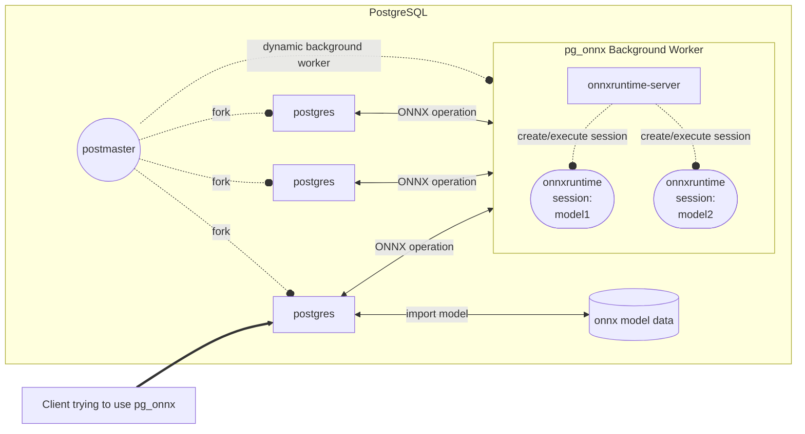

## pg_onnx, 接入开放神经网络集市, load已有模型, 让数据库快速具备推理能力      
                
### 作者                
digoal                
                
### 日期                
2023-09-22                
                
### 标签                
PostgreSQL , PolarDB , 推理 , onnx , ONNX: Open Neural Network Exchange , 开放神经网络集市     
                
----                
                
## 背景          
如果将AI相关的操作按运算量分为2类:       
- 轻计算, 直接在数据库中完成. 例如这篇信息即将提到的pg_onnx, 或者之前提过的 [lantern, lantern_extras](../202309/20230922_01.md)    
- 重计算, 调用大模型集市 API. 例如阿里云灵积.      
    
要让数据库具备AI运算能力, 有2种方法    
- 用本地数据自己训练模型, 训练过程漫长. 例如: [madlib](https://madlib.apache.org/) , [pg4ml](https://gitee.com/seanguo_007/plpgsql_pg4ml)     
- load已经训练好的模型, 例如来自模型集市.  这个就是pg_onnx干的.  还需要可以运行模型的server: ONNX Runtime Server.     
    
    
1、ONNX Runtime is a cross-platform inference and training machine-learning accelerator.    
    
ONNX Runtime: cross-platform, high performance ML inferencing and training accelerator    
    
https://github.com/microsoft/onnxruntime    
    
2、ONNX Runtime Server: The ONNX Runtime Server is a server that provides TCP and HTTP/HTTPS REST APIs for ONNX inference.    
    
https://github.com/kibae/onnxruntime-server     
    
3、pg_onnx: ONNX Runtime integrated with PostgreSQL. Perform ML inference with data in your database.     
    
https://github.com/kibae/pg_onnx     
    
架构图    
    

        
我尽快集成到以下学习容器中, 方便大家学习.     
  
永久免费的阿里云[云起实验室](https://developer.aliyun.com/adc/scenario/f55dbfac77c0467a9d3cd95ff6697a31)来完成.    
    
如果你本地有docker环境也可以把镜像拉到本地来做实验:    
    
x86_64机器使用以下docker image:    
- [《amd64 image》](../202307/20230710_03.md)    
    
ARM机器使用以下docker image:    
- [《arm64 image》](../202308/20230814_02.md)    
    
## How to use    
    
### Install extension    
    
```sql    
CREATE EXTENSION IF NOT EXISTS pg_onnx;    
```    
    
### Simple Usage    
    
- Import an ONNX file and get the inference results.    
    
```sql    
SELECT pg_onnx_import_model(    
        'sample_model', --------------- model name    
        'v20230101', ------------------ model version     
        PG_READ_BINARY_FILE('/your_model_path/model.onnx')::bytea, -- model binary data    
        '{"cuda": true}'::jsonb, ------ options    
        'sample model' ---------------- description    
    );    
    
SELECT pg_onnx_execute_session(    
        'sample_model', -- model name    
        'v20230101', ----- model version    
        '{    
          "x": [[1], [2], [3]],    
          "y": [[3], [4], [5]],    
          "z": [[5], [6], [7]]    
        }' --------------- inputs    
    );    
```    
    
- Depending on the type and shape of the inputs and outputs of the ML model, you can see different results. Below is an    
  example of the result.    
    
```    
                            pg_onnx_execute                                 
--------------------------------------------------------------------------------    
 {"output": [[0.7488641738891602], [0.8607008457183838], [0.9725375175476074]]}    
```    
    
### Using inference results with triggers    
    
- When data is added, use the BEFORE INSERT trigger to update some columns with ML inference results.    
- *Depending on your ML model, this can have a significant performance impact, so be careful when using it.*    
- [Example](https://github.com/kibae/pg_onnx/blob/main/pg_onnx/expected/05-trigger.out)    
    
```sql    
-- Create a test table    
CREATE TABLE trigger_test    
(    
    id         SERIAL PRIMARY KEY,    
    value1     INT,    
    value2     INT,    
    value3     INT,    
    prediction FLOAT    
);    
    
-- Create a trigger function    
CREATE OR REPLACE FUNCTION trigger_test_insert()    
    RETURNS TRIGGER AS    
$$    
DECLARE    
    result jsonb;    
BEGIN    
    result := pg_onnx_execute_session(    
            'sample_model', 'v20230101',    
            JSONB_BUILD_OBJECT(    
                    'x', ARRAY [[NEW.value1]],    
                    'y', ARRAY [[NEW.value2]],    
                    'z', ARRAY [[NEW.value3]]));    
    
    -- output shape: float[-1,1]    
    -- eg: {"output": [[0.6492120623588562]]}    
    NEW.prediction := result -> 'output' -> 0 -> 0;    
    RETURN NEW;    
END;    
$$    
    LANGUAGE plpgsql;    
    
-- Create a trigger    
CREATE TRIGGER trigger_test_insert    
    BEFORE INSERT    
    ON trigger_test    
    FOR EACH ROW    
EXECUTE PROCEDURE trigger_test_insert();    
```    
    
----    
    
## Functions    
    
- Provides several functions for importing ONNX file and executing and managing it.    
- [ONNX Model Functions](https://github.com/kibae/pg_onnx/wiki/Functions#onnx-model-functions)    
    - [pg_onnx_import_model(TEXT, TEXT, BYTEA, JSONB, TEXT)](https://github.com/kibae/pg_onnx/wiki/Functions#pg_onnx_import_modeltext-text-bytea-jsonb-text)    
    - [pg_onnx_drop_model(TEXT, TEXT)](https://github.com/kibae/pg_onnx/wiki/Functions#pg_onnx_drop_modeltext-text)    
    - [pg_onnx_list_model()](https://github.com/kibae/pg_onnx/wiki/Functions#pg_onnx_list_model)    
    - [pg_onnx_inspect_model_bin(BYTEA)](https://github.com/kibae/pg_onnx/wiki/Functions#pg_onnx_inspect_model_binbytea)    
- [ONNX Session Functions](https://github.com/kibae/pg_onnx/wiki/Functions#onnx-session-functions)    
    - [pg_onnx_create_session(TEXT, TEXT)](https://github.com/kibae/pg_onnx/wiki/Functions#pg_onnx_create_sessiontext-text)    
    - [pg_onnx_describe_session(TEXT, TEXT)](https://github.com/kibae/pg_onnx/wiki/Functions#pg_onnx_describe_sessiontext-text)    
    - [pg_onnx_execute_session(TEXT, TEXT, JSONB)](https://github.com/kibae/pg_onnx/wiki/Functions#pg_onnx_execute_sessiontext-text-jsonb)    
    - [pg_onnx_destroy_session(TEXT, TEXT, JSONB)](https://github.com/kibae/pg_onnx/wiki/Functions#pg_onnx_destroy_sessiontext-text-jsonb)    
    - [pg_onnx_list_session()](https://github.com/kibae/pg_onnx/wiki/Functions#pg_onnx_list_session)    
    
## 参考    
https://github.com/microsoft/onnxruntime    
    
https://github.com/kibae/onnxruntime-server    
    
https://github.com/kibae/pg_onnx    
    
https://onnx.ai/onnx/intro/    
    
https://onnx.ai/onnx/intro/concepts.html#functions    
    
    
  
#### [期望 PostgreSQL|开源PolarDB 增加什么功能?](https://github.com/digoal/blog/issues/76 "269ac3d1c492e938c0191101c7238216")
  
  
#### [PolarDB 云原生分布式开源数据库](https://github.com/ApsaraDB "57258f76c37864c6e6d23383d05714ea")
  
  
#### [PolarDB 学习图谱: 训练营、培训认证、在线互动实验、解决方案、内核开发公开课、生态合作、写心得拿奖品](https://www.aliyun.com/database/openpolardb/activity "8642f60e04ed0c814bf9cb9677976bd4")
  
  
#### [PostgreSQL 解决方案集合](../201706/20170601_02.md "40cff096e9ed7122c512b35d8561d9c8")
  
  
#### [德哥 / digoal's github - 公益是一辈子的事.](https://github.com/digoal/blog/blob/master/README.md "22709685feb7cab07d30f30387f0a9ae")
  
  

  
