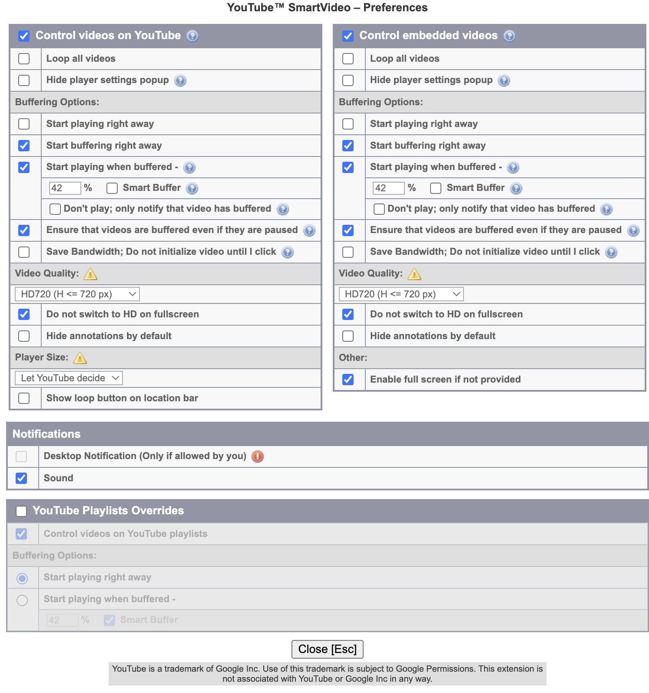

## chrome|firefox disable DASH 让youtube支持持续无限缓冲视频    
              
### 作者              
digoal              
              
### 日期              
2023-11-05              
              
### 标签              
PostgreSQL , PolarDB , macOS , youtube , 缓冲 , 插件 , DASH                    
              
----              
              
## 背景     
  
环境:   
- [《macOS 通过“oversea region ECS和ssh隧道转发代理请求” OR “openVPN” 提升github等访问体验 - chrome Proxy SwitchyOmega , cli ... 可用》](../202310/20231029_01.md)    
  
使用macOS 活动监视器 - 网络监测网络使用情况, 发现一个问题: 使用youtube看视频时, 缓冲30秒左右就不持续缓冲了, 所以对于1Mb带宽的环境, 偶尔也会遇到卡顿的问题.   
  
解决这个问题最好的办法就是让youtube可以持续缓冲视频, 让带宽持续保持跑满状态, 而不是加载30秒就停下来.    
    
原因是浏览器的DASH技术 , 根据网络情况自适应缓冲长度的流媒体技术, 如果你暂停播放, 可能就不缓存了. 对于带宽较大的用户, 可以节约一些流量. 对于带宽小的用户, 可能会导致卡顿, 开启了DASH你可能想让后台持续的缓冲视频是行不通的. 例如`oversea ecs proxy + youtube`的环境, 带宽较小.        
    
DASH技术解释:   
- https://developer.mozilla.org/zh-CN/docs/Web/Media/DASH_Adaptive_Streaming_for_HTML_5_Video    
- https://lifehacker.com/preload-entire-youtube-videos-by-disabling-dash-playbac-1186454034    
    
  
1、经过验证, firefox可以实现youtube暂停状态无限buffer video.     
    
firefox 代理配置:    
- https://addons.mozilla.org/zh-CN/firefox/addon/switchyomega/    
- 可参考chrome的代理配置: [《macOS 通过“oversea region ECS和ssh隧道转发代理请求” OR “openVPN” 提升github等访问体验 - chrome Proxy SwitchyOmega , cli ... 可用》](../202310/20231029_01.md)      
    
在firefox中如何关闭dash, firefox URL填入如下:     
```    
about:config    
```    
    
设置 disables `media.mediasource.enabled` to `false` in `about:config` page of Firefox.       
    
重启firefox    
    
打开youtube视频, 查看视频的详细统计信息, 现在已经可以一直缓冲video了.     
    
2、经过验证, chrome新版本已经不支持disable dash. 所以新版本chrome无法实现youtube暂停状态无限buffer video.     
    
2\.1、chrome关闭dash方法1, 需要老版本chrome, 比较麻烦:    
    
https://beebom.com/how-force-youtube-fully-buffer-video-chrome-firefox/    
    
```    
# chrome URL 输入    
    
chrome://flags/    
```    
    
2\.2、chrome关闭dash方法2, 无效:    
    
https://www.technorms.com/35122/preload-buffer-entire-youtube-videos-disabling-dash-playback    
    
Tampermonkey:     
- https://chromewebstore.google.com/    
- https://chromewebstore.google.com/detail/%E7%AF%A1%E6%94%B9%E7%8C%B4/dhdgffkkebhmkfjojejmpbldmpobfkfo    
    
enable Developer mode, 右上角, 开启开发者模式    
```    
chrome://extensions    
```    
    
YouTubeCenter    
- https://github.com/YePpHa/YouTubeCenter/wiki/Developer-Version    
- https://yeppha.github.io/    
- https://github.com/YePpHa/YouTubeCenter/raw/master/dist/YouTubeCenter.crx    
    
2\.3、chrome 方法3 插件SmartVideo For YouTube, 无效:    
    
chrome 插件 SmartVideo For YouTube      
- https://qastack.cn/webapps/23671/force-youtube-to-always-buffer-the-entire-video-before-playing    
- https://chromewebstore.google.com/detail/smartvideo-for-youtube
- https://chromewebstore.google.com/detail/smartvideo-for-youtube/lnkdbjbjpnpjeciipoaflmpcddinpjjp 
    
配置SmartVideo插件:     
- chrome-extension://lnkdbjbjpnpjeciipoaflmpcddinpjjp/welcome.html    
- chrome-extension://lnkdbjbjpnpjeciipoaflmpcddinpjjp/options.html    
    
勾选 Ensure that videos are buffered even if they are paused.    
    
    
打开一个视频, 鼠标移动到视频中, 右键, 点击详细统计信息, 可以看到connection Speed, Network Activity, Buffer Health等信息.   
  
实测发现  SmartVideo For YouTube  的设置对缓冲无效, 暂停后依旧会导致只缓冲一部分, 然后就不缓存了.    
       
  
## 参考    
https://beebom.com/how-force-youtube-fully-buffer-video-chrome-firefox/     
    
https://www.pcworld.com/article/447494/force-youtube-to-buffer-your-entire-video.html     
    
https://webapps.stackexchange.com/questions/23671/force-youtube-to-always-buffer-the-entire-video-before-playing     
    
https://addons.mozilla.org/zh-CN/firefox/addon/adblock-for-youtube/    
    
https://developer.mozilla.org/zh-CN/docs/Web/Media/DASH_Adaptive_Streaming_for_HTML_5_Video    
    
    
  
#### [期望 PostgreSQL|开源PolarDB 增加什么功能?](https://github.com/digoal/blog/issues/76 "269ac3d1c492e938c0191101c7238216")
  
  
#### [PolarDB 云原生分布式开源数据库](https://github.com/ApsaraDB "57258f76c37864c6e6d23383d05714ea")
  
  
#### [PolarDB 学习图谱: 训练营、培训认证、在线互动实验、解决方案、内核开发公开课、生态合作、写心得拿奖品](https://www.aliyun.com/database/openpolardb/activity "8642f60e04ed0c814bf9cb9677976bd4")
  
  
#### [PostgreSQL 解决方案集合](../201706/20170601_02.md "40cff096e9ed7122c512b35d8561d9c8")
  
  
#### [德哥 / digoal's github - 公益是一辈子的事.](https://github.com/digoal/blog/blob/master/README.md "22709685feb7cab07d30f30387f0a9ae")
  
  

  
  
#### [购买PolarDB云服务折扣活动进行中, 55元起](https://www.aliyun.com/activity/new/polardb-yunparter?userCode=bsb3t4al "e0495c413bedacabb75ff1e880be465a")
  
  
#### [About 德哥](https://github.com/digoal/blog/blob/master/me/readme.md "a37735981e7704886ffd590565582dd0")
  
