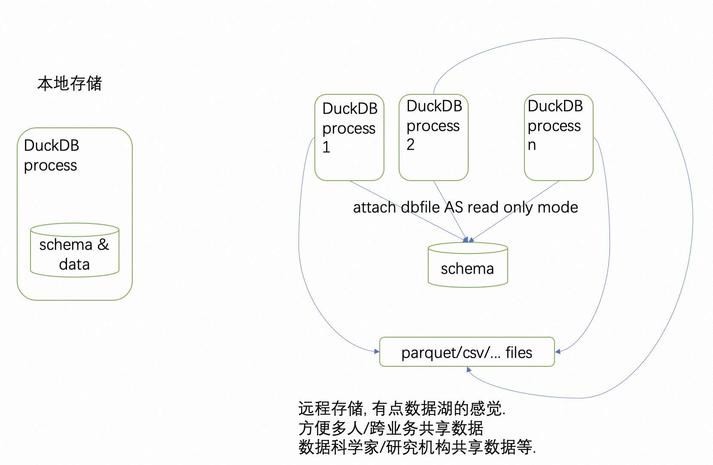
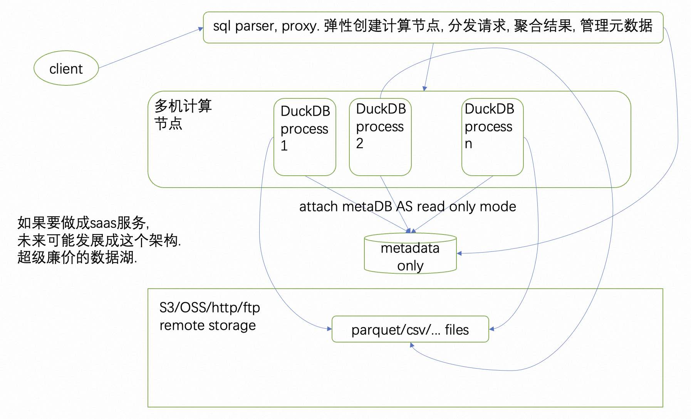

## 期望未来DuckDB的架构演变方向      
                                                                                          
### 作者                                                                    
digoal                                                                    
                                                                    
### 日期                                                                    
2023-11-30                                                                
                                                                    
### 标签                                                                    
PostgreSQL , PolarDB , duckdb , in process , cs                        
                                                                    
----                                                                    
                                                                    
## 背景    
DuckDB发展有点快, 不确定是不是在不久的将来会支持我期待的模式. 2022年9月份写过一些类似使用duckdb实现serverless datalake的文章:  
- [《德说-第135期, duckdb的产品形态如何盈利? 未来数据库产品的商业形态》](../202209/20220909_02.md)  
- [《DuckDB parquet 分区表 / Delta Lake(数据湖) 应用》](../202209/20220905_01.md)  
- [《德说-第140期, duckdb+容器+parquet+对象存储, 实现SaaS场景, 低代码拖拉拽多维度实时分析 降本提效》](../202209/20220913_02.md)  
  
原来2022 11月motherduck就已经在搞这个模式了:  https://motherduck.com/  
- motherduck重新定义了一把serverless, 因为它的计算跑在client侧, 所以准确的说它是Noserver. 顶多也就用MotherDuck来管理一下元数据.  所以它的商业模式应该是转售对象存储的, 当然还有一定的元数据管理费用. 不过server也不是完全没有计算, 当client和存储很远时(例如client在云下, 而数据在云上的情况), 数据传输就会成为瓶颈, 那么你可以使用server来做计算.   做厚client, 做薄server 是motherduck的思路.   
- https://mp.weixin.qq.com/s?__biz=MzA5MTM4MzY1Mw==&mid=2247484124&idx=1&sn=d3d001d54218760f25331d5823e9f817&chksm=907c70d6a70bf9c0ac892be045da3b88f4981b921c6a974454f534ea02aa2d93beb8e4a0d0bc&token=147752621&lang=zh_CN#rd    
- https://motherduck.com/docs/architecture-and-capabilities
  
  
### 现在DuckDB是in process的架构
元数据在本地, 不能共享(但是可以read only模式attach datafile. 也就是说多个进程是可以同时只读模式打开这个datafile的. 我们可以只在datafile内保存schema定义, 实现共享metadata的目的.) 

   
### 期望的架构
演变成服务.  

聚合代理(分发任务多duckdb, 聚合结果) - duckdb(多机的独立分布式in process计算) - metadata db(共享源数据) - s3/oss parquet(廉价远程分布式存储)  

就算不做这个聚合代理, 仅剥离metdata也是很有意义的.  (每个组件独立发展, 必要的时候可以形成联合体, 非必要依旧可以单机in process运行.)  [《将 "数据结构、数据存储" 从 "数据库管理系统" 剥离后 - 造就了大量大数据产品(DataFusion, arrow-rs, databend等)》](../202303/20230328_02.md)     
- duckdb真正做到了计算存储分离, 像搭积木一样组合数据库能力。想要分析就用分析类引擎, 想要时序就用时序类引擎, 想要时空就用时空类存储引擎...          
    - 存储只是一个文件格式, 例如支持 iceberg, parquet, arrow, inmemory ..... 存放在哪里都可以只要能访问到(例如oss, s3, ftp, nas, nfs, 或者本地)    
    - 计算直接嵌入程序, 例如直接嵌入到python中.    
  
duckdb要更加的实用, 在生态还有一个很重要的一环, 如何快速将数据源的数据导出为parquet, 并建立meta信息.  

gda (generate data's agent) - data sources - 快速生成parquet并导入s3/oss, 以及对应的metadata.  
  
  
#### [期望 PostgreSQL|开源PolarDB 增加什么功能?](https://github.com/digoal/blog/issues/76 "269ac3d1c492e938c0191101c7238216")
  
  
#### [PolarDB 云原生分布式开源数据库](https://github.com/ApsaraDB "57258f76c37864c6e6d23383d05714ea")
  
  
#### [PolarDB 学习图谱: 训练营、培训认证、在线互动实验、解决方案、内核开发公开课、生态合作、写心得拿奖品](https://www.aliyun.com/database/openpolardb/activity "8642f60e04ed0c814bf9cb9677976bd4")
  
  
#### [PostgreSQL 解决方案集合](../201706/20170601_02.md "40cff096e9ed7122c512b35d8561d9c8")
  
  
#### [德哥 / digoal's github - 公益是一辈子的事.](https://github.com/digoal/blog/blob/master/README.md "22709685feb7cab07d30f30387f0a9ae")
  
  

  
  
#### [购买PolarDB云服务折扣活动进行中, 55元起](https://www.aliyun.com/activity/new/polardb-yunparter?userCode=bsb3t4al "e0495c413bedacabb75ff1e880be465a")
  
  
#### [About 德哥](https://github.com/digoal/blog/blob/master/me/readme.md "a37735981e7704886ffd590565582dd0")
  
