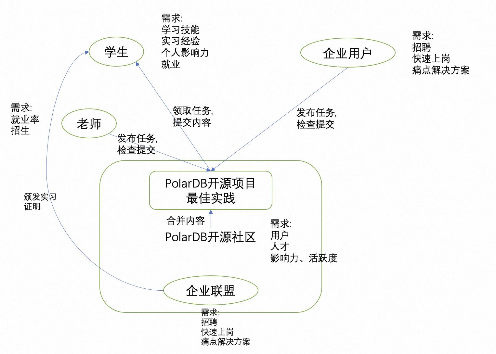

## 德说-第268期, PolarDB开源社区发布大学生实习项目 
                                                            
### 作者                                                            
digoal                                                            
                                                            
### 日期                                                            
2023-11-30                                                   
                                                            
### 标签                                                            
PostgreSQL , DuckDB , PolarDB , 开源社区 , 实习 , 最佳实践 , 技能 , 战绩 , 知道 , 相信 , 优秀 , 影响力 , 被链接 , 链接 , flag , 供需连              
                                                            
----                                                            
                                                            
## 背景     
[《德说-第267期, 从虾米到大神》](../202311/20231118_01.md)  这一篇信息详细论述了大学生如何通过参与开源项目获得技能、影响力、实习经验、战绩, 最终成为大神的方法论.   
  
今天隆重给大家介绍PolarDB开源社区发布的大学生实习项目:     
- https://gitee.com/polardb/polardb-practice    
  
  
  
学生通过这个项目可以在校获得实习证明, 学习到技能, 同时提升自己的影响力, 为将来找到好的工作早做打算.  
  
目前已经有很多所高校参与其中, 陆续发布任务和提交内容, 同时也呼吁更多的高校参与进来.  
   
并且, 任何人都可以来发布任务(当然企业联盟里的企业肯定是最愿意来发布的, 因为他们想要招聘人才, 并且希望人才入职后可以快速进入工作状态.)  
  
任务例子:  
  
```  
任务标题: 解决大模型无法学习私有知识、新增知识的问题  
  
背景: 在私有领域, 有些文档并非公开, 以私有文档的形式存在, 公开的大模型对这些内容不了解. 又或者新的文档不断产生, 大模型的能力截止于训练时间点, 对新知识不了解.    
  
适用场景: 大模型在私有领域, 公共领域的新知识的实时运用.   
  
任务价值: 重新训练需要大量算力, 耗费大量时间. 通过向量数据库+已有大模型, 让大模型快速接入私有知识库和新知识. 提升效率, 降低成本.    
  
目标: 通过向量数据库+已有大模型, 让大模型快速接入私有知识库和新知识.   
  
检验标准: 基于私有知识和新增知识, 询问大模型, 是否可以得到正确的答复?   
```  
  
希望大学生可以多多参与这样的开源项目.  
  
## 如何快速和大量高校建立合作?   
1、通过伙伴和高校合作. 例如已经和很多高校建立合作的机构: 开放原子, 培训机构等.  这种合作方案的设计需要考虑五方的供需(企业联盟、合作方、高校、自身、学生)   
   
2、直接面向高校合作.  这种合作方案的设计需要考虑四方的供需(企业联盟、高校、自身、学生)   
  
  
#### [期望 PostgreSQL|开源PolarDB 增加什么功能?](https://github.com/digoal/blog/issues/76 "269ac3d1c492e938c0191101c7238216")
  
  
#### [PolarDB 云原生分布式开源数据库](https://github.com/ApsaraDB "57258f76c37864c6e6d23383d05714ea")
  
  
#### [PolarDB 学习图谱: 训练营、培训认证、在线互动实验、解决方案、内核开发公开课、生态合作、写心得拿奖品](https://www.aliyun.com/database/openpolardb/activity "8642f60e04ed0c814bf9cb9677976bd4")
  
  
#### [PostgreSQL 解决方案集合](../201706/20170601_02.md "40cff096e9ed7122c512b35d8561d9c8")
  
  
#### [德哥 / digoal's github - 公益是一辈子的事.](https://github.com/digoal/blog/blob/master/README.md "22709685feb7cab07d30f30387f0a9ae")
  
  

  
  
#### [购买PolarDB云服务折扣活动进行中, 55元起](https://www.aliyun.com/activity/new/polardb-yunparter?userCode=bsb3t4al "e0495c413bedacabb75ff1e880be465a")
  
  
#### [About 德哥](https://github.com/digoal/blog/blob/master/me/readme.md "a37735981e7704886ffd590565582dd0")
  
