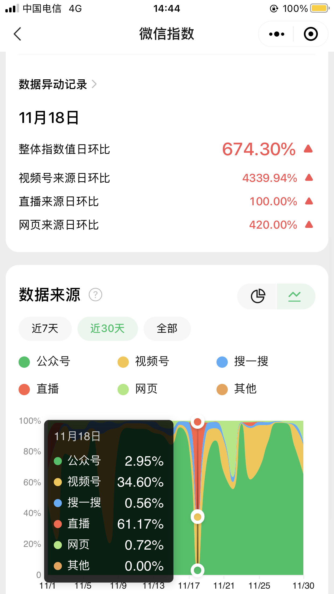
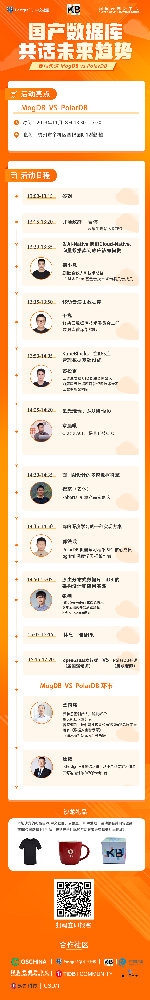

## 为什么企业更愿意抱团组织/参加小型沙龙      
                            
### 作者                            
digoal                            
                            
### 日期                            
2023-11-30                           
                            
### 标签                            
PostgreSQL , duckdb , PolarDB , 开源社区 , 企业联盟 , 投入产出 , 流量 , 品牌 , 广告            
                            
----                            
                            
## 背景      
### 大型峰会的几个弊端    
- 由于盈利的需要, 招商后需要满足赞助商的营销需求, 峰会容易变成广告秀场, 不仅展台上打广告, 分享的议题也充斥着广告.      
- 为了达到规模化的效果吸引赞助商, 甚至有一些会可能花钱注水请会虫来参会, 看起来人很多, 其实大都不是赞助商想要的目标用户.      
- 对于特别卷的行业, 大多数的参会人员可能都是同行, 沦为一场赞助商占大多数, 用户占少数的会议.      
- 大型峰会往往集中在几个大城市, 在经济下行周期, 需要出差参加会议的用户可能会被砍掉差旅, 无法参加会议.      
- 对于产业内的乙方, 往往需要不菲的赞助费用, 才能在大型会议上进行分享.      
- 小用户无法吸引赞助商, 能参会进行分享的甲方用户又往往都集中在头部行业的头部企业, 每年都是这些行业和场景, 讲来讲去就会缺乏新意.      
- 大型峰会灵活性较小, 互动受限, 大多数时候仅限于分享问答环节.  (当然, 组局闭门会议又会涉及到出钱赞助的问题)       
    
所以, 产业内的乙方赞助大型峰会投入产出是较低的, 一来无法直接带来商机, 二来就是纯粹的打广告, 而且会议新闻稿对应的线上广告很多也是垃圾流量.      
   
     
### 一场成功的沙龙, 应该满足2个模型    
供需连.      
      
《素书》 . 德者, 人之所得, 使万物各得其所欲.      
   
### 企业抱团组织/参加小型沙龙的优势    
    
1、一场成功的沙龙应该是这样的:      
- 甲方展示了自己的业务场景、痛点和需求      
- 甲方用乙方的产品解决了自己的痛点和需求, 并传播了乙方的产品/解决方案      
- 乙方将自己的产品和技术传播出去, 建立了自己的技术影响力      
- 甲方了解到了新的解决方案      
- 甲方一次性了解了多个相关的产品的优缺点、适应的场景等      
- 流量方通过以上的精彩内容打造了流量爆款, 并带来了更多新增用户      
- 演讲者提升了自己的个人影响力      
- 专家和用户产生了激烈的互动, 形成了更强烈的友情      
   
如何最小成本的满足各方需求, 达到以上目的?  
    
2、搞一场小型沙龙要投入什么?      
- 海报设计、小礼品(文化传播)、场地、茶水、嘉宾晚宴、KTV聚会(凝聚力(一起唱过歌、一起扛过枪、一起同过窗))      
    
分摊到每个企业, 最多的可能2K左右(场地、茶水、嘉宾晚宴), 对于出得多的企业, 在内容、宣传方面可以多一点权益来进行平衡. 而且既然是抱团, 企业可以轮流来负责最大的这块费用.      
    
3、搞一场小型沙龙可能需要哪些参与方?      
- 嘉宾(甲方、乙方)      
- 企业(甲方、乙方)      
- 高校      
- 传播方 ( 开源社区, 各企业公众号|视频号, KOL公众号|视频号, 传统媒体如开源中国、csdn、墨天轮, 协会如CCF、CNCF、xxx基金会、开源协会等 )      
- 主办方 ( 出场地|大经费的企业、开源社区、主要参与的运营方等 )      
- 协办方 ( 协会等 )      
    
4、内容呈现形式:     
- mini talk,     
- 公开课,     
- 现场 PK,     
- 圆桌,     
- 现场组队互动,     
- meetup     
- 走进高校     
- 走进名企     
    
5、传播形式:    
- 直播    
- 回放    
- 现场    
    
流量无外乎线上+线下. 小型沙龙的核心是打造爆款内容, 线下输出内容, 线下建交, 线上传播.      
    
6、企业抱团组织/参加小型沙龙的优势      
- 1、成本低, 轮流赞助(场地、嘉宾晚宴、KTV).      
- 2、输出干货多, 纯广告少.      
- 3、地方属性, 互动属性强, 面对面可以建立更好的信任和粘性.      
- 4、内容呈现更加灵活, 更容易打造爆款.  可以免费吸引到流量平台的支持.      
- 5、流量放大, 联盟企业和流量平台集中在一个时间段发布同一份内容, 容易拉升微信指数、搜索引擎指数, 提升影响力.      
    
  
   
例如我们近期搞的几场小型沙龙, 效果非常好.   
  
  
   
    
