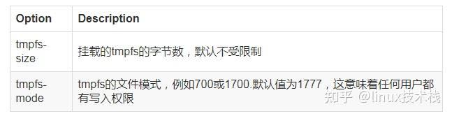

## 转载 - Docker volumn, bind mount, tmpfs mount 的使用. 宿主机如何和容器共享数据? 容器使用宿主机内存?   
                                              
### 作者                                              
digoal                                              
                                              
### 日期                                              
2023-12-08                                           
                                              
### 标签                                              
PostgreSQL , DuckDB , PolarDB , docker , volumn , bind mount , tmpfs mount                     
                                              
----                                              
                                              
## 背景      
原文: https://zhuanlan.zhihu.com/p/468642439  
  
默认容器的数据的读写发生在容器的存储层，当容器被删除时其上的数据将会丢失。所以我们应该尽量保证容器存储层不发生写操作，为了实现数据的持久化存储我们需要选择一种方案来保存数据，当前有以下几种方式：  
  
volumes , bind mounts , tmpfs mounts   
  
下图展示了这三种技术：  
  
  
  
## Volumes  
Volumes(数据卷)是一个可供一个或多个容器使用的位于宿主机上特殊目录，它拥有以下特性：  
  
数据卷可以在容器间共享和重用 对数据卷的写入操作，不会对镜像有任何影响 数据卷默认会一直存在，即使容器被删除使用数据卷的目的是持久化容器中的数据，以在容器间共享或者防止数据丢失（写入容器存储层的数据会丢失）。  
  
使用数据卷的步骤一般分为两步：  
  
创建一个数据卷 使用 `-v` 或 `--mount` 参数将数据卷挂载容器指定目录中，这样所有该容器针对该指定目录的写操作都会保存在宿主机上的 Volume 中。  
  
### Volume管理  
创建一个Volume：  
```  
$ docker volume create my-vol  
```  
  
查看Volumes：  
```  
$ docker volume ls  
local    my-vol  
$ docker volume inspect my-vol  
[  
 {  
  "Driver": "local",  
  "Labels": {},  
  "Mountpoint": "/var/lib/docker/volumes/my-vol/_data",  
  "Name": "my-vol",  
  "Options": {},  
  "Scope": "local"  
 }  
]  
```  
  
我么可以看到创建的 Volume `my-vol` 保存在目录`/var/lib/docker/volumes/`下，以后所有针对该 Volume 的写数据都会保存中目录`/var/lib/docker/volumes/my-vol/_data`下。  
  
删除一个 Volume：  
```  
$ docker volume rm my-vol  
```  
  
或者删除所有未使用的 Volumes：  
```  
docker volume prune  
```  
  
### 挂载数据卷到容器目录  
创建了一个 Volume 之后，我们可以在运行容器时通过指定 `-v` 或 `--mount` 参数来使用该 Volume：  
  
使用`--mount`参数：  
```  
$ docker run -d --name=nginxtest --mount source=nginx-vol,destination=/usr/share/nginx/html nginx:latest  
```  
  
`source` 指定 volume name，`destination` 指定容器内的文件或文件夹。  
  
或者使用 `-v` 参数：  
```  
$ docker run -d --name=nginxtest -v nginx-vol:/usr/share/nginx/html nginx:latest  
```  
  
挂载成功后，容器从 `/usr/share/nginx/html` 目录下读取或写入数据，实际上都是从宿主机的 `nginx-vol` 数据卷中读取或写入数据。因此 Volumes 或 Bind mounts 也可以看作是容器和宿主机共享文件的一种方式。  
  
`-v` 参数使用冒号分割 source 和 destination，冒号前半部分是 source(宿主机上的volumn name)，后半部分是 destination(容器中的目录)。  
  
如果你挂载一个还不存在的数据卷，Docker 会自动创建它。（因此创建数据卷那一步非必需）  
  
如果容器中的待挂载的目录不是一个空目录，那么该目录下的文件会被复制到数据卷中。（Bind mounts下，宿主机上的目录总会覆盖容器中的待挂载目录）  
  
`-v` 参数和 `--mount` 参数总的来说功能几乎相同，唯一的区别是在运行一个 service 时只能够 --mount 参数来挂载数据卷。  
  
### 使用只读数据卷  
有些情况下，我们希望某个数据卷对某个容器来说是只读的，可以通过添加 `readonly` 选项来实现：  
```  
$ docker run -d --name=nginxtest --mount source=nginx-vol,destination=/usr/share/nginx/html,readonly nginx:latest  
```  
  
或者使用 `-v` 参数：  
```  
$ docker run -d --name=nginxtest -v nginx-vol:/usr/share/nginx/html:ro nginx:latest  
```  
  
## Bind mounts  
Bind mounts 模式 和 Volumes非常相似，不同点在于Bind mounts模式是将宿主机上的任意文件或文件夹挂载到容器，而Volumes本质上是将Docker服务管理的一块区域（默认是 `/var/lib/docker/volumes` 下的文件夹）挂载到容器。  
  
Bind mounts的使用和Volumes类似，也是通过`-v`或`--mount`参数将宿主机文件挂载容器中。下面是一个例子：  
  
使用`--mount`参数时，需要指定`type=bind`：  
```  
$ docker run -d --name=nginxtest --mount type=bind,source=/usr/local/web,destination=/usr/share/nginx/html nginx:latest  
```  
  
上面的例子将宿主机上的 `/usr/local/web` 文件夹挂载到容器中的 `/usr/share/nginx/html` 文件夹。  
  
或者使用`-v`参数：  
```  
$ docker run -d --name=nginxtest -v /usr/local/web:/usr/share/nginx/html nginx:latest  
```  
  
挂载成功后，容器从 `/usr/share/nginx/html` 目录下读取或写入数据，实际上都是从宿主机的 `/usr/local/web` 目录中读取或写入数据。因此Volumes或Bind mounts也可以看作是容器和宿主机共享文件的一种方式。  
  
如果你使用Bind mounts挂载宿主机目录到一个容器中的非空目录，那么此容器中的非空目录中的文件会被隐藏，容器访问这个目录时能够访问到的文件均来自于宿主机目录。这也是Bind mounts模式和Volumes模式最大的行为上的不同。  
  
## tmpfs mounts  
Volumes和Bind mounts模式使我们能够在宿主机和容器间共享文件从而我们能够将数据持久化到宿主机上，以避免写入容器存储层带来的容器停止后数据的丢失的问题。  
  
如果你使用linux运行Docker，那么避免写入数据到容器存储层还有一个方案：`tmpfs mounts`。  
  
tmpfs mounts，顾名思义，是一种非持久化的数据存储。它仅仅将数据保存在宿主机的内存中，一旦容器停止运行，tmpfs mounts会被移除，从而造成数据丢失。  
  
### tmpfs mounts的使用  
  
我们可以在运行容器时通过指定`--tmpfs`参数或`--mount`参数来使用tmpfs mounts：  
```  
$ docker run -d -it --name tmptest --mount type=tmpfs,destination=/app nginx:latest  
$ docker run -d -it --name tmptest --tmpfs /app nginx:latest  
```  
  
使用`--tmpfs`参数无法指定任何其他的可选项，并且不能用于Swarm Service。  
  
使用`docker container inspect tmptest`命令，然后查看Mounts部分可以看到：  
```  
"Tmpfs": {  
 "/app": ""  
},  
```  
  
### tmpfs mounts 可选选项  
  
  
- `tmpfs-size`, 字节数, 默认无限   
- `tmpfs-mode`, 权限, 默认1777, 任何用户都可以读写    
  
一个例子：  
```  
docker run -d -it --name tmptest --mount type=tmpfs,destination=/app,tmpfs-mode=1770 nginx:latest  
```  
    
  
#### [期望 PostgreSQL|开源PolarDB 增加什么功能?](https://github.com/digoal/blog/issues/76 "269ac3d1c492e938c0191101c7238216")
  
  
#### [PolarDB 云原生分布式开源数据库](https://github.com/ApsaraDB "57258f76c37864c6e6d23383d05714ea")
  
  
#### [PolarDB 学习图谱: 训练营、培训认证、在线互动实验、解决方案、内核开发公开课、生态合作、写心得拿奖品](https://www.aliyun.com/database/openpolardb/activity "8642f60e04ed0c814bf9cb9677976bd4")
  
  
#### [PostgreSQL 解决方案集合](../201706/20170601_02.md "40cff096e9ed7122c512b35d8561d9c8")
  
  
#### [德哥 / digoal's github - 公益是一辈子的事.](https://github.com/digoal/blog/blob/master/README.md "22709685feb7cab07d30f30387f0a9ae")
  
  

  
  
#### [购买PolarDB云服务折扣活动进行中, 55元起](https://www.aliyun.com/activity/new/polardb-yunparter?userCode=bsb3t4al "e0495c413bedacabb75ff1e880be465a")
  
  
#### [About 德哥](https://github.com/digoal/blog/blob/master/me/readme.md "a37735981e7704886ffd590565582dd0")
  
