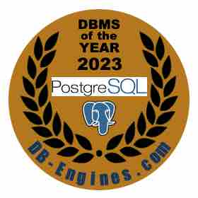
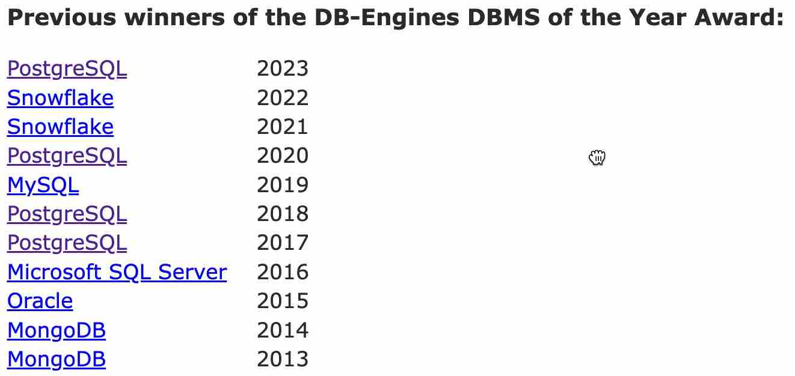
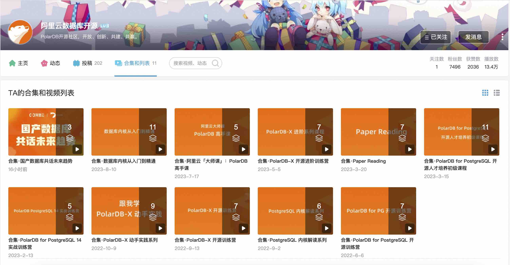

## PostgreSQL 获得2023年度数据库, 和你我有什么关系?       
                              
### 作者                              
digoal                              
                              
### 日期                              
2024-01-03                        
                              
### 标签                              
PostgreSQL , PolarDB , DuckDB , 年度数据库        
                              
----                              
                              
## 背景    
恭喜PostgreSQL荣获DB-Engine 2023年度数据库, 这已经是PG第4次获此殊荣, PG的前景这么好, 非常值得学习.   
  
  
  
  
  
那么如何学好PG, 如何把本领变成钱?    
  
## 第一步  
需要一些教程:    
  
一、阿里云数据库PolarDB开源社区官方B站账号, 持续发布精彩课程.     
  
https://space.bilibili.com/2070322174/channel/series    
  
合集·数据库内核从入门到精通 , 与武汉大学弘毅班的刘老师合作打造, 非常推荐.   
  
合集·PolarDB for PostgreSQL 开源人才培养初级课程 , CUUG创始人陈老师精心录制的课程, CUUG曾经是Oracle官方指定合作伙伴, 培养了大量DBA, 所以对数据库管理人才的培养陈老师绝对权威.   
  
合集·PostgreSQL 内核解读系列 , 阿里云数据库团队架构师于老师做的课程, 备受欢迎.   
  
    
  
二、我组织的一些课程, 涵盖管理、优化、原理、场景实践等方面, 也非常欢迎有兴趣的同学一起交流学习.    
  
欢迎关注我的github, 打开如下文档(首页有点大, 打开需要耐心): `https://github.com/digoal/blog/blob/master/README.md`    
    
1、视频下载链接： https://pan.baidu.com/s/1Q5u5NSrb0gL5-psA9DCBUQ   (提取码：5nox   如果链接失效请通知我, 谢谢)    
- PostgreSQL 9.3 数据库管理与优化 4天    
- PostgreSQL 9.3 数据库管理与优化 5天    
- PostgreSQL 9.3 数据库优化 3天    
- PostgreSQL 9.1 数据库管理与开发 1天    
- PostgreSQL 专题讲座    
    
2、[《2021-重新发现PG之美 系列 - 适合架构师与业务开发者》](../202105/20210526_02.md)    
3、[《2021-DB吐槽大会 系列 - 适合产品经理、架构师与内核开发者》](../202108/20210823_05.md)    
4、[《2020-PostgreSQL 应用场景最佳实践 - 适合架构师与业务开发者》](../202009/20200903_02.md)    
5、[《2020-PostgreSQL+MySQL 联合解决方案课程 - 适合架构师与业务开发者》](../202001/20200118_02.md)    
6、[《2019-PostgreSQL 2天体系化培训 - 适合DBA》](../201901/20190105_01.md)    
7、[《2017-PostgreSQL 应用场景实践 - 适合架构师与业务开发者》](../201805/20180524_02.md)    
8、[《2019-PG天天象上沙龙纪录 - 适合DBA》](../201801/20180121_01.md)    
9、[《2019-Oracle迁移到PostgreSQL - 适合DBA与业务开发者》](../201906/20190615_03.md)      
10、[《2021-Ask 德哥 系列 - 适合DBA与业务开发者》](../202109/20210928_01.md)      
11、[《2018-PG生态、案例、开发实践系列 - 适合架构师与业务开发者》](https://edu.aliyun.com/course/836/lesson/list)    
12、[《2018-阿里云POLARDB for Oracle|RDS for PPAS 讲解视频》](https://yq.aliyun.com/live/582)    
13、[《2022-每天5分钟,PG聊通透 - 系列1 - 热门问题》](../202112/20211209_02.md)     
14、[《2023-PostgreSQL|PolarDB 学习实验手册》](../202308/20230822_02.md)       
15、[《2023-PostgreSQL|PolarDB 永久免费实验环境》](https://developer.aliyun.com/adc/scenario/f55dbfac77c0467a9d3cd95ff6697a31)       
16、[《2023-PostgreSQL Docker镜像学习环境 ARM64版, 已集成热门插件和工具》](../202308/20230814_02.md)       
17、[《2023-PostgreSQL Docker镜像学习环境 AMD64版, 已集成热门插件和工具》](../202307/20230710_03.md)       
18、[《Oracle DBA 增值+转型 PostgreSQL 学习方法、路径》](../201804/20180425_01.md)     
19、[《PostgreSQL、Greenplum 技术+108个场景结合最佳实践《如来神掌》》](../201706/20170601_02.md)      
20、[《PostgreSQL 数据库安全指南 - 以及安全合规》](../201506/20150601_01.md)      
21、[《PostgreSQL 持续稳定使用的小技巧 - 最佳实践、规约、规范》](../201902/20190219_02.md)      
22、[《PostgreSQL DBA最常用SQL》](../202005/20200509_02.md)      
23、[《PostgreSQL 数据库开发规范》](../201609/20160926_01.md)      
24、[《企业数据库选型规则》](197001/20190214_01.md)      
25、[《PostgreSQL 规格评估 - 微观、宏观、精准 多视角估算数据库性能(选型、做预算不求人)》](../201709/20170921_01.md)      
26、[《数据库选型之 - 大象十八摸 - 致 架构师、开发者》](../201702/20170209_01.md)      
27、[《数据库选型思考(PostgreSQL,MySQL,Oracle)》](../201702/20170208_03.md)      
28、[PolarDB开源数据库高校工作室 发布《PostgreSQL+PolarDB开源数据库人才认证培训》教程+实验手册 下载](../202306/20230616_03.md)      
  
## 第二步  
  
你还需要一个好的学习环境:    
  
1、我花了大量时间整理的 PostgreSQL docker 镜像, 集成了必备插件200+款, 大量PG相关工具等, 方便你学习调用.   
  
x86_64机器使用以下docker image:          
- [《amd64 image》](../202307/20230710_03.md)          
  
```  
# 拉取镜像, 第一次拉取一次即可. 或者需要的时候执行, 将更新到最新镜像版本.    
docker pull registry.cn-hangzhou.aliyuncs.com/digoal/opensource_database:pg14_with_exts    
    
# 启动容器    
docker run --platform linux/amd64 -d -it -P --cap-add=SYS_PTRACE --cap-add SYS_ADMIN --privileged=true --name pg --shm-size=1g registry.cn-hangzhou.aliyuncs.com/digoal/opensource_database:pg14_with_exts  
  
##### 如果你想学习备份恢复、修改参数等需要重启数据库实例的case, 换个启动参数, 使用参数--entrypoint将容器根进程换成bash更好. 如下:   
docker run -d -it -P --cap-add=SYS_PTRACE --cap-add SYS_ADMIN --privileged=true --name pg --shm-size=1g --entrypoint /bin/bash registry.cn-hangzhou.aliyuncs.com/digoal/opensource_database:pg14_with_exts  
##### 以上启动方式需要进入容器后手工启动数据库实例: su - postgres; pg_ctl start;    
    
# 进入容器    
docker exec -ti pg bash    
    
# 连接数据库    
psql    
```  
          
ARM机器使用以下docker image:          
- [《arm64 image》](../202308/20230814_02.md)         
  
```  
# 拉取镜像, 第一次拉取一次即可. 或者需要的时候执行, 将更新到最新镜像版本.    
docker pull registry.cn-hangzhou.aliyuncs.com/digoal/opensource_database:pg14_with_exts_arm64    
    
# 启动容器    
docker run -d -it -P --cap-add=SYS_PTRACE --cap-add SYS_ADMIN --privileged=true --name pg --shm-size=1g registry.cn-hangzhou.aliyuncs.com/digoal/opensource_database:pg14_with_exts_arm64  
  
##### 如果你想学习备份恢复、修改参数等需要重启数据库实例的case, 换个启动参数, 使用参数--entrypoint将容器根进程换成bash更好. 如下:   
docker run -d -it -P --cap-add=SYS_PTRACE --cap-add SYS_ADMIN --privileged=true --name pg --shm-size=1g --entrypoint /bin/bash registry.cn-hangzhou.aliyuncs.com/digoal/opensource_database:pg14_with_exts_arm64    
##### 以上启动方式需要进入容器后手工启动数据库实例: su - postgres; pg_ctl start;    
    
# 进入容器    
docker exec -ti pg bash    
    
# 连接数据库    
psql    
```   
  
2、对于学生或者培训机构, 你可以通过云起实验统一学习环境. 如果学生要花1天来搭建学习环境, 相信任何培训机构都是忍不了的.  
  
[《2023-PostgreSQL|PolarDB 永久免费实验环境》](https://developer.aliyun.com/adc/scenario/f55dbfac77c0467a9d3cd95ff6697a31)     
  
https://developer.aliyun.com/adc/scenario/f55dbfac77c0467a9d3cd95ff6697a31    
  
## 第三步  
学完是不是考个证?    
  
国内做 PG 培训和认证的很多, 可以自己搜一下, 比如cuug, 盘古云课堂都有PG认证, 如果你能在PG认证基础上再拿个基于PG的国产数据库认证, 含金量可能会更高一些.    
  
  
## 第四步  
学完要不要加入社区, 通过写公众号, 在社群中分享知识, 帮助其他人解决问题, 建立自己的影响力?    
  
PostgreSQL中文社区:  
  
http://www.postgres.cn/  
  
PolarDB开源社区:  
  
https://openpolardb.com/home  
  
## 第五步  
通过参加比赛或者参与PG相关开源项目的开发建立自己在业内的权威性?  同时让更多的猎头、大V找到你?    
  
国内供给学生的比赛比较多, 例如编程之夏、开源之夏.    
  
面向已上班人士的权威比赛相对较少, 例如天池大赛.    
  
我会在2024年和社区、企业联盟、高校联合发起一些比赛, 欢迎你来参加.  关注我的公众号可以获得比赛活动的预告信息.    
  
已经写在我的计划里: [《德说-第272期, 知行合一 (2023 我干了什么? 2024 我要干什么?)》](../202401/20240101_01.md)    
  
完成这5步, 我相信你可以实现 [《德说-第267期, 从虾米到大神》](../202311/20231118_01.md)    
    
  
#### [期望 PostgreSQL|开源PolarDB 增加什么功能?](https://github.com/digoal/blog/issues/76 "269ac3d1c492e938c0191101c7238216")
  
  
#### [PolarDB 开源数据库](https://openpolardb.com/home "57258f76c37864c6e6d23383d05714ea")
  
  
#### [PolarDB 学习图谱](https://www.aliyun.com/database/openpolardb/activity "8642f60e04ed0c814bf9cb9677976bd4")
  
  
#### [购买PolarDB云服务折扣活动进行中, 55元起](https://www.aliyun.com/activity/new/polardb-yunparter?userCode=bsb3t4al "e0495c413bedacabb75ff1e880be465a")
  
  
#### [PostgreSQL 解决方案集合](../201706/20170601_02.md "40cff096e9ed7122c512b35d8561d9c8")
  
  
#### [德哥 / digoal's Github - 公益是一辈子的事.](https://github.com/digoal/blog/blob/master/README.md "22709685feb7cab07d30f30387f0a9ae")
  
  
#### [About 德哥](https://github.com/digoal/blog/blob/master/me/readme.md "a37735981e7704886ffd590565582dd0")
  
  

  
