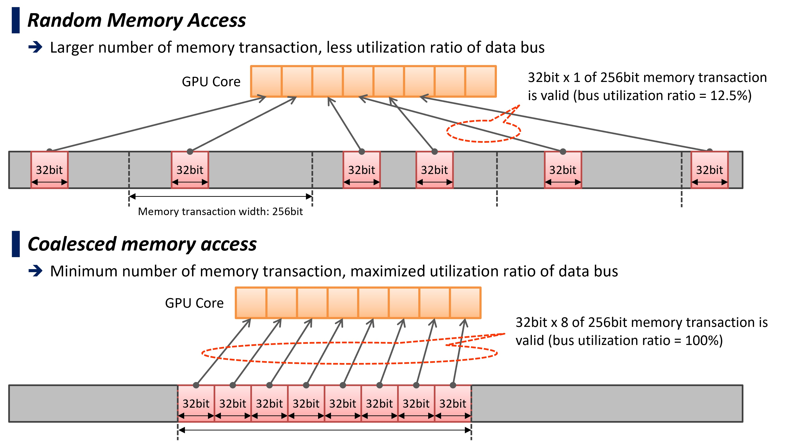

## PostgreSQL 利用GPU加速OLAP的插件pg-strom发布5.0版本   
                                  
### 作者                                  
digoal                                  
                                  
### 日期                                  
2024-01-04                            
                                  
### 标签                                  
PostgreSQL , PolarDB , DuckDB , pg-strom , GPU        
                                  
----                                  
                                  
## 背景     
PostgreSQL 利用GPU加速OLAP的插件pg-strom发布5.0版本.  
  
http://heterodb.github.io/pg-strom/  
  
http://heterodb.github.io/pg-strom/release_v5.0/  
  
## 概述  
PG-Strom v5.0主要变化如下：  
- 代码库已经完全重新设计并进行了各种改进。  
- 进程模型从多进程模型修改为多线程后台工作者（PG-Strom GPU Service）。它减少了 GPU 资源消耗和任务切换的开销。  
- 使用 CUDA C++ 动态生成的 GPU 设备代码被伪内核代码替换。它消除了使用 NVRTC 的即时编译，并改进了首次响应时间。这也是未来支持CSD（计算存储驱动器）和DPU（数据处理单元）的基础。  
- GPU-Cache 现在部署在 CUDA 托管内存上，允许过度使用 GPU 设备内存。  
- 修改了 PostgreSQL 数据类型的数据布局以调整合并内存访问。  
- GpuPreAgg取代了整个GROUP BY实现，然后提高了整体性能。  
- 无论 Join 的深度如何，GpuJoin 仅提取元组一次。  
- Arrow_Fdw 和 Pg2Arrow 支持箭头文件的最小/最大统计。  
- 添加了两个箭头工具：Pca2Arrow 捕获网络数据包，arrow2csv 以 CSV 格式转储箭头文件。  
  
## 先决条件  
- PostgreSQL v15.x、v16.x  
- CUDA 工具包 12.2 或更高版本  
- CUDA Toolkit 支持的 Linux 发行版  
- 英特尔 x86 64 位架构 (x86_64)  
- NVIDIA GPU CC 6.0 或更高版本（至少 Pascal；建议使用 Volta 或更高版本）  
  
## 新流程模型  
在 v5.0 中，多线程后台工作进程（PG-Strom GPU 服务）协调 GPU 资源和任务执行，各个 PostgreSQL 后端进程通过 IPC 向 GPU 服务发送请求并接收结果。  
  
在 v3.x 系列之前，每个 PostgreSQL 后端单独控制 GPU 设备。当 CUDA 和 PG-Strom 的软件质量不够时，这种设计可以通过轻松识别有问题的代码来帮助软件调试，但是，随着数据库会话的增加，它会极大地消耗 GPU 资源，从任务的角度来看，不推荐使用这种软件架构-交换。  
  
这一设计更改使得 PG-Strom v5.0 对于并发数据库会话的增加更加稳定，并提高了繁重的 GPU 任务的性能。  
  
## 伪设备代码  
PG-Strom v5.0 现在根据提供的 SQL 生成自己的“伪代码”，并且 GPU 设备代码充当解释器来执行此“伪代码”。与 v3.x 系列不同，它不再生成 CUDA C++ 本机代码。  
  
乍一看，这似乎是性能下降的一个因素。然而，动态代码生成最初只针对每次查询都会变化的一小部分代码，例如 WHERE 子句；大多数实现都是静态构建的，运行时编译由 NVRTC 处理。（大约 150 毫秒）现在可以省略，从而有助于缩短响应时间。  
  
“伪代码”是一组低级命令，可以在 EXPLAIN VERBOSE 中显示。例如，下面的查询包含`lo_quantity > 10`WHERE 子句中的表达式。该操作定义为`Scan Quals OpCode`调用比较列和常数`numeric_gt`之间的大小关系的函数 . `lo_quantity` 列和常量 `10`  
  
```  
postgres=# explain verbose select count(*), sum(lo_quantity), lo_shipmode from lineorder where lo_quantity > 10 group by lo_shipmode;  
                                                                                                                                                                           QUERY PLAN  
  
----------------------------------------------------------------------------------------------------------------------------------------------------------------------------------------------------------------------------------------------------------------------------------------------------------------------------------------------------------------  
 HashAggregate  (cost=3242387.01..3242387.10 rows=7 width=51)  
   Output: pgstrom.fcount((pgstrom.nrows())), pgstrom.sum_fp_num((pgstrom.psum((lo_quantity)::double precision))), lo_shipmode  
   Group Key: lineorder.lo_shipmode  
   ->  Custom Scan (GpuPreAgg) on public.lineorder  (cost=3242386.89..3242386.96 rows=7 width=51)  
         Output: (pgstrom.nrows()), (pgstrom.psum((lo_quantity)::double precision)), lo_shipmode  
         GPU Projection: pgstrom.nrows(), pgstrom.psum((lo_quantity)::double precision), lo_shipmode  
         GPU Scan Quals: (lo_quantity > '10'::numeric) [rows: 600128800 -> 479262800]  
         GPU-Direct SQL: enabled (GPU-0)  
         KVars-Slot: <slot=0, type='numeric', expr='lo_quantity'>, <slot=1, type='bpchar', expr='lo_shipmode'>, <slot=2, type='bpchar', expr='lo_shipmode'>, <slot=3, type='float8', expr='lo_quantity'>  
         KVecs-Buffer: nbytes: 83968, ndims: 2, items=[kvec0=<0x0000-dfff, type='numeric', expr='lo_quantity'>, kvec1=<0xe000-147ff, type='bpchar', expr='lo_shipmode'>]  
         LoadVars OpCode: {Packed items[0]={LoadVars(depth=0): kvars=[<slot=0, type='numeric' resno=9(lo_quantity)>, <slot=1, type='bpchar' resno=17(lo_shipmode)>]}}  
         MoveVars OpCode: {Packed items[0]={MoveVars(depth=0): items=[<slot=0, offset=0x0000-dfff, type='numeric', expr='lo_quantity'>, <slot=1, offset=0xe000-147ff, type='bpchar', expr='lo_shipmode'>]}}}  
         Scan Quals OpCode: {Func(bool)::numeric_gt args=[{Var(numeric): slot=0, expr='lo_quantity'}, {Const(numeric): value='10'}]}  
         Group-By KeyHash OpCode: {HashValue arg={SaveExpr: <slot=1, type='bpchar'> arg={Var(bpchar): kvec=0xe000-14800, expr='lo_shipmode'}}}  
         Group-By KeyLoad OpCode: {LoadVars(depth=-2): kvars=[<slot=2, type='bpchar' resno=3(lo_shipmode)>]}  
         Group-By KeyComp OpCode: {Func(bool)::bpchareq args=[{Var(bpchar): slot=1, expr='lo_shipmode'}, {Var(bpchar): slot=2, expr='lo_shipmode'}]}  
         Partial Aggregation OpCode: {AggFuncs <nrows[*], psum::fp[slot=3, expr='lo_quantity'], vref[slot=1, expr='lo_shipmode']> args=[{SaveExpr: <slot=3, type='float8'> arg={Func(float8)::float8 arg={Var(numeric): kvec=0x0000-e000, expr='lo_quantity'}}}, {SaveExpr: <slot=1, type='bpchar'> arg={Var(bpchar): kvec=0xe000-14800, expr='lo_shipmode'}}]}  
         Partial Function BufSz: 24  
(18 rows)  
```  
  
尽管目前尚未实现，但该伪代码也旨在将来将 SQL 处理卸载到 CSD（计算存储驱动器）或 DPU（数据处理单元）。  
  
## 改进数据布局  
GPU 具有比 CPU 更宽的内存带宽，但为了利用这种性能，需要满足合并内存访问的条件，即同时访问附近的内存区域。  
  
在 v5.0 中，GPU 设备代码中 PostgreSQL 数据类型的布局已得到改进，使它们更适合合并内存访问。如果我们按原样使用 PostgreSQL 数据类型，则在某些时间引用的字段将被放置在离散位置，从而无法有效利用 DRAM 的读取带宽。通过为每个字段安排多个这样的区域，相邻的核心可以从相邻区域读取数据，从而更容易满足合并内存访问的条件。  
  
这一改进旨在不仅为具有极高性能内存带宽的高端GPU产品带来足够的执行性能，而且为中端GPU带来足够的执行性能。  
  
随机内存访问  
  
  
合并内存访问  
  
  
## Arrow_Fdw 支持最小/最大统计  
  
Pg2Arrow 现在可以生成带有最小/最大统计信息的 Apache Arrow 文件。  
  
其新选项`--stat=COLUMN_NAME` 记录每个 `RecordBatch` 的指定列的最大/最小值，并使用 Apache Arrow 的自定义元数据机制将其嵌入页脚中。使用 Arrow_Fdw 读取 Apache Arrow 文件时，使用上述最小/最大统计信息执行类似于范围索引扫描的操作。  
  
例如，如果 `Arrow_Fdw` 外部表的 WHERE 子句如下：  
```  
WHERE ymd BETERRN '2020-01-01'::date AND '2021-12-31'::date  
```  
  
Arrow_Fdw 会跳过 ymd 字段的最大值小于 的 `record-batch`  `'2020-01-01'::date`，或者 ymd 字段的最小值大于`'2021-12-31::date` 的 `record-batch`，因为很明显与搜索不匹配状况。  
  
因此，对于具有类似值的记录聚集在附近的模式的数据集，例如日志数据时间戳，可以获得与使用范围索引缩小范围相当的性能。  
  
## 其他变化  
- PG-Strom v5.0 停止支持 PostgreSQL v14 或更早版本。计划版本为 v15 或更高版本。  
- 由于开发进度原因，v5.0 禁用了分区方式的 GpuJoin。它将在不久的将来版本中重新实现。  
  
  
#### [期望 PostgreSQL|开源PolarDB 增加什么功能?](https://github.com/digoal/blog/issues/76 "269ac3d1c492e938c0191101c7238216")
  
  
#### [PolarDB 开源数据库](https://openpolardb.com/home "57258f76c37864c6e6d23383d05714ea")
  
  
#### [PolarDB 学习图谱](https://www.aliyun.com/database/openpolardb/activity "8642f60e04ed0c814bf9cb9677976bd4")
  
  
#### [购买PolarDB云服务折扣活动进行中, 55元起](https://www.aliyun.com/activity/new/polardb-yunparter?userCode=bsb3t4al "e0495c413bedacabb75ff1e880be465a")
  
  
#### [PostgreSQL 解决方案集合](../201706/20170601_02.md "40cff096e9ed7122c512b35d8561d9c8")
  
  
#### [德哥 / digoal's Github - 公益是一辈子的事.](https://github.com/digoal/blog/blob/master/README.md "22709685feb7cab07d30f30387f0a9ae")
  
  
#### [About 德哥](https://github.com/digoal/blog/blob/master/me/readme.md "a37735981e7704886ffd590565582dd0")
  
  

  
