## 开源PolarDB|PostgreSQL 应用开发者&DBA 公开课 - 5.1 PolarDB开源版本必学特性 - PolarDB 架构解读             
                        
### 作者                        
digoal                        
                        
### 日期                        
2024-01-24                        
                        
### 标签                        
PostgreSQL , PolarDB , 应用开发者 , DBA , 公开课              
                        
----                        
                        
## 背景       
## PolarDB 架构解读        
### 本节阅读导航
[1、PostgreSQL开源版本遇到的一些问题](#jump1)  
  
[2、PolarDB 的优势](#jump2)  
  
[3、PolarDB 存储计算分离架构概述](#jump3)  
  
[4、PolarDB HTAP 架构概述](#jump4)  
  
   
PolarDB for PostgreSQL是基于PostgreSQL开源版本的开源云原生分布式数据库, 在讲解PolarDB架构之前, 首先对PostgreSQL的架构进行简单讲解, 这样我们更能理解为什么需要开发PolarDB for PostgreSQL云原生分布式数据库.   
  
### <span id="jump1">1、PostgreSQL开源版本遇到的一些问题</span>   
  
随着用户业务数据量越来越大，业务请求越来越频繁，业务越来越复杂，传统数据库系统面临巨大挑战，如：  
- 存储空间无法超过单机上限。  
- 通过只读实例进行读扩展，每个只读实例独享一份存储，增加了成本。  
- 由于创建只读实例需要从主库拷贝所有数据，随着数据量增加，导致创建只读实例的耗时增加。  
- 当业务压力大时产生的WAL日志较多，导致备库apply WAL的延迟较高，从而导致使用读写分离的业务可能出现问题。  
- 随着数据量的增加，当业务需要通过大量数据生成日报、月报、年报等分析数据，或需要进行较复杂的SQL请求时，或者需要快速给大表创建索引以解决性能问题时，无法高效的响应此类请求，需要增加数据仓库来实现该需求，增加了业务复杂度、故障率、成本等。  
  
### <span id="jump2">2、PolarDB 的优势</span>  
  
针对上述传统数据库的问题，阿里云研发了 PolarDB 云原生数据库。采用了自主研发的计算集群和存储集群分离的架构。具备如下优势：  
- 扩展性：存储计算分离，极致弹性。  
- 成本：共享一份数据，存储成本低。  
- 易用性：一写多读，透明读写分离。  
- 可靠性：三副本、秒级备份。  
  
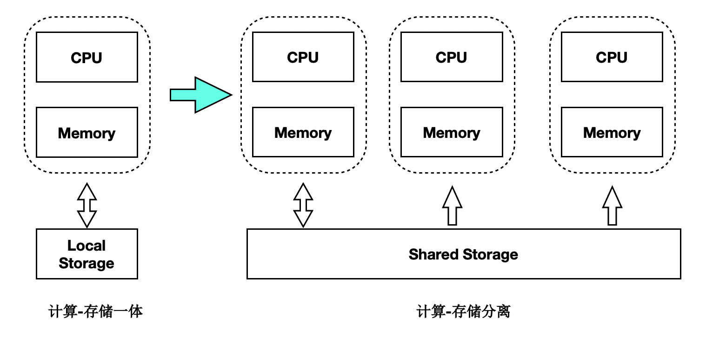  
  
上图为PolarDB与PostgreSQL开源社区单机版的架构概览对比.    
  
### <span id="jump3">3、PolarDB 存储计算分离架构概述</span>    
  
单个计算节点无法发挥出存储侧大 IO 带宽的优势，也无法通过增加计算资源来加速大的查询。PolarDB开发了基于 Shared-Storage 的 MPP 分布式并行执行，来加速在 OLTP 场景下 OLAP 查询。 PolarDB 支持一套 OLTP 场景型的数据在如下两种计算引擎下使用：  
- 单机执行引擎：处理高并发的 OLTP 型负载。  
- 分布式执行引擎：处理大查询的 OLAP 型负载。  
  
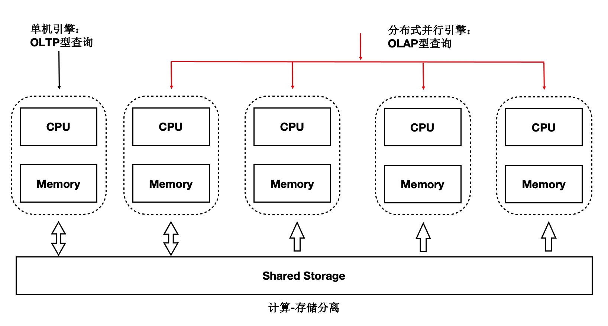  
  
在使用相同的硬件资源时性能达到了传统 MPP 数据库的 90%，同时具备了 SQL 级别的弹性：在计算能力不足时，可随时增加参与 OLAP 分析查询的 CPU，而数据无需重分布。  
  
3\.1、架构原理  
  
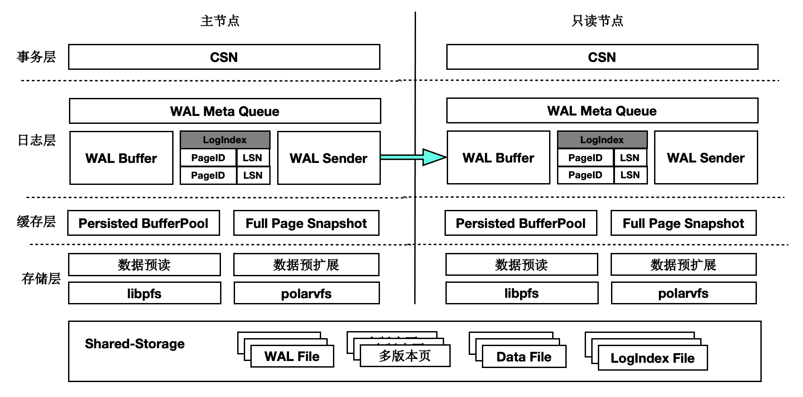   
  
首先来看下基于 Shared-Storage 的 PolarDB 的架构原理。  
- 主节点为可读可写节点（RW），只读节点为只读（RO）。  
- Shared-Storage 层，只有主节点能写入，因此主节点和只读节点能看到一致的落盘的数据。  
- 只读节点的内存状态是通过回放 WAL 保持和主节点同步的。  
- 主节点的 WAL 日志写到 Shared-Storage，仅复制 WAL 的 meta 给只读节点。  
- 只读节点从 Shared-Storage 上读取 WAL 并回放。  
  
3\.2、低延迟复制  
  
传统流复制的问题。  
- 同步链路：日志同步路径 IO 多，网络传输量大。  
- 页面回放：读取和 Buffer 修改慢（IO 密集型 + CPU 密集型）。  
- DDL 回放：修改文件时需要对修改的文件加锁，而加锁的过程容易被阻塞，导致 DDL 慢。  
- 快照更新：RO 高并发引起事务快照更新慢。  
  
如下图所示：  
  
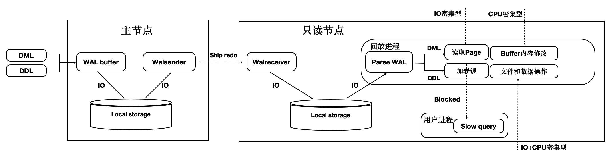   
  
流程如下:  
- 1、主节点写入 WAL 日志到本地文件系统中。  
- 2、WAL Sender 进程读取，并发送。  
- 3、只读节点的 WAL Receiver 进程接收写入到本地文件系统中。  
- 4、回放进程读取 WAL 日志，读取对应的 Page 到 BufferPool 中，并在内存中回放。  
- 5、主节点刷脏页到 Shared Storage。  
  
可以看到，整个链路很长，只读节点延迟高，影响用户业务读写分离负载均衡。  
  
3\.2\.1、PolarDB 优化 1：只复制 Meta  
  
因为底层是 Shared-Storage，只读节点可直接从 Shared-Storage 上读取所需要的 WAL 数据。因此主节点只把 WAL 日志的元数据（去掉 Payload）复制到只读节点，这样网络传输量小，减少关键路径上的 IO。如下图所示：  
  
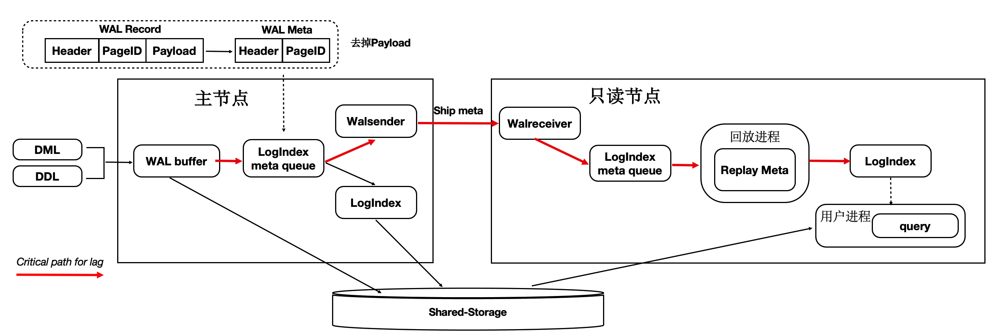   
  
- 1、WAL Record 是由：Header，PageID，Payload 组成。  
- 2、由于只读节点可以直接读取 Shared-Storage 上的 WAL 文件，因此主节点只把 WAL 日志的元数据发送（复制）到只读节点，包括：Header，PageID。  
- 3、在只读节点上，通过 WAL 的元数据直接读取 Shared-Storage 上完整的 WAL 文件。  
  
通过上述优化，能显著减少主节点和只读节点间的网络传输量。从下图可以看到网络传输量减少了 98%。  
  
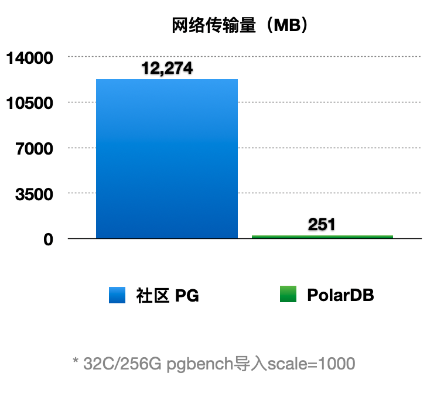   
  
3\.2\.2、PolarDB 优化 2：页面回放优化  
  
在传统 DB 中日志回放的过程中会读取大量的 Page 并逐个日志 Apply，然后落盘。该流程在用户读 IO 的关键路径上，PolarDB 借助存储计算分离可以做到：如果只读节点上 Page 不在 BufferPool 中，不产生任何 IO，仅仅记录 LogIndex 即可。  
  
PolarDB 可以将回放进程中的如下 IO 操作 offload 到 session 进程中：  
- 1、数据页 IO 开销。  
- 2、日志 apply 开销。  
- 3、基于 LogIndex 页面的多版本回放。  
  
如下图所示，在只读节点上的回放进程中，在 Apply 一条 WAL 的 meta 时：  
  
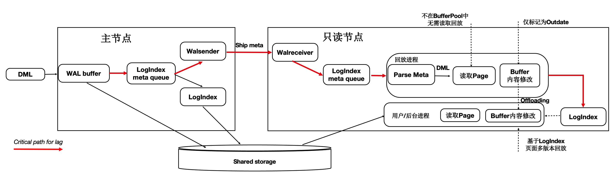   
  
- 1、如果对应 Page 不在内存中，仅仅记录 LogIndex。  
- 2、如果对应的 Page 在内存中，则标记为 Outdate，并记录 LogIndex，回放过程完成。  
- 3、用户 session 进程在读取 Page 时，读取正确的 Page 到 BufferPool 中，并通过 LogIndex 来回放相应的日志。  
- 4、可以看到，主要的 IO 操作有原来的单个回放进程 offload 到了多个用户进程。  
  
通过上述优化，能显著减少回放的延迟，比 AWS Aurora 快 30 倍。  
  
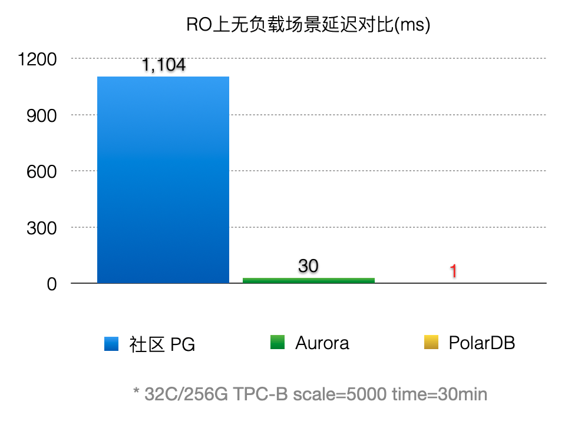   
  
3\.2\.3、PolarDB 优化 3：DDL 锁回放优化  
  
在主节点执行 DDL 时，比如：drop table，需要在所有节点上都对表上排他锁，这样能保证表文件不会在只读节点上读取时被主节点删除掉了（因为文件在 Shared-Storage 上只有一份）。在所有只读节点上对表上排他锁是通过 WAL 复制到所有的只读节点，只读节点回放 DDL 锁来完成。而回放进程在回放 DDL 锁时，对表上锁可能会阻塞很久，因此可以通过把 DDL 锁也 offload 到其他进程上来优化回放进程的关键路径。  
  
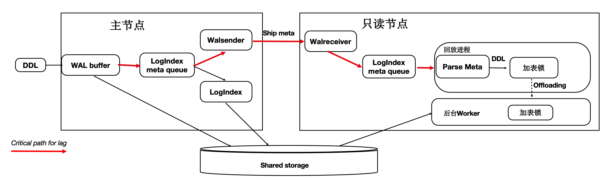   
  
通过上述优化，能够回放进程一直处于平滑的状态，不会因为去等 DDL 而阻塞了回放的关键路径。  
  
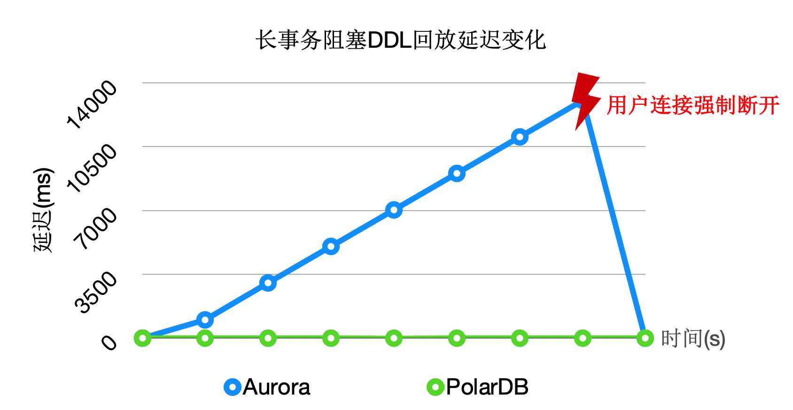   
  
上述 3 个优化之后，极大的降低了复制延迟，能够带来如下优势：  
- 读写分离：负载均衡，更接近 Oracle RAC 使用体验。  
- 高可用：加速 HA 流程。  
- 稳定性：最小化未来页的数量，可以写更少或者无需写页面快照。  
  
3\.2\.4、PolarDB 优化 4：Recovery 优化  
  
PG社区版本数据库 OOM、Crash 等场景恢复时间长，本质上是日志回放慢，在共享存储 Direct-IO 模型下问题更加突出。  
  
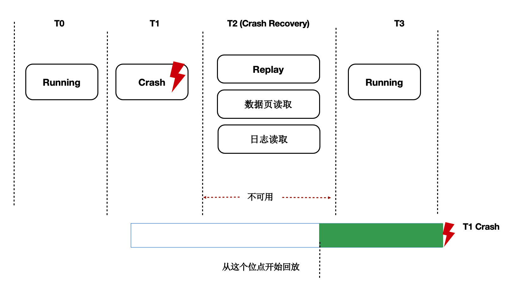   
  
PolarDB Lazy Recovery 优化:   
- 通过 [PolarDB LogIndex](https://apsaradb.github.io/PolarDB-for-PostgreSQL/zh/theory/logindex.html) 我们在只读节点上做到了 Lazy 的回放，那么在主节点重启后的 recovery 过程中，本质也是在回放日志，那么我们可以借助 Lazy 回放来加速 recovery 的过程：  
  
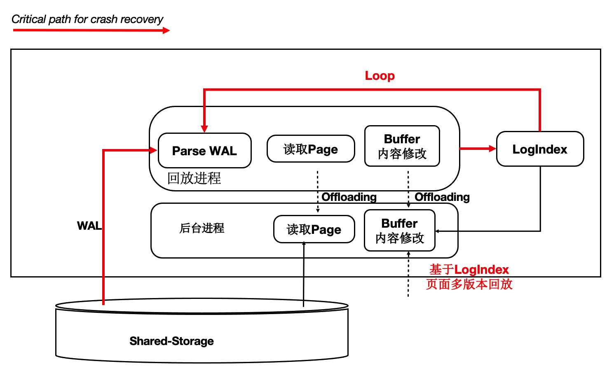   
  
- 1、从 checkpoint 点开始逐条去读 WAL 日志。  
- 2、回放完 LogIndex 日志后，即认为回放完成。  
- 3、recovery 完成，开始提供服务。  
- 4、真正的回放被 offload 到了重启之后进来的 session 进程中。  
  
优化之后（PG社区版本与PolarDB回放 500MB 日志量的对比）：  
  
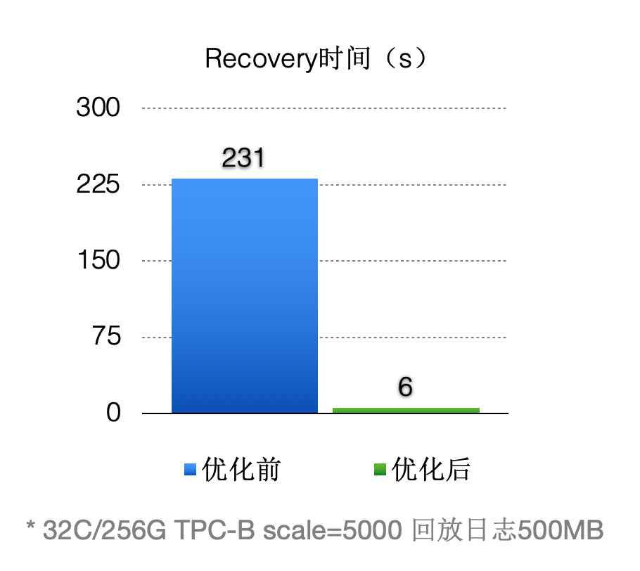   
  
### <span id="jump4">4、PolarDB HTAP 架构概述</span>     
  
PolarDB 读写分离后，由于底层是存储池，理论上 IO 吞吐是无限大的。而大查询只能在单个计算节点上执行，单个计算节点的 CPU/MEM/IO 是有限的，因此单个计算节点无法发挥出存储侧的大 IO 带宽的优势，也无法通过增加计算资源来加速大的查询。PolarDB 开发了基于 Shared-Storage 的 MPP 分布式并行执行，来加速在 OLTP 场景下 OLAP 查询。  
  
4\.1、分布式 MPP 执行引擎   
  
PolarDB 底层存储在不同节点上是共享的，因此不能直接像传统 MPP 一样去扫描表。我们在原来单机执行引擎上支持了 MPP 分布式并行执行，同时对 Shared-Storage 进行了优化。 基于 Shared-Storage 的 MPP 是业界首创，它的原理是：  
- Shuffle 算子屏蔽数据分布。  
- ParallelScan 算子屏蔽共享存储。  
  
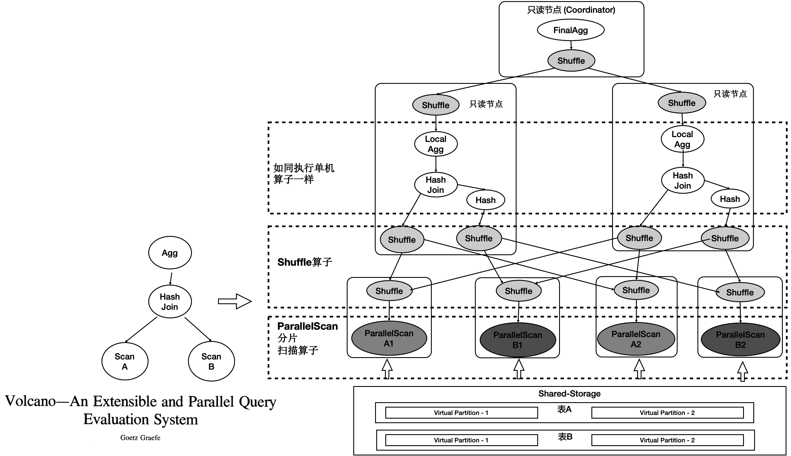   
  
如图所示：  
- 1、表 A 和表 B 做 join，并做聚合。  
- 2、共享存储中的表仍然是单个表，并没有做物理上的分区。  
- 3、重新设计 4 类扫描算子，使之在扫描共享存储上的表时能够分片扫描，形成 virtual partition。  
  
  
4\.2、Parallel Query 并行查询   
  
基于社区的 GPORCA 优化器扩展了能感知共享存储特性的 Transformation Rules。使得能够探索共享存储下特有的 Plan 空间，比如：对于一个表在 PolarDB 中既可以全量的扫描，也可以分区域扫描，这个是和传统 MPP 的本质区别。图中，上面灰色部分是 PolarDB 内核与 GPORCA 优化器的适配部分。下半部分是 ORCA 内核，灰色模块是我们在 ORCA 内核中对共享存储特性所做的扩展。  
  
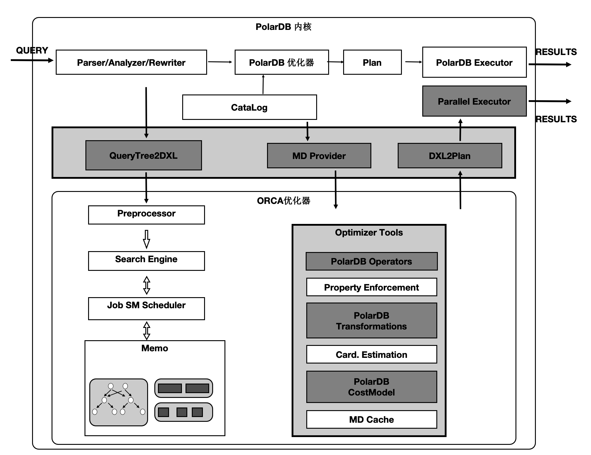   
  
4\.2\.1、算子并行化  
  
PolarDB 中有 4 类算子需要并行化，下面介绍一个具有代表性的 Seqscan 的算子的并行化。为了最大限度的利用存储的大 IO 带宽，在顺序扫描时，按照 4MB 为单位做逻辑切分，将 IO 尽量打散到不同的盘上，达到所有的盘同时提供读服务的效果。这样做还有一个优势，就是每个只读节点只扫描部分表文件，那么最终能缓存的表大小是所有只读节点的 BufferPool 总和。  
  
   
  
下面的图表中：  
- 1、增加只读节点，扫描性能线性提升 30 倍。  
- 2、打开 Buffer 时，扫描从 37 分钟降到 3.75 秒。  
  
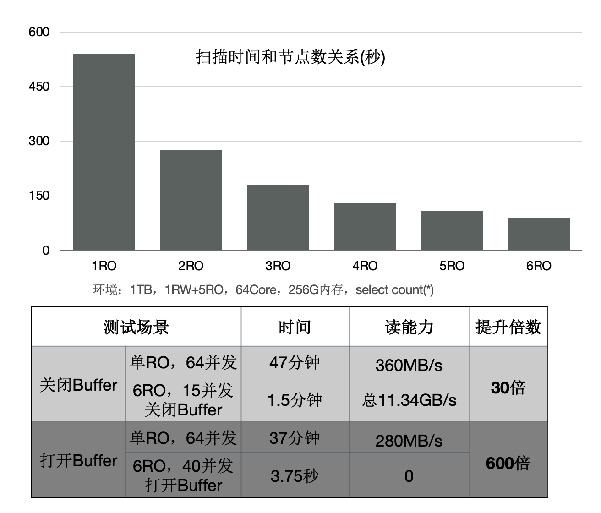   
  
4\.2\.2、消除数据倾斜问题  
  
倾斜是传统 MPP 固有的问题：  
- 1、在 PolarDB 中，大对象的是通过 heap 表关联 `TOAST` 表，无论对哪个表切分都无法达到均衡。  
- 2、另外，不同只读节点的事务、buffer、网络、IO 负载抖动。  
  
以上两点会导致分布执行时存在长尾进程。  
  
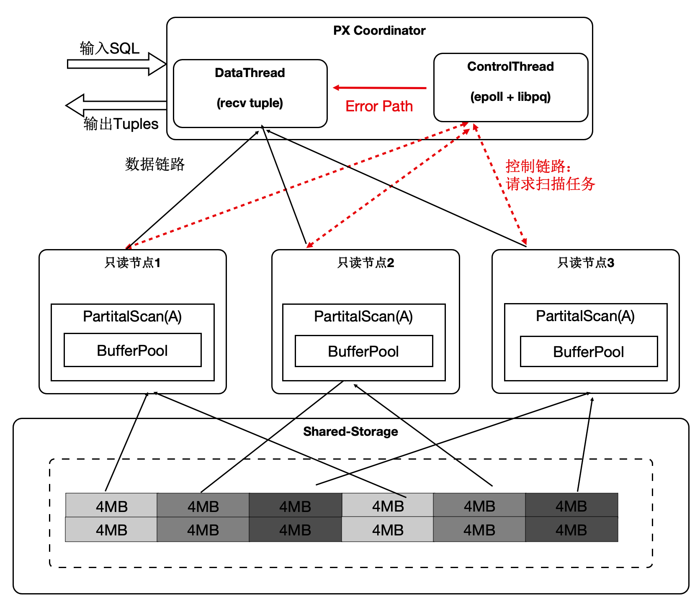   
  
- 1、协调节点内部分成 DataThread 和 ControlThread。  
- 2、DataThread 负责收集汇总元组。  
- 3、ControlThread 负责控制每个扫描算子的扫描进度。  
- 4、扫描快的工作进程能多扫描逻辑的数据切片。  
- 5、过程中需要考虑 Buffer 的亲和性。  
  
需要注意的是：尽管是动态分配，尽量维护 buffer 的亲和性；另外，每个算子的上下文存储在 worker 的私有内存中，Coordinator 不存储具体表的信息；  
  
下面表格中，当出现大对象时，静态切分出现数据倾斜，而动态扫描仍然能够线性提升。  
  
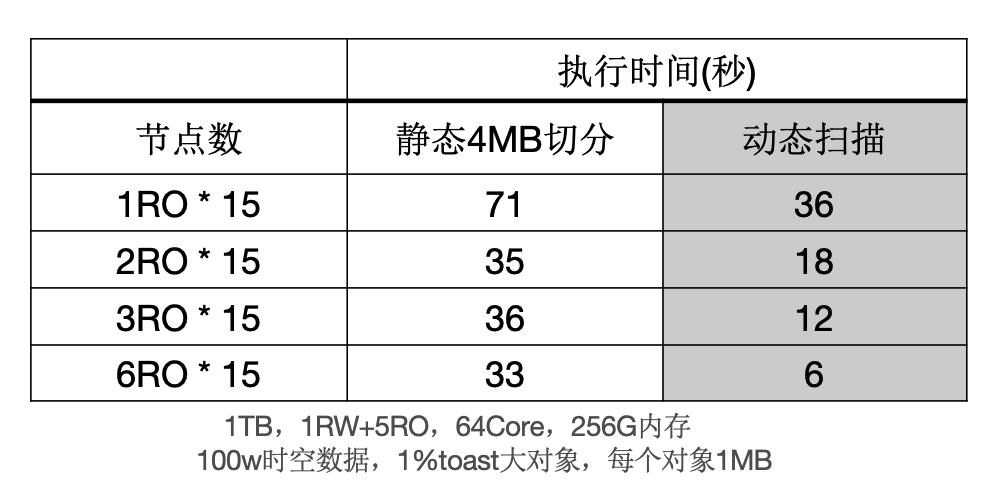   
  
  
4\.3、Parallel DML / Parallel CREATE INDEX  
  
4\.3\.1、Parallel DML  
  
基于 PolarDB 读写分离架构和 HTAP serverless 弹性扩展的设计， PolarDB Parallel DML 支持一写多读、多写多读两种特性。  
- 一写多读：在 RO 节点上有多个读 Worker，在 RW 节点上只有一个写 Worker；  
- 多写多读：在 RO 节点上有多个读 Worker，在 RW 节点上也有多个写 Worker。多写多读场景下，读写的并发度完全解耦。  
  
不同的特性适用不同的场景，用户可以根据自己的业务特点来选择不同的 PDML 功能特性。  
  
4\.3\.2、Parallel CREATE INDEX (分布式执行加速索引创建)   
  
OLTP 业务中会建大量的索引，经分析建索引过程中：80%是在排序和构建索引页，20%在写索引页。通过使用分布式并行来加速排序过程，同时流水化批量写入。  
  
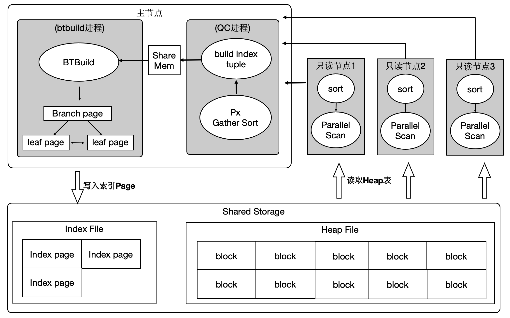   
  
上述优化能够使得创建索引有 4~5 倍的提升。  
  
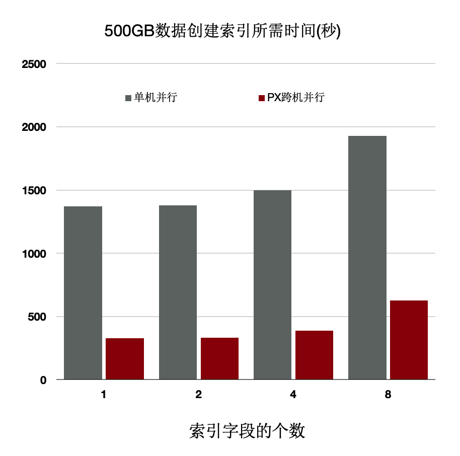   
  
4\.4、使用说明  
  
PolarDB HTAP 适用于日常业务中的 轻分析类业务，例如：对账业务，报表业务。  
  
4\.4\.1、使用 MPP 进行分析型查询  
  
PolarDB PG 引擎默认不开启 MPP 功能。若您需要使用此功能，请使用如下参数：  
- `polar_enable_px`：指定是否开启 MPP 功能。默认为 `OFF`，即不开启。  
- `polar_px_max_workers_number`：设置单个节点上的最大 MPP Worker 进程数，默认为 `30`。该参数限制了单个节点上的最大并行度，节点上所有会话的 MPP workers 进程数不能超过该参数大小。  
- `polar_px_dop_per_node`：设置当前会话并行查询的并行度，默认为 `1`，推荐值为当前 CPU 总核数。若设置该参数为 `N`，则一个会话在每个节点上将会启用 `N` 个 MPP Worker 进程，用于处理当前的 MPP 逻辑  
- `polar_px_nodes`：指定参与 MPP 的只读节点。默认为空，表示所有只读节点都参与。可配置为指定节点参与 MPP，以逗号分隔  
- `px_worker`：指定 MPP 是否对特定表生效。默认不生效。MPP 功能比较消耗集群计算节点的资源，因此只有对设置了 `px_workers` 的表才使用该功能。例如：  
    - `ALTER TABLE t1 SET(px_workers=1)` 表示 t1 表允许 MPP  
    - `ALTER TABLE t1 SET(px_workers=-1)` 表示 t1 表禁止 MPP  
    - `ALTER TABLE t1 SET(px_workers=0)` 表示 t1 表忽略 MPP（默认状态）  
  
本示例以简单的单表查询操作，来描述 MPP 的功能是否有效。  
```  
-- 创建 test 表并插入基础数据。  
CREATE TABLE test(id int);  
INSERT INTO test SELECT generate_series(1,1000000);  
  
-- 默认情况下 MPP 功能不开启，单表查询执行计划为 PG 原生的 Seq Scan  
EXPLAIN SELECT * FROM test;  
                       QUERY PLAN  
--------------------------------------------------------  
 Seq Scan on test  (cost=0.00..35.50 rows=2550 width=4)  
(1 row)  
```  
  
开启并使用 MPP 功能：  
```  
-- 对 test 表启用 MPP 功能  
ALTER TABLE test SET (px_workers=1);  
  
-- 开启 MPP 功能  
SET polar_enable_px = on;  
  
EXPLAIN SELECT * FROM test;  
  
                                  QUERY PLAN  
-------------------------------------------------------------------------------  
 PX Coordinator 2:1  (slice1; segments: 2)  (cost=0.00..431.00 rows=1 width=4)  
   ->  Seq Scan on test (scan partial)  (cost=0.00..431.00 rows=1 width=4)  
 Optimizer: PolarDB PX Optimizer  
(3 rows)  
```  
  
配置参与 MPP 的计算节点范围：  
```  
-- 查询当前所有只读节点的名称  
CREATE EXTENSION polar_monitor;  
  
SELECT name,host,port FROM polar_cluster_info WHERE px_node='t';  
 name  |   host    | port  
-------+-----------+------  
 node1 | 127.0.0.1 | 5433  
 node2 | 127.0.0.1 | 5434  
(2 rows)  
  
-- 当前集群有 2 个只读节点，名称分别为：node1，node2  
  
-- 指定 node1 只读节点参与 MPP  
SET polar_px_nodes = 'node1';  
  
-- 查询参与并行查询的节点  
SHOW polar_px_nodes;  
 polar_px_nodes  
----------------  
 node1  
(1 row)  
  
EXPLAIN SELECT * FROM test;  
                                  QUERY PLAN  
-------------------------------------------------------------------------------  
 PX Coordinator 1:1  (slice1; segments: 1)  (cost=0.00..431.00 rows=1 width=4)  
   ->  Partial Seq Scan on test  (cost=0.00..431.00 rows=1 width=4)  
 Optimizer: PolarDB PX Optimizer  
(3 rows)  
```  
  
4\.4\.2、使用 MPP 进行分区表查询  
- 当前 MPP 对分区表支持的功能如下所示：  
- 支持 Range 分区的并行查询  
- 支持 List 分区的并行查询  
- 支持单列 Hash 分区的并行查询  
- 支持分区裁剪  
- 支持带有索引的分区表并行查询  
- 支持分区表连接查询  
- 支持多级分区的并行查询  
```  
--分区表 MPP 功能默认关闭，需要先开启 MPP 功能  
SET polar_enable_px = ON;  
  
-- 执行以下语句，开启分区表 MPP 功能  
SET polar_px_enable_partition = true;  
  
-- 执行以下语句，开启多级分区表 MPP 功能  
SET polar_px_optimizer_multilevel_partitioning = true;  
```  
  
4\.4\.3、使用 MPP 加速索引创建  
  
当前仅支持对 B-Tree 索引的构建，且暂不支持 `INCLUDE` 等索引构建语法，暂不支持表达式等索引列类型。  
  
如果需要使用 MPP 功能加速创建索引，请使用如下参数：  
- `polar_px_dop_per_node`：指定通过 MPP 加速构建索引的并行度。默认为 `1`。  
- `polar_px_enable_replay_wait`：当使用 MPP 加速索引构建时，当前会话内无需手动开启该参数，该参数将自动生效，以保证最近更新的数据表项可以被创建到索引中，保证索引表的完整性。索引创建完成后，该参数将会被重置为数据库默认值。  
- `polar_px_enable_btbuild`：是否开启使用 MPP 加速创建索引。取值为 `OFF` 时不开启（默认），取值为 `ON` 时开启。  
- `polar_bt_write_page_buffer_size`：指定索引构建过程中的写 `I/O` 策略。该参数默认值为 `0`（不开启），单位为块，最大值可设置为 `8192`。推荐设置为 `4096`。  
    - 当该参数设置为不开启时，在索引创建的过程中，对于索引页写满后的写盘方式是 block-by-block 的单个块写盘。  
    - 当该参数设置为开启时，内核中将缓存一个 `polar_bt_write_page_buffer_size` 大小的 buffer，对于需要写盘的索引页，会通过该 buffer 进行 `I/O` 合并再统一写盘，避免了频繁调度 `I/O` 带来的性能开销。该参数会额外提升 20% 的索引创建性能。  
```  
-- 开启使用 MPP 加速创建索引功能。  
SET polar_px_enable_btbuild = on;  
  
-- 使用如下语法创建索引  
CREATE INDEX t ON test(id) WITH(px_build = ON);  
  
-- 查询表结构  
\d test  
               Table "public.test"  
 Column |  Type   | Collation | Nullable | Default  
--------+---------+-----------+----------+---------  
 id     | integer |           |          |  
 id2    | integer |           |          |  
Indexes:  
    "t" btree (id) WITH (px_build=finish)  
```  
  
4\.5、TPC-H 性能：加速比  
  
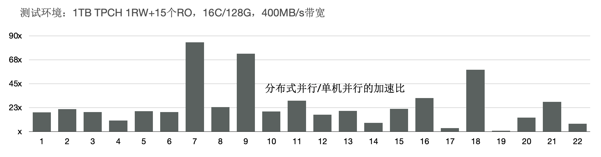   
  
我们使用 1TB 的 TPC-H 进行了测试，首先对比了 PolarDB 新的分布式并行和单机并行的性能：有 3 个 SQL 提速 60 倍，19 个 SQL 提速 10 倍以上；  
  
   
  
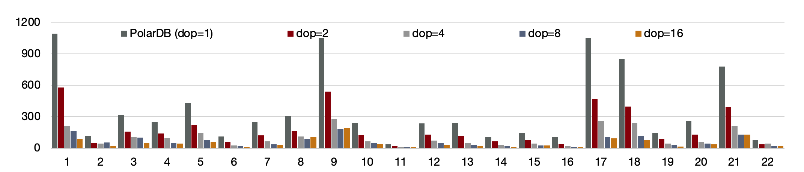   
  
另外，使用分布式执行引擎测，试增加 CPU 时的性能，可以看到，从 16 核和 128 核时性能线性提升；单看 22 条 SQL，通过该增加 CPU，每个条 SQL 性能线性提升。  
  
4\.6、TPC-H 性能：和传统 MPP 数据库的对比  
    
与传统 MPP 数据库相比，同样使用 16 个节点，PolarDB 的性能是传统 MPP 数据库的 90%。  
  
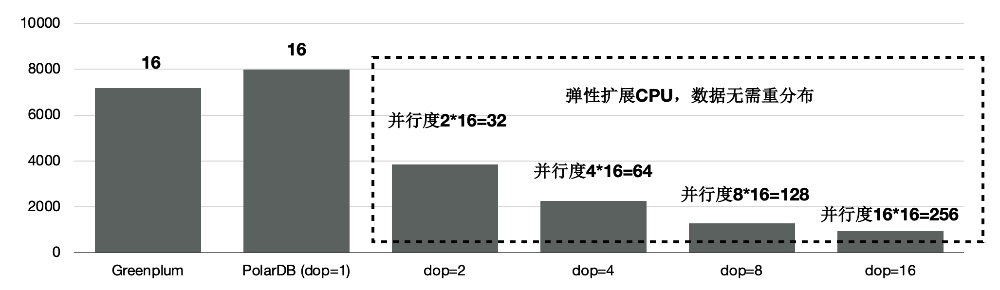   
  
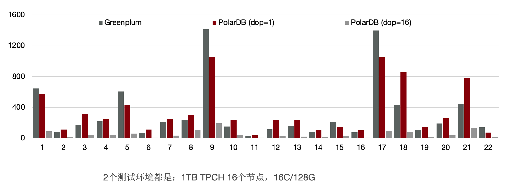   
    
前面讲到我们给 PolarDB 的分布式引擎做到了弹性扩展，数据不需要充分重分布，当 dop = 8 时，性能是传统 MPP 数据库的 5.6 倍。  
  
  
#### [期望 PostgreSQL|开源PolarDB 增加什么功能?](https://github.com/digoal/blog/issues/76 "269ac3d1c492e938c0191101c7238216")
  
  
#### [PolarDB 开源数据库](https://openpolardb.com/home "57258f76c37864c6e6d23383d05714ea")
  
  
#### [PolarDB 学习图谱](https://www.aliyun.com/database/openpolardb/activity "8642f60e04ed0c814bf9cb9677976bd4")
  
  
#### [购买PolarDB云服务折扣活动进行中, 55元起](https://www.aliyun.com/activity/new/polardb-yunparter?userCode=bsb3t4al "e0495c413bedacabb75ff1e880be465a")
  
  
#### [PostgreSQL 解决方案集合](../201706/20170601_02.md "40cff096e9ed7122c512b35d8561d9c8")
  
  
#### [德哥 / digoal's Github - 公益是一辈子的事.](https://github.com/digoal/blog/blob/master/README.md "22709685feb7cab07d30f30387f0a9ae")
  
  
#### [About 德哥](https://github.com/digoal/blog/blob/master/me/readme.md "a37735981e7704886ffd590565582dd0")
  
  

  
