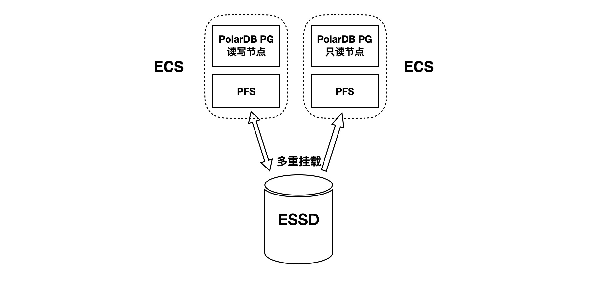
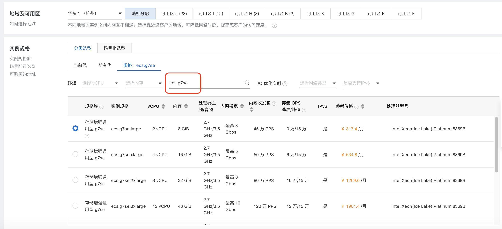
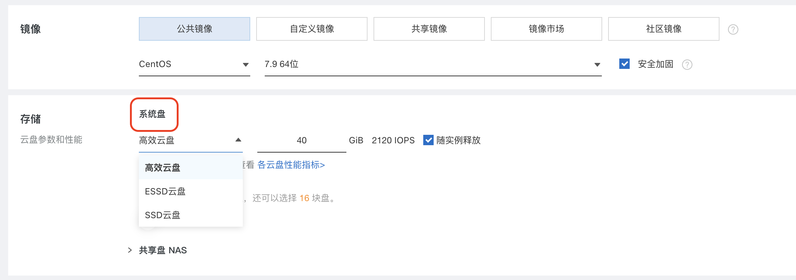
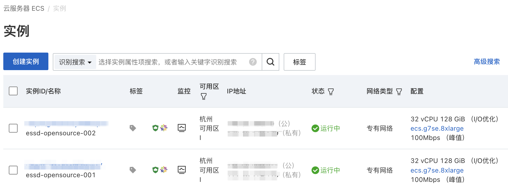
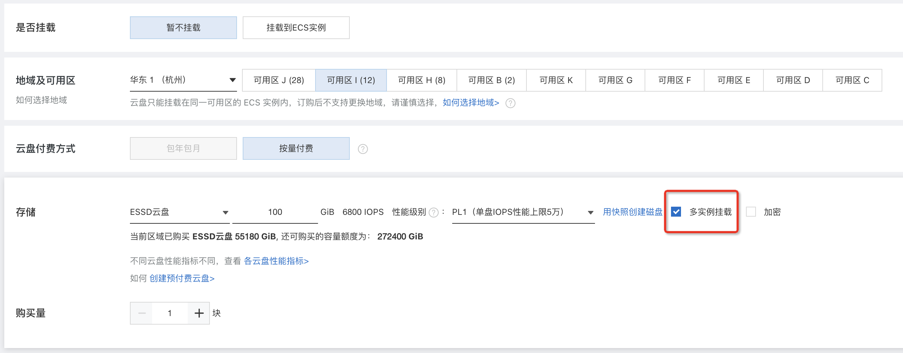
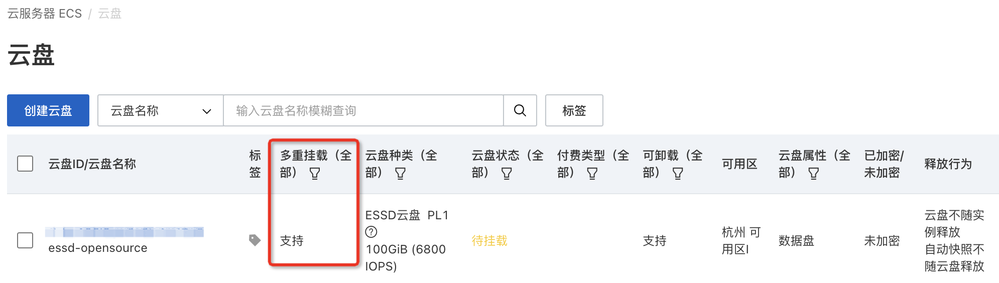
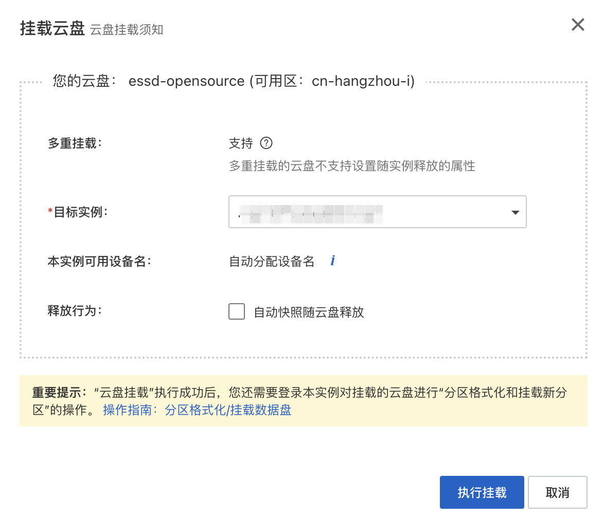
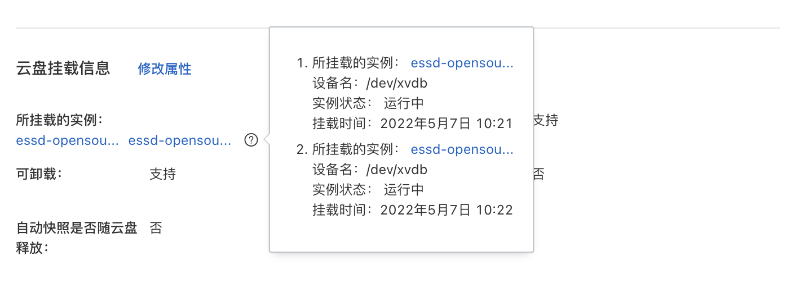

## 开源PolarDB|PostgreSQL 应用开发者&DBA 公开课 - 5.3 PolarDB开源版本必学特性 - PolarDB 安装部署               
                            
### 作者                            
digoal                            
                            
### 日期                            
2024-01-24                            
                            
### 标签                            
PostgreSQL , PolarDB , 应用开发者 , DBA , 公开课                  
                            
----                            
                            
## 背景           
## PolarDB 安装部署      
### 本节阅读导航
[1、安装部署 PolarDB 单机版](#jump1)  
  
[2、安装部署 PolarDB 集群版(on ECS + ESSD)](#jump2)  
  
[3、更多部署环境](#jump3)  
    
### <span id="jump1">1、安装部署 PolarDB 单机版</span> 
  
PS:   
- 前置条件, 请在本机先安装docker desktop.    
- 注意将文中命令内出现的`${your_data_dir}`替换为你实际的目录全路径.   
  
在单机文件系统（如 ext4）上部署 PolarDB-PG，适用于所有PolarDB计算节点都可以访问相同本地磁盘存储的场景。     
    
单机版通常用于快速搭建PolarDB学习或开发环境.      
    
1\.1、拉取镜像    
    
我们在 DockerHub 上提供了 PolarDB-PG 的 [本地实例镜像](https://hub.docker.com/r/polardb/polardb_pg_local_instance/tags)，里面已包含启动 PolarDB-PG 本地存储实例的入口脚本。镜像目前支持 `linux/amd64` 和 `linux/arm64` 两种 CPU 架构。    
    
```    
docker pull polardb/polardb_pg_local_instance    
```    
    
1\.2、初始化数据库    
    
在本机新建一个空白目录 `${your_data_dir}` 作为 PolarDB-PG 实例的数据目录。启动容器时，将该目录作为 `VOLUME` 挂载到容器内，对数据目录进行初始化。在初始化的过程中，可以传入环境变量覆盖默认值：    
- `POLARDB_PORT`：PolarDB-PG 运行所需要使用的端口号，默认值为 `5432`；镜像将会使用三个连续的端口号（默认 `5432-5434`）    
- `POLARDB_USER`：初始化数据库时创建默认的 superuser（默认 `postgres`）    
- `POLARDB_PASSWORD`：默认 superuser 的密码    
  
使用如下命令初始化数据库(`--rm`表示执行后自动删除容器, 但是`VOLUME`目录中的数据被保留, 实现初始化数据库实例目的.)：    
```    
docker run -it --rm \
    --env POLARDB_PORT=5432 \
    --env POLARDB_USER=u1 \
    --env POLARDB_PASSWORD=your_password \
    -v ${your_data_dir}:/var/polardb \
    polardb/polardb_pg_local_instance \
    echo 'done'    
```
  
<b>例如:</b>
```
mkdir /Users/digoal/polardb_data

docker run -it --rm \
    --env POLARDB_PORT=5432 \
    --env POLARDB_USER=postgres \
    --env POLARDB_PASSWORD=hellopwd123 \
    -v /Users/digoal/polardb_data:/var/polardb \
    polardb/polardb_pg_local_instance \
    echo 'done'     
```
  
1\.3、启动 PolarDB-PG 服务    
  
数据库初始化完毕后，使用 `-d` 参数以后台模式创建容器，启动 PolarDB-PG 服务。通常 PolarDB-PG 的端口需要暴露给外界使用，使用 `-p` 参数将容器内的端口范围暴露到容器外。比如，初始化数据库时使用的是 `5432-5434` 端口，如下命令将会把这三个端口映射到容器外的 `54320-54322` 端口：    
```  
docker run -it -d \
    --cap-add=SYS_PTRACE \
    --cap-add SYS_ADMIN \
    --privileged=true \
    --name polardb_pg \
    --shm-size=1g \
    -p 54320-54322:5432-5434 \
    -v ${your_data_dir}:/var/polardb \
    polardb/polardb_pg_local_instance  
```  
  
或者也可以直接让容器与宿主机共享网络：    
```  
docker run -it -P -d \
    --cap-add=SYS_PTRACE \
    --cap-add SYS_ADMIN \
    --privileged=true \
    --name polardb_pg \
    --shm-size=1g \
    --network=host \
    -v ${your_data_dir}:/var/polardb \
    polardb/polardb_pg_local_instance  
```
  
<b>例如:</b>
```
docker run -it -P -d \
    --cap-add=SYS_PTRACE \
    --cap-add SYS_ADMIN \
    --privileged=true \
    --name polardb_pg \
    --shm-size=1g \
    --network=host \
    -v /Users/digoal/polardb_data:/var/polardb \
    polardb/polardb_pg_local_instance    
```
    
    
### <span id="jump2">2、安装部署 PolarDB 集群版(on ECS + ESSD)</span>   
    
PS: 前置条件   
- ECS 的系统选择Linux, 例如Debian 11, CentOS 8    
- 需要在ECS系统中安装docker server/desktop, 以便运行打包好的 pfs/PolarDB 容器   
  
[阿里云 ESSD（Enhanced SSD）云盘](https://help.aliyun.com/document_detail/122389.html) 结合 25 GE 网络和 RDMA 技术，能够提供单盘高达 100 万的随机读写能力和单路低时延性能。阿里云 ESSD 云盘支持 NVMe 协议，且可以同时挂载到多台支持 NVMe 协议的 ECS（Elastic Compute Service）实例上，从而实现多个 ECS 实例并发读写访问，具备高可靠、高并发、高性能等特点。更新信息请参考阿里云 ECS 文档：  
- [支持 NVMe 协议的云盘概述](https://help.aliyun.com/document_detail/256487.html)  
- [开启多重挂载功能](https://help.aliyun.com/document_detail/262105.html)  
  
接下来指导您完成以下过程：  
- 1、部署两台阿里云 ECS 作为计算节点  
- 2、将一块 ESSD 云盘多重挂载到两台 ECS 上，作为共享存储  
- 3、在 ESSD 共享存储上格式化分布式文件系统 PFS  
- 4、基于 PFS，在两台 ECS 上共同搭建一个存算分离、读写分离的 PolarDB 集群  
  
    
  
2\.1、部署阿里云 ECS  
  
首先需要准备两台或以上的 [阿里云 ECS](https://www.aliyun.com/product/ecs)。目前，ECS 对支持 ESSD 多重挂载的规格有较多限制，详情请参考 [使用限制](https://help.aliyun.com/document_detail/256487.htm?spm=a2c4g.11186623.0.0.61397e72QGaXV0#section-4w6-dyy-otg)。仅 部分可用区、部分规格（`ecs.g7se、ecs.c7se、ecs.r7se`）的 ECS 实例可以支持 ESSD 的多重挂载。如图，请务必选择支持多重挂载的 ECS 规格：  
  
    
  
对 ECS 存储配置的选择，系统盘可以选用任意的存储类型，数据盘和共享盘暂不选择。后续再单独创建一个 ESSD 云盘作为共享盘：  
  
    
  
如图所示，在 同一可用区 中建好两台 ECS：  
  
    
  
2\.2、准备 ESSD 云盘  
  
在阿里云 ECS 的管理控制台中，选择 存储与快照 下的 云盘，点击 创建云盘。在与已经建好的 ECS 所在的相同可用区内，选择建立一个 ESSD 云盘，并勾选 多实例挂载。如果您的 ECS 不符合多实例挂载的限制条件，则该选框不会出现。  
  
    
  
ESSD 云盘创建完毕后，控制台显示云盘支持多重挂载，状态为 待挂载：  
  
    
  
接下来，把这个云盘分别挂载到两台 ECS 上：  
  
    
  
挂载完毕后，查看该云盘，将会显示该云盘已经挂载的两台 ECS 实例：  
  
    
  
2\.3、检查云盘  
  
通过 ssh 分别连接到两台 ECS 上，运行 `lsblk` 命令可以看到：  
- `nvme0n1` 是 40GB 的 ECS 系统盘，为 ECS 私有  
- `nvme1n1` 是 100GB 的 ESSD 云盘，两台 ECS 同时可见  
  
```  
$ lsblk  
NAME        MAJ:MIN RM  SIZE RO TYPE MOUNTPOINT  
nvme0n1     259:0    0   40G  0 disk  
└─nvme0n1p1 259:1    0   40G  0 part /etc/hosts  
nvme1n1     259:2    0  100G  0 disk  
```  
  
2\.4、准备分布式文件系统(PFS)  
  
2\.4\.1、PFS 编译安装  
  
接下来，将在两台 ECS 上分别部署 PolarDB 的主节点和只读节点。作为前提，需要在 ECS 共享的 ESSD 块设备上 格式化并挂载 PFS。  
  
请先在ECS主机上安装Docker desktop/server. 具体步骤请参考docker官网文档( https://www.docker.com/ ), 书中略过.    
  
拉取polardb_pg_binary镜像, 将在所有PolarDB计算节点(ECS)使用这个镜像的容器来运行pfs和数据库.    
```  
docker pull polardb/polardb_pg_binary  
```  
  
在所有PolarDB计算节点(ECS) 启动容器  
```  
docker run -d -it --network=host \
    --cap-add=SYS_PTRACE --cap-add SYS_ADMIN \
    --privileged=true \
    --name polardb_pg \
    --shm-size=1g \
    polardb/polardb_pg_binary \
    /bin/bash   
```  
  
在PolarDB计算节点(ECS) 进入容器的方法:  
```  
docker exec -ti polardb_pg bash   
```  
  
2\.4\.2、块设备重命名(如果命名已符合pfs需求, 可略过. 例如on ECS+ESSD 可略过该步骤.)  
  
PFS 仅支持访问 以特定字符开头的块设备（详情可见 [PolarDB File System](https://github.com/ApsaraDB/PolarDB-FileSystem) 源代码的 [src/pfs_core/pfs_api.h](https://github.com/ApsaraDB/PolarDB-FileSystem/blob/master/src/pfs_core/pfs_api.h) 文件）：  
  
```  
#define PFS_PATH_ISVALID(path)                                  \
    (path != NULL &&                                            \
     ((path[0] == '/' && isdigit((path)[1])) || path[0] == '.'  \
      || strncmp(path, "/pangu-", 7) == 0                       \
      || strncmp(path, "/sd", 3) == 0                           \
      || strncmp(path, "/sf", 3) == 0                           \
      || strncmp(path, "/vd", 3) == 0                           \
      || strncmp(path, "/nvme", 5) == 0                         \
      || strncmp(path, "/loop", 5) == 0                         \
      || strncmp(path, "/mapper_", 8) ==0))  
```  
  
因此，为了保证能够顺畅完成后续流程，建议在所有访问块设备的节点上使用相同的软链接访问共享块设备。例如，在 NBD 服务端主机上，使用新的块设备名 `/dev/nvme1n1` 软链接到共享存储块设备的原有名称 `/dev/vdb` 上：  
```  
sudo ln -s /dev/vdb /dev/nvme1n1  
```  
  
在 NBD 客户端主机(PolarDB计算节点)上，使用同样的块设备名 `/dev/nvme1n1` 软链到共享存储块设备的原有名称 `/dev/nbd0` 上：  
```  
sudo ln -s /dev/nbd0 /dev/nvme1n1  
```  
  
这样便可以在服务端和客户端两台主机上使用相同的块设备名 `/dev/nvme1n1` 访问同一个块设备。  
  
  
2\.4\.3、块设备格式化  
  
使用 任意一台主机的容器，在共享存储块设备上格式化 PFS 分布式文件系统：  
```  
sudo pfs -C disk mkfs nvme1n1  
```  
  
PS: 格式化 PFS 分布式文件系统仅需在集群中任意一个计算节点执行一次即可.    
  
2\.4\.4、PFS 文件系统挂载  
  
在能够访问共享存储的 所有主机节点的容器中 上分别启动 PFS 守护进程，挂载 PFS 文件系统：  
```  
sudo /usr/local/polarstore/pfsd/bin/start_pfsd.sh -p nvme1n1 -w 2  
```  
  
2\.5、PolarDB 读写节点部署  
  
在作为PolarDB RW节点的主机的容器中进行部署.  
  
初始化读写节点的本地数据目录 `~/primary/`：  
```  
$HOME/tmp_basedir_polardb_pg_1100_bld/bin/initdb -D $HOME/primary  
```  
  
在共享存储的 `/nvme1n1/shared_data/` 路径上创建共享数据目录，然后使用 `polar-initdb.sh` 脚本初始化共享数据目录：  
```  
# 使用 pfs 创建共享数据目录  
sudo pfs -C disk mkdir /nvme1n1/shared_data  
# 初始化 db 的本地和共享数据目录  
sudo $HOME/tmp_basedir_polardb_pg_1100_bld/bin/polar-initdb.sh \
    $HOME/primary/ /nvme1n1/shared_data/  
```  
  
编辑读写节点的配置。打开 `~/primary/postgresql.conf`，增加配置项：  
```  
port=5432  
polar_hostid=1  
polar_enable_shared_storage_mode=on  
polar_disk_name='nvme1n1'  
polar_datadir='/nvme1n1/shared_data/'  
polar_vfs.localfs_mode=off  
shared_preload_libraries='$libdir/polar_vfs,$libdir/polar_worker'  
polar_storage_cluster_name='disk'  
logging_collector=on  
log_line_prefix='%p\t%r\t%u\t%m\t'  
log_directory='pg_log'  
listen_addresses='*'  
max_connections=1000  
synchronous_standby_names='replica1'  
```  
  
编辑读写节点的客户端认证文件 `~/primary/pg_hba.conf`，增加以下配置项，允许只读节点进行物理复制：  
```  
host	replication	postgres	0.0.0.0/0	trust  
# 注意, 如果你知道ECS主机的网段, 建议把 0.0.0.0/0 配置为网段 例如 192.168.1.0/24   
```  
  
<b>插入知识点开始.</b>    
  
在不同主机上的容器之间的通信问题请参考:  
- https://superuser.com/questions/1141553/communication-between-docker-containers-on-differents-hosts-in-the-same-local-ne    
  
要使 Docker 容器在不同主机上彼此之间通过 IP 网络互相访问，你需要设置一个跨主机的网络。Docker 的内置解决方案是使用 overlay 网络。Overlay 网络允许容器分布在多个 Docker 守护进程主机上，并且这些容器能够安全地相互通信。  
  
以下是设置容器跨主机通信的步骤：  
  
2\.5\.1、安装 Docker Engine  
  
确保所有的主机上都安装了 Docker Engine，并且版本都是 1.12 或更高。  
  
2\.5\.2、设置 Docker Swarm  
  
Overlay 网络需要 Docker Swarm，所以你要初始化 Swarm 模式。  
  
在你选定的第一个主机（Manager Node）上运行：  
  
```bash  
docker swarm init --advertise-addr <MANAGER-IP>  
```  
  
其中 `<MANAGER-IP>` 是该主机的 IP 地址。  
  
初始化 Swarm 之后，将其他主机加入为 Worker Nodes：  
  
```bash  
docker swarm join --token <SWARM-TOKEN> <MANAGER-IP>:2377  
```  
  
`<SWARM-TOKEN>` 通过在 Manager Node 上运行 `docker swarm join-token worker` 获得。  
  
2\.5\.3、创建 Overlay 网络  
  
在任何一个 Swarm Manager 上创建一个 overlay 网络：  
  
```bash  
docker network create --driver overlay --attachable my-overlay-network  
```  
  
这里 `my-overlay-network` 是你为 overlay 网络自定义的名称，使用 `--attachable` 参数允许非 Swarm 服务的容器连接到这个网络。  
  
2\.5\.4、运行容器并加入网络  
  
在任何 Swarm 节点上启动你的容器，并将其连接到先前创建的 overlay 网络：  
  
```bash  
docker run -d --name my-container --network my-overlay-network my-image  
```  
  
这里 `my-container` 是为你的容器指定的名字，`my-image` 是你容器的镜像。  
  
2\.5\.5、容器间通信  
  
容器现在可以使用容器名称作为主机名来互相通信。例如，如果你在 `my-overlay-network` 网络上启动了两个名为 `container1` 和 `container2` 的容器，那么 `container1` 可以通过 `container2` 的名称来解析 `container2` 的 IP 地址。  
  
请注意，这些步骤假设所有的主机都能够相互访问。如果你的主机在不同的网络中，例如它们之间受到防火墙或者 NAT 的限制，你可能需要进行一些额外的网络配置，比如设置适当的防火墙规则或者使用 VPN 等。  
  
另外，如果你使用的是 Docker Desktop（如在 Windows 或 Mac 上），Swarm 和 Overlay 网络的设置可能会有一些不同，因为 Docker Desktop 附带了一个内置的虚拟化环境。  
  
<b>插入知识点结束.</b>   
  
最后，启动读写节点：  
```  
$HOME/tmp_basedir_polardb_pg_1100_bld/bin/pg_ctl start -D $HOME/primary  
```  
  
检查读写节点能否正常运行：  
```  
$HOME/tmp_basedir_polardb_pg_1100_bld/bin/psql \
    -p 5432 \
    -d postgres \
    -c 'SELECT version();'  
            version  
--------------------------------  
 PostgreSQL 11.9 (POLARDB 11.9)  
(1 row)  
```  
  
在读写节点上，为对应的只读节点创建相应的复制槽，用于只读节点的物理复制：  
```  
$HOME/tmp_basedir_polardb_pg_1100_bld/bin/psql \
    -p 5432 \
    -d postgres \
    -c "SELECT pg_create_physical_replication_slot('replica1');"  
 pg_create_physical_replication_slot  
-------------------------------------  
 (replica1,)  
(1 row)  
```  
  
2\.6、PolarDB 只读节点部署  
  
在作为PolarDB RO节点的主机的容器中进行部署.  
  
在只读节点本地磁盘的 `~/replica1` 路径上创建一个空目录，然后通过 `polar-replica-initdb.sh` 脚本使用共享存储上的数据目录来初始化只读节点的本地目录。初始化后的本地目录中没有默认配置文件，所以还需要使用 `initdb` 创建一个临时的本地目录模板，然后将所有的默认配置文件拷贝到只读节点的本地目录下：  
```  
mkdir -m 0700 $HOME/replica1  
sudo ~/tmp_basedir_polardb_pg_1100_bld/bin/polar-replica-initdb.sh \
    /nvme1n1/shared_data/ $HOME/replica1/  
  
$HOME/tmp_basedir_polardb_pg_1100_bld/bin/initdb -D /tmp/replica1  
cp /tmp/replica1/*.conf $HOME/replica1/  
```  
  
编辑只读节点的配置。打开 `~/replica1/postgresql.conf`，增加配置项：  
```  
port=5433  
polar_hostid=2  
polar_enable_shared_storage_mode=on  
polar_disk_name='nvme1n1'  
polar_datadir='/nvme1n1/shared_data/'  
polar_vfs.localfs_mode=off  
shared_preload_libraries='$libdir/polar_vfs,$libdir/polar_worker'  
polar_storage_cluster_name='disk'  
logging_collector=on  
log_line_prefix='%p\t%r\t%u\t%m\t'  
log_directory='pg_log'  
listen_addresses='*'  
max_connections=1000  
```  
  
创建只读节点的复制配置文件 `~/replica1/recovery.conf`，增加读写节点的连接信息，以及复制槽名称：  
```  
polar_replica='on'  
recovery_target_timeline='latest'  
primary_slot_name='replica1'  
primary_conninfo='host=[读写节点所在IP] port=5432 user=postgres dbname=postgres application_name=replica1'  
```  
  
最后，启动只读节点：  
```  
$HOME/tmp_basedir_polardb_pg_1100_bld/bin/pg_ctl start -D $HOME/replica1  
```  
  
检查只读节点能否正常运行：  
```  
$HOME/tmp_basedir_polardb_pg_1100_bld/bin/psql \
    -p 5433 \
    -d postgres \
    -c 'SELECT version();'  
            version  
--------------------------------  
 PostgreSQL 11.9 (POLARDB 11.9)  
(1 row)  
```  
  
2\.7、PolarDB 集群检查和测试  
  
部署完成后，需要进行实例检查和测试，确保读写节点可正常写入数据、只读节点可以正常读取。  
  
登录 读写节点，创建测试表并插入样例数据：  
```  
$HOME/tmp_basedir_polardb_pg_1100_bld/bin/psql -q \
    -p 5432 \
    -d postgres \
    -c "CREATE TABLE t (t1 INT PRIMARY KEY, t2 INT); INSERT INTO t VALUES (1, 1),(2, 3),(3, 3);"  
```  
  
登录 只读节点，查询刚刚插入的样例数据：  
```  
$HOME/tmp_basedir_polardb_pg_1100_bld/bin/psql -q \
    -p 5433 \
    -d postgres \
    -c "SELECT * FROM t;"  
 t1 | t2  
----+----  
  1 |  1  
  2 |  3  
  3 |  3  
(3 rows)  
```  
  
在读写节点上插入的数据对只读节点可见，这意味着基于共享存储的 PolarDB 计算节点集群搭建成功。  
   
    
### <span id="jump3">3、更多部署环境</span>
编译安装PolarDB软件, 以debian 11.x为例, 这两个镜像中已经包含了编译安装的PolarDB软件.
- [PostgreSQL最全软件学习镜像for X86_64](../202307/20230710_03.md)
- [PostgreSQL最全软件学习镜像for ARM64](../202308/20230814_02.md)
  
  
X86_64 安装方法例子如下:  
```
useradd -b /home/polardb -m -d /home/polardb -s /bin/bash polardb
apt-get install -y libldap2-dev libxerces-c-dev gettext tcl tcl-dev libperl-dev 
rm -f /usr/bin/python 
ln -s /usr/bin/python3 /usr/bin/python 
cd /tmp
git clone -b POLARDB_11_STABLE --depth 1 https://github.com/ApsaraDB/PolarDB-for-PostgreSQL
cd PolarDB-for-PostgreSQL
LLVM_CONFIG=/usr/bin/llvm-config-13 ./polardb_build.sh --withpx --noinit --basedir=/home/polardb/polardb_11_home

echo "#  add by digoal " >> /home/polardb/.bashrc
echo "alias rm='rm -i' " >> /home/polardb/.bashrc
echo "alias cp='cp -i' " >> /home/polardb/.bashrc
echo "alias ll='ls -larth' " >> /home/polardb/.bashrc
echo "alias mv='mv -i' " >> /home/polardb/.bashrc
echo "export PGHOME=/home/polardb/polardb_11_home " >> /home/polardb/.bashrc
echo "export PATH=\$PGHOME/bin:\$PATH " >> /home/polardb/.bashrc

# X86 
echo "export LD_LIBRARY_PATH=\$PGHOME/lib:/usr/local/lib:/usr/lib/x86_64-linux-gnu:\$LD_LIBRARY_PATH " >> /home/polardb/.bashrc
# ARM64
# echo "export LD_LIBRARY_PATH=\$PGHOME/lib:/usr/local/lib:/usr/lib/aarch64-linux-gnu:\$LD_LIBRARY_PATH " >> /home/polardb/.bashrc

echo "export PGDATA=/home/polardb/primary " >> /home/polardb/.bashrc
echo "export PGUSER=polardb " >> /home/polardb/.bashrc
echo "export PGHOST=\$PGDATA " >> /home/polardb/.bashrc
echo "export PGPORT=5432 " >> /home/polardb/.bashrc
echo "export PGDATABASE=postgres " >> /home/polardb/.bashrc
echo "export LC_ALL=en_US.UTF-8 " >> /home/polardb/.bashrc

# 初始化数据库实例
su - polardb -c " /home/polardb/polardb_11_home/bin/initdb -D /home/polardb/primary "

# 启动数据库
# su - polardb
# /home/polardb/polardb_11_home/bin/pg_ctl -D /home/polardb/primary -l logfile start

# 进入数据库SQL Shell
# su - polardb
# /home/polardb/polardb_11_home/bin/psql -h 127.0.0.1 -p 5432 -U polardb postgres 
```
  
更多环境请参考 [PolarDB for PostgreSQL 开源官方手册](https://apsaradb.github.io/PolarDB-for-PostgreSQL/zh/)     
- curve 分布式存储    
- ceph 分布式存储    
- nbd     
- 传统存储    
    
    
  
#### [期望 PostgreSQL|开源PolarDB 增加什么功能?](https://github.com/digoal/blog/issues/76 "269ac3d1c492e938c0191101c7238216")
  
  
#### [PolarDB 开源数据库](https://openpolardb.com/home "57258f76c37864c6e6d23383d05714ea")
  
  
#### [PolarDB 学习图谱](https://www.aliyun.com/database/openpolardb/activity "8642f60e04ed0c814bf9cb9677976bd4")
  
  
#### [购买PolarDB云服务折扣活动进行中, 55元起](https://www.aliyun.com/activity/new/polardb-yunparter?userCode=bsb3t4al "e0495c413bedacabb75ff1e880be465a")
  
  
#### [PostgreSQL 解决方案集合](../201706/20170601_02.md "40cff096e9ed7122c512b35d8561d9c8")
  
  
#### [德哥 / digoal's Github - 公益是一辈子的事.](https://github.com/digoal/blog/blob/master/README.md "22709685feb7cab07d30f30387f0a9ae")
  
  
#### [About 德哥](https://github.com/digoal/blog/blob/master/me/readme.md "a37735981e7704886ffd590565582dd0")
  
  

  
