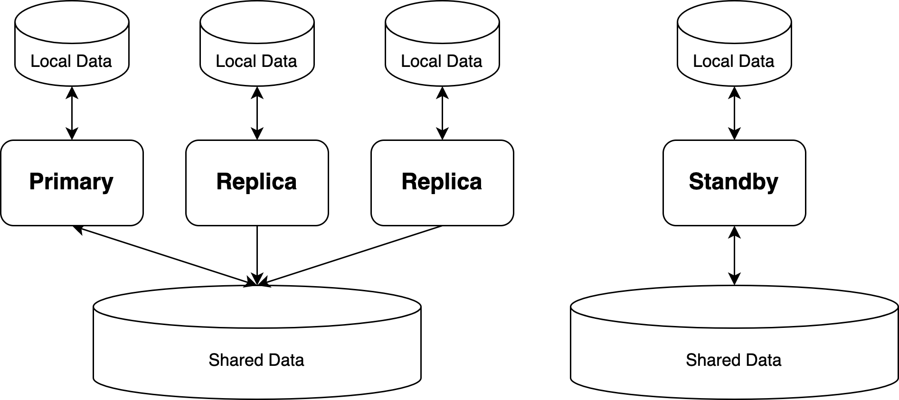

## 开源PolarDB|PostgreSQL 应用开发者&DBA 公开课 - 5.4 PolarDB开源版本必学特性 - PolarDB 日常运维          
                              
### 作者                              
digoal                              
                              
### 日期                              
2024-01-23                              
                              
### 标签                              
PostgreSQL , PolarDB , 应用开发者 , DBA , 公开课                    
                              
----                              
                              
## 背景      
## PolarDB 日常运维      
### 本节阅读导航
[本节环境说明](#jump0)  
  
[1、PolarDB 读写节点故障切换 (只读节点在线 Promote)](#jump1)  
  
[2、增加PolarDB 只读节点](#jump2)  
  
[3、配置PolarDB WAL日志归档](#jump3)  
  
[4、备份 PolarDB](#jump4)  
  
[5、恢复 PolarDB](#jump5)  
  
[6、创建 PolarDB 实例的容灾实例](#jump6)  
  
[7、排查 PolarDB CPU负载高](#jump7)  
  
  
### <span id="jump0">本节环境说明</span>   
为了降低学习门槛, 满足没有共享存储环境的同学可以进行体验的需求, 本章的例子使用的是本地环境进行讲解, 共享存储的方法与之类似可以自行探索更有乐趣.    
  
主机创建一个目录用于存放PolarDB共享数据卷 (请根据你自己的环境进行修改, 本例为`/Users/digoal/polardb_data`) :  
```  
mkdir ~/polardb_data  
cd ~/polardb_data  
pwd  
  返回:  
  /Users/digoal/polardb_data   
```  
  
拉取镜像  
```  
docker pull polardb/polardb_pg_local_instance  
```  
  
初始化数据库 (请根据你自己的环境进行修改, 本例为`/Users/digoal/polardb_data`)    
```  
docker run -it --rm \
    --env POLARDB_PORT=5432 \
    --env POLARDB_USER=postgres \
    --env POLARDB_PASSWORD=hellopwd123 \
    -v /Users/digoal/polardb_data:/var/polardb \
    polardb/polardb_pg_local_instance \
    echo 'done'     
```  
  
启动 PolarDB-PG 服务 (请根据你自己的环境进行修改, 本例为`/Users/digoal/polardb_data`)    
```  
docker run -it -P -d \
    --cap-add=SYS_PTRACE \
    --cap-add SYS_ADMIN \
    --privileged=true \
    --name polardb_pg \
    --shm-size=1g \
    --network=host \
    -v /Users/digoal/polardb_data:/var/polardb \
    polardb/polardb_pg_local_instance    
```  
  
容器内的 `5432` 至 `5434` 端口分别运行着一个读写节点和两个只读节点。两个只读节点与读写节点共享同一份数据，并通过物理复制保持与读写节点的内存状态同步。  
  
进入容器  
```  
docker exec -ti polardb_pg bash  
  
postgres@docker-desktop:~$ psql  
psql (11.9)  
Type "help" for help.  
  
postgres=# SHOW data_directory;  
        data_directory          
------------------------------  
 /var/polardb/primary_datadir  
(1 row)  
```  
  
没有特殊说明, 下面演示都在容器中执行.    
  
### <span id="jump1">1、PolarDB 读写节点故障切换 (只读节点在线 Promote)</span>     
  
首先确认1主2读3个节点的数据目录    
```  
postgres@docker-desktop:~$ ps -efw|grep postgres|grep "\-D"  
postgres    17     1  0 14:08 pts/0    00:00:00 /home/postgres/tmp_basedir_polardb_pg_1100_bld/bin/postgres -D /var/polardb/primary_datadir  
postgres    48     1  0 14:08 pts/0    00:00:00 /home/postgres/tmp_basedir_polardb_pg_1100_bld/bin/postgres -D /var/polardb/replica_datadir1  
postgres    64     1  0 14:08 pts/0    00:00:00 /home/postgres/tmp_basedir_polardb_pg_1100_bld/bin/postgres -D /var/polardb/replica_datadir2  
```  
  
关闭读写节点(5432), 模拟读写节点故障.   
```  
pg_ctl -D /var/polardb/primary_datadir stop -m fast  
```  
  
此时，集群中没有任何节点可以写入存储了。这时，我们需要将一个只读节点提升为读写节点，恢复对存储的写入。  
  
只有当读写节点停止写入后，才可以将只读节点提升为读写节点，否则将会出现集群内两个节点同时写入的情况。当数据库检测到出现多节点写入时，将会导致运行异常。  
  
将即将被激活的实例(5433)参数进行修改, 以进行激活. 注释的配置为采用quorum同步复制, 确保2个只读实例有1个收到wal meta.       
```  
echo "# synchronous_standby_names='ANY 1 (*)'  
synchronous_standby_names=''" >> /var/polardb/primary_datadir/postgresql.auto.conf   
  
echo "# synchronous_standby_names='ANY 1 (*)'  
synchronous_standby_names=''" >> /var/polardb/replica_datadir1/postgresql.auto.conf   
  
echo "# synchronous_standby_names='ANY 1 (*)'  
synchronous_standby_names=''" >> /var/polardb/replica_datadir2/postgresql.auto.conf   
```  
  
将运行在 5433 端口的只读节点提升为读写节点：  
```  
pg_ctl -D /var/polardb/replica_datadir1 promote  
waiting for server to promote.... done  
server promoted  
```  
  
接下来将将其他活着的节点(5434)的同步目标从old(5432)转移到新的读写节点(5433).   
```  
cd /var/polardb/replica_datadir2  
vi recovery.conf  
  
# 注释并修改  
# primary_conninfo = 'host=localhost port=5432 user=postgres dbname=postgres application_name=replica2'   
primary_conninfo = 'host=localhost port=5433 user=postgres dbname=postgres application_name=replica2'   
```  
  
老的RW节点角色转变为RO节点. 本例老的RW节点实际上还在, 所以可以将老的RW节点角色转变为RO节点.  
```  
cd /var/polardb/primary_datadir  
vi recovery.conf  
  
# 增加如下, 现在它是replica1, 过去的replica1是primary.   
primary_conninfo = 'host=localhost port=5433 user=postgres dbname=postgres application_name=replica1'  
primary_slot_name = 'replica1'  
polar_replica = on  
recovery_target_timeline = 'latest'  
  
# 启动节点  
pg_ctl -D /var/polardb/primary_datadir start  
```  
  
现在新的RW节点上可以看到有2个RO节点了  
```  
postgres@docker-desktop:~$ psql -p 5433  
psql (11.9)  
Type "help" for help.  
  
postgres=# select * from pg_replication_slots ;  
 slot_name | plugin | slot_type | datoid | database | temporary | active | active_pid | xmin | catalog_xmin | restart_lsn | confirmed_flush_lsn   
-----------+--------+-----------+--------+----------+-----------+--------+------------+------+--------------+-------------+---------------------  
 replica1  |        | physical  |        |          | f         | t      |      65345 |      |              | 0/174CEC0   |   
 replica2  |        | physical  |        |          | f         | t      |      65300 |      |              | 0/174CCC8   |   
(2 rows)  
  
postgres=# checkpoint;  
CHECKPOINT  
  
postgres=# select * from pg_stat_replication ;  
  pid  | usesysid | usename  | application_name | client_addr | client_hostname | client_port |         backend_start         | backend_xmin |   state   | sent_lsn  | write_lsn | flush_lsn | replay_lsn   
|    write_lag    |    flush_lag    |   replay_lag    | sync_priority | sync_state   
-------+----------+----------+------------------+-------------+-----------------+-------------+-------------------------------+--------------+-----------+-----------+-----------+-----------+------------  
+-----------------+-----------------+-----------------+---------------+------------  
 65300 |       10 | postgres | replica2         | ::1         |                 |       34416 | 2024-01-25 14:57:34.5525+08   |              | streaming | 0/174D048 | 0/174D048 | 0/174D048 | 0/174D048    
| 00:00:00.000239 | 00:00:00.000239 | 00:00:00.000467 |             0 | async  
 65345 |       10 | postgres | replica1         | ::1         |                 |       49196 | 2024-01-25 15:03:17.208988+08 |              | streaming | 0/174D048 | 0/174D048 | 0/174D048 | 0/174D048    
| 00:00:00.000352 | 00:00:00.000352 | 00:00:00.000435 |             0 | async  
(2 rows)  
```  
  
### <span id="jump2">2、增加PolarDB 只读节点</span>    
  
由于PolarDB采用了共享存储的架构, 新建只读节点时, 只读实例本地的数据可以通过初始化来生成, 不需要拷贝共享存储中的数据. 或者从已有计算节点拷贝.     
  
2\.1、创建本地数据目录  
```  
cd /var/polardb  
mkdir replica_datadir3  
chmod 700 replica_datadir3  
```  
  
2\.2、初始化RO实例数据目录    
```  
# 从RW节点 start backup  
psql -p 5433 -c "select pg_start_backup('test',true);"  
  
# 选择从replica2拷贝.  
cp -r /var/polardb/replica_datadir2/* /var/polardb/replica_datadir3/  
  
# 删除 postmaster.pid   
rm -f /var/polardb/replica_datadir3/postmaster.pid   
  
# 从RW节点 stop backup  
psql -p 5433 -c "select pg_stop_backup();"  
```  
  
2\.3、配置参数  
从任意只读实例拷贝如下4个文件  
```  
/var/polardb/replica_datadir3/  
  
  
postgresql.conf  
postgresql.auto.conf  
pg_hba.conf  
recovery.conf  
```  
  
修改以上文件的内容  
```  
echo "port = 5435  
  polar_hostid = 3" >> /var/polardb/replica_datadir3/postgresql.auto.conf  
  
echo "primary_conninfo = 'host=localhost port=5433 user=postgres dbname=postgres application_name=replica3'  
  primary_slot_name = 'replica3'" >> /var/polardb/replica_datadir3/recovery.conf  
```  
  
2\.4、在RW节点创建replica slot  
```  
psql \
    -p 5433 \
    -d postgres \
    -c "SELECT pg_create_physical_replication_slot('replica3');"  
  
 pg_create_physical_replication_slot  
-------------------------------------  
 (replica3,)  
(1 row)  
```  
  
2\.5、启动RO实例  
```  
pg_ctl start -D /var/polardb/replica_datadir3  
```  
  
2\.6、检查新RO实例上的数据是否正确  
```  
# 在RW节点执行数据写入
# 注意, 目前PolarDB DDL语句通过WAL同步到所有的RO节点/standby节点, 
# 因此在执行DDL时要确保所有replication slot对应节点的正常, 否则DDL操作会被堵塞.
# 通过pg_replication_slots视图或pg_get_replication_slots()函数可以查询系统中的slots.
# 如果SLOT对应节点已经不需要(例如故障)了, 那么请及时调用pg_drop_replication_slot(name)删除对应的slot
psql -p 5433  
drop table if exists test;  
create table test (id int, info text, ts timestamp);  
insert into test select generate_series(1,10), md5(random()::text), clock_timestamp();  
  
# 在RO节点查看数据是否已同步
psql -p 5435  
select count(*) from test;  
```  
  
2\.7、检查新的PolarDB集群拓扑  
```  
psql -p 5433  
select * from pg_stat_replication;  
  
  pid  | usesysid | usename  | application_name | client_addr | client_hostname | client_port |         backend_start         | backend_xmin |   state   | sent_lsn  | write_lsn | flush_lsn | replay_lsn   
| write_lag | flush_lag | replay_lag | sync_priority | sync_state   
-------+----------+----------+------------------+-------------+-----------------+-------------+-------------------------------+--------------+-----------+-----------+-----------+-----------+------------  
+-----------+-----------+------------+---------------+------------  
 65300 |       10 | postgres | replica2         | ::1         |                 |       34416 | 2024-01-25 14:57:34.5525+08   |              | streaming | 0/17516A8 | 0/17516A8 | 0/17516A8 | 0/17516A8    
|           |           |            |             0 | async  
 65345 |       10 | postgres | replica1         | ::1         |                 |       49196 | 2024-01-25 15:03:17.208988+08 |              | streaming | 0/17516A8 | 0/17516A8 | 0/17516A8 | 0/17516A8    
|           |           |            |             0 | async  
 65589 |       10 | postgres | replica3         | ::1         |                 |       41628 | 2024-01-25 15:48:53.513407+08 |              | streaming | 0/17516A8 | 0/17516A8 | 0/17516A8 | 0/17516A8    
|           |           |            |             0 | async  
(3 rows)  
```  
  
### <span id="jump3">3、配置PolarDB WAL日志归档</span>    
  
3\.1、创建归档目录  
```  
cd /var/polardb/  
mkdir wal_archive  
```  
  
3\.2、新增配置  
```  
echo "polar_enable_switch_wal_in_backup = on  
archive_mode = on  
archive_command = 'test ! -f /var/polardb/wal_archive/%f && cp %p /var/polardb/wal_archive/%f'" >> /var/polardb/primary_datadir/postgresql.auto.conf  
  
echo "polar_enable_switch_wal_in_backup = on  
archive_mode = on  
archive_command = 'test ! -f /var/polardb/wal_archive/%f && cp %p /var/polardb/wal_archive/%f'" >> /var/polardb/replica_datadir1/postgresql.auto.conf  
  
echo "polar_enable_switch_wal_in_backup = on  
archive_mode = on  
archive_command = 'test ! -f /var/polardb/wal_archive/%f && cp %p /var/polardb/wal_archive/%f'" >> /var/polardb/replica_datadir2/postgresql.auto.conf  
  
echo "polar_enable_switch_wal_in_backup = on  
archive_mode = on  
archive_command = 'test ! -f /var/polardb/wal_archive/%f && cp %p /var/polardb/wal_archive/%f'" >> /var/polardb/replica_datadir3/postgresql.auto.conf  
```  
  
3\.3、重启计算节点  
```  
pg_ctl restart -m fast -D /var/polardb/primary_datadir  
pg_ctl restart -m fast -D /var/polardb/replica_datadir1  
pg_ctl restart -m fast -D /var/polardb/replica_datadir2  
pg_ctl restart -m fast -D /var/polardb/replica_datadir3  
```  
  
3\.4、确认归档是否正常  
```  
psql -p 5433  
psql (11.9)  
Type "help" for help.  
  
postgres=#   select pg_switch_wal();  
 pg_switch_wal   
---------------  
 0/17517B0  
(1 row)  
  
postgres=# checkpoint;  
CHECKPOINT  
postgres=#   select pg_switch_wal();  
 pg_switch_wal   
---------------  
 0/2000120  
(1 row)  
  
postgres=# \q  
  
postgres@docker-desktop:/var/polardb/wal_archive$ ll  
total 32768  
drwxr-xr-x 4 postgres postgres      128 Jan 25 15:57 ./  
drwxrwxrwx 8 postgres postgres      256 Jan 25 15:52 ../  
-rw------- 1 postgres postgres 16777216 Jan 25 15:56 000000010000000000000001  
-rw------- 1 postgres postgres 16777216 Jan 25 15:57 000000010000000000000002  
```  
  
### <span id="jump4">4、备份 PolarDB</span>      
  
PolarDB for PostgreSQL 采用基于共享存储的存算分离架构，其数据目录分为以下两类：  
- 本地数据目录：位于每个计算节点的本地存储上，为每个计算节点私有  
- 共享数据目录：位于共享存储上，被所有计算节点共享  
  
   
  
由于本地数据目录中的目录和文件不涉及数据库的核心数据，因此在备份数据库时，备份本地数据目录是可选的。可以仅备份共享存储上的数据目录，然后使用 `initdb` 重新生成新的本地存储目录。但是计算节点的本地配置文件需要被手动备份，如 `postgresql.conf`、`postgresql.auto.conf`、`pg_hba.conf`、`recovery.conf`  等文件。  
  
通过以下 SQL 命令可以查看节点的本地数据目录：  
```  
postgres=# SHOW data_directory;  
        data_directory          
------------------------------  
 /var/polardb/primary_datadir  
(1 row)  
```  
  
通过以下 SQL 命令可以查看所有计算节点在共享存储上的共享数据目录：  
```  
postgres=# SHOW polar_datadir;  
             polar_datadir                
----------------------------------------  
 file-dio:///var/polardb/shared_datadir  
(1 row)  
```  
  
polar_basebackup 备份工具  
  
PolarDB for PostgreSQL 的备份工具 `polar_basebackup`，由 PostgreSQL 的 `pg_basebackup` 改造而来，完全兼容 `pg_basebackup`，因此同样可以用于对 PostgreSQL 做备份恢复。`polar_basebackup` 的可执行文件位于 PolarDB for PostgreSQL 安装目录下的 `bin/` 目录中。  
  
该工具的主要功能是将一个运行中的 PolarDB for PostgreSQL 数据库的数据目录（包括本地数据目录和共享数据目录）备份到目标目录中。  
```  
polar_basebackup takes a base backup of a running PostgreSQL server.  
  
Usage:  
  polar_basebackup [OPTION]...  
  
Options controlling the output:  
  -D, --pgdata=DIRECTORY receive base backup into directory  
  -F, --format=p|t       output format (plain (default), tar)  
  -r, --max-rate=RATE    maximum transfer rate to transfer data directory  
                         (in kB/s, or use suffix "k" or "M")  
  -R, --write-recovery-conf  
                         write recovery.conf for replication  
  -T, --tablespace-mapping=OLDDIR=NEWDIR  
                         relocate tablespace in OLDDIR to NEWDIR  
      --waldir=WALDIR    location for the write-ahead log directory  
  -X, --wal-method=none|fetch|stream  
                         include required WAL files with specified method  
  -z, --gzip             compress tar output  
  -Z, --compress=0-9     compress tar output with given compression level  
  
General options:  
  -c, --checkpoint=fast|spread  
                         set fast or spread checkpointing  
  -C, --create-slot      create replication slot  
  -l, --label=LABEL      set backup label  
  -n, --no-clean         do not clean up after errors  
  -N, --no-sync          do not wait for changes to be written safely to disk  
  -P, --progress         show progress information  
  -S, --slot=SLOTNAME    replication slot to use  
  -v, --verbose          output verbose messages  
  -V, --version          output version information, then exit  
      --no-slot          prevent creation of temporary replication slot  
      --no-verify-checksums  
                         do not verify checksums  
  -?, --help             show this help, then exit  
  
Connection options:  
  -d, --dbname=CONNSTR   connection string  
  -h, --host=HOSTNAME    database server host or socket directory  
  -p, --port=PORT        database server port number  
  -s, --status-interval=INTERVAL  
                         time between status packets sent to server (in seconds)  
  -U, --username=NAME    connect as specified database user  
  -w, --no-password      never prompt for password  
  -W, --password         force password prompt (should happen automatically)  
      --polardata=datadir  receive polar data backup into directory  
      --polar_disk_home=disk_home  polar_disk_home for polar data backup  
      --polar_host_id=host_id  polar_host_id for polar data backup  
      --polar_storage_cluster_name=cluster_name  polar_storage_cluster_name for polar data backup  
```  
  
`polar_basebackup` 的参数及用法几乎和 `pg_basebackup` 一致，新增了以下与共享存储相关的参数：  
- `--polar_disk_home` / `--polar_host_id` / `--polar_storage_cluster_name`：这三个参数指定了用于存放备份共享数据的共享存储节点  
- `--polardata`：该参数指定了备份共享存储节点上存放共享数据的路径；如不指定，则默认将共享数据备份到本地数据备份目录的 `polar_shared_data/` 路径下  
  
  
4\.1、创建存储备份文件的目录  
```  
cd /var/polardb  
mkdir backup  
```  
  
4\.2、备份  
```  
# 通过RW (5433)进行备份  
# 本地数据写入 /var/polardb/backup/primary  
# 共享数据写入 /var/polardb/backup/polar_shared_data  
  
polar_basebackup -h 127.0.0.1 -p 5433 -U postgres -R -D /var/polardb/backup/primary --polardata=/var/polardb/backup/polar_shared_data  
```  
  
4\.3、修改数据  
```  
postgres=# create table t (id int, info text, ts timestamp);  
CREATE TABLE  
postgres=# insert into t values (1,'test',now());  
INSERT 0 1  
```  
  
4\.4、切换WAL日志保证归档正常  
```  
postgres=# checkpoint;  
CHECKPOINT   
postgres=# select pg_switch_wal();  
 pg_switch_wal   
---------------  
 0/7003280  
(1 row)  
  
postgres=# select pg_switch_wal();  
 pg_switch_wal   
---------------  
 0/8000078  
(1 row)  
  
postgres=# \q  
  
postgres@docker-desktop:/var/polardb/backup$ cd ../wal_archive/  
postgres@docker-desktop:/var/polardb/wal_archive$ ll  
total 131072  
drwxr-xr-x 10 postgres postgres      320 Jan 25 16:17 ./  
drwxrwxrwx  9 postgres postgres      288 Jan 25 16:09 ../  
-rw-------  1 postgres postgres 16777216 Jan 25 15:56 000000010000000000000001  
-rw-------  1 postgres postgres 16777216 Jan 25 15:57 000000010000000000000002  
-rw-------  1 postgres postgres 16777216 Jan 25 16:13 000000010000000000000003  
-rw-------  1 postgres postgres 16777216 Jan 25 16:13 000000010000000000000004  
-rw-------  1 postgres postgres 16777216 Jan 25 16:15 000000010000000000000005  
-rw-------  1 postgres postgres 16777216 Jan 25 16:15 000000010000000000000006  
-rw-------  1 postgres postgres 16777216 Jan 25 16:17 000000010000000000000007  
-rw-------  1 postgres postgres 16777216 Jan 25 16:17 000000010000000000000008  
```  
  
### <span id="jump5">5、恢复 PolarDB</span>      
  
恢复整个集群(包括共享文件)到一个新的集群.    
  
5\.1、创建新的共享数据目录  
  
直接在备份目录中操作, 略.   
  
5\.2、创建新的主节点目录  
  
直接在备份目录中操作, 略.   
  
5\.3、恢复共享数据  
  
直接在备份目录中操作, 略.   
  
5\.4、恢复主节点数据  
  
直接在备份目录中操作, 略.   
  
5\.5、配置恢复文件  
```  
cd /var/polardb/backup/primary  
  
echo "polar_enable_switch_wal_in_backup = on  
archive_mode = on  
archive_command = '/bin/date'   
polar_datadir = 'file-dio:///var/polardb/backup/polar_shared_data'  
port = 5436  
polar_hostid = 200 " >> ./postgresql.conf   
  
echo "polar_enable_switch_wal_in_backup = on  
archive_mode = on  
archive_command = '/bin/date'   
polar_datadir = 'file-dio:///var/polardb/backup/polar_shared_data'  
port = 5436  
polar_hostid = 200 " >> ./postgresql.auto.conf   
  
echo "recovery_target_timeline = 'latest'  
restore_command = 'cp /var/polardb/wal_archive/%f %p' " > ./recovery.conf   
```  
  
5\.6、启动并进行恢复  
```  
pg_ctl start -D /var/polardb/backup/primary  
```  
  
5\.7、观察最后修改的数据是否正常恢复到新的PolarDB集群  
```  
postgres@docker-desktop:/var/polardb/backup/primary$ psql -p 5436  
psql (11.9)  
Type "help" for help.  
  
postgres=# select * from t;  
 id | info  |             ts               
----+-------+----------------------------  
  1 | test  | 2024-01-25 16:17:29.400825  
```
  
### <span id="jump6">6、创建 PolarDB 实例的容灾实例</span>    
  
容灾实例包含计算节点和存储2个部分, 从主实例同步WAL的完整数据进行回放. PolarDB的流复制协议会自动识别当前是不同存储实例的容灾节点还是同一存储实例下的RO节点, 如果是不同存储下的容灾节点, 流复制会发送所有的WAL信息, 如果是同一存储下的 RO节点则只发送WAL meta信息.   
  
  
6\.1、准备容灾机器, 本例子就在同一个docker容器中进行模拟测试, 所以创建一个新的实例目录即可.  
```  
cd /var/polardb    
mkdir disast    
```  
  
6\.2、使用`polar_basebackup`备份主实例和存储  
```  
# 通过RW (5433)进行备份    
# 本地数据写入 /var/polardb/disast/primary    
# 共享数据写入 /var/polardb/disast/polar_shared_data    
  
polar_basebackup -h 127.0.0.1 -p 5433 -U postgres -R -D /var/polardb/disast/primary --polardata=/var/polardb/disast/polar_shared_data  
```  
  
6\.3、修改容灾实例配置  
```  
cd /var/polardb/disast/primary    
    
echo "polar_enable_switch_wal_in_backup = on    
archive_mode = on    
archive_command = '/bin/date'     
polar_datadir = 'file-dio:///var/polardb/disast/polar_shared_data'    
port = 1921    
polar_hostid = 100 " >> ./postgresql.conf     
    
echo "polar_enable_switch_wal_in_backup = on    
archive_mode = on    
archive_command = '/bin/date'     
polar_datadir = 'file-dio:///var/polardb/disast/polar_shared_data'    
port = 1921    
polar_hostid = 100 " >> ./postgresql.auto.conf     
    
echo "recovery_target_timeline = 'latest'    
standby_mode = 'on'  
primary_conninfo = 'host=localhost port=5433 user=postgres dbname=postgres application_name=diast_primary' " > ./recovery.conf     
```  
  
6\.4、启动容灾实例  
```  
pg_ctl start -D /var/polardb/disast/primary    
```  
  
6\.5、在主实例的读写节点对数据进行修改  
```  
psql -p 5433  
  
create table tbl_diast(id int primary key, info text, ts timestamp);  
insert into tbl_diast select generate_series(1,10), md5(random()::text), clock_timestamp();  
```  
  
6\.6、观察容灾节点同步数据是否正常  
```  
psql -p 1921  
  
postgres=# select count(*) from tbl_diast;  
 count   
-------  
    10  
(1 row)  
```
  
使用lsof可以看到容灾实例打开了primary和polar_shared_data数据文件
```
sudo apt-get install -y lsof

lsof|grep disast

...
postgres  588              postgres    7u      REG              0,176     32768   27919 /var/polardb/disast/polar_shared_data/base/13123/2703
postgres  584              postgres   13w      REG              0,176         0   28920 /var/polardb/disast/primary/pg_log/postgresql-2024-01-26_202711_slow.log
```
    
  
### <span id="jump7">7、排查 PolarDB CPU负载高</span>       
  
在 PolarDB for PostgreSQL 的使用过程中，可能会出现 CPU 使用率异常升高甚至达到满载的情况。本文将介绍造成这种情况的常见原因和排查方法，以及相应的解决方案。  
  
7\.1、业务量上涨  
当 CPU 使用率上升时，最有可能的情况是业务量的上涨导致数据库使用的计算资源增多。所以首先需要排查目前数据库的活跃连接数是否比平时高很多。如果数据库配备了监控系统，那么活跃连接数的变化情况可以通过图表的形式观察到；否则可以直接连接到数据库，执行如下 SQL 来获取当前活跃连接数：  
```  
SELECT COUNT(*) FROM pg_stat_activity WHERE state NOT LIKE 'idle';  
```  
  
`pg_stat_activity` 是 PostgreSQL 的内置系统视图，该视图返回的每一行都是一个正在运行中的 PostgreSQL 进程，`state` 列表示进程当前的状态。该列可能的取值为：  
- `active`：进程正在执行查询  
- `idle`：进程空闲，正在等待新的客户端命令  
- `idle in transaction`：进程处于事务中，但目前暂未执行查询  
- `idle in transaction (aborted)`：进程处于事务中，且有一条语句发生过错误  
- `fastpath function call`：进程正在执行一个 `fast-path` 函数  
- `disabled`：进程的状态采集功能被关闭  
  
上述 SQL 能够查询到所有非空闲状态的进程数，即可能占用 CPU 的活跃连接数。如果活跃连接数较平时更多，则 CPU 使用率的上升是符合预期的。  
  
7\.2、慢查询  
  
如果 CPU 使用率上升，而活跃连接数的变化范围处在正常范围内，那么有可能出现了较多性能较差的慢查询。这些慢查询可能在很长一段时间里占用了较多的 CPU，导致 CPU 使用率上升。PostgreSQL 提供了慢查询日志的功能，执行时间高于 `log_min_duration_statement` 的 SQL 将会被记录到慢查询日志中。然而当 CPU 占用率接近满载时，将会导致整个系统的停滞，所有 SQL 的执行可能都会慢下来，所以慢查询日志中记录的信息可能非常多，并不容易排查。  
  
7\.2\.1、定位执行时间较长的慢查询  
  
[`pg_stat_statements`](https://www.postgresql.org/docs/current/pgstatstatements.html) 插件能够记录数据库服务器上所有 SQL 语句在优化和执行阶段的统计信息。由于该插件需要使用共享内存，因此插件名需要被配置在 `shared_preload_libraries` 参数中。  
  
如果没有在当前数据库中创建过 `pg_stat_statements` 插件的话，首先需要创建这个插件。该过程将会注册好插件提供的函数及视图：  
```  
CREATE EXTENSION IF NOT EXISTS pg_stat_statements;  
```  
  
该插件和数据库系统本身都会不断累积统计信息。为了排查 CPU 异常升高后这段时间内的问题，需要把数据库和插件中留存的统计信息做一次清空，然后开始收集从当前时刻开始的统计信息：  
  
-- 清空当前数据库的统计信息  
SELECT pg_stat_reset();  
-- 清空 pg_stat_statements 插件截止目前收集的统计信息  
SELECT pg_stat_statements_reset();  
接下来需要等待一段时间（1-2 分钟），使数据库和插件充分采集这段时间内的统计信息。  
  
统计信息收集完毕后，参考使用如下 SQL 查询执行时间最长的 5 条 SQL：  
```  
-- < PostgreSQL 13  
SELECT * FROM pg_stat_statements ORDER BY total_time DESC LIMIT 5;  
  
-- >= PostgreSQL 13  
SELECT * FROM pg_stat_statements ORDER BY total_exec_time DESC LIMIT 5;  
```  
  
7\.2\.2、定位读取 Buffer 数量较多的慢查询  
  
当一张表缺少索引，而对该表的查询基本上都是点查时，数据库将不得不使用全表扫描，并在内存中进行过滤条件的判断，处理掉大量的无效记录，导致 CPU 使用率大幅提升。利用 pg_stat_statements 插件的统计信息，参考如下 SQL，可以列出截止目前读取 Buffer 数量最多的 5 条 SQL：  
```  
SELECT * FROM pg_stat_statements  
ORDER BY shared_blks_hit + shared_blks_read DESC  
LIMIT 5;  
```  
  
借助 PostgreSQL 内置系统视图 [`pg_stat_user_tables`](https://www.postgresql.org/docs/15/monitoring-stats.html#MONITORING-PG-STAT-ALL-TABLES-VIEW) 中的统计信息，也可以统计出使用全表扫描的次数最多的表。参考如下 SQL，可以获取具备一定规模数据量（元组约为 10 万个）且使用全表扫描获取到的元组数量最多的 5 张表：  
```  
SELECT * FROM pg_stat_user_tables  
WHERE n_live_tup > 100000 AND seq_scan > 0  
ORDER BY seq_tup_read DESC  
LIMIT 5;  
```  
  
7\.2\.3、定位长时间执行不结束的慢查询  
  
通过系统内置视图 `pg_stat_activity`，可以查询出长时间执行不结束的 SQL，这些 SQL 有极大可能造成 CPU 使用率过高。参考以下 SQL 获取查询执行时间最长，且目前还未退出的 5 条 SQL：  
```  
SELECT  
    *,  
    extract(epoch FROM (NOW() - xact_start)) AS xact_stay,  
    extract(epoch FROM (NOW() - query_start)) AS query_stay  
FROM pg_stat_activity  
WHERE state NOT LIKE 'idle%'  
ORDER BY query_stay DESC  
LIMIT 5;  
```  
  
结合前一步中排查到的 使用全表扫描最多的表，参考如下 SQL 获取 在该表上 执行时间超过一定阈值（比如 10s）的慢查询：  
```  
SELECT * FROM pg_stat_activity  
WHERE  
    state NOT LIKE 'idle%' AND  
    query ILIKE '%表名%' AND  
    NOW() - query_start > interval '10s';  
```  
  
7\.2\.4、解决方法与优化思路  
  
对于异常占用 CPU 较高的 SQL，如果仅有个别非预期 SQL，则可以通过给后端进程发送信号的方式，先让 SQL 执行中断，使 CPU 使用率恢复正常。参考如下 SQL，以慢查询执行所使用的进程 pid（`pg_stat_activity` 视图的 `pid` 列）作为参数，中止相应的进程的执行：  
```  
SELECT pg_cancel_backend(pid);  
SELECT pg_terminate_backend(pid);  
```  
  
如果执行较慢的 SQL 是业务上必要的 SQL，那么需要对它进行调优。  
  
首先可以对 SQL 涉及到的表进行采样，更新其统计信息，使优化器能够产生更加准确的执行计划。采样需要占用一定的 CPU，最好在业务低谷期运行：  
```  
ANALYZE 表名;  
```  
  
对于全表扫描较多的表，可以在常用的过滤列上创建索引，以尽量使用索引扫描，减少全表扫描在内存中过滤不符合条件的记录所造成的 CPU 浪费。  
  
7\.3、更多的DBA常用SQL参考[digoal github](../202005/20200509_02.md)  
  
更多优化思路参考[digoal github](../201704/20170424_06.md)    
  
更多维护信息参考[PolarDB 开源官方网站](https://apsaradb.github.io/PolarDB-for-PostgreSQL/zh/).    
  
  
#### [期望 PostgreSQL|开源PolarDB 增加什么功能?](https://github.com/digoal/blog/issues/76 "269ac3d1c492e938c0191101c7238216")
  
  
#### [PolarDB 开源数据库](https://openpolardb.com/home "57258f76c37864c6e6d23383d05714ea")
  
  
#### [PolarDB 学习图谱](https://www.aliyun.com/database/openpolardb/activity "8642f60e04ed0c814bf9cb9677976bd4")
  
  
#### [购买PolarDB云服务折扣活动进行中, 55元起](https://www.aliyun.com/activity/new/polardb-yunparter?userCode=bsb3t4al "e0495c413bedacabb75ff1e880be465a")
  
  
#### [PostgreSQL 解决方案集合](../201706/20170601_02.md "40cff096e9ed7122c512b35d8561d9c8")
  
  
#### [德哥 / digoal's Github - 公益是一辈子的事.](https://github.com/digoal/blog/blob/master/README.md "22709685feb7cab07d30f30387f0a9ae")
  
  
#### [About 德哥](https://github.com/digoal/blog/blob/master/me/readme.md "a37735981e7704886ffd590565582dd0")
  
  

  
