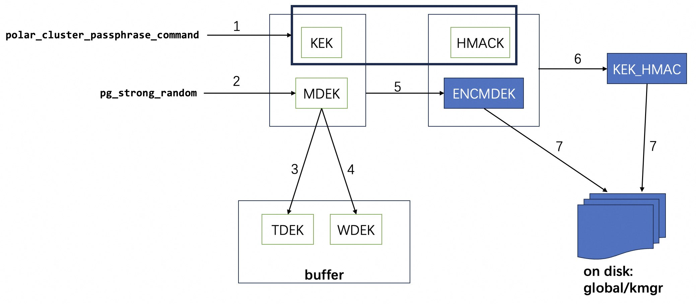
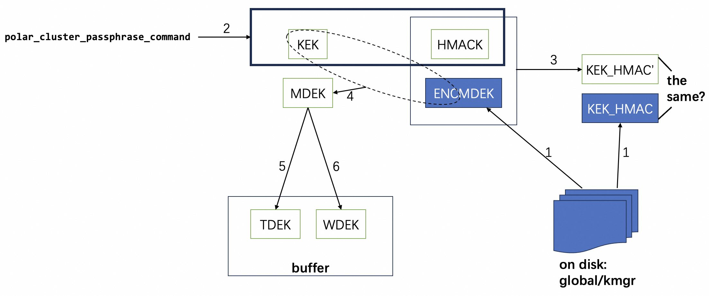
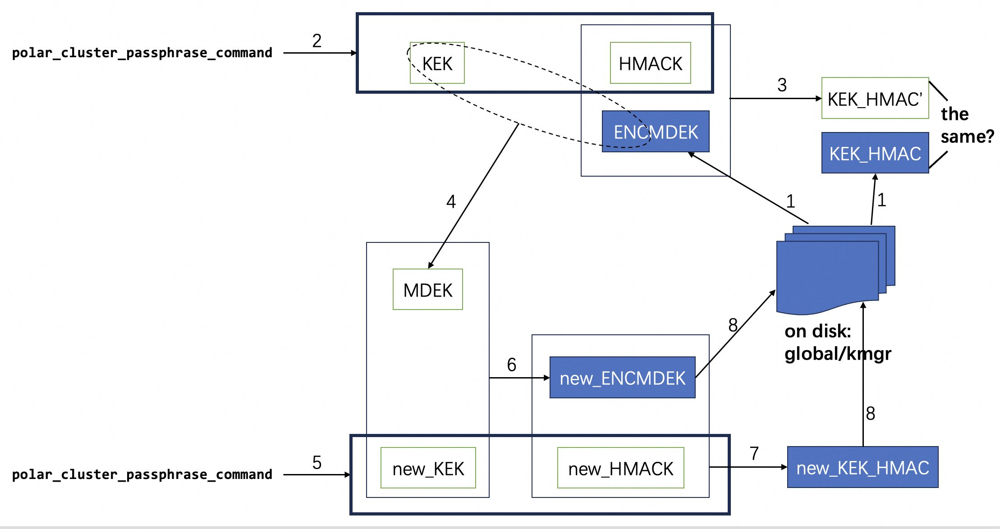

## 开源PolarDB|PostgreSQL 应用开发者&DBA 公开课 - 5.5 PolarDB开源版本必学特性 - PolarDB 特性解读与体验       
                                  
### 作者                                  
digoal                                  
                                  
### 日期                                  
2024-01-25                                  
                                  
### 标签                                  
PostgreSQL , PolarDB , 应用开发者 , DBA , 公开课                        
                                  
----                                  
                                  
## 背景          
  
## PolarDB 特性解读与体验  
[b站视频链接](https://www.bilibili.com/video/BV19wf8YFEsk/)  

[Youtube视频链接](https://www.youtube.com/watch?v=ly3EH94kk_k)  
   
### 本节阅读导航
[1、预读 / 预扩展](#jump1)  
  
[2、Shared Server(这个功能可能不演进了, 建议使用连接池)](#jump2)  
  
[3、闪回表和闪回日志](#jump3)  
  
[4、弹性跨机并行查询（ePQ）](#jump4)  
  
[5、TDE 透明数据加密](#jump5)  
  
实验1-4环境容器:  
```
mkdir ~/pb11_1  
cd ~/pb11_1  

docker run -d -it -P --shm-size=1g \
--cap-add=SYS_PTRACE --cap-add SYS_ADMIN \
--privileged=true --name pb11_1 \
-v ${PWD}:/var/polardb \
registry.cn-hangzhou.aliyuncs.com/polardb_pg/polardb_pg_local_instance:11 bash  
```
  
### <span id="jump1">1、预读 / 预扩展</span>    
  
1\.1、堆表预读  
  
在 PostgreSQL 读取堆表的过程中，会以 8kB 页为单位通过文件系统读取页面至内存缓冲池（Buffer Pool）中。PFS 对于这种数据量较小的 I/O 操作并不是特别高效。所以，PolarDB 为了适配 PFS 而设计了 堆表批量预读。当读取的页数量大于 1 时，将会触发批量预读，一次 I/O 读取 128kB 数据至 Buffer Pool 中。预读对顺序扫描（Sequential Scan）、Vacuum 两种场景性能可以带来一倍左右的提升，在索引创建场景下可以带来 18% 的性能提升。  
  
1\.2、堆表预扩展  
  
在 PostgreSQL 中，表空间的扩展过程中将会逐个申请并扩展 8kB 的页。即使是 PostgreSQL 支持的批量页扩展，进行一次 N 页扩展的流程中也包含了 N 次 I/O 操作。这种页扩展不符合 PFS 最小页扩展粒度为 4MB 的特性。为此，PolarDB 设计了堆表批量预扩展，在扩展堆表的过程中，一次 I/O 扩展 4MB 页。在写表频繁的场景下（如装载数据），能够带来一倍的性能提升。  
  
1\.3、索引创建预扩展  
  
索引创建预扩展与堆表预扩展的功能类似。索引创建预扩展特别针对 PFS 优化索引创建过程。在索引创建的页扩展过程中，一次 I/O 扩展 4MB 页。这种设计可以在创建索引的过程中带来 30% 的性能提升。  
  
  
>注意  
>当前索引创建预扩展只适配了 B-Tree 索引。其他索引类型暂未支持。  
  
  
  
1\.4、使用堆表预读  
  
堆表预读的参数名为 `polar_bulk_read_size`，功能默认开启，默认大小为 `128kB`。不建议用户自行修改该参数，`128kB` 是贴合 PFS 的最优值，自行调整并不会带来性能的提升。  
  
关闭功能：  
```  
ALTER SYSTEM SET polar_bulk_read_size = 0;  
SELECT pg_reload_conf();  
```  
  
打开功能并设置预读大小为 128kB：  
```  
ALTER SYSTEM SET polar_bulk_read_size = '128kB';  
SELECT pg_reload_conf();  
```  
  
1\.5、使用堆表预扩展  
  
堆表预扩展的参数名为 `polar_bulk_extend_size`，功能默认开启，预扩展的大小默认是 4MB。不建议用户自行修改该参数值，4MB 是贴合 PFS 的最优值。  
  
关闭功能：  
```  
ALTER SYSTEM SET polar_bulk_extend_size = 0;  
SELECT pg_reload_conf();  
```  
  
打开功能并设置预扩展大小为 4MB：  
```  
ALTER SYSTEM SET polar_bulk_extend_size = '4MB';  
SELECT pg_reload_conf();  
```
   
demo:    
```
set polar_force_unlogged_to_logged_table=off;
create  unlogged table t (id int);
\timing
insert into t select generate_series(1,10000000); 
```
  
1\.6、使用索引创建预扩展  
  
索引创建预扩展的参数名为 `polar_index_create_bulk_extend_size`，功能默认开启。索引创建预扩展的大小默认是 4MB。不建议用户自行修改该参数值，4MB 是贴合 PFS 的最优值。  
  
关闭功能：  
```  
ALTER SYSTEM SET polar_index_create_bulk_extend_size = 0;  
SELECT pg_reload_conf();  
```  
  
打开功能，并设置预扩展大小为 4MB：  
```  
ALTER SYSTEM SET polar_index_create_bulk_extend_size = 512;  
SELECT pg_reload_conf();  
```  
  
1\.7、性能表现  
  
为了展示堆表预读、堆表预扩展、索引创建预扩展的性能提升效果，以下是 PolarDB for PostgreSQL 14 的实例上进行的测试。  
- 规格：8 核 32GB 内存  
- 测试场景：400GB pgbench 测试  
  
  
1\.7\.1、堆表预读  
  
400GB 表的 Vacuum 性能：  
  
   
  
400GB 表的 SeqScan 性能：  
  
   
  
  
结论：  
- 堆表预读在 Vacuum 和 SeqScan 场景上，性能提升了 1-2 倍  
- 堆表预读大小在超过默认值 128kB 之后对性能提升没有明显帮助  
  
1\.7\.2、堆表预扩展  
  
400GB 表数据装载性能：  
  
   
  
  
结论：  
- 堆表预扩展在数据装载场景下带来一倍的性能提升  
- 堆表预扩展大小在超过默认值 4MB 后对性能没有明显帮助  
  
  
1\.7\.3、索引创建预扩展  
  
400GB 表创建索引性能：  
  
   
  
结论：  
- 索引创建预扩展在索引创建场景下能够带来 30% 的性能提升  
- 加大索引创建预扩展大小超过默认值 4MB 对性能没有明显帮助  
  
  
### <span id="jump2">2、Shared Server(这个功能可能不演进了, 建议使用连接池)</span>    
  
原生 PostgreSQL 的连接调度方式是每一个进程对应一个连接 (One-Process-Per-Connection)，这种调度方式适合低并发、长连接的业务场景。而在高并发或大量短连接的业务场景中，进程的大量创建、销毁以及上下文切换，会严重影响性能。同时，在业务容器化部署后，每个容器通过连接池向数据库发起连接，业务在高峰期会弹性扩展出很多容器，后端数据库的连接数会瞬间增高，影响数据库稳定性，导致 OOM 频发。  
  
  
  
为了解决上述问题，业界在使用 PostgreSQL 时通常会配置连接池组件，比如部署在数据库侧的后置连接池 [PgBouncer](https://www.pgbouncer.org/)，部署在应用侧的前置连接池 [Druid](https://github.com/alibaba/druid)。但大多数后置连接池无法支持保留用户连接私有信息（如 GUC 参数、Prepared Statement）的相关功能，在面临进程被污染的情况（如加载动态链接库、修改 role 参数）时也无法及时清理。PS: 有些后置连接池现在也能支持某些常见会话变量的HOLD和漂移, [《pgbouncer 1.21 开始支持 prepared statement in 事务模式》](../202310/20231026_02.md) . 前置连接池不仅无法解决后置连接池的缺陷，还无法根据应用规模扩展而实时调整配置，仍然会面临连接数膨胀的问题。  
  
PolarDB for PostgreSQL 针对上述问题，从数据库内部提供了 Shared Server（后文简称 SS）内置连接池功能，采用共享内存 + Session Context + Dispatcher 转发 + Backend Pool 的架构，实现了用户连接与后端进程的解绑。后端进程具备了 Native、Shared、Dedicated 三种执行模式，并且在运行时可以根据实时负载和进程污染情况进行动态转换。负载调度算法充分吸收 AliSQL 对社区版 MySQL 线程池的缺陷改进，使用 Stall 机制弹性控制 Worker 数量，同时避免用户连接饿死。从根本上解决了高并发或者大量短连接带来的性能、稳定性问题。  
  
  
  
TPC-C 高并发性能对比  
- Shared Server 主要应用于高并发或大量短连接的业务场景，因此这里使用 TPC-C 进行测试。  
  
使用 104c 512GB 的物理机单机部署，测试 TPC-C 1000 仓下，并发数从 300 增大到 5000 时，不同配置下的分数对比。如下图所示：  
- old：不使用任何连接池，使用 PostgreSQL 的原生执行模式（即 Native 模式）  
- ss off：使用 Shared Server 内置连接池，启动前关闭 SS 开关，退化为 Native 模式  
- ss native：使用 Shared Server 内置连接池，启动后关闭 SS 开关，退化为 Native 模式  
- ss didicated：使用 Shared Server 内置连接池，启动后开启 SS 开关，但强制使用 Dedicated 模式  
- ss shared：使用 Shared Server 内置连接池，启动后开启 SS 开关，使用标准的 Shared 模式  
  
  
  
从图中可以看出：  
- 原生 PostgreSQL 场景、Shared Server 关闭的场景、Shared Server 兜底场景中，均无法稳定进行 TPC-C 高并发测试。性能从并发数为 1500 时开始下跌，在并发数为 5000 时已经不能提供服务  
- Shared Server 开启并进入 Shared 模式后，TPC-C 性能不受高并发数影响，始终保持在稳定状态，很好地支持了高并发场景  
  
使用说明  
  
常用参数  
  
Shared Server 的典型配置参数说明如下：  
- `polar_enable_shm_aset`：是否开启全局共享内存，当前默认关闭，重启生效  
- `polar_ss_shared_memory_size`：Shared Server 全局共享内存的使用上限，单位 kB，为 `0` 时表示关闭，默认 1MB。重启生效。  
- `polar_ss_dispatcher_count`：Dispatcher 进程的最大个数，默认为 `2`，最大为 CPU 核心数，建议配置与 CPU 核心数相同。重启生效。  
- `polar_enable_shared_server`：Shared Server 功能是否开启，默认关闭。  
- `polar_ss_backend_max_count`：后端进程的最大数量，默认为 `-5`，表示为 `max_connection` 的 `1/5`；`0 / -1` 表示与 `max_connection` 保持一致。建议设置为 CPU 核心数的 10 倍为佳。  
- `polar_ss_backend_idle_timeout`：后端进程的空闲退出时间，默认 3 分钟  
- `polar_ss_session_wait_timeout`：后端进程被用满时，用户连接等待被服务的最大时间，默认 60 秒  
- `polar_ss_dedicated_dbuser_names`：记录指定数据库/用户使用时进入 Native 模式，默认为空，格式为 `d1/_,_/u1,d2/u2`，表示对使用数据库 `d1` 的任意连接、使用用户 `u1` 的任意连接、使用数据库 `d2` 且用户 `u2` 的任意连接，都会回退到 Native 模式
  
测试举例    
   
增加连接数    
```
# 注意增加连接数后, RO 节点配置也需要配置, 重启.
echo "max_connections=5000" >> /var/polardb/primary_datadir/postgresql.conf
echo "max_connections=5000" >> /var/polardb/replica_datadir1/postgresql.conf
echo "max_connections=5000" >> /var/polardb/replica_datadir2/postgresql.conf

pg_ctl restart -m fast -D /var/polardb/primary_datadir
pg_ctl restart -m fast -D /var/polardb/replica_datadir1
pg_ctl restart -m fast -D /var/polardb/replica_datadir2
```
    
无shared server压测  
```
pgbench -i -s 10

pgbench -M prepared -n -r -P 1 -c 10 -j 10 -T 120 -S
pgbench -M prepared -n -r -P 1 -c 100 -j 100 -T 120 -S
pgbench -M prepared -n -r -P 1 -c 1000 -j 1000 -T 120 -S
```
  
使用shared server压测   
```
echo "
alter system set polar_enable_shm_aset=on;
alter system set polar_ss_shared_memory_size='512MB';
alter system set polar_ss_dispatcher_count=4;
alter system set polar_enable_shared_server=on;
alter system set polar_ss_backend_max_count=40;
alter system set polar_ss_dedicated_dbuser_names='dedi_testdb/dedi_testuser';
" | psql -f -  

pg_ctl restart -m fast -D /var/polardb/primary_datadir

pgbench -M prepared -n -r -P 1 -c 10 -j 10 -T 120 -S
pgbench -M prepared -n -r -P 1 -c 100 -j 100 -T 120 -S
pgbench -M prepared -n -r -P 1 -c 1000 -j 1000 -T 120 -S
```
  
[《PostgresPro buildin pool(内置连接池)版本 原理与测试》](../201805/20180521_03.md)  
   
[《PostgreSQL pgbench 支持100万连接》](../201805/20180516_02.md)    
  
更多用法和注意事项请参考[PolarDB 开源官方手册](https://apsaradb.github.io/PolarDB-for-PostgreSQL/zh/features/v11/performance/shared-server.html)    
  
### <span id="jump3">3、闪回表和闪回日志</span>   
  
闪回表功能依赖闪回日志和快速恢复区功能，需要设置 `polar_enable_flashback_log=on` 和 `polar_enable_fast_recovery_area=on` 参数并重启。其他的参数也需要按照需求来修改，建议一次性修改完成并在业务低峰期重启。打开闪回表功能将会增大内存、磁盘的占用量，并带来一定的性能损失，请谨慎评估后再使用。  
  
目前闪回表功能会恢复目标表的数据到一个新表中，表名为 `polar_flashback_目标表 OID` 。在执行 FLASHBACK TABLE 语法后会有如下 NOTICE 提示：  
```  
polardb=# flashback table test to timestamp now() - interval '1h';  
NOTICE:  Flashback the relation test to new relation polar_flashback_54986, please check the data  
FLASHBACK TABLE  
```  
  
其中的 `polar_flashback_54986` 就是闪回恢复出的临时表，只恢复表数据到目标时刻。目前只支持 普通表 的闪回，不支持以下数据库对象：  
- 索引  
- Toast 表  
- 物化视图  
- 分区表 / 分区子表  
- 系统表  
- 外表  
- 含有 toast 子表的表  
  
使用方法  
```  
FLASHBACK TABLE  
    [ schema. ]table  
    TO TIMESTAMP expr;  
```  
  
准备测试数据。创建表 test，并插入数据：  
```  
CREATE TABLE test(id int);  
INSERT INTO test select * FROM generate_series(1, 10000);  
```  
  
查看已插入的数据：  
```  
polardb=# SELECT count(1) FROM test;  
 count  
-------  
 10000  
(1 row)  
  
polardb=# SELECT sum(id) FROM test;  
   sum  
----------  
 50005000  
(1 row)  
```  
  
等待 10 秒并删除表数据：  
```  
SELECT pg_sleep(10);  
DELETE FROM test;  
```  
  
表中已无数据：  
```  
polardb=# SELECT * FROM test;  
 id  
----  
(0 rows)  
```  
  
闪回表到 10 秒之前的数据：  
```  
polardb=# FLASHBACK TABLE test TO TIMESTAMP now() - interval'10s';  
NOTICE:  Flashback the relation test to new relation polar_flashback_65566, please check the data  
FLASHBACK TABLE  
```  
  
检查闪回表数据：  
```  
polardb=# SELECT count(1) FROM polar_flashback_65566;  
 count  
-------  
 10000  
(1 row)  
  
polardb=# SELECT sum(id) FROM polar_flashback_65566;  
   sum  
----------  
 50005000  
(1 row)  
```  
  
更多用法和注意事项请参考[PolarDB 开源官方手册](https://apsaradb.github.io/PolarDB-for-PostgreSQL/zh/features/v11/availability/flashback-table.html)  
  
### <span id="jump4">4、弹性跨机并行查询（ePQ）</span>    
  
PostgreSQL 提供了 `EXPLAIN` 命令用于 SQL 语句的性能分析。它能够输出 SQL 对应的查询计划，以及在执行过程中的具体耗时、资源消耗等信息，可用于排查 SQL 的性能瓶颈。  
  
`EXPLAIN` 命令原先只适用于单机执行的 SQL 性能分析。PolarDB-PG 的 ePQ 弹性跨机并行查询扩展了 EXPLAIN 的功能，使其可以打印 ePQ 的跨机并行执行计划，还能够统计 ePQ 执行计划在各个算子上的执行时间、数据扫描量、内存使用量等信息，并以统一的视角返回给客户端。  
  
ePQ执行计划查看  
  
ePQ 的执行计划是分片的。每个计划分片（Slice）由计算节点上的虚拟执行单元（Segment）启动的一组进程（Gang）负责执行，完成 SQL 的一部分计算。ePQ 在执行计划中引入了 Motion 算子，用于在执行不同计划分片的进程组之间进行数据传递。因此，Motion 算子就是计划分片的边界。  
  
ePQ 中总共引入了三种 Motion 算子：  
- `PX Coordinator`：源端数据发送到同一个目标端（汇聚）  
- `PX Broadcast`：源端数据发送到每一个目标端（广播）  
- `PX Hash`：源端数据经过哈希计算后发送到某一个目标端（重分布）  
  
以一个简单查询作为例子：  
```  
=> CREATE TABLE t (id INT);  
=> SET polar_enable_px TO ON;  
=> EXPLAIN (COSTS OFF) SELECT * FROM t LIMIT 1;  
                   QUERY PLAN  
-------------------------------------------------  
 Limit  
   ->  PX Coordinator 6:1  (slice1; segments: 6)  
         ->  Partial Seq Scan on t  
 Optimizer: PolarDB PX Optimizer  
(4 rows)  
```  
  
以上执行计划以 `Motion` 算子为界，被分为了两个分片：一个是接收最终结果的分片 `slice0`，一个是扫描数据的分片`slice1`。对于 `slice1` 这个计划分片，ePQ 将使用六个执行单元（`segments: 6`）分别启动一个进程来执行，这六个进程各自负责扫描表的一部分数据（`Partial Seq Scan`），通过 `Motion` 算子将六个进程的数据汇聚到一个目标端（`PX Coordinator 6:1`），传递给 `Limit` 算子。  
  
如果查询逐渐复杂，则执行计划中的计划分片和 `Motion` 算子会越来越多：  
```  
=> CREATE TABLE t1 (a INT, b INT, c INT);  
=> SET polar_enable_px TO ON;  
=> EXPLAIN (COSTS OFF) SELECT SUM(b) FROM t1 GROUP BY a LIMIT 1;  
                         QUERY PLAN  
------------------------------------------------------------  
 Limit  
   ->  PX Coordinator 6:1  (slice1; segments: 6)  
         ->  GroupAggregate  
               Group Key: a  
               ->  Sort  
                     Sort Key: a  
                     ->  PX Hash 6:6  (slice2; segments: 6)  
                           Hash Key: a  
                           ->  Partial Seq Scan on t1  
 Optimizer: PolarDB PX Optimizer  
(10 rows)  
```  
  
以上执行计划中总共有三个计划分片。将会有六个进程（`segments: 6`）负责执行 `slice2` 分片，分别扫描表的一部分数据，然后通过 `Motion` 算子（`PX Hash 6:6`）将数据重分布到另外六个（`segments: 6`）负责执行 `slice1` 分片的进程上，各自完成排序（`Sort`）和聚合（`GroupAggregate`），最终通过 `Motion` 算子（`PX Coordinator 6:1`）将数据汇聚到结果分片 `slice0`。  
  
更多弹性跨机并行查询（ePQ）用法和注意事项请参考:  
- [《开源PolarDB|PostgreSQL 应用开发者&DBA 公开课 - 5.1 PolarDB开源版本必学特性 - PolarDB 架构解读》](../202401/20240124_02.md)  
- [PolarDB 开源官方手册](https://apsaradb.github.io/PolarDB-for-PostgreSQL/zh/features/v11/epq/)  
  
### <span id="jump5">5、TDE 透明数据加密 </span>      
#### 1、背景  
  
TDE（Transparent Data Encryption），即 透明数据加密。TDE 通过在数据库层执行透明的数据加密，阻止可能的攻击者绕过数据库直接从存储层读取敏感信息。经过数据库身份验证的用户可以 透明（不需要更改应用代码或配置）地访问数据，而尝试读取表空间文件中敏感数据的 OS 用户以及尝试读取磁盘或备份信息的不法之徒将不允许访问明文数据。  
  
#### 2、术语  
  
- KEK： 密钥加密密钥（Key Encryption Key)。`polar_cluster_passphrase_command` 得到的 `passphrase` 经 SHA-512 加密后生成 KEK 和 HMACK。  
- HMACK： `polar_cluster_passphrase_command` 得到的 `passphrase` 经 SHA-512 加密后生成 KEK 和 HMACK。  
- MDEK： `pg_strong_random` 随机生成，存在内存中，作为实际加密数据的密码。  
- TDEK： Table Data Encryption Key，由 MDEK 经 OpenSSL 的 HKDF 算法生成，存在内存中，作为实际加密数据的密码。  
- WDEK： Wal Data Encryption Key，MDEK 经 OpenSSL 的 HKDF 算法生成，存在内存中，作为实际加密数据的密码。  
- ENCMDEK： 用 KEK 加密 MDEK 生成 ENCMDEK。  
- KEK_HMAC： ENCMDEK 和 HMACK 经过 HMAC 算法生成 KEK_HMAC，用于还原密钥时的校验信息。  
  
#### 3、原理  
  
##### 密钥管理模块  
<b>1 密钥结构</b>  
  
采用 2 层密钥结构，即密钥加密密钥和表数据加密密钥。表数据加密密钥是实际对数据库数据进行加密的密钥。密钥加密密钥则是对表数据加密密钥进行进一步加密的密钥。两层密钥的详细介绍如下：  
  
- 密钥加密密钥（KEK），以及 KEK 的校验值 HMACK：通过运行 `polar_cluster_passphrase_command` 参数中命令并计算 SHA-512 后得到 64 字节的数据，其中前 32 字节为顶层加密密钥 KEK，后 32 字节为 HMACK。  
- 表数据加密密钥（TDEK）和 WAL 日志加密密钥（WDEK）：通过密码学中的安全随机数生成器生成的密钥，是数据和 WAL 日志加密的真正密钥。两个密钥加密后的密文使用 HMACK 作为密钥，经过 HMAC 算法得到 rdek_hmac 和 wdek_hmac，用于密钥 KEK 的校验，保存在共享存储上。  
  
KEK 和 HMACK 每次都是通过外部获取，例如 KMS，测试的时候可以直接 `echo passphrase` 得到。ENCMDEK 和 KEK_HMAC 需要保存在共享存储上，用来保证下次启动时 RW 和 RO 都可以读取该文件，获取真正的加密密钥。其数据结构如下：  
```  
typedef struct KmgrFileData  
{  
    /* version for kmgr file */  
    uint32      kmgr_version_no;  
  
    /* Are data pages encrypted? Zero if encryption is disabled */  
    uint32      data_encryption_cipher;  
  
    /*  
     * Wrapped Key information for data encryption.  
     */  
    WrappedEncKeyWithHmac tde_rdek;  
    WrappedEncKeyWithHmac tde_wdek;  
  
    /* CRC of all above ... MUST BE LAST! */  
    pg_crc32c   crc;  
} KmgrFileData;  
```  
  
该文件当前是在 `initdb` 的时候产生，这样就可以保证 Standby 通过 `pg_basebackup` 获取到。  
  
在实例运行状态下，TDE 相关的控制信息保存在进程的内存中，结构如下：  
```  
static keydata_t keyEncKey[TDE_KEK_SIZE];  
static keydata_t relEncKey[TDE_MAX_DEK_SIZE];  
static keydata_t walEncKey[TDE_MAX_DEK_SIZE];  
char *polar_cluster_passphrase_command = NULL;  
extern int data_encryption_cipher;  
```  
  
<b>2 密钥加密</b>  
  
数据库初始化时需要生成密钥，过程示意图如下：  
  
    
  
步骤解释如下, 注意图中`线条连接的框框`有助于理解参与加密的K有哪些? 生成的K是哪个?    
- 1 运行 `polar_cluster_passphrase_command` 得到 64 字节的 KEK + HMACK，其中 KEK 长度为 32 字节，HMACK 长度为 32 字节。  
- 2 调用 OpenSSL 中的随机数生成算法生成 MDEK。  
- 3 使用 MDEK 调用 OpenSSL 的 HKDF 算法生成 TDEK。  
- 4 使用 MDEK 调用 OpenSSL 的 HKDF 算法生成 WDEK。  
- 5 使用 KEK 加密 MDEK 生成 ENCMDEK。  
- 6 ENCMDEK 和 HMACK 经过 HMAC 算法生成 KEK_HMAC 用于还原密钥时的校验信息。  
- 7 将 ENCMDEK 和 KEK_HMAC 补充其他 `KmgrFileData` 结构信息写入 `global/kmgr` 文件。  
  
<b>3 密钥解密</b>  
  
当数据库崩溃或重新启动等情况下，需要通过有限的密文信息解密出对应的密钥，其过程如下：  
  
    
  
步骤解释如下, 注意图中`线条连接的框框`有助于理解参与加密的K有哪些? 生成的K是哪个?    
- 1 读取 `global/kmgr` 文件获取 ENCMDEK 和 KEK_HMAC。  
- 2 运行 `polar_cluster_passphrase_command` 得到 64 字节的 KEK + HMACK。  
- 3 ENCMDEK 和 HMACK 经过 HMAC 算法生成 KEK_HMAC'，比较 KEK_HMAC 和 KEK_HMAC' 两者是否相同，如果相同，继续下一步；如果不同则报错返回。  
- 4 使用 KEK 解密 ENCMDEK 生成 MDEK。  
- 5 使用 MDEK 调用 OpenSSL 的 HKDF 算法生成 TDEK，因为是特定的 info 所以可以生成相同 TDEK。  
- 6 使用 MDEK 调用 OpenSSL 的 HKDF 算法生成 WDEK，因为是特定的 info 所以可以生成相同 WDEK。  
  
<b>4 密钥更换</b>  
  
密钥更换的过程可以理解为先用旧的 KEK 还原密钥，然后再用新的 KEK 生成新的 kmgr 文件。其过程如下图：  
  
    
  
步骤解释如下, 注意图中`线条连接的框框`有助于理解参与加密的K有哪些? 生成的K是哪个?    
- 读取 `global/kmgr` 文件获取 ENCMDEK 和 KEK_HMAC。  
- 运行 `polar_cluster_passphrase_command` 得到 64 字节的 KEK + HMACK  
- ENCMDEK 和 HMACK 经过 HMAC 算法生成 KEK_HMAC'，比较 KEK_HMAC 和 KEK_HMAC' 两者是否相同，如果相同，继续下一步；如果不同则报错返回。  
- 使用 KEK 解密 ENCMDEK 生成 MDEK。  
- 运行 `polar_cluster_passphrase_command` 得到 64 字节新的 new_KEK + new_HMACK。  
- 使用 new_KEK 加密 MDEK 生成 new_ENCMDEK。  
- new_ENCMDEK 和 new_HMACK 经过 HMAC 算法生成 new_KEK_HMAC 用于在还原密钥时校验信息。  
- 将 new_ENCMDEK 和 new_KEK_HMAC 补充其他 `KmgrFileData` 结构信息写入 `global/kmgr` 文件。  
  
##### 加密模块  
我们期望对所有的用户数据按照 Page 的粒度进行加密，加密方法采用 AES-128/256 加密算法（产品化默认使用 AES-256）。(`page LSN`，`page number`) 作为每个数据页加密的 IV，IV 是可以保证相同内容加密出不同结果的初始向量。  
  
每个 Page 的头部数据结构如下：  
```  
typedef struct PageHeaderData  
{  
    /* XXX LSN is member of *any* block, not only page-organized ones */  
    PageXLogRecPtr pd_lsn;      /* LSN: next byte after last byte of xlog  
                                 * record for last change to this page */  
    uint16      pd_checksum;    /* checksum */  
    uint16      pd_flags;       /* flag bits, see below */  
    LocationIndex pd_lower;     /* offset to start of free space */  
    LocationIndex pd_upper;     /* offset to end of free space */  
    LocationIndex pd_special;   /* offset to start of special space */  
    uint16      pd_pagesize_version;  
    TransactionId pd_prune_xid; /* oldest prunable XID, or zero if none */  
    ItemIdData  pd_linp[FLEXIBLE_ARRAY_MEMBER]; /* line pointer array */  
} PageHeaderData;  
```  
  
在上述结构中：  
- `pd_lsn` 不能加密：因为解密时需要使用 IV 来解密。  
- `pd_flags` 增加是否加密的标志位 `0x8000`，并且不加密：这样可以兼容明文 page 的读取，为增量实例打开 TDE 提供条件。  
- `pd_checksum` 不加密：这样可以在密文条件下判断 Page 的校验和。  
  
<b>1 加密文件</b>  
  
当前加密含有用户数据的文件，比如数据目录中以下子目录中的文件：  
```  
base/  
global/  
pg_tblspc/  
pg_replslot/  
pg_stat/  
pg_stat_tmp/  
...  
```  
  
<b>2 何时加密</b>  
  
当前对于按照数据 Page 来进行组织的数据，将按照 Page 来进行加密的。Page 落盘之前必定需要计算校验和，即使校验和相关参数关闭，也会调用校验和相关的函数 `PageSetChecksumCopy`、`PageSetChecksumInplace`。所以，只需要计算校验和之前加密 Page，即可保证用户数据在存储上是被加密的。  
  
##### 解密模块  
存储上的 Page 读入内存之前必定经过 checksum 校验，即使相关参数关闭，也会调用校验函数 `PageIsVerified`。所以，只需要在校验和计算之后解密，即可保证内存中的数据已被解密。  
  
#### 4、使用举例   
对于用户来说：  
  
`initdb` 时增加 `--cluster-passphrase-command 'xxx' -e aes-256` 参数就会生成支持 TDE 的集群，其中 `cluster-passphrase-command` 参数为得到加密密钥的密钥的命令，`-e` 代表数据加密采用的加密算法，目前支持 AES-128、AES-256 和 SM4。  
```  
initdb --cluster-passphrase-command 'echo \"abc123\"' -e aes-256  
```  
  
在数据库运行过程中，只有超级用户可以执行如下命令得到对应的加密算法：  
```  
show polar_data_encryption_cipher;  
```  
  
在数据库运行过程中，可以创建插件 `polar_tde_utils` 来修改 TDE 的加密密钥或者查询 TDE 的一些执行状态，目前支持：  
  
1、修改加密密钥，其中函数参数为获取加密密钥的方法（该方法保证只能在宿主机所在网络才可以获得），该函数执行后，`kmgr` 文件内容变更，等下次重启后生效。  
```  
select polar_tde_update_kmgr_file('echo \"abc123456\"');  
```  
  
2、得到当前的 kmgr 的 info 信息。  
```  
select * from polar_tde_kmgr_info_view();  
```  
  
3、检查 kmgr 文件的完整性。  
```  
select polar_tde_check_kmgr_file();  
```  
  
执行 `pg_filedump` 解析加密后的页面，用于一些极端情况下，做页面解析。  
```  
pg_filedump -e aes-128 -C 'echo \"abc123\"' -K global/kmgr base/14543/2608    
```  
  
<b> 例子 </b>  
  
1、拉取PolarDB开发环境镜像  
```  
docker pull registry.cn-hangzhou.aliyuncs.com/polardb_pg/polardb_pg_devel:ubuntu22.04   
```  
  
2、创建并运行容器  
```  
docker run -d -it -P --shm-size=1g --cap-add=SYS_PTRACE --cap-add SYS_ADMIN --privileged=true --name pb_tde registry.cn-hangzhou.aliyuncs.com/polardb_pg/polardb_pg_devel:ubuntu22.04 bash    
```  
  
3、下载PolarDB 11分支源码并编译  
```  
# 进入容器  
docker exec -ti pb_tde bash    
    
# 拉取 POLARDB_11_STABLE 分支   
cd /tmp    
git clone -c core.symlinks=true --depth 1 -b POLARDB_11_STABLE https://github.com/ApsaraDB/PolarDB-for-PostgreSQL     
  
# 编译PolarDB, 同时初始化PolarDB数据库集群  
cd /tmp/PolarDB-for-PostgreSQL    
./polardb_build.sh --with-tde --without-fbl --withrep=1 --debug=off   
```
   
初始化成功后, 目录结构:    
```  
软件目录  
/home/postgres/tmp_basedir_polardb_pg_1100_bld/

共享数据文件目录
/home/postgres/tmp_datadir_polardb_pg_1100_bld/

primary节点目录
/home/postgres/tmp_master_dir_polardb_pg_1100_bld/

replica1节点目录
/home/postgres/tmp_replica_dir_polardb_pg_1100_bld/
```    
  
如果你想手工`initdb`, 可以参考`polardb_build.sh`, `tde`相关的配置可以从中窥见一二. `postgresql.conf`以及`pg_hba.conf`、`recovery.conf`、`replication_slot`等配置也可以参考`polardb_build.sh`中的逻辑:   
```  
less polardb_build.sh  
  
    --with-tde)                 tde=on  
                                ;;  
    --enc=*)                    eval enc_func="$val" #default aes-256 ,support aes-256、aes-128、sm4  
                                ;;  
  
enc_func="aes-256"  
  
if [[ $tde == "on" ]];  
then  
    tde_initdb_args="--cluster-passphrase-command 'echo \"adfadsfadssssssssfa123123123123123123123123123123123123111313123\"' -e $enc_func"  
fi  
  
  
if [[ $need_initdb == "yes" ]];  
then  
  su_eval "$pg_bld_basedir/bin/initdb -k -U $pg_db_user -D $pg_bld_master_dir $tde_initdb_args"  
```  
  
4、进入数据库, 检查tde配置  
```  
$ psql  
psql (11.9)  
Type "help" for help.  
  
postgres=# create extension polar_tde_utils;  
CREATE EXTENSION  
  
postgres=# select polar_tde_check_kmgr_file();  
 polar_tde_check_kmgr_file   
---------------------------  
 t  
(1 row)  
  
postgres=# show polar_cluster_passphrase_command;  
                    polar_cluster_passphrase_command                       
-------------------------------------------------------------------------  
 echo "adfadsfadssssssssfa123123123123123123123123123123123123111313123"  
(1 row)  
  
postgres=# \x  
Expanded display is on.  
  
postgres=# select * from polar_tde_kmgr_info_view();  
-[ RECORD 1 ]----------+-----------------------------------------------------------------  
kmgr_version_no        | 201912301  
data_encryption_cipher | aes-256  
rdek_key_hex           | 3eb4048d0eebde4b486675d01f78eb6288696ee3d4dc9ae736fa166071c33e15  
wdek_key_hex           | a82b8e8374751d919860447428dd8a5dd5434d7e465ba39a84c5826466455819  
kek_enckey_hex         | 6590d5f45f2bbeb8aaf2da9cb8bc05555fe24b2e652cf3af1408b20c6be0eeb3  
  
postgres=# select * from pg_settings where name = 'polar_cluster_passphrase_command';  
-[ RECORD 1 ]---+------------------------------------------------------------------------  
name            | polar_cluster_passphrase_command  
setting         | echo "adfadsfadssssssssfa123123123123123123123123123123123123111313123"  
unit            |   
category        | Encryption for TDE  
short_desc      | Command to obtain passphrases for database encryption.  
extra_desc      |   
context         | sighup  
vartype         | string  
source          | configuration file  
min_val         |   
max_val         |   
enumvals        |   
boot_val        |   
reset_val       | echo "adfadsfadssssssssfa123123123123123123123123123123123123111313123"  
sourcefile      | /home/postgres/tmp_master_dir_polardb_pg_1100_bld/postgresql.conf  
sourceline      | 553  
pending_restart | f  
```  
  
5、简单压测  
```  
$ pgbench -i -s 10  
dropping old tables...  
NOTICE:  table "pgbench_accounts" does not exist, skipping  
NOTICE:  table "pgbench_branches" does not exist, skipping  
NOTICE:  table "pgbench_history" does not exist, skipping  
NOTICE:  table "pgbench_tellers" does not exist, skipping  
creating tables...  
generating data...  
100000 of 1000000 tuples (10%) done (elapsed 0.01 s, remaining 0.10 s)  
200000 of 1000000 tuples (20%) done (elapsed 0.02 s, remaining 0.09 s)  
300000 of 1000000 tuples (30%) done (elapsed 0.03 s, remaining 0.07 s)  
400000 of 1000000 tuples (40%) done (elapsed 0.05 s, remaining 0.08 s)  
500000 of 1000000 tuples (50%) done (elapsed 0.19 s, remaining 0.19 s)  
600000 of 1000000 tuples (60%) done (elapsed 0.36 s, remaining 0.24 s)  
700000 of 1000000 tuples (70%) done (elapsed 0.54 s, remaining 0.23 s)  
800000 of 1000000 tuples (80%) done (elapsed 0.76 s, remaining 0.19 s)  
900000 of 1000000 tuples (90%) done (elapsed 0.82 s, remaining 0.09 s)  
1000000 of 1000000 tuples (100%) done (elapsed 0.93 s, remaining 0.00 s)  
vacuuming...  
creating primary keys...  
done.  
```  
  
```  
$ pgbench -M prepared -n -r -P 1 -c 8 -j 8 -T 120  
...  
transaction type: <builtin: TPC-B (sort of)>  
scaling factor: 10  
query mode: prepared  
number of clients: 8  
number of threads: 8  
duration: 120 s  
number of transactions actually processed: 586184  
latency average = 1.638 ms  
latency stddev = 1.606 ms  
tps = 4883.914420 (including connections establishing)  
tps = 4884.198756 (excluding connections establishing)  
statement latencies in milliseconds:  
         0.000  \set aid random(1, 100000 * :scale)  
         0.000  \set bid random(1, 1 * :scale)  
         0.000  \set tid random(1, 10 * :scale)  
         0.000  \set delta random(-5000, 5000)  
         0.049  BEGIN;  
         0.099  UPDATE pgbench_accounts SET abalance = abalance + :delta WHERE aid = :aid;  
         0.056  SELECT abalance FROM pgbench_accounts WHERE aid = :aid;  
         0.116  UPDATE pgbench_tellers SET tbalance = tbalance + :delta WHERE tid = :tid;  
         0.429  UPDATE pgbench_branches SET bbalance = bbalance + :delta WHERE bid = :bid;  
         0.065  INSERT INTO pgbench_history (tid, bid, aid, delta, mtime) VALUES (:tid, :bid, :aid, :delta, CURRENT_TIMESTAMP);  
         0.824  END;  
```
   
<b> 配置举例 </b>   
   
2个节点pg_hba.conf配置  
```  
# TYPE  DATABASE        USER            ADDRESS                 METHOD  
  
# "local" is for Unix domain socket connections only  
local   all             all                                     trust  
# IPv4 local connections:  
host    all             all             127.0.0.1/32            trust  
# IPv6 local connections:  
host    all             all             ::1/128                 trust  
# Allow replication connections from localhost, by a user with the  
# replication privilege.  
local   replication     all                                     trust  
host    replication     all             127.0.0.1/32            trust  
host    replication     all             ::1/128                 trust  
```  
  
primary节点postgresql.conf配置  
```  
listen_addresses = '*'  
max_connections = 100             
log_statement = 'ddl'             
polar_cluster_passphrase_command = 'echo "adfadsfadssssssssfa123123123123123123123123123123123123111313123"'  
polar_enable_shared_storage_mode = on  
polar_wal_pipeline_enable = true  
polar_create_table_with_full_replica_identity = off  
logging_collector = on  
log_directory = 'pg_log'  
unix_socket_directories='.'  
shared_buffers = '2GB'  
synchronous_commit = on  
full_page_writes = off  
random_page_cost = 1.1  
autovacuum_naptime = 10min  
max_worker_processes = 32  
polar_use_statistical_relpages = off  
polar_enable_persisted_buffer_pool = off  
polar_nblocks_cache_mode = 'all'  
polar_enable_replica_use_smgr_cache = on  
polar_enable_standby_use_smgr_cache = on  
polar_vfs.localfs_mode = true  
polar_enable_localfs_test_mode = on  
polar_disk_name = 'home'  
polar_datadir = 'file-dio:///home/postgres/tmp_datadir_polardb_pg_1100_bld'  
shared_preload_libraries = '$libdir/polar_px,$libdir/polar_vfs,$libdir/polar_worker,$libdir/pg_stat_statements,$libdir/auth_delay,$libdir/auto_explain,$libdir/polar_monitor_preload,$libdir/polar_stat_sql'  
polar_hostid = 1  
port = 5432  
```  
  
replica节点postgresql.conf配置  
```  
listen_addresses = '*'  
max_connections = 100             
log_statement = 'ddl'    
polar_cluster_passphrase_command = 'echo "adfadsfadssssssssfa123123123123123123123123123123123123111313123"'  
polar_enable_shared_storage_mode = on  
max_connections = 100  
polar_wal_pipeline_enable = true  
polar_create_table_with_full_replica_identity = off  
logging_collector = on  
log_directory = 'pg_log'  
unix_socket_directories='.'  
shared_buffers = '2GB'  
synchronous_commit = on  
full_page_writes = off  
random_page_cost = 1.1  
autovacuum_naptime = 10min  
max_worker_processes = 32  
polar_use_statistical_relpages = off  
polar_enable_persisted_buffer_pool = off  
polar_nblocks_cache_mode = 'all'  
polar_enable_replica_use_smgr_cache = on  
polar_enable_standby_use_smgr_cache = on  
polar_vfs.localfs_mode = true  
polar_enable_localfs_test_mode = on  
listen_addresses = '*'  
polar_disk_name = 'home'  
polar_datadir = 'file-dio:///home/postgres/tmp_datadir_polardb_pg_1100_bld'  
shared_preload_libraries = '$libdir/polar_px,$libdir/polar_vfs,$libdir/polar_worker,$libdir/pg_stat_statements,$libdir/auth_delay,$libdir/auto_explain,$libdir/polar_monitor_preload,$libdir/polar_stat_sql'  
polar_hostid = 2  
port = 5433  
```  
  
replica节点recovery.conf配置  
```  
primary_conninfo = 'host=127.0.0.1 port=5432 user=postgres dbname=postgres application_name=replica1'  
polar_replica = on  
recovery_target_timeline = 'latest'  
primary_slot_name = 'replica1'  
```
   
修改密钥加密密钥:   
```
# RW节点
select polar_tde_update_kmgr_file('echo \"abc123456\"');

# 所有节点
alter system set polar_cluster_passphrase_command='echo \"abc123456\"';

# 重启所有节点
```
   
更多tde详细介绍参考[PolarDB手册](https://apsaradb.github.io/PolarDB-for-PostgreSQL/zh/features/v11/security/tde.html)  
    
更多特性参考[PolarDB 开源官方手册](https://apsaradb.github.io/PolarDB-for-PostgreSQL/zh/)  
       
  
  
#### [期望 PostgreSQL|开源PolarDB 增加什么功能?](https://github.com/digoal/blog/issues/76 "269ac3d1c492e938c0191101c7238216")
  
  
#### [PolarDB 开源数据库](https://openpolardb.com/home "57258f76c37864c6e6d23383d05714ea")
  
  
#### [PolarDB 学习图谱](https://www.aliyun.com/database/openpolardb/activity "8642f60e04ed0c814bf9cb9677976bd4")
  
  
#### [购买PolarDB云服务折扣活动进行中, 55元起](https://www.aliyun.com/activity/new/polardb-yunparter?userCode=bsb3t4al "e0495c413bedacabb75ff1e880be465a")
  
  
#### [PostgreSQL 解决方案集合](../201706/20170601_02.md "40cff096e9ed7122c512b35d8561d9c8")
  
  
#### [德哥 / digoal's Github - 公益是一辈子的事.](https://github.com/digoal/blog/blob/master/README.md "22709685feb7cab07d30f30387f0a9ae")
  
  
#### [About 德哥](https://github.com/digoal/blog/blob/master/me/readme.md "a37735981e7704886ffd590565582dd0")
  
  

  
