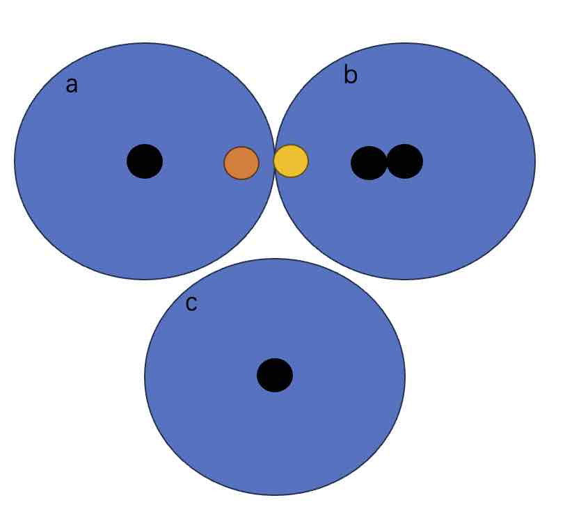

## 头大! 索引扫描和全表扫描结果不一样, 这向量数据库还能用? 教你一招大幅提升召回率(recall)    
                                                                 
### 作者                                                                 
digoal                                                                 
                                                                 
### 日期                                                                 
2024-04-17                                                             
                                                                 
### 标签                                                                 
PostgreSQL , PolarDB , DuckDB , 向量搜索 , 全表扫描 , 召回正确率      
                                                                 
----                                                                 
                                                                 
## 背景       
  
AI这么强但也不是无所不能的, 例如就有1个小毛病, 会“失忆”, 一旦没有了上下文, AI无法理解你要表达什么, 所以需要向量数据库来存储上下文的向量, 帮助AI把它和你对话相关的上下文找回来.    
  
另一方面, 向量数据库也被用于存储私有知识库, 帮助AI理解它没有训练过的私有化知识体系, 辅助回答你的问题.    
  
于是乎就有了向量数据库和向量相似搜索. 但是在向量搜索中有一个奇怪的现象: 使用向量索引搜索和全表扫描得到的结果可能不一样? 可能导致AI记忆出现紊乱就像得了“精神病”满嘴跑火车. 那可咋整?     
  
1、为什么查询结果会不一样呢?      
  
这和向量索引的实现方式有关, 以ivfflat为例, 会在向量空间设定若干个中心点(类似kmean聚集), 然后将向量记录放入离它最近的中心点的桶内. 在搜索一个向量的近邻向量时, 先找离它最近的中心点, 然后到这个中心点的桶里搜索最近的向量. 但是这样也是有问题的, 例如离你最近的向量可能不在这个桶里, 而是在另一个桶里, 只是在离你最近的桶里的概率大一点而已.    
  
    
  
这个黄点离b的中心点更近, 但是实际离他最近的点应该在a里的红点, 如果只到1个桶里找, 就会错过红点, 返回的结果和全表扫描结果就会不一样.    
  
为了解决这个问题, 在搜索时可以指定多个最近的桶, 然后去这些桶里找.    
```  
SET ivfflat.probes = 10;   -- 去离自己最近的10个中心点的桶里找.    
```  
  
以上是召回1个点的举例, 如果召回多个点, 则更容易出现与全表扫描不一致的情况.    
  
hnsw的实现更为复杂, 但是同样存在与ivfflat一样的问题.     
  
2、是不是不能用有误差的向量索引?    
  
当然不是, 向量值实际上是将token/语句按语义赋予到向量空间的概率值, 它本身就不是精确值.     
  
在按向量距离进行查询召回时, 要召回的记录是与目标向量距离相近并且在小范围内的记录, 往往是多条(如果是身份识别, 例如人脸识别可能最后要取1条进行匹配, 当然一版还会确认其他属性, 例如终端和该人物的关联度、该人的常驻地址、客户端的token等, 综合判断是否为同一个人).     
  
另一个重要的原因是全表扫描实在太慢了.  在性能面前, 存在一定的误差是被允许的.   
  
3、如何提高索引搜索的召回正确率?     
  
首先要熟悉向量索引的原理和对应的参数, 可以参考如下文章:    
- [《ivfflat,hnsw搜索算法说明》](../201912/20191219_02.md)    
  
3\.1、在表里有一定记录后再创建向量索引, 而不要在空表上建立, 因为需要有数据来进行构图和聚集.  
  
3\.2、调大 build 向量索引时的 memory maintenance_work_mem. 这个没有明确说明, 但是在某些产品里可能有用, 例如Lindorm.   
  
3\.3、调整 index 和 search 参数   
  
3\.3\.1、ivfflat索引:  
  
index 参数推荐:   
- lists = `rows / 1000` for up to 1M and `sqrt(rows)` for over 1M rows    
  
search 参数推荐:   
- `sqrt(lists)`   -- (higher is better for recall, lower is better for speed)  
  
HNSW参数限制参考:    
  
https://github.com/pgvector/pgvector/blob/master/src/ivfflat.h  
```  
/* IVFFlat parameters */  
#define IVFFLAT_DEFAULT_LISTS	100  
#define IVFFLAT_MIN_LISTS		1  
#define IVFFLAT_MAX_LISTS		32768  
#define IVFFLAT_DEFAULT_PROBES	1  
```  
  
3\.3\.2、HNSW索引:  
  
index 参数推荐:   
- m - the max number of connections per layer (16 by default, 最大100)  
- ef_construction - the size of the dynamic candidate list for constructing the graph (64 by default, 最大1000)  
  
ef_construction越大, 召回率越高, 但是最大也只能设置1000 (表示使用hnsw索引最多能召回1000条记录, 再大要改代码), 以牺牲build索引和insert的延迟为代价, 换取更好的召回率.    
  
例如:   
```  
CREATE INDEX ON items USING hnsw (embedding vector_l2_ops) WITH (m = 16, ef_construction = 64);  
```  
  
search 参数推荐:   
- Specify the size of the dynamic candidate list for search (40 by default)  
  
例如:   
```  
SET hnsw.ef_search = 100;  -- 以牺牲查询速度换取更高的召回率  
```  
  
HNSW参数限制参考:    
  
https://github.com/pgvector/pgvector/blob/master/src/hnsw.h  
```  
/* HNSW parameters */  
#define HNSW_DEFAULT_M	16  
#define HNSW_MIN_M	2  
#define HNSW_MAX_M		100  
#define HNSW_DEFAULT_EF_CONSTRUCTION	64  
#define HNSW_MIN_EF_CONSTRUCTION	4  
#define HNSW_MAX_EF_CONSTRUCTION		1000  
#define HNSW_DEFAULT_EF_SEARCH	40  
#define HNSW_MIN_EF_SEARCH		1  
#define HNSW_MAX_EF_SEARCH		1000  
```  
  
3\.4、reorder , order by limit N  
  
这个实际上是一些产品的内部实现, 例如Lindorm, 当然业务也可以这么做, 如想召回100条, 可以使用索引返回200条, 然后精排limit 100条.  
  
  
4、召回正确率的测试方法?     
  
pgvector提供了一些测试方法, 在 https://github.com/pgvector/pgvector/blob/master/test/t   
- 注意, 这依赖你的postgresql编译时支持了tap (configure `--enable-tap-tests`), 参考: https://www.postgresql.org/docs/current/regress-tap.html  
- 可以使用我的无敌docker image, 在IvorySQL这个用户下进行测试 例如`su - ivorysql; cd /tmp/pgvector; make prove_installcheck PROVE_TESTS=test/t/001_ivfflat_wal.pl  OR make prove_installcheck`
  
例如build hnsw时, 内存、并行度等对recall的影响:  
- https://github.com/pgvector/pgvector/blob/master/test/t/012_hnsw_build_recall.pl  
  
  
5、下面我使用无敌镜像测试一下, 有兴趣的朋友肯定知道哪里找到我的无敌镜像.  
  
创建测试表  
```  
drop table if exists tst;  
create unlogged table tst (i int4, v vector(256));  
```  
  
写入10万向量, 256维度    
```  
do language plpgsql $$  
declare  
  sql text;  
begin  
  sql := format($_$INSERT INTO tst SELECT i, ARRAY[%s$_$, repeat('random(),',256));    
  sql := rtrim(sql, ',');  
  sql := sql || '] FROM generate_series(1, 100000) i;';   
  execute sql;   
end;   
$$;   
```  
  
并行创建hnsw索引, 使用最大的m和ef_construction  
```  
set client_min_messages TO debug1;  
set max_parallel_maintenance_workers =4;  
set maintenance_work_mem ='1GB';  
ALTER TABLE tst SET (parallel_workers = 4);  
create index ON tst USING hnsw (v vector_cosine_ops) with (m = 100, ef_construction = 1000);   
    DEBUG:  building index "tst_v_idx" on table "tst" serially  
    DEBUG:  using 4 parallel workers  
```  
  
创建一个数组插件, 方便统计recall:  
```  
create extension intarray;   
```  
  
5\.1、实验1 因为ef_construction设置了1000, 所以在召回1000条以内的向量召回率都是非常高的, 达到98%以上.    
```  
do language plpgsql $$  
declare  
  sql1 text;  
  var text;  
  res1 int[];  
  res2 int[];  
  res numeric;  
begin  
  set local hnsw.ef_search = 1000;  
  set enable_indexscan=on;  
  set enable_bitmapscan=off;  
  set enable_seqscan=off;  
  select string_agg(rnd,',') into var from (select random()::text rnd from generate_series(1,256)) t;   
  sql1 := format($_$select array_agg(i order by i) from (select i from tst order by v <=> '[%s]' limit 1000) t;$_$, var);  -- limit 1000表示召回1000条  
  raise notice '%', sql1;  
  execute sql1 into res1;  
  raise notice '%', res1;  
  set enable_indexscan=off;  
  set enable_seqscan=on;  
  execute sql1 into res2;  
  raise notice '%', res2;  
  select 100 * array_length(uniq(sort(res1 & res2)), 1) / array_length(uniq(sort(res1 + res2)), 1) :: numeric into res;  
  raise notice 'recall: %', res;   
end;   
$$;   
```  
  
```  
NOTICE:  recall: 98.6097318768619662  
NOTICE:  recall: 99.0049751243781095  
NOTICE:  recall: 99.2031872509960159  
NOTICE:  recall: 99.6007984031936128  
...  
```  
  
5\.2、实验2 演示1个召回率低的情况, 实验小的ef_search (小于要召回的记录条数 limit). 这个是因为全表扫描limit 1000, 而索引只返回了500, 必然召回率就低了.   
```  
do language plpgsql $$  
declare  
  sql1 text;  
  var text;  
  res1 int[];  
  res2 int[];  
  res numeric;  
begin  
  set local hnsw.ef_search = 500;  
  set enable_indexscan=on;  
  set enable_bitmapscan=off;  
  set enable_seqscan=off;  
  select string_agg(rnd,',') into var from (select random()::text rnd from generate_series(1,256)) t;   
  sql1 := format($_$select array_agg(i order by i) from (select i from tst order by v <=> '[%s]' limit 1000) t;$_$, var);  -- limit 1000表示召回1000条  
  raise notice '%', sql1;  
  execute sql1 into res1;  
  raise notice '%', res1;  
  set enable_indexscan=off;  
  set enable_seqscan=on;  
  execute sql1 into res2;  
  raise notice '%', res2;  
  select 100 * array_length(uniq(sort(res1 & res2)), 1) / array_length(uniq(sort(res1 + res2)), 1) :: numeric into res;  
  raise notice 'recall: %', res;   
end;   
$$;   
```  
  
```  
NOTICE:  recall: 50.0000000000000000  
NOTICE:  recall: 50.0000000000000000  
NOTICE:  recall: 50.0000000000000000  
NOTICE:  recall: 50.0000000000000000  
...  
```  
  
5\.3、实验3 召回100条, 召回率基本是100%    
```  
do language plpgsql $$  
declare  
  sql1 text;  
  var text;  
  res1 int[];  
  res2 int[];  
  res numeric;  
begin  
  set local hnsw.ef_search = 1000;  
  set enable_indexscan=on;  
  set enable_bitmapscan=off;  
  set enable_seqscan=off;  
  select string_agg(rnd,',') into var from (select random()::text rnd from generate_series(1,256)) t;   
  sql1 := format($_$select array_agg(i order by i) from (select i from tst order by v <=> '[%s]' limit 100) t;$_$, var);  -- limit 1000表示召回1000条  
  raise notice '%', sql1;  
  execute sql1 into res1;  
  raise notice '%', res1;  
  set enable_indexscan=off;  
  set enable_seqscan=on;  
  execute sql1 into res2;  
  raise notice '%', res2;  
  select 100 * array_length(uniq(sort(res1 & res2)), 1) / array_length(uniq(sort(res1 + res2)), 1) :: numeric into res;  
  raise notice 'recall: %', res;   
end;   
$$;   
```  
  
```  
NOTICE:  recall: 100.0000000000000000  
NOTICE:  recall: 100.0000000000000000  
NOTICE:  recall: 100.0000000000000000  
NOTICE:  recall: 100.0000000000000000  
...  
```
   
6、对比一下build index时采用默认的m和ef_construction, 召回正确率情况, 相比之前的大幅度下跌.   
```  
drop index tst_v_idx ;
set client_min_messages TO debug1;  
set max_parallel_maintenance_workers =4;  
set maintenance_work_mem ='1GB';  
ALTER TABLE tst SET (parallel_workers = 4);  
create index ON tst USING hnsw (v vector_cosine_ops) with (m = 16, ef_construction = 64);   
    DEBUG:  building index "tst_v_idx" on table "tst" serially  
    DEBUG:  using 4 parallel workers  
```  
     
```  
do language plpgsql $$  
declare  
  sql1 text;  
  var text;  
  res1 int[];  
  res2 int[];  
  res numeric;  
begin  
  set local hnsw.ef_search = 1000;  
  set enable_indexscan=on;  
  set enable_bitmapscan=off;  
  set enable_seqscan=off;  
  select string_agg(rnd,',') into var from (select random()::text rnd from generate_series(1,256)) t;   
  sql1 := format($_$select array_agg(i order by i) from (select i from tst order by v <=> '[%s]' limit 1000) t;$_$, var);  -- limit 1000表示召回1000条  
  raise notice '%', sql1;  
  execute sql1 into res1;  
  raise notice '%', res1;  
  set enable_indexscan=off;  
  set enable_seqscan=on;  
  execute sql1 into res2;  
  raise notice '%', res2;  
  select 100 * array_length(uniq(sort(res1 & res2)), 1) / array_length(uniq(sort(res1 + res2)), 1) :: numeric into res;  
  raise notice 'recall: %', res;   
end;   
$$;   
```  
   
```  
NOTICE:  recall: 48.1481481481481481
NOTICE:  recall: 46.4128843338213763
NOTICE:  recall: 47.9289940828402367
NOTICE:  recall: 47.0588235294117647 
...  
```  
  
  
<b>通过简单的方法, 我们轻松把召回正确率一下子就提高到了99%以上.</b>      
  
另外据观察, pgvector列出了大量unreleased的feature, 代码实际上已经完成了部分, 可以看出[pgvector](https://github.com/pgvector/pgvector) 又要放大招了:   
  
例如新增2种向量距离类型:   
- Hamming distance  
- Jaccard distance  
  
新增3种向量类型:  
- half vector - up to 4,000 dimensions (unreleased)  
- Binary Vector - up to 64,000 dimensions (unreleased)  
- Sparse Vector - up to 1,000 non-zero elements (unreleased)  
  
  
  
#### [期望 PostgreSQL|开源PolarDB 增加什么功能?](https://github.com/digoal/blog/issues/76 "269ac3d1c492e938c0191101c7238216")
  
  
#### [PolarDB 开源数据库](https://openpolardb.com/home "57258f76c37864c6e6d23383d05714ea")
  
  
#### [PolarDB 学习图谱](https://www.aliyun.com/database/openpolardb/activity "8642f60e04ed0c814bf9cb9677976bd4")
  
  
#### [购买PolarDB云服务折扣活动进行中, 55元起](https://www.aliyun.com/activity/new/polardb-yunparter?userCode=bsb3t4al "e0495c413bedacabb75ff1e880be465a")
  
  
#### [PostgreSQL 解决方案集合](../201706/20170601_02.md "40cff096e9ed7122c512b35d8561d9c8")
  
  
#### [德哥 / digoal's Github - 公益是一辈子的事.](https://github.com/digoal/blog/blob/master/README.md "22709685feb7cab07d30f30387f0a9ae")
  
  
#### [About 德哥](https://github.com/digoal/blog/blob/master/me/readme.md "a37735981e7704886ffd590565582dd0")
  
  

  
