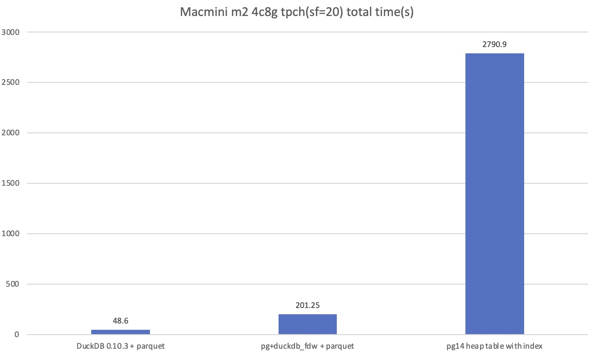

## PG被DuckDB碾压,该反省哪些方面? DuckDB v0.10.3 在Macmini 2023款上的tpch性能表现如何? PostgreSQL使用duckdb_fdw 的tpch加速性能表现如何?      
               
### 作者                                      
digoal                                      
                                      
### 日期                                      
2024-05-25                              
                                      
### 标签                     
PostgreSQL , PolarDB , DuckDB , duckdb_fdw , tpch , macmini , m2         
                                      
----                                      
                                      
## 背景      
PG被DuckDB碾压,还不反省?    
  
1、star数被超越   
  
DuckDB 2018年发布第一个版本, 17.2k star https://db-engines.com/en/system/DuckDB  
  
postgres 1989年发布第一个版本, 14.9k star https://db-engines.com/en/system/PostgreSQL  
  
2、分析能力被全面碾压   
  
一些用户会将PG用在数据量不是特别大(例如TB级别时)的分析型业务, 因为pg 9.6开始引入了并行计>算, 分析性能还可以, 并且它不像大型分析产品部署和管理起来那么复杂, 对机器要求也不高, 非常适合中小型数据量的分析.  但是现在性能被duckdb全面碾压了, 看本文后面的测试数据. 并且DuckDB使用起来还要简单.    
  
  
  
  
  
当然PG也有一些提升更大数据量场景分析性能和数据融合能力的插件, 如parquet fdw, [pg_lakehouse](https://github.com/paradedb/paradedb/tree/dev/pg_lakehouse), duckdb fdw, columnar等. 但是目前整体体验都非常一般, 例如[columnar](https://github.com/hydradatabase/hydra/tree/main/columnar/src/backend/columnar)还不支持并行(No support for intra-node parallel scans)    
  
pg_lakehouse 理念不错, 把PG从孤岛变成连接外部数据的桥梁, 结合pg_analytics实现分析(datafusion那套架构), 让用户只要使用Pg就可以同时用于处理TP和AP. oss、s3 都是云上使用最为广泛的产品, 为什么不是云数据库厂商先发做出这块能力(我是说要有好的体验)的呢?    
  
这些插件在以下docker image中都有集成, 有兴趣的朋友可以参考阅读:  
- [《2023-PostgreSQL Docker镜像学习环境 ARM64版, 已集成热门插件和工具》](../202308/20230814_02.md)       
- [《2023-PostgreSQL Docker镜像学习环境 AMD64版, 已集成热门插件和工具》](../202307/20230710_03.md)       
  
3、受制于PG扩展接口最近发展真的是太慢了, 导致包括以上在内的插件从性能到体验都离产品化有一段距离. 再这样发展下去, extension也很快会被碾压. 最近DuckDB出的extension都非常的赞, 体验杠杠的.    
  
举几个例子:   
- fdw接口都出来多少年了, 下推还行, 但是事务支持、数据传输效率、cache plan等都有改进空间, 所以通过fdw来读写oss里面的parquet数据效率还有很大提升空间.    
- tam(table access method)也有很多需要完善的地方, 所以你看从PG 12发布tam后到现在都6年了, 一个能打(被普遍用户认可并用于生产)的三方 table am 都没有. 甚至17版本上线好几个tam扩展能力, 又被tom lane打回. 参考: [《PostgreSQL 17 到底值不值得期待? 看完这篇就明白了.》](../202404/20240411_01.md)  tom lane一边拒绝 tam, 自己crunchydata databridge 确大张旗鼓的改进tam, 提升s3等云对象存储访问效率和体验.  参考: [《什么? PostgreSQL大佬tom lane公司crunchydata“模仿”DuckDB创意?》](../202405/20240506_02.md)    
- 还有wire protocol兼容性扩展能力, aws负责babelfish(协议层兼容sql server)哥们提交的增加wire protocol hook的Patch, 死活不让进Master分支, 导致扩展Pg 语法兼容性特别麻烦.    
  
好消息是, 基于PG的商业数据库在不懈努力, 例如  
1、haloDB:   
- 正在将duckdb做成halodb的 in-memory table. 据说这块也要大量扩展tam的接口. 这就是社区不作为了, 明明要打造好扩展接口, 现在接口也不好好做.    
- 协议层兼容 mysql, oracle.   
  
2、PolarDB 云原生分布式数据库.  
- 这个不用多介绍了, 懂得都懂, 跳转至官网: openpolardb.com    
  
## 开始PK
  
## DuckDB `v0.10.3` 发布性能表现如何?  
DuckDB `v0.10.3` 发布, 在Macmini 2023款上的tpch性能表现如何? PostgreSQL使用duckdb_fdw 的tpch加速性能表现如何? PostgreSQL自身存储引擎能打吗?       
    
机器: `Macmini 2023款 M2芯片 16GiB内存 256GiB硬盘`     
    
使用我打包的万能镜像: [《2023-PostgreSQL Docker镜像学习环境 ARM64版, 已集成热门插件和工具》](../202308/20230814_02.md)         
    
获取 docker 镜像:     
```    
docker pull registry.cn-hangzhou.aliyuncs.com/digoal/opensource_database:pg14_with_exts_arm64    
```    
    
docker 资源配置:    
```    
4 Core    
8GiB 内存     
4GiB SWAP     
Virtual disk limit: 128 GB     
```    
    
DuckDB 版本: `v0.10.3`    
    
PostgreSQL 版本: `14.12`    
    
  
创建本地volume, 将docker内较大量的数据存放至此:   
```    
mkdir -p ~/docker_volumn/pg  
```  
  
启动容器(宿主机`volumn`映射到容器的`/data`):    
```  
docker run -d -it -P --cap-add=SYS_PTRACE --cap-add SYS_ADMIN --privileged=true -v ~/docker_volumn/pg:/data --name pg --shm-size=1g registry.cn-hangzhou.aliyuncs.com/digoal/opensource_database:pg14_with_exts_arm64  
```    
    
进入容器, 进入postgres用户, DuckDB和PostgreSQL测试都在这个用户下进行:    
```    
docker exec -ti pg bash    
  
echo "vm.swappiness = 0" >> /etc/sysctl.d/99-sysctl.conf   
sysctl -p  
    
su - postgres    
```    
    
## DuckDB + parquet    
进入DuckDB shell:    
```    
./duckdb  /data/new.db   
```    
    
生成20GB tpch原始数据:     
```    
.timer on    
PRAGMA max_temp_directory_size='64GiB';     
load tpch;      
call dbgen(sf='20');       
  -- Run Time (s): real 129.280 user 114.879912 sys 12.317068    
```    
    
将20GB tpch原始数据导出到本地Parquet文件:    
```    
EXPORT DATABASE '/data' (FORMAT PARQUET);        
  --  Run Time (s): real 196.960 user 121.116805 sys 47.395505    
EXPORT DATABASE '/data' (FORMAT CSV);   -- 这一份测试3时用于导入PostgreSQL本地表    
```    
    
生成22条tpch查询sql:    
```    
copy (select query from tpch_queries()) to '/data/tpch.sql' with (quote '', HEADER false);       
-- or    
-- copy (select 'PRAGMA tpch('||query_nr||');' from tpch_queries()) to '/data/tpch.sql' with (quote '', HEADER false);       
```    
    
创建22条tpch查询sql对应的22个视图 `tpch_q1, ... tpch_q22`     
```    
copy (select 'create or replace view tpch_q'|| query_nr ||' as '||query from tpch_queries()) to '/data/tpch_query_view.sql' with (quote '', HEADER false);       
```    
    
退出DuckDB shell:    
```    
.quit    
```    
    
    
修改 `tpch_q12` , 否则使用`duckdb_fdw`时会有 `duckdb -> pg` 类型映射错误      
```    
vi /data/tpch_query_view.sql     
```    
    
```    
create or replace view tpch_q12 as SELECT    
    l_shipmode,    
    sum(    
        CASE WHEN o_orderpriority = '1-URGENT'    
            OR o_orderpriority = '2-HIGH' THEN    
            1.0  -- 修改这里, 1 修改为 1.0       
        ELSE    
            0    
        END) AS high_line_count,    
    sum(    
        CASE WHEN o_orderpriority <> '1-URGENT'    
            AND o_orderpriority <> '2-HIGH' THEN    
            1.0   -- 修改这里, 1 修改为 1.0        
        ELSE    
            0    
        END) AS low_line_count    
FROM    
    orders,    
    lineitem    
WHERE    
    o_orderkey = l_orderkey    
    AND l_shipmode IN ('MAIL', 'SHIP')    
    AND l_commitdate < l_receiptdate    
    AND l_shipdate < l_commitdate    
    AND l_receiptdate >= CAST('1994-01-01' AS date)    
    AND l_receiptdate < CAST('1995-01-01' AS date)    
GROUP BY    
    l_shipmode    
ORDER BY    
    l_shipmode;    
```    
    
DuckDB tpch 性能测试 (数据存储在外部parquet文件)       
    
进入DuckDB shell:    
```    
-- 创建duckdb数据文件,     
    
./duckdb /data/digoal.db    
```    
    
创建tpch表对应视图, 使用视图访问tpch测试表对应的parquet文件:      
```    
CREATE VIEW lineitem AS SELECT * FROM read_parquet('/data/lineitem.parquet');        
CREATE VIEW orders AS SELECT * FROM read_parquet('/data/orders.parquet');        
CREATE VIEW partsupp AS SELECT * FROM read_parquet('/data/partsupp.parquet');        
CREATE VIEW part AS SELECT * FROM read_parquet('/data/part.parquet');        
CREATE VIEW customer AS SELECT * FROM read_parquet('/data/customer.parquet');        
CREATE VIEW supplier AS SELECT * FROM read_parquet('/data/supplier.parquet');        
CREATE VIEW nation AS SELECT * FROM read_parquet('/data/nation.parquet');        
CREATE VIEW region AS SELECT * FROM read_parquet('/data/region.parquet');       
```    
    
新建tpch 22条query对应的视图:      
```    
.read /data/tpch_query_view.sql     
```    
    
执行检查点, 保存以上视图到duckdb数据文件内:    
```    
checkpoint;     
```    
    
    
    
列出DuckDB当前配置的内存限制:    
```    
select * from duckdb_settings() where name like '%memory%';      
    
┌──────────────┬─────────┬─────────────────────────────────────────────┬────────────┬─────────┐    
│     name     │  value  │                 description                 │ input_type │  scope  │    
│   varchar    │ varchar │                   varchar                   │  varchar   │ varchar │    
├──────────────┼─────────┼─────────────────────────────────────────────┼────────────┼─────────┤    
│ max_memory   │ 6.2 GiB │ The maximum memory of the system (e.g. 1GB) │ VARCHAR    │ GLOBAL  │    
│ memory_limit │ 6.2 GiB │ The maximum memory of the system (e.g. 1GB) │ VARCHAR    │ GLOBAL  │    
└──────────────┴─────────┴─────────────────────────────────────────────┴────────────┴─────────┘    
```    
    
执行tpch查询:      
```    
.timer on     
.output /data/tpch.result       
.read /data/tpch.sql     
```    
    
DuckDB+parquet tpch(sf=20) 22条query 总耗时 48.615 秒      
```    
Run Time (s): real 3.382 user 12.270868 sys 0.726760    
Run Time (s): real 0.368 user 1.218201 sys 0.158289    
Run Time (s): real 1.942 user 6.884382 sys 0.659815    
Run Time (s): real 1.355 user 4.854397 sys 0.385653    
Run Time (s): real 1.947 user 7.001857 sys 0.656324    
Run Time (s): real 1.641 user 6.084068 sys 0.417452    
Run Time (s): real 3.796 user 12.373250 sys 1.841919    
Run Time (s): real 2.679 user 8.851007 sys 1.206746    
Run Time (s): real 3.614 user 12.323548 sys 1.859185    
Run Time (s): real 2.432 user 8.720211 sys 0.730984    
Run Time (s): real 0.324 user 1.141013 sys 0.134006    
Run Time (s): real 2.145 user 7.591906 sys 0.762911    
Run Time (s): real 2.337 user 8.099739 sys 0.890027    
Run Time (s): real 1.509 user 5.274063 sys 0.672981    
Run Time (s): real 2.858 user 10.097497 sys 1.140366    
Run Time (s): real 0.333 user 1.150265 sys 0.066505    
Run Time (s): real 1.915 user 6.869154 sys 0.679118    
Run Time (s): real 4.749 user 16.525018 sys 1.626446    
Run Time (s): real 2.668 user 9.203536 sys 0.730004    
Run Time (s): real 1.654 user 5.814008 sys 0.677364    
Run Time (s): real 4.553 user 16.418398 sys 1.327657    
Run Time (s): real 0.414 user 1.466042 sys 0.092717    
```    
    
## PostgreSQL + duckdb_fdw + parquet + query view (相当于全部pushdown)      
    
安装duckdb parquet插件:    
```    
mkdir -p /var/lib/postgresql/.duckdb/extensions/v0.10.3/linux_arm64    
cd /var/lib/postgresql/.duckdb/extensions/v0.10.3/linux_arm64    
wget http://extensions.duckdb.org/v0.10.3/linux_arm64/parquet.duckdb_extension.gz    
gunzip parquet.duckdb_extension.gz     
```    
    
PostgreSQL 使用duckdb_fdw 利用duckdb计算能力, 访问存储在本地tpch原始数据对应的parquet数据文件. 通过view执行22条tpch query.       
    
进入PostgreSQL shell:    
```    
psql    
```    
    
创建duckdb_fdw插件    
```    
create extension duckdb_fdw;     
```    
    
创建duckdb server, 指定前面保存好的duckdb数据文件, 包含视图定义.    
```    
CREATE SERVER duckdb_server FOREIGN DATA WRAPPER duckdb_fdw OPTIONS (database '/data/digoal.db' );        
```    
    
将duckdb的视图倒入PostgreSQL的外部表    
```    
IMPORT FOREIGN SCHEMA public FROM SERVER DuckDB_server INTO public;        
```    
    
生成在PostgreSQL内执行22条tpch query的SQL语句 (通过view来执行22条tpch query).      
```    
copy (select 'select * from tpch_q'||i||';' from generate_series(1,22) i) to '/data/pg_tpch_duckdb_fdw.sql' ;    
```    
    
执行query之前, 需导入parquet插件   
```    
select duckdb_execute('duckdb_server', 'load parquet;');     
```  
  
设置为测试DuckDB时一样的内存限制大小  
```  
select duckdb_execute('duckdb_server', $$set max_memory='6.2GiB';$$);    
select duckdb_execute('duckdb_server', $$set memory_limit='6.2GiB';$$);    
```    
    
通过view来执行22条tpch query    
```    
\timing on     
\o /data/pg_tpch_duckdb_fdw.result     
\i /data/pg_tpch_duckdb_fdw.sql     
    
-- OR    
-- \i /data/tpch.sql  -- q12 也需要像前面修改 /data/tpch_query_view.sql 一样修改     
```    
    
PostgreSQL+duckdb_fdw+parquet+query view (相当于全部pushdown到DuckDB)   tpch(sf=20) 22条query 总耗时 201.25 秒     
```    
Time: 10748.084 ms (00:10.748)  
Time: 1373.017 ms (00:01.373)  
Time: 5718.034 ms (00:05.718)  
Time: 5113.934 ms (00:05.114)  
Time: 6551.738 ms (00:06.552)  
Time: 2519.208 ms (00:02.519)  
Time: 19162.414 ms (00:19.162)  
Time: 8009.050 ms (00:08.009)  
Time: 14776.421 ms (00:14.776)  
Time: 6496.172 ms (00:06.496)  
Time: 1075.576 ms (00:01.076)  
Time: 5435.326 ms (00:05.435)  
Time: 11202.727 ms (00:11.203)  
Time: 4192.284 ms (00:04.192)  
Time: 8945.932 ms (00:08.946)  
Time: 2817.935 ms (00:02.818)  
Time: 6108.834 ms (00:06.109)  
Time: 43550.500 ms (00:43.550)  
Time: 7598.709 ms (00:07.599)  
Time: 4932.664 ms (00:04.933)  
Time: 22832.490 ms (00:22.832)  
Time: 2088.688 ms (00:02.089)  
```    
  
## PostgreSQL 本地行存表  
新建与当前用户postgres同名存放本地表的schema  
```  
postgres=# create schema postgres;  
CREATE SCHEMA  
```  
  
新建表空间, 设置为默认表空间  
```  
mkdir /data/abc  
  
create tablespace tbs location '/data/abc';  
  
set default_tablespace ='tbs';  
alter role postgres set default_tablespace ='tbs';  
```  
  
建表  
```  
postgres=# \i /data/schema.sql  
CREATE TABLE  
CREATE TABLE  
CREATE TABLE  
CREATE TABLE  
CREATE TABLE  
CREATE TABLE  
CREATE TABLE  
CREATE TABLE  
```  
  
为了导入方便,改成unlogged table  
```  
alter table customer set unlogged;  
alter table lineitem set unlogged;  
alter table nation set unlogged;  
alter table orders set unlogged;  
alter table part set unlogged;  
alter table partsupp set unlogged;  
alter table region set unlogged;  
alter table supplier set unlogged;  
```  
  
通过duckdb_fdw将tpch数据从parquet文件导入postgresql本地表  
```  
\i /data/load.sql  
```  
  
创建postgresql本地表的索引(PG 没有索引跑不出来, 有一些嵌套查询实在太慢了.  q17 30秒, q20 过了十几分钟没跑出来.), 参考:  https://github.com/digoal/gp_tpch/blob/master/dss/tpch-index.sql    
```    
set maintenance_work_mem='1GB';  
-- indexes on the foreign keys    
    
CREATE INDEX IDX_SUPPLIER_NATION_KEY ON SUPPLIER (S_NATIONKEY);    
    
CREATE INDEX IDX_PARTSUPP_PARTKEY ON PARTSUPP (PS_PARTKEY);    
CREATE INDEX IDX_PARTSUPP_SUPPKEY ON PARTSUPP (PS_SUPPKEY);    
    
CREATE INDEX IDX_CUSTOMER_NATIONKEY ON CUSTOMER (C_NATIONKEY);    
    
CREATE INDEX IDX_ORDERS_CUSTKEY ON ORDERS (O_CUSTKEY);    
    
CREATE INDEX IDX_LINEITEM_ORDERKEY ON LINEITEM (L_ORDERKEY);    
CREATE INDEX IDX_LINEITEM_PART_SUPP ON LINEITEM (L_PARTKEY,L_SUPPKEY);    
    
CREATE INDEX IDX_NATION_REGIONKEY ON NATION (N_REGIONKEY);    
    
-- aditional indexes    
    
CREATE INDEX IDX_LINEITEM_SHIPDATE ON LINEITEM (L_SHIPDATE, L_DISCOUNT, L_QUANTITY);    
    
CREATE INDEX IDX_ORDERS_ORDERDATE ON ORDERS (O_ORDERDATE);    
```    
  
改成logged 对象  
```  
update pg_class set relpersistence = 'p' where relpersistence = 'u';  
```  
  
调整shared buffer和work_mem  
```  
alter system set shared_buffers='2GB';  
alter role postgres set work_mem='32MB';  
```  
  
重启容器  
```  
docker stop pg  
docker start pg  
docker exec -ti pg bash  
su - postgres  
psql  
```  
    
以下是PG增加了索引之后的tpch query结果.  tpch(sf=20) 22条query 总耗时 2790.94 秒       
```    
analyze;   
\timing on     
\o /data/pg_tpch.result     
\i /data/tpch.sql    
    
Time: 60317.546 ms (01:00.318)  
Time: 88929.610 ms (01:28.930)  
Time: 32596.940 ms (00:32.597)  
Time: 48620.736 ms (00:48.621)  
Time: 55727.432 ms (00:55.727)  
Time: 207391.359 ms (03:27.391)  
Time: 27132.845 ms (00:27.133)  
Time: 117553.008 ms (01:57.553)  
Time: 829795.748 ms (13:49.796)  
Time: 45392.179 ms (00:45.392)  
Time: 32471.915 ms (00:32.472)  
Time: 25439.356 ms (00:25.439)  
Time: 22745.637 ms (00:22.746)  
Time: 153935.888 ms (02:33.936)  
Time: 124949.464 ms (02:04.949)  
Time: 12197.386 ms (00:12.197)  
Time: 14841.749 ms (00:14.842)  
Time: 42511.465 ms (00:42.511)  
Time: 38056.589 ms (00:38.057)  
Time: 505946.346 ms (08:25.946)  
Time: 302506.388 ms (05:02.506)  
Time: 1880.400 ms (00:01.880)  
```    
  
## parquet vs heap 空间占用对比
对比列存储压缩, PG占用的空间是DuckDB的5.3倍  
   
PostgreSQL: sf=2 占用 2561 MB   
```
postgres=# show default_toast_compression;
 default_toast_compression 
---------------------------
 pglz  -- 支持 lz4, pglz ; toast_threshold = 2K
(1 row)
```
    
DuckDB: sf=2 占用 480M
```
EXPORT DATABASE '/data' (FORMAT PARQUET, COMPRESSION ZSTD,
    ROW_GROUP_SIZE 100_000);   

parquet 格式: 
支持压缩方式: snappy, gzip or zstd
分组大小: row_group_size_bytes = row_group_size * 1024
分组大小: row_group_size 默认 122880
```
    
## 小结    
DuckDB+parquet tpch(sf=20) 22条query 总耗时 48.615 秒      
    
PostgreSQL+duckdb_fdw+parquet+query view (相当于全部pushdown到DuckDB)   tpch(sf=20) 22条query 总耗时 201.25 秒     
    
PostgreSQL本地行存表(包括索引) tpch(sf=20) 22条query 总耗时 2790.94 秒     
  
  
  
  
  
    
#### [期望 PostgreSQL|开源PolarDB 增加什么功能?](https://github.com/digoal/blog/issues/76 "269ac3d1c492e938c0191101c7238216")  
    
    
#### [PolarDB 开源数据库](https://openpolardb.com/home "57258f76c37864c6e6d23383d05714ea")  
    
    
#### [PolarDB 学习图谱](https://www.aliyun.com/database/openpolardb/activity "8642f60e04ed0c814bf9cb9677976bd4")  
    
    
#### [购买PolarDB云服务折扣活动进行中, 55元起](https://www.aliyun.com/activity/new/polardb-yunparter?userCode=bsb3t4al "e0495c413bedacabb75ff1e880be465a")  
    
    
#### [PostgreSQL 解决方案集合](../201706/20170601_02.md "40cff096e9ed7122c512b35d8561d9c8")  
    
    
#### [德哥 / digoal's Github - 公益是一辈子的事.](https://github.com/digoal/blog/blob/master/README.md "22709685feb7cab07d30f30387f0a9ae")  
    
    
#### [About 德哥](https://github.com/digoal/blog/blob/master/me/readme.md "a37735981e7704886ffd590565582dd0")  
    
    
  
