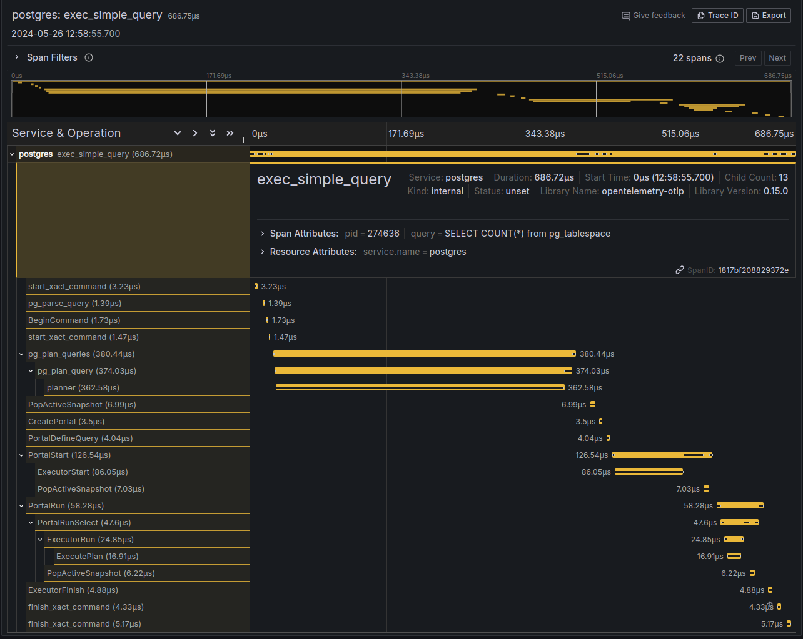

## pg-ferret: 开源的基于eBPF 低overhead采样 All-in-one tracing toolkit for PostgreSQL   
              
### 作者              
digoal              
              
### 日期              
2024-06-14              
              
### 标签              
PostgreSQL , PolarDB , DuckDB , eBPF , DBdoctor            
              
----              
              
## 背景   
和海信聚好看DBdoctor使用同样的eBPF技术.    
   
All-in-one tracing toolkit for Postgres  
  
  
  
https://github.com/ChrisBellew/pg-ferret    
    
特性:   
  
Observe traces of your queries inside Postgres  
  
Correlate Postgres query spans with your application spans  
  
Low overhead auto-instrumentation with eBPF. Rust in the kernel and userspace [Obligatory blazingly fast].  
  
Built in trace storage with Grafana Tempo and trace visualisation with Grafana. Or bring your own OpenTelemetry backend (Grafana Tempo, Jaeger, Zipkin, Honeycomb, Datadog, etc).  
  
Special debug build of Postgres included. Small (currently unmeasured) performance overhead  
  
Intended for non-production use in debugging slow queries  
  
Built with using the power of Rust and [Aya](https://github.com/aya-rs/aya)  
    
    
