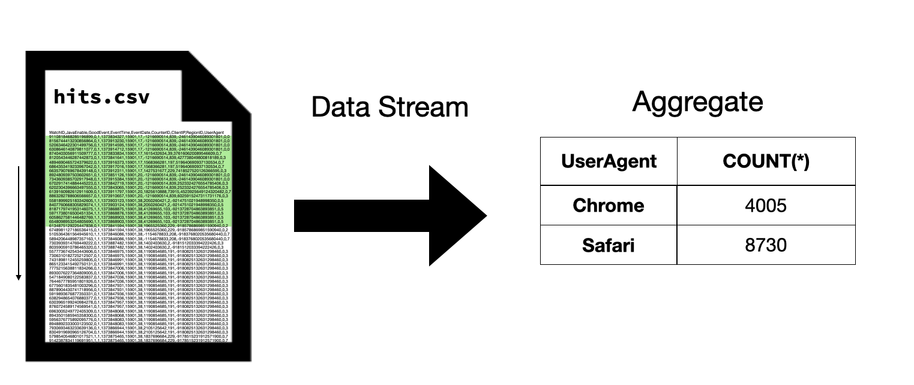

## DuckDB高效内存管理: 流式执行 , 临时文件 , 缓冲区管理       
                                                              
### 作者                                  
digoal                                  
                                         
### 日期                                       
2024-07-17                               
                                      
### 标签                                    
PostgreSQL , PolarDB , DuckDB , 内存管理 , 流式执行 , 临时文件 , 缓冲区管理         
                                                             
----                                      
                                                    
## 背景    
原文: https://duckdb.org/2024/07/09/memory-management.html  
  
处理大量数据时，内存是一种重要资源。内存是一种快速缓存层，可以极大地提高查询处理速度。但是，内存是有限且昂贵的，处理大型数据集时，通常没有足够的内存来缓存所有必要的数据结构。有效管理内存对于高性能查询引擎至关重要 - 因为必须利用内存才能提供高性能，但我们必须小心，不要使用过多的内存，这可能会导致内存不足错误或导致OOM kill进程。  
  
DuckDB 的构建旨在有效利用可用内存，同时避免内存耗尽, 方法如下：  
- 流执行引擎允许小块数据流过系统，而无需将整个数据集填满整个内存后计算。  
- 中间状态的数据可以暂时溢出到磁盘以释放内存空间，从而允许计算原本超出可用内存的复杂查询。  
- 缓冲区管理器(buffer manager)会缓存持久化数据库文件中尽可能多的页面，但不会超过预定义的内存限制。  
  
在这篇博文中，我们将介绍 DuckDB 中内存管理的这些方面 - 并提供它们的使用示例。  
  
## 流式执行  
DuckDB 使用流式执行引擎来处理查询。数据源（例如表、CSV 文件或 Parquet 文件）永远不会完全加载到内存后再计算。相反，数据一次读取和处理一个块。例如，考虑执行以下查询：  
```sql  
SELECT UserAgent,  
       count(*)  
FROM 'hits.csv'  
GROUP BY UserAgent;  
```  
  
DuckDB 不会一次性读取整个 CSV 文件，而是分块读取 CSV 文件的数据，并利用从这些块中读取的数据逐步计算聚合结果。此过程持续进行，直到读取整个 CSV 文件，此时计算出整个聚合结果。  
  
  
  
在上面的例子中，我们仅展示了单个数据流。实际上，DuckDB 使用多个数据流来实现多线程执行 - 每个线程执行自己的数据流。不同线程的聚合结果组合起来计算最终结果。  
  
与PG类似, 聚合可以采用多阶段并行:   
- [《Greenplum支持人为多阶段聚合的方法 - 直连segment(PGOPTIONS='-c gp_session_role=utility') Or gp_dist_random('gp_id') Or 多阶段聚合 prefunc》](../201806/20180624_02.md)    
- [《PostgreSQL 11 preview - 多阶段并行聚合array_agg, string_agg》](../201803/20180322_11.md)    
- [《HybridDB PostgreSQL "Sort、Group、distinct 聚合、JOIN" 不惧怕数据倾斜的黑科技和原理 - 多阶段聚合》](../201711/20171123_01.md)    
- [《PostgreSQL 10 自定义并行计算聚合函数的原理与实践 - (含array_agg合并多个数组为单个一元数组的例子)》](../201801/20180119_04.md)    
- [《PostgreSQL Oracle 兼容性之 - 自定义并行聚合函数 PARALLEL_ENABLE AGGREGATE》](../201803/20180312_03.md)    
- [《PostgreSQL 16 preview - string_agg, array_agg支持并行》](../202301/20230125_03.md)    
- [《PostgreSQL 并行计算解说 之21 - parallel partition table wise agg》](../201903/20190317_13.md)    
- [《PostgreSQL 并行计算解说 之3 - parallel agg》](../201903/20190316_05.md)    
  
虽然流式执行在概念上很简单，但它功能强大，足以为许多简单用例提供大于内存的支持。例如，流式执行为以下应用提供大于内存的支持：  
- 计算分组总数较少的聚合  
- 从一个文件读取数据并写入另一个文件（例如，从 CSV 读取并写入 Parquet）  
- 计算数据的 Top-N（其中 N 较小）  
  
请注意，无需执行任何操作即可启用流执行——DuckDB 始终以这种方式处理查询。  
  
## 中间状态的数据结果写出到临时文件  
虽然流式执行可以实现大于内存的简单查询处理，但在许多情况下，仅靠流式执行是不够的。  
  
在上例中，流式执行实现了大于内存的处理，因为计算出的聚合结果非常小——因为与 Web 请求总数相比，唯一用户代理非常少。因此，聚合哈希表将始终保持较小，并且永远不会超过可用内存量。  
  
如果处理查询所需的中间件大于内存，则流式执行是不够的。例如，假设我们在上一个示例中按源 IP 分组：  
```sql  
SELECT IPNetworkID,  
       count(*)  
FROM 'hits.csv'  
GROUP BY IPNetworkID;  
```  
  
由于唯一源 IP 的数量更多，我们需要维护的哈希表也大得多。如果聚合哈希表的大小超出内存，流式执行引擎就不足以防止内存不足的问题。  
  
在许多情况下都可能出现大于内存的中间数据集，尤其是在执行更复杂的查询时。例如，以下情况可能会导致大于内存的中间数据集：  
- 计算具有许多唯一分组的聚合  
- 计算具有许多不同值的列的不同分组计数  
- 连接两个大于内存的表(也不一定会溢出, 因为可以使用disk hash join, 至少PostgreSQL目前解决了)  
- 对大于内存的数据集进行排序(也不一定会溢出)  
- 在大于内存的表上计算复杂窗口查询(也不一定会溢出)  
  
DuckDB 通过磁盘临时文件来处理这些情况。当需要时，大于内存的中间文件会（部分）写入临时目录中的磁盘。虽然磁盘临时文件功能强大，但它会降低性能 - 因为必须执行额外的 I/O。因此，DuckDB 会尝试将磁盘临时文件的使用降至最低。只有当中间文件的大小超过内存限制时，才会自适应地使用磁盘临时文件。即使在这些情况下，也会将尽可能多的数据保存在内存中以最大限度地提高性能。具体执行方式取决于运算符，其他博客文章（聚合、 排序）中详细介绍了这一点。  
  
此memory_limit设置控制 DuckDB 允许在内存中保留多少数据。默认情况下，此设置设置为80%系统物理 RAM （例如，如果您的系统有 16 GB RAM，则默认为 12.8 GB）。可以使用以下命令更改内存限制：  
```sql  
SET memory_limit = '4GB';  
```  
  
可以使用设置选择临时目录的位置`temp_directory`，默认情况下是带有后缀的`持久化数据库文件.tmp`（例如`database.db.tmp`），或者仅`.tmp`当连接到内存数据库时。可以使用设置限制临时目录的最大大小`max_temp_directory_size`，默认为`90%`存储临时文件的驱动器上剩余的磁盘空间。这些设置可以按如下方式调整：  
```sql  
SET temp_directory = '/tmp/duckdb_swap';  
SET max_temp_directory_size = '100GB';  
```  
  
如果超出内存限制并且无法使用磁盘临时文件，要么是因为明确禁用磁盘临时文件，要么是临时目录大小超出提供的限制，或者系统限制意味着磁盘临时文件不能用于给定的查询 - 则会报告内存不足错误并取消查询。  
  
## 缓冲区管理器(buffer manager)  
DuckDB 中内存管理的另一个核心组件是缓冲区管理器。缓冲区管理器负责从 DuckDB 自己的持久存储中缓存页面。从概念上讲，缓冲区管理器的工作方式与磁盘临时文件类似。页面尽可能多地保存在内存中，当其他数据结构需要空间时，页面会从内存中移出。缓冲区管理器遵守与任何中间数据结果相同的内存限制。可以释放缓冲区管理器中的页面以腾出空间用于中间数据结果，反之亦然。  
  
缓冲区管理器和中间数据结果之间有两个主要区别：  
- 由于缓冲区管理器缓存了磁盘上已存在的页面（在 DuckDB 的持久存储中），因此在逐出时无需将它们写入临时目录。相反，当再次需要它们时，可以直接从附加的存储文件中重新读取它们。  
- 查询中间件具有自然的生命周期，即当查询处理完毕后，中间结果就不再需要了。从持久性存储中缓冲管理的页面在查询之间很有用。因此，缓冲区管理器保存的页面将保持缓存状态，直到持久性数据库关闭，或者直到必须释放空间以进行其他操作。  
  
缓冲区管理器的性能提升取决于底层存储介质的速度。当数据存储在非常快的磁盘上时，读取数据很快，加速效果很小。当数据存储在网络驱动器上或通过 http/S3 读取时，读取需要执行网络请求，加速效果可能非常大。  
  
## 分析内存使用情况  
DuckDB 包含许多可用于分析内存使用情况的工具。  
  
该`duckdb_memory()`函数可用于检查系统中哪些组件正在使用内存。缓冲区管理器(buffer manager)使用的内存标记为`BASE_TABLE`，而查询中间结果则分为不同的组。  
```sql  
FROM duckdb_memory();  
  
┌──────────────────┬────────────────────┬─────────────────────────┐  
│       tag        │ memory_usage_bytes │ temporary_storage_bytes │  
│     varchar      │       int64        │          int64          │  
├──────────────────┼────────────────────┼─────────────────────────┤  
│ BASE_TABLE       │          168558592 │                       0 │  
│ HASH_TABLE       │                  0 │                       0 │  
│ PARQUET_READER   │                  0 │                       0 │  
│ CSV_READER       │                  0 │                       0 │  
│ ORDER_BY         │                  0 │                       0 │  
│ ART_INDEX        │                  0 │                       0 │  
│ COLUMN_DATA      │                  0 │                       0 │  
│ METADATA         │                  0 │                       0 │  
│ OVERFLOW_STRINGS │                  0 │                       0 │  
│ IN_MEMORY_TABLE  │                  0 │                       0 │  
│ ALLOCATOR        │                  0 │                       0 │  
│ EXTENSION        │                  0 │                       0 │  
├──────────────────┴────────────────────┴─────────────────────────┤  
│ 12 rows                                               3 columns │  
└─────────────────────────────────────────────────────────────────┘  
```  
  
该`duckdb_temporary_files`函数可用于检查临时目录的当前内容。  
```  
FROM duckdb_temporary_files();  
  
┌────────────────────────────────┬───────────┐  
│              path              │   size    │  
│            varchar             │   int64   │  
├────────────────────────────────┼───────────┤  
│ .tmp/duckdb_temp_storage-0.tmp │ 967049216 │  
└────────────────────────────────┴───────────┘  
```  
  
## 结论  
内存管理对于高性能分析引擎至关重要。DuckDB 旨在利用任何可用内存来加速查询处理，同时使用磁盘临时文件来优雅地处理大于内存的数据集。内存管理仍然是一个活跃的开发领域，并且在 DuckDB 版本中不断改进。除此之外，我们正在努力改进涉及多个具有中间结果大于内存的运算符的复杂查询的内存管理。  
  
  
#### [期望 PostgreSQL|开源PolarDB 增加什么功能?](https://github.com/digoal/blog/issues/76 "269ac3d1c492e938c0191101c7238216")
  
  
#### [PolarDB 开源数据库](https://openpolardb.com/home "57258f76c37864c6e6d23383d05714ea")
  
  
#### [PolarDB 学习图谱](https://www.aliyun.com/database/openpolardb/activity "8642f60e04ed0c814bf9cb9677976bd4")
  
  
#### [购买PolarDB云服务折扣活动进行中, 55元起](https://www.aliyun.com/activity/new/polardb-yunparter?userCode=bsb3t4al "e0495c413bedacabb75ff1e880be465a")
  
  
#### [PostgreSQL 解决方案集合](../201706/20170601_02.md "40cff096e9ed7122c512b35d8561d9c8")
  
  
#### [德哥 / digoal's Github - 公益是一辈子的事.](https://github.com/digoal/blog/blob/master/README.md "22709685feb7cab07d30f30387f0a9ae")
  
  
#### [About 德哥](https://github.com/digoal/blog/blob/master/me/readme.md "a37735981e7704886ffd590565582dd0")
  
  

  
