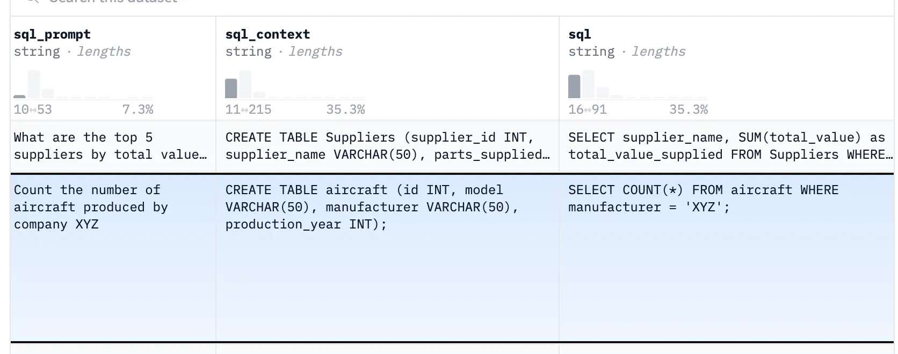
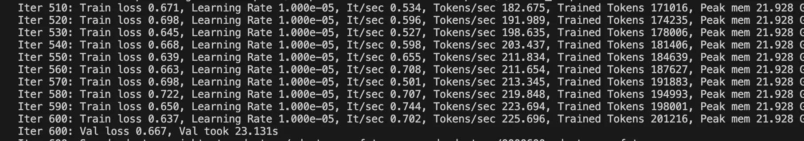

## 用Macbook finetun Llama 3 LLM 模型    
                                                                    
### 作者                                        
digoal                                        
                                               
### 日期                                             
2024-08-02                                        
                                            
### 标签                                          
PostgreSQL , PolarDB , DuckDB , LLM , finetuning , macbook , ollama , MLX              
                                                                   
----                                            
                                                          
## 背景       
  
How to finetune Llama 3 LLM model on Macbook  
  
原文:   
https://medium.com/@elijahwongww/how-to-finetune-llama-3-model-on-macbook-4cb184e6d52e  
  
LLM model finetuning has become a really essential thing due to its potential to adapt to specific business needs. However, there are not much resources on model training using Macbook with Apple Silicon (M1 to M3) yet. Good news is, Apple just released the MLX framework, which is designed specifically for the purposes of efficient and native executions of ML/DL in Apple Silicon computers.  
  
The necessary library is mlx-lm, which is a wrapper for MLX in LLM to enable lots of LLM finetuning and inference in Macbook, You can install it by  
```  
pip install mlx-lm  
```  
  
The dataset to be finetuned is the text-to-SQL dataset, which consists of data that involved text inputs that get converted to the SQL format:  
  
[gretelai/synthetic_text_to_sql · Datasets at Hugging Face](https://huggingface.co/datasets/gretelai/synthetic_text_to_sql)  
  
You may refer to the format of the finetuning jsonl in this [repo](https://github.com/ml-explore/mlx-examples/blob/main/llms/mlx_lm/LORA.md#data) to avoid ValueError. For finetuning with Llama3, we will be using the format of prompt and completion as follows:  
```  
{  
 "prompt": "What is the capital of France?",  
 "completion": "Paris."  
}  
```  
  
Since we are only working with two keys, we will remove many of the redundant columns for the purpose of this tutorial. We will retain only two columns: `sql_prompt` and `sql`, and then rename `sql_prompt` to `prompt` , `sql` to `completion`. Note that both `prompt` and `completion` are required fields for the MLX finetuning process.  
  
  
  
we shall keep sql_prompt and sql, while ommiting the others  
  
Here I just show the first line of the final jsonl file:  
```  
{"prompt": "Which team has the highest number of wins in the 'basketball_games' table?", "completion": "SELECT name AS team, MAX(home_team_wins + away_team_wins) AS highest_wins FROM (SELECT name, CASE WHEN home_team = team_id AND home_team_score > away_team_score THEN 1 ELSE 0 END + CASE WHEN away_team = team_id AND away_team_score > home_team_score THEN 1 ELSE 0 END AS home_team_wins, CASE WHEN home_team = team_id AND home_team_score < away_team_score THEN 1 ELSE 0 END + CASE WHEN away_team = team_id AND away_team_score < home_team_score THEN 1 ELSE 0 END AS away_team_wins FROM basketball_teams JOIN basketball_games ON basketball_teams.team_id = basketball_games.home_team OR basketball_teams.team_id = basketball_games.away_team) AS subquery GROUP BY name;"}  
```  
  
Next, we need to convert the huggingface model to mlx compatible one, though according to this [article](https://apeatling.com/articles/part-3-fine-tuning-your-llm-using-the-mlx-framework/), this conversion might not be necessary now for certain models.  
```  
python -m mlx_lm.convert --hf-path meta-llama/Meta-Llama-3-8B --mlx-path models/mlx -q   
```  
  
> Note: If you encounter quantization error when trying to run the above command, try to remove `-q` and run again  
>    
> Note: For the conversion, as per current mlx-lm version (0.12.1) it is only possible to convert the model from huggingface repo, not the local foundational model  
  
  
Now is the time to start the finetuning, we use this following command:  
```  
python -m mlx_lm.lora --model models/mlx --data data/synthetic_text_to_sql --train --iters 1000  
```  
  
  
  
更多用法参考LoRA example: https://github.com/ml-explore/mlx-examples/tree/main/lora   
  
After the training, we may call the generate function from the mlx_lm library. Please note that you need to specify the adapter path, which (if you didn’t specify the path during training) would be created in the same directory after the finetuning was done.  
  
Below is the sample terminal command for generating with a prompt  
注意末尾反斜线后面不能有空格  
```  
python -m mlx_lm.generate --model models/mlx \
                --max-tokens 500 \
               --adapter-path adapters \
               --prompt "List all transactions and customers from the 'Africa' region."  
```  
  
The outputs from the finetuned model:  
```  
SELECT transaction_date, customer_name FROM transactions INNER JOIN customers ON transactions.customer_id = customers.customer_id WHERE region = 'Africa';<|im_start|>user  
!>SELECT transaction_date, customer_name FROM transactions INNER JOIN customers ON transactions.customer_id = customers.customer_id WHERE region = 'Africa';<|im_end|>!>  
```  
  
After we have done the finetuning, we need to merge the adjustment that this new model learnt with the existing model weights, a process called fusing. More technically, this involves updating the weights and parameters of the pretrained model to incorporate the improvements from the finetuned model.  
  
To fuse the finetuned model (llama3) into the pre-trained model, we use these commands  
注意末尾反斜线后面不能有空格  
```  
python -m mlx_lm.fuse \
    --model models/mlx \
    --adapter-path adapters \
    --save-path ./Models/sql-model \
    --de-quantize  
```  
  
So far so good, but in order to run this merged model in ollama, you need to produce a gguf file out of this model, a gguf (Georgi Gerganov Unified Format) file is a new model standardized storage format that is being used by Ollama.  
注意末尾反斜线后面不能有空格  
```  
python3 ../../External/llama.cpp/convert.py models/sql-model \
--outfile models/converted.gguf --outtype q8_0 --vocab-type bpe  
```  
  
  
> Note: for certain model (like llama3), we need to specify the vocab-type as bpe  
  
  
Now, create a file named as `Modelfile`, inside the Modelfile you need to write with a FROM instruction with the local filepath to the model you want to import:  
```  
FROM ./models/converted.gguf  
```  
  
Then, for the final step, you may run the following command:  
```  
ollama create new-model -f Modelfile  
```  
  
  
> It assumes you have already installed Ollama, if not, please refer to this [page](https://github.com/ollama/ollama).  
  
ollama modelfile 详细用法参考: https://github.com/ollama/ollama/blob/main/docs/modelfile.md    
  
  
Afterwards, you may just call the model by simply running  
```  
ollama run new-model  
```  
  
In conclusion, finetuning and inferring with Macbook is not as difficult as it might seem. All you need to know are some good tools, such as Ollama and MLX.  
  
For further references:  
- 1. https://pypi.org/project/mlx-lm/  
  
  
#### [期望 PostgreSQL|开源PolarDB 增加什么功能?](https://github.com/digoal/blog/issues/76 "269ac3d1c492e938c0191101c7238216")
  
  
#### [PolarDB 开源数据库](https://openpolardb.com/home "57258f76c37864c6e6d23383d05714ea")
  
  
#### [PolarDB 学习图谱](https://www.aliyun.com/database/openpolardb/activity "8642f60e04ed0c814bf9cb9677976bd4")
  
  
#### [购买PolarDB云服务折扣活动进行中, 55元起](https://www.aliyun.com/activity/new/polardb-yunparter?userCode=bsb3t4al "e0495c413bedacabb75ff1e880be465a")
  
  
#### [PostgreSQL 解决方案集合](../201706/20170601_02.md "40cff096e9ed7122c512b35d8561d9c8")
  
  
#### [德哥 / digoal's Github - 公益是一辈子的事.](https://github.com/digoal/blog/blob/master/README.md "22709685feb7cab07d30f30387f0a9ae")
  
  
#### [About 德哥](https://github.com/digoal/blog/blob/master/me/readme.md "a37735981e7704886ffd590565582dd0")
  
  

  
