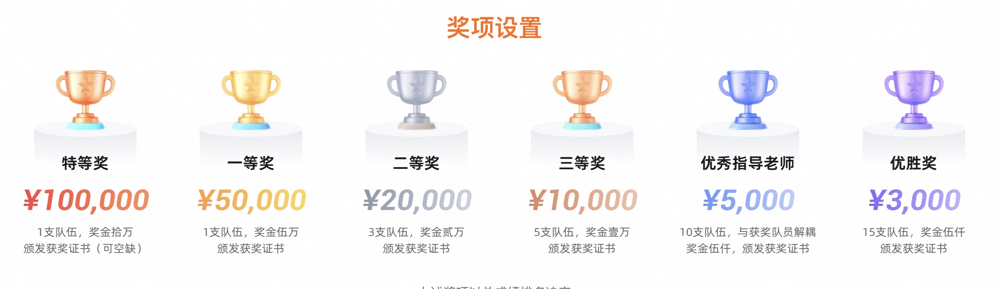

## 大学生数据库创新设计赛开始报名了, 拿个奖杯回家过年!   
                                                                            
### 作者                                                
digoal                                                
                                                       
### 日期                                                     
2024-08-28                                                
                                                    
### 标签                                                  
PostgreSQL , PolarDB , DuckDB , 大学生 , 数据库大赛 , 应用 , 创新 , 设计 , 内核 , 使用 , 考研 , 保研    
                                                                           
----                                                    
                                                                  
## 背景     
好消息, 面向全国在读大学生(含全国普通高等学校全日制在读本科和专科学生)的数据库创新设计赛来了, 拿个奖杯回家过年!     
    
关注全国大学生计算机系统能力大赛 数据库赛道 PolarDB数据库创新设计赛（天池杯）: https://os.educg.net/    
  
这个赛事备受大学生关注的原因之一是获奖选手有机会保研或者考研加分. 家里有大学生的朋友, 请多多关注转发!   
  
  
    
### 1、赛事简介   
2024年全国大学生计算机系统能力大赛PolarDB数据库创新设计赛（天池杯），是由全国高等学校计算机教育研究会、系统能力培养研究专家组、系统能力培养研究项目发起高校、阿里云计算有限公司共同主办、武汉大学承办、机械工业出版社、希冀平台协办的全国性数据库大赛。  
  
大赛面向全国普通高等学校全日制在读本科和专科学生，旨在培养数据库系统领域的设计、分析、优化与应用人才，激发学生的想象力、创新力、工程实践能力和团队协作精神，以赛促学、以赛促教，为高质量专业人才搭建交流、展示、合作的开源社区平台，让参与大赛的学生、指导教师、学校和企业都能从中获得补益，助力我国高校与企业在数据库系统领域的产学研合作健康、快速发展。  
  
### 2、本赛事覆盖的范围   
1、再次强调, 大赛面向全国在读大学生(含全国普通高等学校全日制在读本科和专科学生), 为此我查了一下全国高等学校名单, 截至2023年6月15日，全国高等学校共计3072所，其中：普通高等学校2820所，含本科院校1275所、高职（专科）院校1545所；成人高等学校252所。本名单未包含港澳台地区高等学校。  
  
http://www.moe.gov.cn/jyb_xxgk/s5743/s5744/A03/202306/t20230619_1064976.html    
  
2、很多同学一看赛题可能会误以为只有数据库专业的才有机会获得好的成绩, 确实之前的很多数据库赛事都是内核研发方向, 受众较少. 实际上大量的应用开发者是使用数据库的开发者, 在应用中设计好数据库的架构与用法也是非常关键的, 甚至决定了应用能扩展的性能上限(并发、吞吐等). 为了解决这个矛盾, 让更多的学生能参与数据库赛事, 我们开辟了这个"数据库创新设计赛"赛道, 既能考察内核开发又能考察数据库应用与架构设计能力. 这个比赛覆盖的学生范围较广(适合数据库专业、软件工程的学生、所有和数据库有关专业的学生). 甚至我建议报名组队时, 队伍里要有熟悉数据库原理和使用的也要有熟悉数据库内核的.    
  
### 3、赛事难度级别   
参与难度低, 提交作品难度中, 但可发挥空间巨大.    
  
需要了解一些git, docker的使用方法, 会一些基本的linux命令, 就可以把比赛需要的环境搞起来.     
  
懂得一些shell脚本语法, 日常SQL语法, 就可以提交作品.  如果懂得一些数据库的参数用法就有机会和其他学生拉开分数.   偷偷[《教你几招性能PK的“作弊技巧”! 让你的数据库也能遥遥领先》](../202406/20240618_01.md)  如果违规了可别说是我教的.     
  
熟悉编译器的使用、数据库内核|钩子|插件编程、SQL的优化技巧、数据库的表存储和索引原理和优化技巧、单机并行、分布式并行技术、数据库各种优化参数、操作系统的各种优化参数、一些IO相关的系统调用接口、数据库的周边工具、调试方法、瓶颈分析方法等, 就有机会取得好成绩.    
     
### 4、比赛形式    
和很多比赛一样, fork比赛指定的代码到自己的私有仓库, 并将评审组提供的账号加入私有仓库组织以便评测时可以拉去你的私有仓库代码. 根据比赛要求修改和调试, 根据比赛要求提交作品.    
  
初赛, 根据初赛题目提交作品考察性能  
  
决赛, 根据决赛题目提交作品考察性能, 设计文档等  
  
决赛答辩  
  
赛事流程详见: https://tianchi.aliyun.com/competition/entrance/532261    
```  
2024年8月21日：报名启动。发布PolarDB数据库创新设计赛章程和技术方案。  
  
2024年10月7日：报名截止。发布初赛参赛题目和初赛阶段的评测技术指标。  
  
2024年11月20日：初赛截止提交。  
  
2024年11月29日：公布决赛入围名单。公布决赛题目及评测技术指标。  
  
2024年12月中：决赛第一阶段（线上完成）。  
  
2024年12月中下旬：决赛第二阶段（线下举办），参赛队针对题目做整体展示并完成答辩，评审委员会给出成绩。  
```  
  
### 5、考点介绍   
比赛涉及开源项目PolarDB: https://github.com/ApsaraDB/PolarDB-for-PostgreSQL/tree/POLARDB_11_STABLE  PolarDB是基于流行的PostgreSQL开源数据库开发的云原生数据库产品, 具有存算分离, HTAP(OLAP+OLTP), 弹性伸缩等优势.      
  
考点: 可能涉及PostgreSQL、PolarDB的编译部署、各种参数配置项、SQL语法、TPC工业标准组织的BENCHMARK、复杂SQL优化、数据导入、插件原理、存储引擎开发等.     
  
可以参考的文档:     
  
德哥的个人Blog: https://github.com/digoal/blog/blob/master/README.md  
  
PostgreSQL 11官方手册: https://www.postgresql.org/docs/11/index.html  
  
开源PolarDB手册: https://apsaradb.github.io/PolarDB-for-PostgreSQL/zh/  
  
开源PolarDB|PostgreSQL 应用开发者&DBA 公开课: https://github.com/digoal/blog/blob/master/202401/20240123_02.md  
  
TPCH: https://github.com/ApsaraDB/tpch-dbgen  
  
其他
- [《MacOS下抓取火焰图和分析程序性能的方法(sample, FlameGraph) - Linux Perf》](../202210/20221026_06.md)  
- [《Linux ftrace - 内核性能分析 - 火焰图》](../202112/20211216_01.md)  
- [《PostgreSQL explain analyze 火山图火焰图 图形化性能分析软件 pg_flame》](../202012/20201217_02.md)  
- [《PostgreSQL 源码性能诊断(perf profiling)指南(含火焰图生成分析FlameGraph)》](../201611/20161129_01.md)  
  
### 6、学生参加比赛的收益   
1、获奖后可能获得考研加分或保研.  
  
2、获得相应的比赛奖金.   
  
  
  
3、通过比赛加入技术圈子, 结交志同道合的朋友, 未来都可能成为你的贵人.     
  
4、提升自己在行业中的影响力. 为将来就业或创业奠定更好的基础.     
  
5、获得战绩, 成为你简历中的重要一笔.    
  
这个比赛每年都会有, 大一的新生可以先参加进来取取经, 未来可以拼出更好的成绩.    
    
### 7、报名方法   
报名直接点击: https://tianchi.aliyun.com/competition/entrance/532261     
  
或者从全国大学生计算机系统能力大赛官网进入: https://os.educg.net/    
  
### 8、关注赛事信息 (qq群、官网)   
  
大赛介绍及赛事实时公告: https://tianchi.aliyun.com/specials/promotion/2024-csdcc-polardb     
    
PolarDB数据库创新设计赛联系邮箱: cscc-PolarDB@hz.cmpbook.com       
  
PolarDB数据库创新设计赛技术讨论 QQ 群: 995229018    
  
### 9、一些小诀窍
  
1、组队很关键, 选择互补的队员. 可以去学校的各个相关的社团看看有没有合适的人选.   
    
2、多咨询指导老师.  
   
3、加入QQ群, 有问题随时可以交流.  
   
4、如果学校有开源数据库工作室/社团, 一定要可以加入, 除了比赛在社团中可以获得更多对你有长期帮助的信息. 如果还没有工作室/社团, 也可以联系我, 我们会安排和老师联系建立工作室/社团.   
   
  
#### [期望 PostgreSQL|开源PolarDB 增加什么功能?](https://github.com/digoal/blog/issues/76 "269ac3d1c492e938c0191101c7238216")
  
  
#### [PolarDB 开源数据库](https://openpolardb.com/home "57258f76c37864c6e6d23383d05714ea")
  
  
#### [PolarDB 学习图谱](https://www.aliyun.com/database/openpolardb/activity "8642f60e04ed0c814bf9cb9677976bd4")
  
  
#### [购买PolarDB云服务折扣活动进行中, 55元起](https://www.aliyun.com/activity/new/polardb-yunparter?userCode=bsb3t4al "e0495c413bedacabb75ff1e880be465a")
  
  
#### [PostgreSQL 解决方案集合](../201706/20170601_02.md "40cff096e9ed7122c512b35d8561d9c8")
  
  
#### [德哥 / digoal's Github - 公益是一辈子的事.](https://github.com/digoal/blog/blob/master/README.md "22709685feb7cab07d30f30387f0a9ae")
  
  
#### [About 德哥](https://github.com/digoal/blog/blob/master/me/readme.md "a37735981e7704886ffd590565582dd0")
  
  

  
