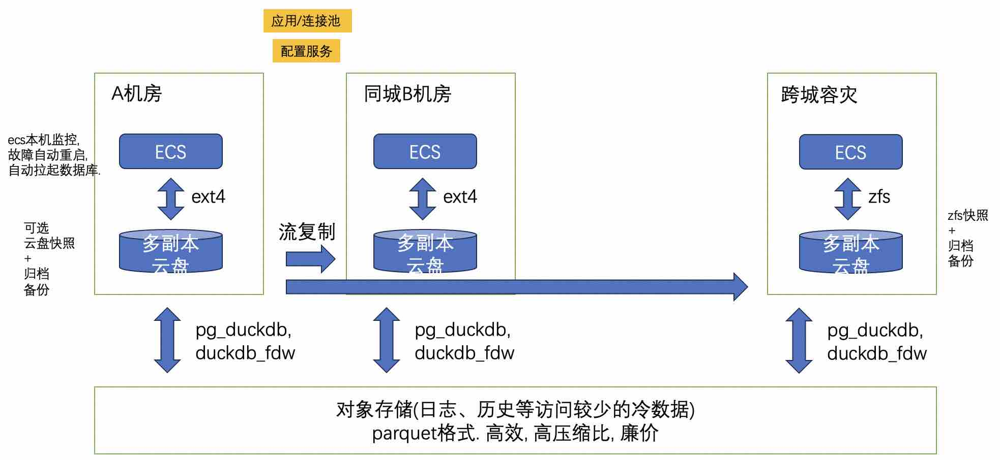

## 别搞HA,别搞HA,别搞HA! 续     
                                                                                
### 作者                                                    
digoal                                                    
                                                           
### 日期                                                         
2024-08-30                                                    
                                                        
### 标签                                                      
PostgreSQL , PolarDB , DuckDB , HA , 高可用 , 0丢失 , 崩溃恢复 , 云盘 , 多副本 , ECS , 机房故障 , 地震 , 跨城容灾 , zfs , 快照 , 克隆 , 备份 , 升级         
                                                                               
----                                                        
                                                                      
## 背景     
续 这一篇 [《DB吐槽大会,第47期 - PG 崩溃恢复能快点吗》](../202109/20210915_07.md)    
  
我想纠正一个观点, 数据库不是一定要搞主从HA的, 数据库不是一定要备份的, 数据库不是一定要搞双盘RAID1的. 搞主从HA之前先问问为什么吧?    
  
搞主从HA不就是要解决0丢失和快速崩溃恢复吗？咱直奔主题，别搞错了，HA不是目的，它只是手段 ！  
  
1、没有HA如何做到0丢失？  
  
0丢失很简单，不需要高端存储, 云盘的多副本技术随便就可以做到0丢失，还需要啥HA？实在很重要的数据搞个跨机房或者跨地域容灾实例防天灾。  
   
云盘和本地盘不同, 云盘通常本身就是多副本的, 可靠性和可用性比本地盘高N个级别. 而且云盘可能也支持跨机房容灾能力(如果有的话, 可以考虑使用这个能力来实现跨机房HA). 云盘的弱点之一是单次IO的响应时间比本地盘高, 不过PG的大部分请求是异步IO不用担心, 也可以使用分组提交或异步提交来解决这个性能问题. 另一个弱点可能是云盘的吞吐, 和ECS规格以及云盘的规格相关, 想大也能做大.     
   
2、没有HA如何做到瞬间崩溃恢复？  
  
瞬间崩溃恢复技术确实不简单，能做到任何时候崩溃恢复都无需等待，有这样的技术吗？沃特？还真做到了！PolarDB lazy recovery, 其实就是读page时同时读必要的wal进行恢复, 所以崩溃后数据库立即就对用户可用.  
  
如果是开源PostgreSQL呢? 也不用太担心. 除非
- 你的shared buffer配置得特别大,   
- 并且里面很多很多脏数据未持久化(基本上只有可能出现在业务高峰、并且 bgwrite 参数没配置好),   
- 并且checkpoint周期特别长,   
- 并且checkpoint target设置得很大(接近1).  
    
这么多的并且合在一起, 概率就大大下降了. 所以即使是PG, 大概率崩溃恢复也是很快的.     
  
## 云上使用的数据库, 大多数时候不需要HA   
数据库流复制那种HA弊端太多, 毛病实在太多。老司机都难免翻车：  
- 成本至少翻一倍，  
- 异步的切来切去丢数据\脑裂，  
- 同步的性能损耗大\故障点增加\成本翻几倍，  
- 功能损失让人抓狂（逻辑槽支持不好，啥都要写wal等），  
- 版本管理插件管理配置管理更加复杂坑更多等等  
  
我推荐的省钱省事架构:    
- 主实例: 单机ecs + essd云盘 + ext4   (有容灾实例时, 不需要备份; 没有容灾实例时备份: 云盘快照+归档)      
- 可选 跨机房备用实例(异步流复制): 单机ecs + essd云盘 + ext4       
- 建议选择 跨地域容灾备份实例(异步流复制): 单机ecs + essd云盘 + zfs  (备份: zfs快照+归档)        
  
    
  
主实例故障怎么办?   
- 重启数据库或者重启ECS就可以了, 放心, 快得很. 比起流复制HA带来的弊端, ECS重启一次比切换慢个十几秒算啥?  故障又不是高频动作.     
  
机房故障怎么办?   
- 毕竟机房不是三天两头坏, 自动或人为切换都行. 根据你自己的业务对外的可用性承诺来判断, 如果本身要求不高的确认机房挂了一时半会起不来, 再考虑切换.     
  
如果是可用性要求特别高的业务, 面对机房故障, 就需要考虑跨机房高可用方案了, 这方面的产品特别多, 例如
- 中启乘数的clup, https://gitee.com/csudata/clup-community  ;   https://www.csudata.com/
- kubeblocks: https://github.com/apecloud/kubeblocks  
  
地震怎么办?   
- 确认无力回天了的话, 可以人为切到容灾实例, 毕竟地震概率很小.     
  
升版本怎么办?    
- 小版本升级, 安装好软件重启就可以, 快得很. 安全起见, 可以在升级前做个云盘快照.     
- 大版本升级, 本来就需要用备实例来演练, 在异地容灾的机器上克隆zfs快照进行演练, 成本低到不敢想象.     
   
一些最佳实践文章:   
- [《PostgreSQL 12 on 阿里云ecs 本地ssd VS essd pl3性能 - 含fio,fsync test,pgbench test，优缺点、云盘PG内核优化建议》](../201912/20191228_04.md)    
- [《PostgreSQL 11 1万亿 tpcb 性能测试 on 阿里云ECS + ESSD + zfs/lvm2条带 + block_size=32K》](../201809/20180919_01.md)    
- [《PostgreSQL 10 + PostGIS + Sharding(pg_pathman) + MySQL(fdw外部表) on ECS 部署指南(适合新用户) - 珍藏级》](../201710/20171018_01.md)    
- [《PostgreSQL on ECS多云盘的部署、快照备份和恢复》](../201708/20170812_01.md)    
- [《PostgreSQL 最佳实践 - 块级增量备份(ZFS篇)验证 - recovery test script for zfs snapshot clone + postgresql stream replication + archive》](../201608/20160823_09.md)    
- [《PostgreSQL 最佳实践 - 块级增量备份(ZFS篇)双机HA与块级备份部署》](../201608/20160823_08.md)    
- [《PostgreSQL 最佳实践 - 块级增量备份(ZFS篇)单个数据库采用多个zfs卷(如表空间)时如何一致性备份》](../201608/20160823_07.md)    
- [《PostgreSQL 最佳实践 - 块级增量备份(ZFS篇)备份集有效性自动校验》](../201608/20160823_06.md)    
- [《PostgreSQL 最佳实践 - 块级增量备份(ZFS篇)方案与实战》](../201608/20160823_05.md)    
- [《PostgreSQL 快速大版本升级多种方案 - 含重点介绍fast & safe upgrade to PostgreSQL 9.4 use pg_upgrade & zfs》](../201412/20141219_01.md)    
- [《如何创建RDS PG 的秒级 flashback闪回实例, 实时容灾实例 - zfs - snapshot - clone - standby - compress》](../202003/20200321_02.md)    
- [《ZFS PostgreSQL 调优》](../202009/20200910_01.md)    
  
    
  
#### [期望 PostgreSQL|开源PolarDB 增加什么功能?](https://github.com/digoal/blog/issues/76 "269ac3d1c492e938c0191101c7238216")
  
  
#### [PolarDB 开源数据库](https://openpolardb.com/home "57258f76c37864c6e6d23383d05714ea")
  
  
#### [PolarDB 学习图谱](https://www.aliyun.com/database/openpolardb/activity "8642f60e04ed0c814bf9cb9677976bd4")
  
  
#### [购买PolarDB云服务折扣活动进行中, 55元起](https://www.aliyun.com/activity/new/polardb-yunparter?userCode=bsb3t4al "e0495c413bedacabb75ff1e880be465a")
  
  
#### [PostgreSQL 解决方案集合](../201706/20170601_02.md "40cff096e9ed7122c512b35d8561d9c8")
  
  
#### [德哥 / digoal's Github - 公益是一辈子的事.](https://github.com/digoal/blog/blob/master/README.md "22709685feb7cab07d30f30387f0a9ae")
  
  
#### [About 德哥](https://github.com/digoal/blog/blob/master/me/readme.md "a37735981e7704886ffd590565582dd0")
  
  

  
