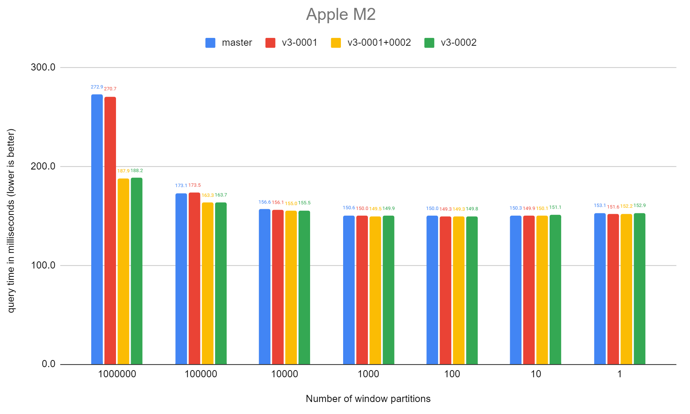

## PostgreSQL 18 preview - 窗口查询性能提升40%(100万个窗口时), 递归CTE性能提升       
                                                                                    
### 作者                                                        
digoal                                                        
                                                               
### 日期                                                             
2024-09-06                                                       
                                                            
### 标签                                                          
PostgreSQL , PolarDB , DuckDB , 窗口查询 , 性能 , 窗口数       
                                                                                   
----                                                            
                                                                          
## 背景       
PostgreSQL 18窗口查询性能提升优化, 100万个窗口时性能提升40%, 窗口越多性能提升越明显.  代码优化参考如下说明, 看起来就是把tuplestore_clear的返回指针回传了, 减少了重复调用.   
  
类似 `update/delete returning` 减少重复查询?    
  
    
  
https://git.postgresql.org/gitweb/?p=postgresql.git;a=commit;h=908a968612f9ed61911d8ca0a185b262b82f1269  
```  
Optimize WindowAgg's use of tuplestores  
author	David Rowley <drowley@postgresql.org>	  
Thu, 5 Sep 2024 04:18:30 +0000 (16:18 +1200)  
committer	David Rowley <drowley@postgresql.org>	  
Thu, 5 Sep 2024 04:18:30 +0000 (16:18 +1200)  
commit	908a968612f9ed61911d8ca0a185b262b82f1269  
tree	bf1957ccad3aab816fc5b0175c2294c099dc6680	tree  
parent	19b861f880166fbdb67d268955e590881376f876	commit | diff  
  
Optimize WindowAgg's use of tuplestores  
  
When WindowAgg finished one partition of a PARTITION BY, it previously  
would call tuplestore_end() to purge all the stored tuples before again  
calling tuplestore_begin_heap() and carefully setting up all of the  
tuplestore read pointers exactly as required for the given frameOptions.  
Since the frameOptions don't change between partitions, this part does  
not make much sense.  For queries that had very few rows per partition,  
the overhead of this was very large.  
  
It seems much better to create the tuplestore and the read pointers once  
and simply call tuplestore_clear() at the end of each partition.  
tuplestore_clear() moves all of the read pointers back to the start  
position and deletes all the previously stored tuples.  
  
A simple test query with 1 million partitions and 1 tuple per partition  
has been shown to run around 40% faster than without this change.  The  
additional effort seems to have mostly been spent in malloc/free.  
  
Making this work required adding a new bool field to WindowAggState  
which had the unfortunate effect of being the 9th bool field in a group  
resulting in the struct being enlarged.  Here we shuffle the fields  
around a little so that the two bool fields for runcondition relating  
stuff fit into existing padding.  Also, move the "runcondition" field to  
be near those.  This frees up enough space with the other bool fields so  
that the newly added one fits into the padding bytes.  This was done to  
address a very small but apparent performance regression with queries  
containing a large number of rows per partition.  
  
Reviewed-by: Ashutosh Bapat <ashutosh.bapat.oss@gmail.com>  
Reviewed-by: Tatsuo Ishii <ishii@postgresql.org>  
Discussion: https://postgr.es/m/CAHoyFK9n-QCXKTUWT_xxtXninSMEv%2BgbJN66-y6prM3f4WkEHw%40mail.gmail.com  
```

递归CTE性能提升   
   
https://git.postgresql.org/gitweb/?p=postgresql.git;a=commit;h=5d56d07ca343a467ce74a042c22c963ea2690eaf  
```
Optimize tuplestore usage for WITH RECURSIVE CTEs
author	David Rowley <drowley@postgresql.org>	
Thu, 19 Sep 2024 03:20:35 +0000 (15:20 +1200)
committer	David Rowley <drowley@postgresql.org>	
Thu, 19 Sep 2024 03:20:35 +0000 (15:20 +1200)
commit	5d56d07ca343a467ce74a042c22c963ea2690eaf
tree	080c10e729c58c29b956d23efc46fed5cd570156	tree
parent	8a6e85b46e0ff1a49b1b2303149ec010e5e0b30e	commit | diff
Optimize tuplestore usage for WITH RECURSIVE CTEs

nodeRecursiveunion.c makes use of two tuplestores and, until now, would
delete and recreate one of these tuplestores after every recursive
iteration.

Here we adjust that behavior and instead reuse one of the existing
tuplestores and just empty it of all tuples using tuplestore_clear().

This saves some free/malloc roundtrips and has shown a 25-30% performance
improvement for queries that perform very little work between recursive
iterations.

This also paves the way to add some EXPLAIN ANALYZE telemetry output for
recursive common table expressions, similar to what was done in 1eff8279d
and 95d6e9af0.  Previously calling tuplestore_end() would have caused
the maximum storage space used to be lost.

Reviewed-by: Tatsuo Ishii
Discussion: https://postgr.es/m/CAApHDvr9yW0YRiK8A2J7nvyT8g17YzbSfOviEWrghazKZbHbig@mail.gmail.com
```
  
  
#### [期望 PostgreSQL|开源PolarDB 增加什么功能?](https://github.com/digoal/blog/issues/76 "269ac3d1c492e938c0191101c7238216")
  
  
#### [PolarDB 开源数据库](https://openpolardb.com/home "57258f76c37864c6e6d23383d05714ea")
  
  
#### [PolarDB 学习图谱](https://www.aliyun.com/database/openpolardb/activity "8642f60e04ed0c814bf9cb9677976bd4")
  
  
#### [购买PolarDB云服务折扣活动进行中, 55元起](https://www.aliyun.com/activity/new/polardb-yunparter?userCode=bsb3t4al "e0495c413bedacabb75ff1e880be465a")
  
  
#### [PostgreSQL 解决方案集合](../201706/20170601_02.md "40cff096e9ed7122c512b35d8561d9c8")
  
  
#### [德哥 / digoal's Github - 公益是一辈子的事.](https://github.com/digoal/blog/blob/master/README.md "22709685feb7cab07d30f30387f0a9ae")
  
  
#### [About 德哥](https://github.com/digoal/blog/blob/master/me/readme.md "a37735981e7704886ffd590565582dd0")
  
  

  
